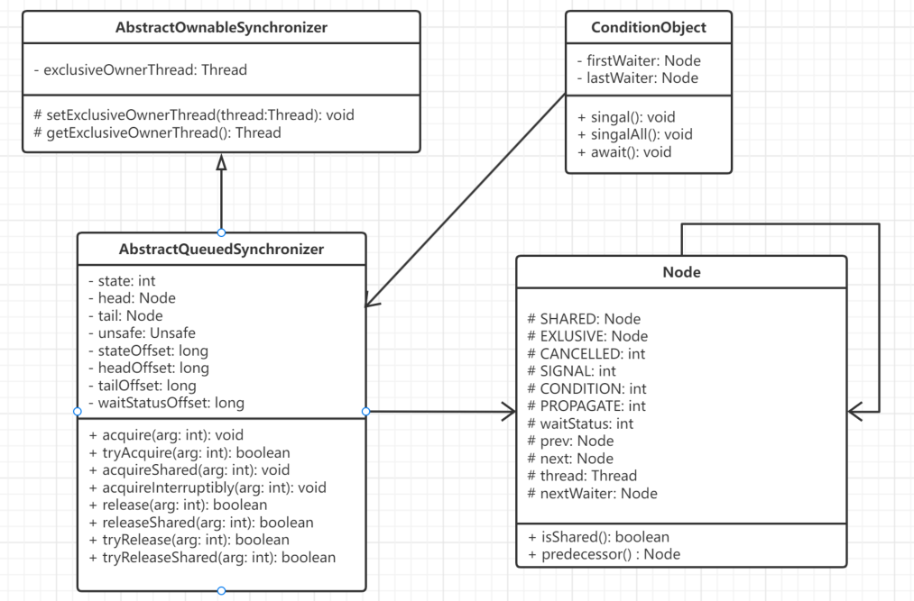
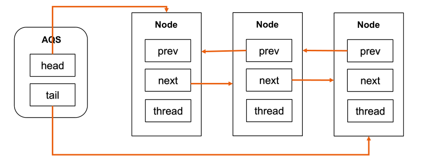
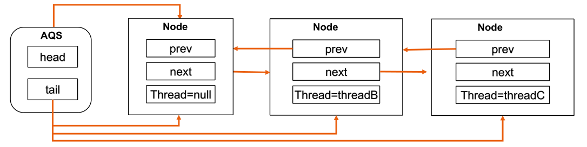
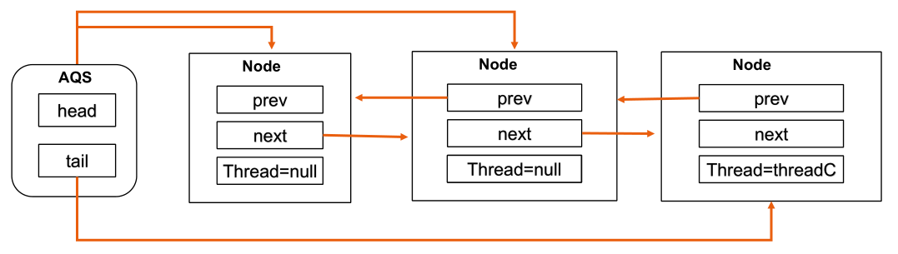

# AQS

## 简介

AQS（AbstractQueuedSynchronizer）即队列同步器。它是**构建锁**或者**其他同步组件的基础框架**（如ReentrantLock、ReentrantReadWriteLock、Semaphore等）。

AQS是JUC并发包中的核心基础组件，其本身是一个抽象类。理论上还是利用管程实现的，在AQS中，有一个volatile修饰的state，获取锁的时候，会读写state的值，解锁的时候，也会读写state的值。所以AQS就拥有了volatile的happens-before规则。

由类图可以看到，AQS是一个**FIFO的双向队列，队列中存储的是thread**，其内部通过**节点head和tail**记录队首和队尾元素，队列元素的类型为**Node**。

- Node中的**thread变量**用来存放进入AQS队列里面的线程，Node节点内部：prev记录当前节点的前驱节点；next 记录当前节点的后继节点
- **SHARED**用来标记该线程是**获取共享资源时被阻塞挂起**后放入AQS队列的
- **EXCLUSIVE**用来标记线程是**获取独占资源时被挂起**后放入AQS队列的
- **waitStatus**记录当前线程等待状态，可以为
  1. CANCELLED (线程被取消了)
  2. SIGNAL(线程需要被唤醒)
  3. CONDITION(线程在CONDITION条件队列里面等待)
  4. PROPAGATE(释放共享资源时需要通知其他节点)

在AQS中维持了一个**单一的状态信息state**，对于ReentrantLock的实现来说，state 可以用来表示当前线程获取锁的可重入次数；AQS继承自AbstractOwnableSynchronizer，其中的exclusiveOwnerThread变量表示**当前共享资源的持有线程**。

## 实现原理

AQS中的静态内部类Node为链表节点，**AQS会在线程获取锁失败后，线程会被阻塞并封装成Node加入到AQS队列中；当获取锁的线程释放后，会从AQS队列中唤醒一个线程（节点）。**

### 线程抢夺锁失败【加锁】

1. AQS的head、tail分别代表同步队列头节点和尾节点指针，默认为null

2. 当第一个线程抢夺锁失败，同步队列会先初始化，随后线程会被封装成Node节点追加到AQS队列中

   假设：当前独占锁的的线程为ThreadA，抢占锁失败的线程为ThreadB

   2.1 同步队列初始化，首先在队列中添加Node，thread=null，代表当前获取锁成功的线程。随后，AQS的head和tail会同时指向这个节点

   2.2 将ThreadB封装成为Node，追加到AQS队列，设置新节点的prev指向AQS队尾节点；将队尾节点的next指向新节点；最后将AQS尾节点指针指向新节点。

3. 当下一个线程抢夺锁失败时，继续重复上面步骤。假设：ThreadC抢占线程失败

**ThreadC抢占线程失败后，AQS变化如下：**

### 线程被唤醒【解锁】

1. ReentrantLock唤醒阻塞线程时，会按照**FIFO的原则从AQS中head头部开始唤醒首个节点中线程**。
2. head节点表示当前获取锁成功的线程ThreadA节点
3. 当ThreadA释放锁时，它会唤醒后继节点线程ThreadB，head指针指向ThreadB节点，ThreadA节点的next指向Null，从AQS中删除
4. ThreadB开始尝试获得锁，如果ThreadB获得锁成功，会将自己设置为AQS的头节点（ThreadB节点的prev指向Null，设置节点的thread=null）。

**ThreadB获取锁成功后，AQS变化如下：**

