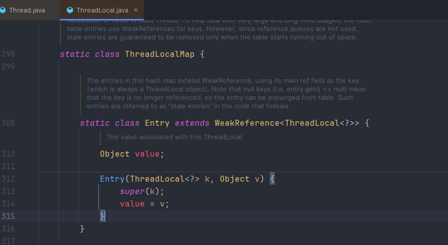

# ThreadLocal

## ThreadLocal是什么

线程本地变量：ThreadLocal为变量在每个线程中都创建了一个副本，每个线程可以访问自己内部的副本变量

## 使用场景

1. 每个线程需要一个独享的对象（通常是工具类，例如SimpleDataFormat、Random）
2. 每个线程内需要使用全局变量，可以让不同方法直接使用，避免参数传递的麻烦（例如在拦截器中获取用户信息）

## 原理

### Thread、ThreadLocal、ThreadLocalMap之间的关系

每个Thread对象中都有一个ThreadLocalMap成员变量，源码如下：




ThreadLocalMap实际上就是一个以ThreadLocal实例为key，任意对象为value的Entry对象。

JVM内部维护了一个线程版的Map<Thread,V>(通过ThreadLocal对象的set方法，把ThreadLocal对象自己当做key，放进了ThreadLoalMap中),每个线程要用到这个V的时候，用当前的线程去Map里面获取，通过这样让每个线程都拥有了自己独立的变量。


## 内存泄露问题

### 为什么使用弱引用

```java
public void function01(){
    //新建了一个ThreadLocal对象，tl是强引用指向这个对象
    ThreadLocal tl = new ThreadLocal<Integer>();    //line1
    //调用set()方法后新建一个Entry，通过源码可知Entry对象里的k是弱引用指向这个对象
    tl.set(2024);                                   //line2
    tl.get();                                       //line3
}
```


当function01方法执行完毕后，栈帧销毁强引用tl也就没有了，但此时线程的ThreadLocalMap里面某个entry的key引用还指向这个对象。若这个key为强引用，就会导致key指向的ThreadLocal对象以及v指向的对象不能被gc回收，造成内存泄露；若key为弱引用可以大概率减少内存泄漏的问题，弱引用可以使ThreadLocal对象在方法执行完毕后顺利被回收且key引用指向为null。

### 弱引用为什么还会造成内存泄露

当我们为ThreadLocal变量赋值，实际上就是往ThreadlocalMap存放当前的Entry(ThreadLocal实例为key，值为value)。Entry中的key为弱引用，当ThreadLocal外部强引用被置为null（tl=null），那么系统GC时候，根据可达性分析，这个ThreadLocal实例就没用任何一条线路能够引用到它，这个ThreadLocal势必会被回收。这样一来，ThreadLocalMap中就会出现key为null的Entry，就没有办法访问这些key为null的Entry的value，如果当前线程迟迟不结束（使用线程池，线程复用），这些key为null的Entry的value就会一直存在一条强引用链：

**`Thread Ref -> Thread -> ThreaLocalMap -> Entry -> value`**，永远无法回收，造成内存泄漏。

当然，如果当前thread运行结束，threadLocal，threadLocalMap,Entry没有引用链可达，在垃圾回收的时候都会被系统进行回收。

在使用中，为了防止内存溢出，需要**`手动调用remove()，尽量使用try-finally块进行回收`**。


