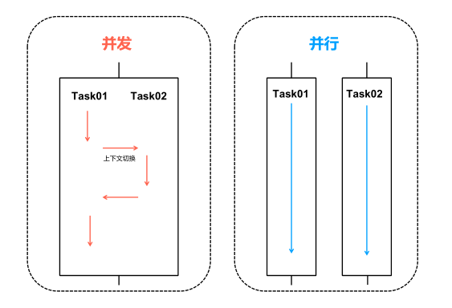
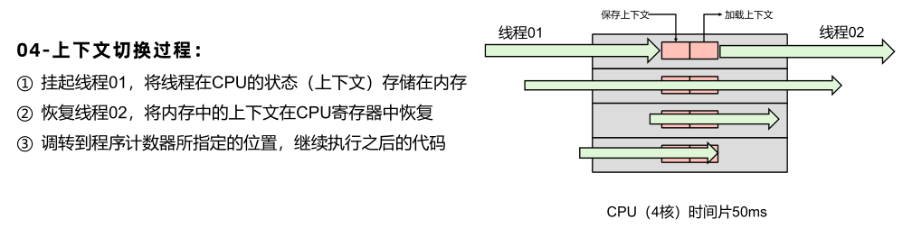
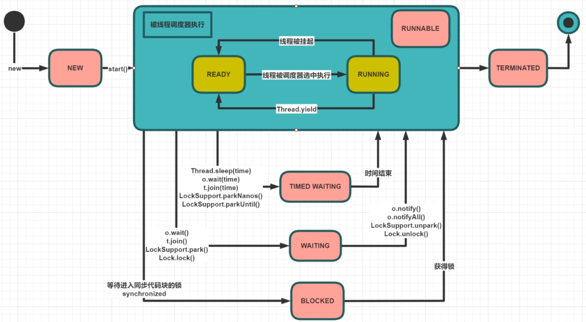
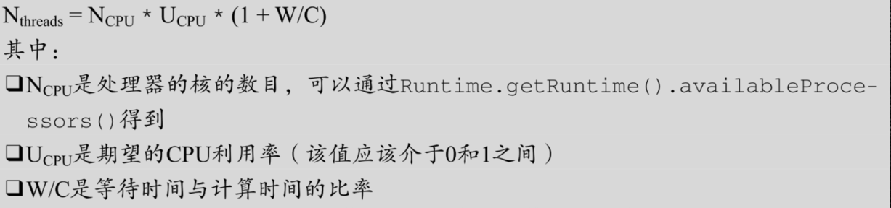

# JUC基础


## 进程与线程

### 进程

是内存运行的一个应用程序，是系统进行资源分配和调度的基本单位，是程序的一次执行过程

### 线程

是进程的一个执行单元，负责当前进程中任务的执行，一个进程内会产生很多线程

### 管程

Monitor(监视器)，也就是我们平时所说的锁

### 进程与线程区别

- **进程：**有独立内存空间，每个进程中的数据空间都是独立的
- **线程**：多线程之间堆空间与方法区是共享的，但每个线程的栈空间、程序计数器是独立的，线程消耗的资源比进程小的多

## 并发与并行

- **并发（Concurrent）**：同一时间段，多个任务都在执行，单位时间内不⼀定同时执行。
- **并行（Parallel）**：单位时间内，多个任务同时执行，单位时间内一定是同时执行。并行上限取决于CPU核数（CPU时间片内50ms）

**注意：并发是一种能力，而并行是一种手段。**当我们的系统拥有了并发的能力后，代码如果跑在多核CPU上就可以并行运行。所以会说高并发处理，而不会说高并行处理。并行处理是基于硬件CPU的是固定的，而并发处理的能力是可以通过设计编码进行提高的。



## 什么是上下文切换

一个CPU**同一时刻**只能被**一个线程**使用，为了提升效率CPU采用**时间片算法**将CPU时间片（几十毫秒/线程）轮流分配给多个线程。在分配的时间片内线程执行，如果没有执行完毕，则需要挂起然后把CPU让给其他线程。

**线程再次运行时，系统是怎么知道线程之前运行到哪里了呢？**

CPU切换线程，会把当前线程的执行位置记录下来，用于下次执行时找到准确位置，线程执行位置的记录与加载过程就叫做**`上下文切换`**。

线程执行位置记录在程序计数器。




## 用户线程和守护线程

Java线程分为用户线程和守护线程，线程的**daemon**属性为true表示是守护线程，false表示是用户线程

### 守护线程

是一种特殊线程，在后台默默完成一些系统性的服务，比如垃圾回收线程

### 用户线程

是系统的工作线程，它会完成这个程序需要完成的业务操作

### 注意点

- 当程序中所有用户线程执行完毕之后，不管守护线程是否结束，系统都会自动退出
- 设置守护线程，需要在start()方法之前进行

```java
/**
* t1设置为守护线程，当main线程执行完毕，意味着程序需要完成的业务操作已经结束了，此时虽然守护线程t1还未执行结束，但是系统也自动退出了。所以当系统只剩下守护进程的时候，java虚拟机会自动退出。
**/
public static void main(String[] args){
    Thread t1 = new Thread(() -> {
        System.out.println(Thread.currentThread().getName()+"\t 开始运行，"+(Thread.currentThread().isDaemon() ? "守护线程":"用户线程"));
        while (true) {

        }
    }, "t1");
    //线程的daemon属性为true表示是守护线程，false表示是用户线程
    t1.setDaemon(true);
    t1.start();
    //2秒钟后主线程再运行
    try { TimeUnit.SECONDS.sleep(2); } catch (InterruptedException e) { e.printStackTrace(); }
    System.out.println(Thread.currentThread().getName()+"----------task is over");
}
//output:
t1	 开始运行，守护线程
main----------task is over
```

## 线程的生命周期

#### 线程的六种状态

1. New：线程刚刚创建，还没有启动
2. Runnable：可运行状态（分为两种：Ready、Running），线程可以在JVM中运行的状态，可能正在运行自己代码，也可能没有，这取决于操作系统处理器
3. Waiting：等待被唤醒，一个线程在等待另一个线程执行一个（唤醒）动作时，该线程进入Waiting状态。进入这个状态后是不能自动唤醒的，必须等待另一个线程调用notify或者notifyAll方法才能够唤醒。
4. Timed Waiting：隔一段时间后后自动唤醒，同waiting状态，有几个方法有超时参数，调用他们将进入TimedWaiting状态。这一状态将一直保持到超时期满或者接收到唤醒通知。带有超时参数的常用方法有Thread.sleep(5000) 、Object.wait(5000)
5. Blocked：被阻塞，当一个线程试图获取一个对象锁，而该对象锁被其他的线程持有，则该线程进入Blocked状态；当该线程持有锁时，该线程将变成Runnable状态
6. Terminated：线程结束，因为run方法正常退出而死亡，或者因为没有捕获的异常终止了run方法而死亡。



一般习惯而言，把Blocked(被阻塞）、Waiting(等待）、Timed Waiting(计时等待）都称为阻塞状态。

#### lock和synchronized的线程状态

- lock.lock()：进入Waiting状态（通过JUC的AQS实现）
- synchronized：进入Blocked状态（只有synchronized才进入Blocked状态）

#### wait与sleep()的区别

- sleep()方法没有释放锁，wait()方法释放了锁
- 都可以暂停线程执行：wait()常用于线程间交互/通信，sleep()用于暂停线程执行
- wait()方法被调用后，需要别的线程调用同一个对象的notify和notifyAll。超时苏醒使用wait(long)方法
- sleep()方法执行完成后，线程会自动苏醒

## 创建线程

### 创建方式

1. 实现Runnable接口，重写run()函数，运行start()方法
2. 继承Thread类，重写run()函数，运行start()方法

### 两种方法的对比

实现Runnable接口更好，一个类继承Thread类就无法再继承其他类，但是一个类实现了Runnable接口，还可以继承其他类，更灵活。

这两种创建线程的方式，最终都调用`target.run()`。准确的讲：一种创建线程方式（new Thread().start()）、两种实现执行单元的方式

### 错误观点

1. 线程池创建线程
2. 通过Future Callable和FutureTask创建线程
3. lambda表达式

## 线程的中断

使用interrupt来通知线程中断，而不是强制。

#### 线程中断的三种方法

1. interrupt()：中断某个线程（设置标志位）
2. isInterrupted()：查询某线程是否被中断过（查询标志位）
3. static interrupted()：查询当前线程是否被中断过，并重置中断标志

如果线程处于活动状态，会将线程中断标志设置为true，被设置中断标志的线程将继续正常运行，所以interrupt()并不能真正的中断线程，需要被设置的线程自己配合才行；如果线程处于被阻塞状态（例如：sleep、wait、join等），那么线程将立即退出被阻塞状态，将线程中断标志位置为false，并抛出一个InterruptedException。

## 线程数设多少最合适



W/C：一般通过Profiler工具（性能分析工具），例如：JProfiler、Arthas


