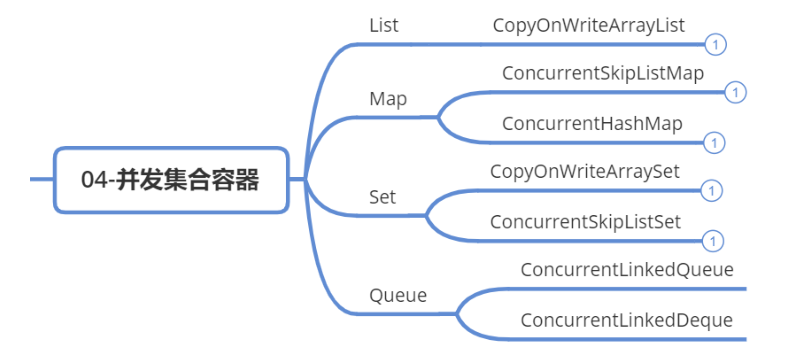
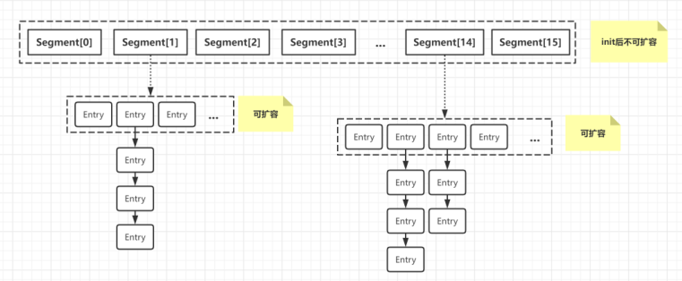
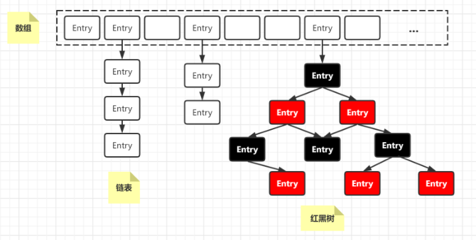

# 并发容器

## 同步容器

Java中的集合主要分为四大类：List、Map、Set、Queue，但是并不是所有集合都是线程安全的。比如，经常使用的ArrayList，HashMap，HashSet都不是线程安全的。

早期的JDK1.0中的就提供了线程安全的集合，包括Vector，Stack、Hashtable。此外还有在JDK1.2中增加的Collections中内部SynchronizedXxx类，它们也是线程安全的集合，可以由对应Collections.synchronizedXxx工厂方法创建。

这些类实现线程安全的方式都是一样的：都是基于synchronized这个同步关键字实现的，对每个公有方法都进行了同步，**保证每次只有一个线程能访问集合，所以它们被称为线程安全的集合（同步容器）**。

## 并发容器

在JDK1.5之前，JDK提供的线程安全的类都是同步集合容器。同步容器都是线程安全的，但是所有线程对容器只能串行访问，性能很差。

在JDK1.5之后引入的JUC并发包，提供的更多类型的并发容器，在性能上做了很多改进优化，可以用来替代同步容器。**它们都是针对多线程并发访问来进行设计的，我们称它们为并发容器**。

并发容器依然可以归属到四大类：List、Map、Set、Queue

### List容器

- **Vector：**synchronized 实现的同步容器，性能差，适合于对数据有强一致性要求的场景
- **`CopyOnWriteArrayList ：`**底层数组实现，使用复制副本进行有锁写操作（数据不一致问题），适合读多写少，允许短暂的数据不一致的场景

### Map容器

- **Hashtable：** synchronized实现的同步容器，性能差，适合于对数据有强一致性要求的场景
- **`ConcurrentHashMap：`**底层数组+链表+红黑树（JDK1.8）实现，对table数组entry加锁（synchronized），具有弱一致性，存在一致性问题。适合存储数据量小，读多写少，允许短暂的数据不一致的场景
- **`ConcurrentSkipListMap：`**底层基于跳表实现的有序Map，使用CAS实现无锁读写操作，具有弱一致性。适合与存储数据量大，读写频繁，允许短暂的数据不一致的场景

### Set容器

- **`CopyOnWriteArraySet：`**底层数组实现的无序Set，使用复制副本实现有锁写操作，具有弱一致性。适合于读多写少，允许读写数据短暂不一致的场景。
- **`ConcurrentSkipListSet：`**底层基于跳表实现的有序Set，使用CAS实现无锁化读写，具有弱一致性。适合于存储数据量大，读写都比较频繁，对数据不要求强一致性的高并发场景。

## ConcurrentHashMap

### JDK1.7结构图

**实现原理：**

- 最外层是多个segment，每个segment的底层数据结构与HashMap类似，仍然是数组和链表组成。
- 每个segment独立上ReentrantLock锁，每个segment之间互不影响，提高并发效率。
- 默认有16个segment，最多可以同时支持16个线程并发写（操作分别分布在不同的Segment上）。这个默认值可以在初始化时设置，一旦初始化以后，就不可以再扩容。

### JDK1.8结构图

**相对于JDK1.7的实现，做了一些改进：**

1. 取消segments字段，直接采用transient volatile HashEntry<K,V>[] table保存数据，采用table数组元素作为锁，从而实现了对每一行数据进行加锁，进一步减少并发冲突的概率。
2. 将原先table数组＋单向链表的数据结构，变更为table数组＋单向链表＋红黑树的结构，查询更快。

**实现原理：**

- 底层采用数组 + 链表 + 红黑树的存储结构
- 存入的Key值通过自己的 hashCode 映射到数组的相应位置
- 为保障查询效率，在特定的时候会对数据增加长度【扩容】，加载因子0.75f
- 当链表长度增加到 8 时，可能会触发链表转为红黑树

## CopyOnWriteArrayList

### 实现原理

CopyOnWriteArrayList底层数组实现，使用复制副本进行有锁写操作，适合读多写少，允许短暂的数据不一致的场景。

**CopyOnWrite思想**：平时查询时，不加锁，更新时从原来的数据copy副本，然后修改副本，最后把原数据替换为副本。修改时，不阻塞读操作，读到的是旧数据。

### 优点

**对于读多写少的场景，相比于其它同步容器，CopyOnWrite这种无锁操作性能更好。**

例如：配置、黑名单、物流地址等变化非常少的数据，这是一种无锁的实现，可以实现程序更高的并发。

### 缺点

1. **数据一致性问题：**这种实现只是保证数据的最终一致性，在添加到拷贝数据而还没进行替换的时候，读到的仍然是旧数据。
2. **内存占用问题：**如果对象比较大，频繁地进行替换会消耗内存，从而致更多的GC次数。这个时候应该考虑其他的容器，例如ConcurrentHashMap。