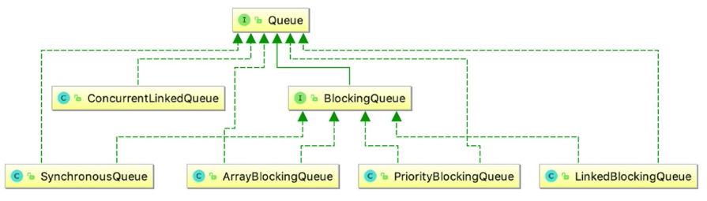

# 并发队列

## 为什么要用队列

1. 通过队列可以很容易的实现数据共享，并且解决上下游处理速度不匹配的问题，典型的生产者消费者模式。
2. 队列中的读写等线程安全问题由队列负责处理。

## 什么是阻塞队列

1. 带阻塞能力的队列，阻塞队列一端是给生产者put数据使用，另一端给消费者take数据使用
2. 阻塞队列是线程安全的，生产者和消费者都可以是多线程
3. take()方法获取并移除队列的头结点，一旦执行take时，队列里无数据则阻塞，直到队列里有数据
4. put()方法是插入元素，如果队列已满，则阻塞，直到队列中有空闲空间
5. 阻塞队列又分为有界和无界队列，无界队列不是无限队列，最大值Integer.MAX_VALUE

## 常用的并发队列

JUC提供了7种适合于不同应用场景的阻塞队列：

**ArrayBlockingQueue示例：**

