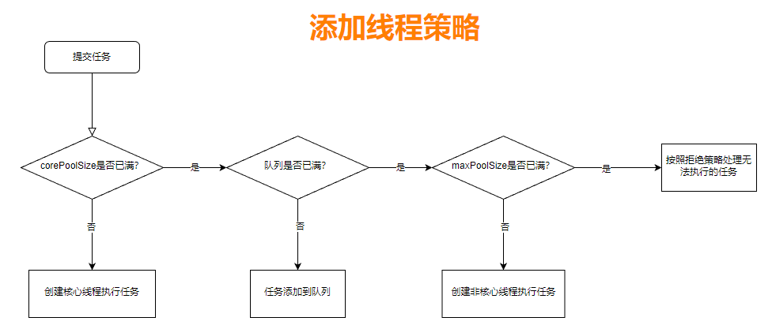

# 线程池

## 线程池介绍

线程池（ThreadPool） 是一种基于**池化思想管理线程**的工具。线程池维护多个线程，等待监督和管理分配可并发执行的任务。看过new Thread源码后我们发现，频繁创建线程销毁线程的开销很大，会降低系统整体性能。

### 优点

1. **降低资源消耗：**通过线程池复用线程，降低创建线程和释放线程的损耗
2. **提高响应速度：**任务到达时，无需等待即刻运行
3. **提高线程的可管理性：**使用线程池可以进行统一的线程分配、调优和监控
4. **提供可扩展性：**线程池具备可扩展性，研发人员可以向其中增加各种功能，比如：延时、定时、监控等

### 适用场景

- **连接池：**预先申请数据库连接，提升申请连接的速度，降低系统的开销
- **快速响应用户请求：**服务器接受到大量请求时，使用线程池是很适合的，它可以大大减少线程的创建和销毁的次数，提高服务器的工作效率。
- 在实际开发中，如果需要创建5个以上的线程，就可以用线程池来管理。

## 线程池参数

| 参数名        | 类型                     | 含义                         |
| ------------- | ------------------------ | ---------------------------- |
| corePoolSize  | int                      | 核心线程数                   |
| maxPoolSize   | ing                      | 最大线程数                   |
| keepAliveTime | long                     | 保持存活时间                 |
| workQueue     | BlockingQueue            | 任务存储队列                 |
| threadFactory | ThreadFactory            | 线程池创建新线程的线程工厂类 |
| Handler       | RejectedExecutionHandler | 线程无法接收任务时的拒绝策略 |

### 参数详解

- **corePoolSize：**核心线程数：线程池完成初始化后，默认情况下，线程池中并没有任何线程，等有任务到来时，再去创建新的线程去执行任务。创建后即使线程空闲（Idle）时也不会回收。

- **maxPoolSize：**最大线程数：线程池可能会在核心线程数的基础上，额外增加一些线程，但这些线程有一个上限，就是maxPoolSize

- **keepAliveTime：**保持存活时间：如果线程池当前的线程数多余corePoolSize，那么当多余的线程空闲时间超过keepAliveTIme，他们就会被终止

- **workQueue：**工作队列，包括：

  - 直接交换队列：SynchronousQueue

  - 无界队列：LinkedBlockingQueue

  - 有界队列：ArrayBlockingQueue

- **threadFactory：**线程工厂：默认使用Executros.defaultThreadFactory()来创建新的线程，创建出来的线程都在同一个线程组，优先级都为MORM_PRIORITY，并且都不是守护线程。如果自己指定ThreadFactory,则可以改变线程名、线程组、优先级、是否是守护线程。

- **Handler：**线程池无法接受所提交任务的拒绝策略

## 线程添加策略



1. 如果线程数小于corePoolSize，即使其他工作线程处于空闲状态，也会创建一个新线程来执行新任务
2. 如果线程数大于或等于corePoolSize但小于maxPoolSize，则将任务放入队列
3. 如果队列已满，并且线程数小于maxPoolSize，则创建一个新的线程来执行新任务
4. 如果队列已满，并且线程数大于或等于maxPoolSize，则执行拒绝策略，拒绝该任务

## 增减线程的特点

- **固定大小线程池**：通过设置corePoolSize和maxPoolSize相同，可以创建固定大小的线程池。
- **动态线程池**：线程池希望保持较少的线程数，并且只有在负载变得很大时才会增加。可以设置corePoolSize比maxPoolSize大一些
- 通过设置maxPoolSize为很高的值，例如Integer.MAX_VALUE，可以允许线程池容纳任意数量的并发任务。
- 只有在队列填满时才创建多于corePoolSize的线程，所以如果用的是无界队列（LinkedBlockingQueue），则线程数就一直不会超过corePoolSize

## 自动创建线程

**`Constructor Parameter: (corePoolSize, maxPoolSize, keepAliveTime, workQueue)`**

### newFixedThreadPool

固定数量线程池，无界任务阻塞队列，Constructor Parameter: (constructor-arg,constructor-arg,0,LinkedBlockingQueue)

如果线程处理任务的速度慢，越来越多的任务就会放在无界队列中，会占用大量内存，这样就会导致内存溢出（OOM）的错误。

### SingleThreadExecutor

一个线程的线程池，无界任务阻塞队列，Constructor Parameter: (1,1,0 seconds,LinkedBlockingQueue)

它和newFixedThreadPool的原理相同，只不过把线程数直接设置为1，当请求堆积时，也会占用大量内存。

### CachedThreadPool

可缓存线程的无界线程池，可以自动回收多余线程，Constructor Parameter: (0,Inter.MAX_VALUE,60 seconds,SynchronousQueue)

如果第二个参数maxPoolSize设置为Integer.MAX_VALUE，可能会创建非常多的线程，导致OOM。

### ScheduledThreadPool

支持定期和周期性任务的线程池，Constructor Parameter: (constructor-arg,Integer.MAX_VALUE,0 seconds,DelayedWorkQueue)

## 手动创建线程池

根据不同的业务场景，自己设置线程池的参数、线程名、任务被拒绝后如何记录日志等

```java
// 使用标准构造器，构造一个普通的线程池
public ThreadPoolExecutor(
    int corePoolSize, // 核心线程数，即使线程空闲（Idle），也不会回收；
    int maximumPoolSize, // 线程数的上限；
    long keepAliveTime, TimeUnit unit, // 线程最大空闲（Idle）时长
    BlockingQueue workQueue, // 任务的排队队列
    ThreadFactory threadFactory, // 新线程的产生方式
    RejectedExecutionHandler handler // 拒绝策略
)   
```

### 设置线程池数量

- **CPU密集型：**线程数量不能太多，可以设置为与相当于CPU核数。（CPU 密集型任务也叫计算密集型任务，其特点是要进行大量计算而需要消耗CPU 资源，比如计算圆周率、对视频进行高清解码等，CPU 密集型任务并行的任务越多，花在任务切换的时间就越多，CPU 执行任务的效率就越低，所以，要最高效地利用 CPU，并行执行任务的数量可以等于 CPU 的核心数。）
- **IO密集型：**IO密集型CPU使用率不高，可以设置的线程数量多一些，可以设置为CPU核心数的2倍
- **参考Brain Goetz推荐的计算方法：**线程数=CPU核心数*(1 + 平均等待时间/平均工作时间)

### 拒绝策略

#### 拒绝时机

1. 当Executor关闭时，提交新任务会被拒绝。
2. 当Executor对最大线程和工作队列容量使用有限边界并且已经饱和时

#### 拒绝策略

- 抛异常策略：AbortPolicy，默认拒绝策略，丢弃任务并抛出RejectedExecutionException异常
- 不做处理策略：DiscardPolicy，丢弃任务，如果线程队列已满，则后续提交的任务都会被静默丢弃，不抛出异常
- 丢弃老任务策略：DiscardOldestPolicy，丢弃队列中存在时间最久的任务，提交新的任务
- 自产自销策略：CallerRunsPolicy，那个线程提交任务就由那个线程负责运行

## 停止线程池

- **shutDown()：**将线程池状态置为**SHUTDOWN**，并不会立即停止。线程池会停止接收新的任务，等待正在执行的任务和队列中的任务都执行完毕后，才会真正的停止线程池

- **isShutDown()**：判断线程池是否进入**SHUTDOWN**状态，返回boolean类型，执行shutDown()方法后返回true

- **shutDownNow()：**将线程池状态置为**STOP**。

  1、停止接收新的任务。

  2、停止处理队列中的任务。

  3、尝试中断正在执行的任务（通过调用Thread.interrupt()方法来实现）。

  4、返回所有未执行的任务列表

- **isTerminated()：**返回线程池是否完全停止，返回boolean类型，一般放在shutdown()方法之后使用

- **waitTermination(Long timeout, TimeUnit unit)：**用于设置阻塞时间，返回线程池是否已停止，一般放在shutdown()方法之后使用，否则一直在阻塞，直至超过设置的阻塞时间后返回false。

  使用该方法后当前线程处于阻塞状态，直到：

  1、所有任务都执行完毕，返回true

  2、超过阻塞时间，返回false

  3、等待过程中线程被中断。抛出InterruptedException

## 线程池状态

- **RUNNING：**接受新任务，并处理排队任务
- **SHUTDOWN：**不接受新任务，但处理排队任务
- **STOP：**不接受新任务，也不处理排队任务，并中断正在执行的任务
- **TIDYING：**整理，所有任务都已终止，workerCount为零时，线程池会转换到TIDYING状态，并将运行terminate()钩子方法
- **TERMINATED：**terminate())钩子方法运行完成


