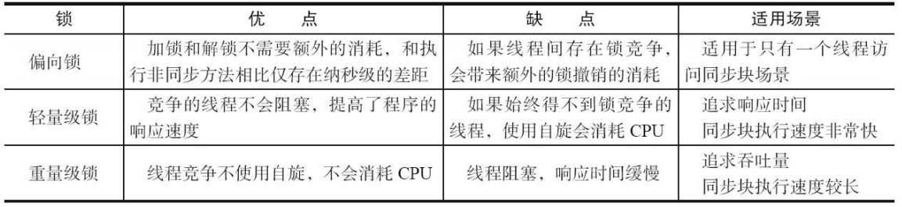

# 锁优化

JDK 1.6 为了减少获得锁和释放锁带来的性能消耗，引入了“偏向锁”和“轻量级锁”，在 JDK 1.6 中，锁一共有 4 种状态，级别从低到高依次是：无锁状态、偏向锁状态、轻量级锁状态和重量级锁状态，这几个状态会随着竞争情况逐渐升级。锁可以升级但不能降级，目的是为了提高获得锁和释放锁的效率。

## 重量级锁

重量级锁是 JVM 中最为基础的锁实现。在这种状态下，JVM 会阻塞加锁失败的线程，并且在目标锁被释放的时候，唤醒这些线程。Java 线程的阻塞以及唤醒，依赖于操作系统的互斥量（mutex） 实现，这些操作需要从操作系统的用户态切换至内核态，其开销非常之大。

为了尽量避免线程阻塞、唤醒操作，JVM 会在线程进入阻塞状态之前，以及被唤醒后竞争不到锁的情况下，进入自旋状态，在处理器上空跑并且轮询锁是否被释放。这就是所谓的自旋锁。

如果在轮询时，锁恰好被释放了，那么当前线程便无须进入阻塞状态，而是直接获得这把锁。但是，自旋等待不能代替阻塞。自旋等待本身虽然避免了线程切换的开销，但它是要占用处理器时间的，如果锁被占用的时间很长，自旋的线程会白白消耗处理器资源，造成性能的浪费。

因此自旋等待的时间会有一定的限度，如果自旋超过了限定的次数仍然没有成功获得锁，就会使用传统的方式去挂起线程。自旋次数的默认值是 10 次（JVM 对应参数`-XX：PreBlockSpin`）。

由于自旋次数对整个 JVM 中所有的锁来说都是相同的，在 JDK 6中对自旋锁进行了优化，引入了自适应的自旋。自适应意味着自旋时间（循环次数）不再是固定的了，而是根据以往自旋等待时是否能够获得锁，来动态调整自旋的时间。比如，在同一个锁对象上，自旋等待刚刚成功获得过锁，那么虚拟机就会认为这次自旋也很有可能再次成功，进而允许自旋等待持续相对更长的时间。另一方面，如果对于某个锁，自旋很少成功获得过锁，那在以后要获取这个锁时将有可能直接省略掉自旋过程。

但是，自旋状态还带来另外一个副作用，那便是不公平的锁机制。处于阻塞状态的线程，并没有办法立刻竞争被释放的锁。处于自旋状态的线程，则很有可能优先获得这把锁。

## 轻量级锁

多个线程在不同的时间段请求同一把锁，不存在锁竞争的情况。针对这种情形，JVM 采用了轻量级锁，来避免重量级锁的阻塞以及唤醒。

### 轻量级锁加锁

线程在执行同步块之前，JVM 会先在当前线程的栈桢中创建一个名为锁记录（Lock Record）的空间，用于存储锁对象目前的 Mark Word 的拷贝，官方称为 Displaced Mark Word。

然后，JVM 会尝试用 CAS（compare-and-swap）操作将对象头中的 Mark Word 替换为指向锁记录的指针。如果成功，当前线程获得锁，并且对象 Mark Word 的锁标志位（Mark Word的最后两个比特）将转变为“00”，表示此对象处于轻量级锁定状态。

如果失败，那么有两种可能：

1. 该线程重复获取同一把锁。此时，JVM会将锁记录清零，以代表该锁被重复获取。
2. 其他线程持有该锁。此时，JVM 会将这把锁膨胀为重量级锁，锁标志的状态值变为“10”，此时 Mark Word 中存储的就是指向重量级锁（互斥量）的指针，后面等待锁的线程也必须进入阻塞状态。

### 轻量级锁解锁

当进行解锁操作时，如果当前锁记录（你可以将一个线程的所有锁记录想象成一个栈结构，每次加锁压入一条锁记录，解锁弹出一条锁记录，当前锁记录指的便是栈顶的锁记录）的值为 0，则代表重复进入同一把锁，直接返回即可。

否则，JVM 使用 CAS 操作将线程中复制的 Displaced Mark Word替换回对象当前的 Mark Word 。如果成功，该线程已经成功释放这把锁。如果替换失败，则意味着这把锁已经被膨胀为重量级锁。此时，JVM 会进入重量级锁的释放过程，唤醒因竞争该锁而被阻塞了的线程。

因为自旋会消耗 CPU，为了避免无用的自旋（比如获得锁的线程被阻塞住了），一旦锁升级成重量级锁，就不会再恢复到轻量级锁状态。

轻量级锁能提升程序同步性能的依据是“对于绝大部分的锁，在整个同步周期内都是不存在竞争的”这一经验法则。如果没有竞争，轻量级锁便通过 CAS 操作成功避免了使用互斥量的开销；但如果确实存在锁竞争，除了互斥量的本身开销外，还额外发生了CAS操作的开销。因此在有竞争的情况下， 轻量级锁反而会比传统的重量级锁更慢。

## 偏向锁

HotSpot 的作者经过研究发现，大多数情况下，锁不仅不存在多线程竞争，而且总是由同一线程多次获得，为了让线程获得锁的代价更低而引入了偏向锁。它的目的是**在无竞争的情况下把整个同步都消除掉**，连 CAS 操作都不去做。

### 实现原理

偏向锁会偏向于第一个获得它的线程，如果在接下来的执行过程中，该锁一直没有被其他的线程获取，则持有偏向锁的线程将永远不需要再进行同步。

具体来说，当锁对象第一次被线程获取的时候， JVM 会通过 CAS 操作，将当前线程ID 记录在锁对象的的 Mark Word 之中，并且将 Mark Word 的最后三位设置为 101（是否偏向锁 + 锁标志位）。

在接下来的运行过程中，每当有线程请求这把锁，JVM 只需判断锁对象 Mark Word 中：最后三位是否为 101，是否包含当前线程的ID，以及 epoch 值是否和锁对象的类的 epoch 值相同。如果都满足，那么当前线程持有该偏向锁，可以直接返回。

如果不满足，就代表有另一个线程来竞争这个偏向锁。这个时候通过 CAS 操作竞争锁，分两种情况：

- 成功：表示之前的线程不存在了， 将 Mark Word 中线程ID设置为当前线程ID，锁不会升级，仍然为偏向锁
- 失败： 表示之前的线程仍然存在，有竞争。当到达全局安全点（safepoint）时获得偏向锁的线程被挂起，偏向锁升级为轻量级锁，然后被阻塞在安全点的线程继续往下执行同步代码。

偏向锁针对的场景就是从始至终只有一个线程请求某一把锁，一旦出现竞争就不再使用偏向锁。

### 偏向锁的撤销

偏向锁使用了一种等到竞争出现才释放锁的机制，所以一旦有其他线程尝试竞争偏向锁时，偏向模式就马上宣告结束。偏向锁的撤销，需要持有偏向锁的线程到达全局安全点（该状态下所有线程都是暂停的）。

具体的做法是在每个类中维护一个 epoch 值，可以理解为第几代偏向锁。当设置偏向锁时，JVM 需要将该 epoch 值复制到锁对象的Mark Word 中。在宣布某个类的偏向锁失效时（撤销达到20次），JVM 则将该类的 epoch 值加 1，表示之前那一代的偏向锁已经失效。而新设置的偏向锁则需要复制新的 epoch 值。

为了保证当前持有偏向锁并且已加锁的线程不至于因此丢锁，JVM 需要遍历所有线程的 Java 栈，找出该类已加锁的实例，并且将它们 Mark Word 中的 epoch 值加 1。该操作需要所有线程处于安全点状态。

如果某一类锁对象的总撤销数超过了一个阈值（对应 JVM 参数 `-XX:BiasedLockingBulkRebiasThreshold`，默认为 20），那么 JVM 会宣布这个类的偏向锁失效。

如果总撤销数超过另一个阈值（对应 JVM 参数 `-XX:BiasedLockingBulkRevokeThreshold`，默认值为 40），那么 JVM 会认为这个类已经不再适合偏向锁。此时，JVM 会撤销该类实例的偏向锁，并且在之后的加锁过程中直接为该类实例设置轻量级锁。

### 偏向锁的关闭

在 Java 6、7 里偏向锁是默认启用的，但是它在应用程序启动几秒钟之后才激活，可以关闭延迟（对应JVM 参数 `-XX:BiasedLockingStartupDelay=0`。

如果应用程序里所有的锁通常情况下处于竞争状态，那么偏向锁就会是一种累赘，对于这种情况，可以关闭偏向锁（对应 JVM 参数`-XX:- UseBiasedLocking=false`），那么程序默认会进入轻量级锁状态。

## 锁的优缺点对比

