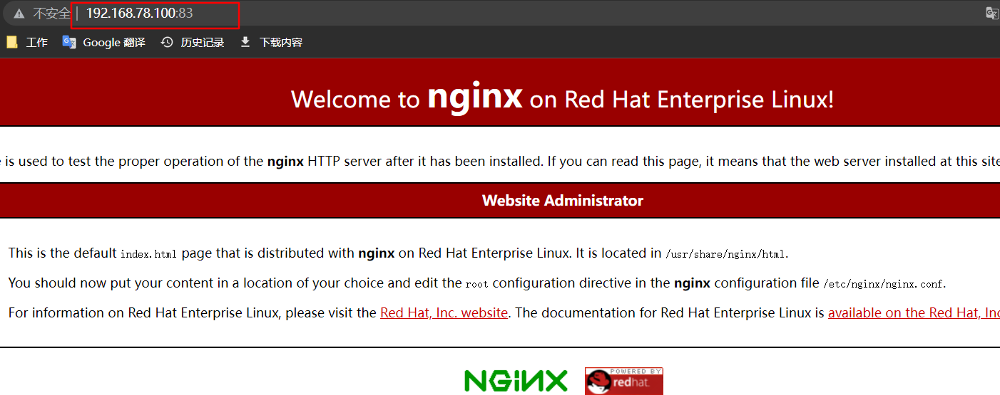

# DockerFile自动构建nginx镜像

基于 ["手动制作nginx镜像"](./手动制作nginx镜像.md) 的命令脚本，编写dockerfile，自动构建nginx镜像。

## 编写dockerfile文件

文件名称必须为：`dockerfile`，存放目录为：`/opt/dockerfile/nginx`

```shell
mkdir -p /opt/dockerfile/nginx && cd /opt/dockerfile/nginx
vim dockerfile
```

```shell
FROM centos:centos7
RUN  curl -O /etc/yum.repos.d/CentOS-Base.repo http://mirrors.aliyun.com/repo/Centos-7.repo
RUN  curl -O /etc/yum.repos.d/epel.repo http://mirrors.aliyun.com/repo/epel-7.repo
RUN  yum install nginx  -y
CMD ["nginx","-g","daemon off;"]
```

## 自动构建镜像

```shell
docker image build -t centos7_nginx:v2 /opt/dockerfile/nginx
```

## 测试

```shell
docker run -d -p 83:80 centos7_nginx:v2
```


