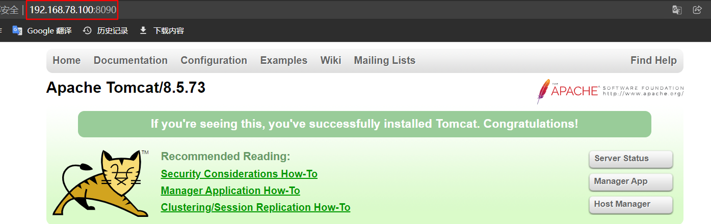

# DockerFile自动构建tomcat镜像

## 下载tomcat和jdk

下载`tomcat`和`jdk`，与`dockerfile`放在同一目录下`/opt/dockerfile/tomcat`

```shell
jdk-8u271-linux-x64.tar.gz
apache-tomcat-8.5.73.tar.gz
```

## 编写dockerfile

文件名称必须为：`dockerfile`，存放目录为：`/opt/dockerfile/tomcat`

```shell
# Base Image
FROM centos:centos7
# Image Desc
MAINTAINER zrd

# Add java and tomcat
ADD jdk-8u271-linux-x64.tar.gz /usr/local/ 
ADD apache-tomcat-8.5.73.tar.gz /usr/local/ 

# Set WORKDIR
ENV workpath /usr/local
WORKDIR $workpath

# configuration Environment 
ENV JAVA_HOME /usr/local/jdk1.8.0_271
ENV CLASSPATH $JAVA_HOME/lib/dt.jar:$JAVA_HOME/lib/tools.jar 
ENV CATALINA_HOME /usr/local/apache-tomcat-8.5.73
ENV PATH $PATH:$JAVA_HOME/bin:$CATALINA_HOME/lib:$CATALINA_HOME/bin 

# container listener port 
EXPOSE 8080

# start tomcat
ENTRYPOINT ["/usr/local/apache-tomcat-8.5.73/bin/catalina.sh","run"]
```

## 自动构建镜像

```shell
docker image build -t centos7_tomcat:v1 /opt/dockerfile/tomcat
```

## 测试

```shell
docker run -d -p 8090:8080 centos7_tomcat:v1
```


