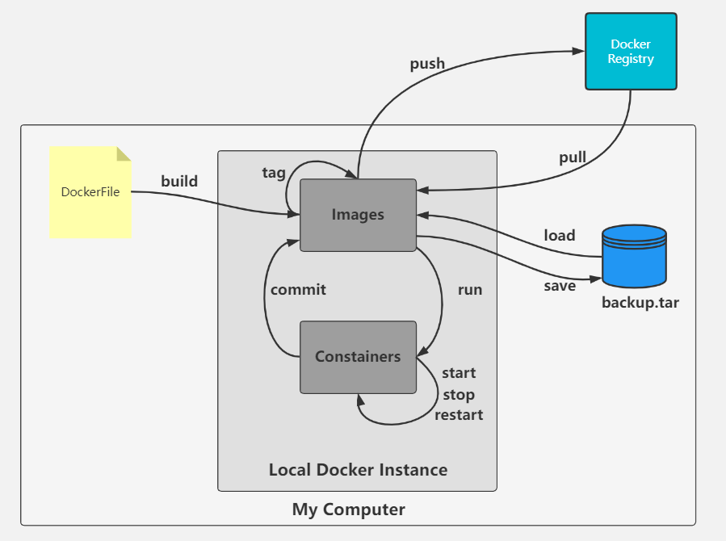

# Docker概览

## Docker是什么

Docker 是一个开源的应用容器引擎，基于 Go 语言 ，诞生于2013年初。

**功能**

可以使用 Docker 来开发、部署和运行我们的应用程序，可以将应用以及所有的环境依赖打包到镜像中，然后发布到任何流行的 Linux 机器，实现虚拟化。

## Docker核心组件

### Docker Image

`Image`一般中文称之为镜像。Docker镜像是一个特殊的文件系统，提供容器运行时所需的资源。

Docker 镜像的构建是通过一个 DSL 语言来编写的，叫 Dockerfile。

### Docker Container

`Container` 也就是容器。Docker 官方对容器的定义：

```shell
A container is a runnable instance of an image.
```

翻译过来就是

```shell
容器是镜像的运行实例。
```

这和进程的定义非常类似：进程是程序的运行实例。这样我们就可以将镜像类比为程序，容器类比为进程。也好比对象编程中类与对象的关系，我们定义好每一个类，然后使用类创建对象，对应到 Docker 的使用上， 镜像（类） 容器（对象）。

### Docker **Registry** 

中文一般翻译为注册中心，是用来存储 Docker 镜像的地方。

一个 **Docker Registry** 中可以包含多个**仓库** （`Repository`）；每个仓库可以包含多个  **标签** （`Tag`）；每个标签对应一个镜像。

通常，一个仓库会包含同一个软件不同版本的镜像，而标签就常用于对应该软件的各个版本。我们可以通过 `<仓库名>:<标签>` 的格式来指定具体是这个软件哪个版本的镜像。如果不给出标签，将以 `latest` 作为默认标签。

Docker Registry 默认使用 Docker Hub，比如我们执行`docker pull` 时，Docker 默认去 Docker Hub 中寻找名字为 image-name 的镜像。当然，我们也可以自己进行单独配置。

### Image、Container、Registry 三者之间的关系


