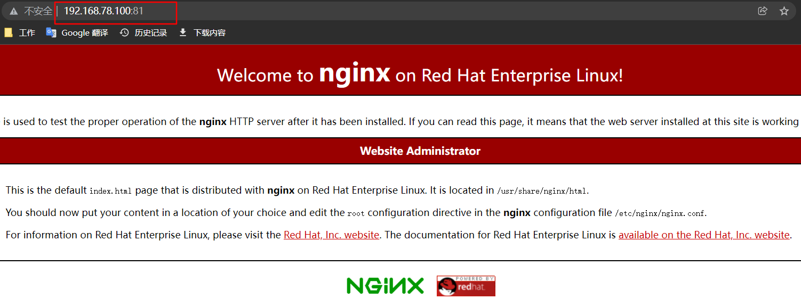
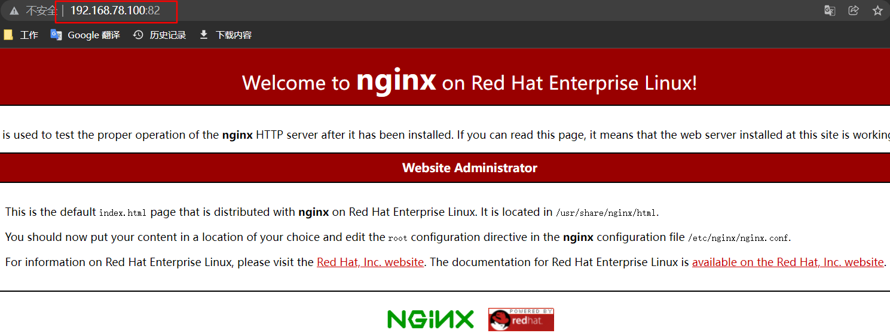

# 手动制作nginx镜像

## 一、基于官方镜像创建容器

```shell
docker run -it -p 81:80 centos:centos7 /bin/bash
```

## 二、在容器内安装相关服务

**下载安装基本工具(设置下载源)**

```shell
curl -O /etc/yum.repos.d/CentOS-Base.repo http://mirrors.aliyun.com/repo/Centos-7.repo
curl -O /etc/yum.repos.d/epel.repo http://mirrors.aliyun.com/repo/epel-7.repo
```

**安装 nginx**

```shell
yum install nginx  -y
```

**启动nginx**

```shell
nginx -g 'daemon off;'
```

**测试**，**访问**：



## 三、将容器保存为镜像

```shell
docker commit bebcf8b94b74 centos7_nginx:v1
```

## 四、测试

```shell
docker run -d -p 82:80 centos7_nginx:v1 nginx -g 'daemon off;'
```

**访问：**


