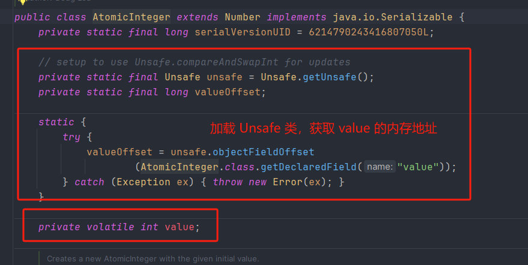
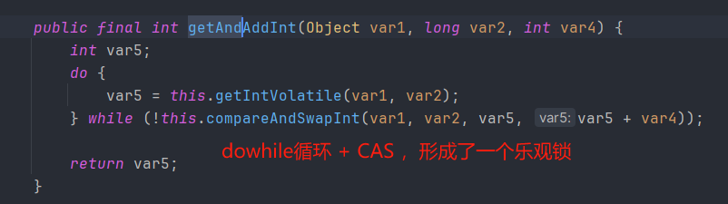
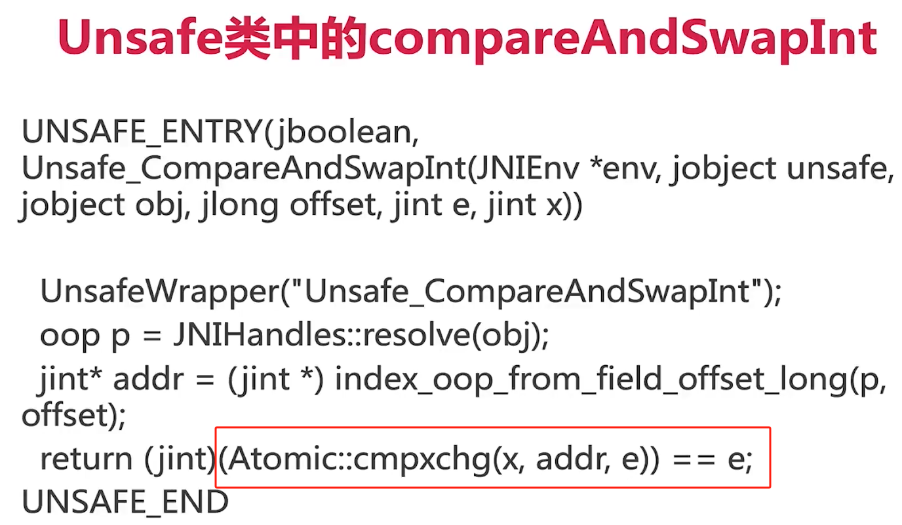

# CAS

## CAS 是什么

CAS（compare and swap） 的缩写，中文翻译：比较并交换，它是一种原子操作，用来解决并发情况下使用锁造成性能损耗的一种机制。

CAS有三个操作参数：内存值V，预期值A、要修改的值B，当且仅当预期值A与内存值V相等时，才将内存值V改为B，否则什么都不做，最后返回当前的内存值V。

## Java中是如何利用CAS来实现原子操作的

以AtomicInteger为例：

1. AtomicInteger加载Unsafe工具，用来直接操作内存数据

   

2. 用Unsafe来实现底层操作

   Unsafe是CAS的核心类。Java无法直接访问底层操作系统，而是通过本地方法（native）来访问。但是JVM留了一个后门：Unsafe类，提供了硬件级别的内存操作。

   valueOffset表示变量值在内存中的偏移地址，由于Unsafe是根据内存偏移地址来获取数据的原值，因此我们就可以用Unsafe来实现CAS。

3. 用volatile修改value字段，保证可见性

4. 以getAndAddInt方法来分析

   

   compareAndSwapInt：拿到变量value在内存中的地址，通过Atomic::cnpxchg实现原子性的比较和替换，其中参数x是即将更新的值，参数e是原内存的值。至此，最终完成CAS的全过程。



## 自旋锁（spinLock）

自旋锁是指尝试获取锁的线程不会立即阻塞，而是采用循环的方式去尝试获取锁，当线程发现锁被占用时，会不断循环判断锁的状态，直到获取。这样的好处是减少线程上下文切换的消耗，缺点是循环会消耗CPU。

### 自旋锁实现

```java
public class SpinLock {
    private static AtomicReference<Thread> sign = new AtomicReference<>();

    private void lock(){
        Thread currentThread = Thread.currentThread();
        while (!sign.compareAndSet(null,currentThread)){
            System.out.println(currentThread.getName()+"自旋获取失败，再次尝试自旋获取");
        }
    }

    private void unlock(){
        Thread currentThread = Thread.currentThread();
        sign.compareAndSet(currentThread,null);
    }

    public static void main(String[] args) {
        SpinLock spinLock = new SpinLock();
        Runnable runnable = () -> {
            System.out.println(Thread.currentThread().getName()+"开始尝试获取自旋锁");
            spinLock.lock();
            System.out.println(Thread.currentThread().getName()+"获取到了自旋锁");
            try {
                Thread.sleep(200);
            } catch (InterruptedException e) {
                throw new RuntimeException(e);
            } finally {
                System.out.println(Thread.currentThread().getName()+"释放了自旋锁");
                spinLock.unlock();
            }
        };
        new Thread(runnable).start();
        new Thread(runnable).start();
    }
}
```

## ABA问题

CAS算法实现一个重要前提需要取出内存中某时刻的数据并在当下时刻比较并替换，那么在这个时间差类会导致数据的变化。

比如说一个线程one从内存位置V中取出A，这时候另一个线程two也从内存中取出A，并且线程two进行了一些操作将值变成了B，然后线程two又将V位置的数据变成A，这时候线程one进行CAS操作发现内存中仍然是A，然后线程one操作成功。尽管线程one的CAS操作成功，但是不代表这个过程就是没有问题的。

ABA问题可以使用版本号解决

```java
public class ABADemo {
    static AtomicStampedReference<Integer> atomicStampedReference = new AtomicStampedReference<Integer>(100,1);
    public static void main(String[] args) {
        new Thread(()->{
            System.out.println(Thread.currentThread().getName()+"第一次版本号："+ atomicStampedReference.getStamp());
            try { Thread.sleep( 1000 ); } catch (InterruptedException e) { e.printStackTrace(); }
            atomicStampedReference.compareAndSet(100,101,atomicStampedReference.getStamp(),atomicStampedReference.getStamp()+1);
            System.out.println(Thread.currentThread().getName()+"第二次版本号："+ atomicStampedReference.getStamp());
            atomicStampedReference.compareAndSet(101,100,atomicStampedReference.getStamp(),atomicStampedReference.getStamp()+1);
            System.out.println(Thread.currentThread().getName()+"第三次版本号："+ atomicStampedReference.getStamp());
        },"t1").start();

        new Thread(()->{
            int stamp = atomicStampedReference.getStamp();
            System.out.println(Thread.currentThread().getName()+"第一次版本号："+ stamp);
            try { Thread.sleep( 3000 ); } catch (InterruptedException e) { e.printStackTrace(); }
            boolean result = atomicStampedReference.compareAndSet(100,1024,stamp,stamp+1);
            System.out.println(Thread.currentThread().getName()+":"+result+":"+atomicStampedReference.getReference());
        },"t2").start();
    }
}
```


