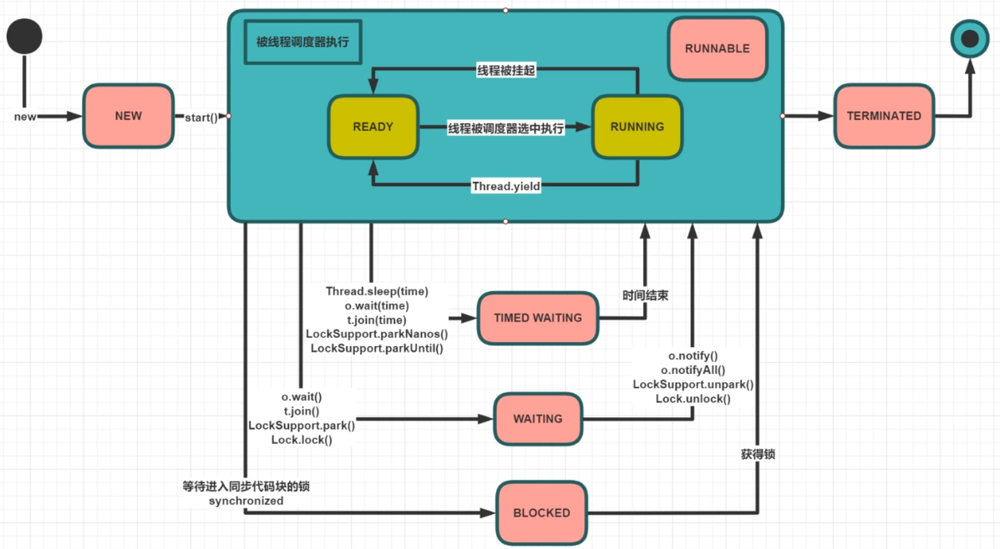
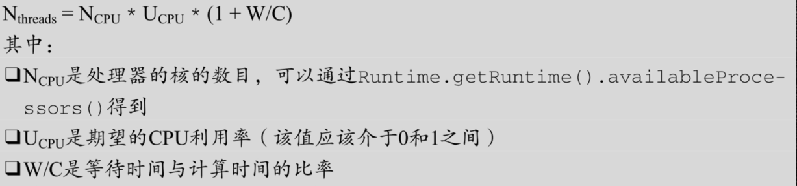

# 线程基础

## 线程的基本概念

### 进程

是程序一次执行，系统进行资源分配和调度的基本单位，每一个进程都有它的内存空间和系统资源

### 线程

在同一个进程内可以执行多个任务，每一个任务可以看做是一个线程，它是调度执行的基本单位

### 管程

Monitor(监视器)，也就是我们平时所说的锁

### 用户线程和守护线程

Java线程分为用户线程和守护线程，线程的**daemon**属性为true表示是守护线程，false表示是用户线程

#### 守护线程

是一种特殊线程，在后台默默完成一些系统性的服务，比如垃圾回收线程

#### 用户线程

是系统的工作线程，它会完成这个程序需要完成的业务操作

#### 注意点

- 当程序中所有用户线程执行完毕之后，不管守护线程是否结束，系统都会自动退出
- 设置守护线程，需要在start()方法之前进行

```java
/**
* t1设置为守护线程，当main线程执行完毕，意味着程序需要完成的业务操作已经结束了，此时虽然守护线程t1还未执行结束，但是系统也自动退出了。所以当系统只剩下守护进程的时候，java虚拟机会自动退出。
**/
public static void main(String[] args){
    Thread t1 = new Thread(() -> {
        System.out.println(Thread.currentThread().getName()+"\t 开始运行，"+(Thread.currentThread().isDaemon() ? "守护线程":"用户线程"));
        while (true) {

        }
    }, "t1");
    //线程的daemon属性为true表示是守护线程，false表示是用户线程
    t1.setDaemon(true);
    t1.start();
    //2秒钟后主线程再运行
    try { TimeUnit.SECONDS.sleep(2); } catch (InterruptedException e) { e.printStackTrace(); }
    System.out.println(Thread.currentThread().getName()+"----------task is over");
}
//output:
t1	 开始运行，守护线程
main----------task is over
```

## 创建线程

### 创建方式

1. 实现Runnable接口，重写run()函数，运行start()方法
2. 继承Thread类，重写run()函数，运行start()方法

### 两种方法的对比

实现Runnable接口更好，一个类继承Thread类就无法再继承其他类，但是一个类实现了Runnable接口，还可以继承其他类，更灵活。

这两种创建线程的方式，最终都调用`target.run()`。准确的讲：一种创建线程方式（new Thread().start()）、两种实现执行单元的方式

### 其他错误观点

1. 线程池创建线程
2. 通过Future Callable和FutureTask创建线程
3. lambda表达式

## 线程的生命周期

#### 线程的六种状态

1. New：线程刚刚创建，还没有启动
2. Runnable：可运行状态（分为两种：Ready、Running）
3. Waiting：等待被唤醒
4. Timed Waiting：隔一段时间后后自动唤醒（例如：sleep(5000)）
5. Blocked：被阻塞
6. Terminated：线程结束



一般习惯而言，把Blocked(被阻塞）、Waiting(等待）、Timed Waiting(计时等待）都称为阻塞状态。

#### lock和synchronized的线程状态

- lock.lock()：进入Waiting状态（通过JUC的AQS实现）
- synchronized：进入Blocked状态（只有synchronized才进入Blocked状态）

## 线程的中断

使用interrupt来通知线程中断，而不是强制。

#### 线程中断的三种方法

1. interrupt()：中断某个线程（设置标志位）
2. isInterrupted()：查询某线程是否被中断过（查询标志位）
3. static interrupted()：查询当前线程是否被中断过，并重置中断标志

如果线程处于活动状态，会将线程中断标志设置为true，被设置中断标志的线程将继续正常运行，所以interrupt()并不能真正的中断线程，需要被设置的线程自己配合才行；如果线程处于被阻塞状态（例如：sleep、wait、join等），那么线程将立即退出被阻塞状态，将线程中断标志位置为false，并抛出一个InterruptedException。

## 线程数设多少最合适



W/C：一般通过Profiler工具（性能分析工具），例如：JProfiler、Arthas


