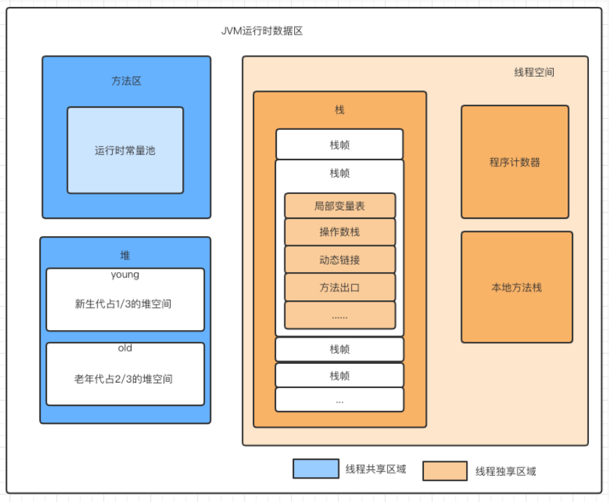
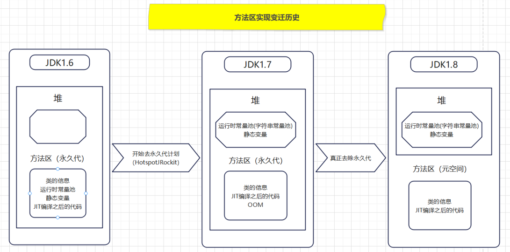
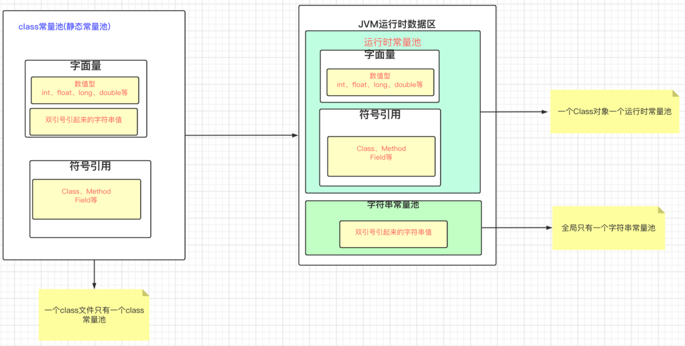
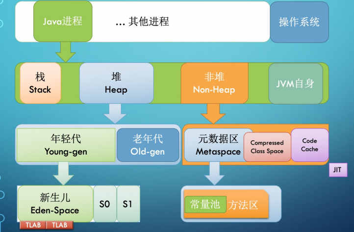

# JVM内存结构

## JVM运行时内存结构

JVM 在执行Java 程序的过程中会把它所管理的内存划分为若干个不同的数据区域。这些区域有各自的用途，以及创建和销毁的时间，有的区域随着虚拟机进程的启动而一直存在，有些区域则是依赖用户线程的启动和结束而建立和销毁。

根据《Java虚拟机规范》的规定，JVM 所管理的内存将会包括以下几个运行时数据区域，如下图所示：



### 堆

**线程共享，存放对象实例以及数组。**

堆是垃圾收集器管理的内存区域，因此也被称作**GC堆**（Garbage Collected Heap）。由于现代垃圾收集器大部分都是基于分代收集理论设计的，所以堆中经常会出现`新生代`、`老年代`、`永久代`、`Eden空间`等。

堆既可以被实现成固定大小的，也可以是可扩展的，不过当前主流的JVM 都是按照可扩展来实现的（通过参数`-Xmx`和`-Xms`设定）。如果在堆中没有内存完成实例分配，并且堆也无法再扩展时，Java虚拟机将会抛出 `OutOfMemoryError` 异常。

### 方法区

线程共享，存储已被虚拟机加载的类型信息、常量、静态变量、即时编译器编译后的代码缓存等数据。虽然《Java虚拟机规范》中把方法区描述为堆的一个逻辑部分，但是它却有一个别名叫作`非堆（Non-Heap）`，目的是与堆区分开来。

此外，方法区中还包括运行时常量池（Runtime Constant Pool）、Compressed Class Space、Code Cache。

**运行时常量池（Runtime Constant Pool）：**用于存放类或接口编译期生成的各种字面量（int、long、float、double数值字面量、字符串字面量）与符号（方法或字段）引用，JVM 就会在运行时常量池中搜索其具体的内存地址。

运行时常量池相对于 Class 文件常量池的另外一个重要特征是具备动态性，在运行期间也可以将新的常量放入池中。

**Compressed Class Space：**存放 class 信息的，和 Metaspace 有交叉。

**Code Cache：**存放 JIT 编译器编译后的本地机器代码。

#### 方法区实现变迁历史



#### 永久代和元空间的区别

1. JDK1.8之前使用的方法区实现是永久代，JDK1.8及以后使用的方法区实现是元空间。
2. 存储位置不同：永久代所使用的内存区域是JVM进程所使用的区域，它的大小受整个JVM的大小所限制。元空间所使用的内存区域是物理内存区域。那么元空间的使用大小只会受物理内存大小的限制。
3. 存储内容不同：永久代存储的信息基本上就是上面方法区存储内容中的数据。元空间只存储类的元信息，而静态变量和运行时常量池都挪到堆中。

### 字符串常量池

#### 三种常量池的比较

- class常量池：一个class文件只有一个class常量池，存放字面量（数值字面量、字符串字面量）与符号（方法或字段）引用
- 运行时常量池：一个class对象有一个运行时常量池，存放字面量（数值字面量、字符串字面量）与符号（方法或字段）引用
- 字符串常量池：全局只有一个字符串常量池，双引号引起来的字符串值



#### 字符串常量池如何存储数据

为了更快的查找某个字符串是否存在于常量池 Java 在设计字符串常量池的时候，使用`StringTable`保存字符串的引用。`StringTable`类似于`HashTable`（哈希表）。在JDK1.7+，`StringTable`可以通过参数指定`-XX:StringTableSize=65539`

#### 字符串常量池如何查找字符串

1. 根据字符串的hashcode找到对应entry
2. 如果没有冲突，它可能只是一个entry
3. 如何有冲突，它可能是一个entry的链表，然后Java再遍历链表，匹配引用对应的字符串
4. 如果找到字符串，返回引用
5. 如果找不到字符串，在使用intern()方法的时候，会将intern()方法调用者的引用放入到`stringtable`中

#### 字符串比较总结

- 单独使用""引号创建的字符串都是常量，编译期就已经确定存储到String Pool(字符串常量池)中。
- 使用new String("")创建的对象会存储到heap中，是运行期新创建的。
- 使用只包含常量的字符串连接符，如"a"+"b"创建的也是常量，编译期就能确定已经存储到String Pool中。
- 被final修饰的变量会变为常量，编译期就能确定已经存储到String Pool中。
- 使用包含变量的字符串连接，如"a"+s创建的对象是运行期才创建的，存储到heap中。
- 运行期调用String的intern()方法可以向String Pool中动态添加对象。

```java
String a = "s1";
//b被final修饰，不可变，编译器在编译期间当作常量使用
final String b = "s";
String c = "s";
//等同于 d = "s" + 1 ，直接计算出 a = "s1"，常量池中已经有对象a = "s1"，因此，d指向与 a 一样的地址
String d = b + 1;
// e的值在运行时才能确定，生成的值存储在堆上，最终，e指向的是堆上的s1
String e = c + 1;
System.out.println(a == d);
System.out.println(a == e);
System.out.println(a == e.intern());
//output: true  false true
```

### 虚拟机栈

线程私有，它的生命周期与线程相同。每个方法被执行的时候，JVM 都会同步创建一个栈帧（Stack Frame）用于**存储局部变量表、操作数栈、动态连接、方法出口**等信息。每一个方法被调用直至执行完毕的过程，就对应着一个栈帧在虚拟机栈中从入栈到出栈的过程。

在《Java虚拟机规范》中，对这个内存区域规定了两类异常状况：

1. 如果线程请求的栈深度大于虚拟机所允许的深度，将抛出`StackOverflowError` 异常
2. 如果Java虚拟机栈容量可以动态扩展，当栈扩展时无法申请到足够的内存，或者创建新的线程时没有足够的内存去创建对应的虚拟机栈，则会抛出 `OutOfMemoryError` 异常

### PC寄存器

**又叫程序计数器，线程私有，可以看作是当前线程所执行的字节码的行号指示器，指向下一条需要执行的字节码指令。**

如果线程正在执行的是一个Java方法，这个计数器记录的是正在执行的虚拟机字节码指令的地址；如果正在执行的是本地（Native）方法，这个计数器值则应为空（Undefined）。

此内存区域是唯一一个在《Java虚拟机规范》中没有规定任何 `OutOfMemoryError` 情况的区域。

#### 为什么需要程序计数器

为了线程切换（系统上下文切换）后能恢复到正确的执行位置

### 本地方法栈

本地方法栈（Native Method Stacks）与虚拟机栈所发挥的作用是非常相似的，其区别只是虚拟机栈为虚拟机执行 Java 方法（也就是字节码）服务，而本地方法栈则是为虚拟机使用到的本地（Native）方法服务。

与虚拟机栈一样，本地方法栈也会在栈深度溢出或者栈扩展失败时分别抛出 `StackOverflowError` 和 `OutOfMemoryError` 异常。

### 堆内存和栈内存

简单的来说，JVM 内存还可以笼统地划分为堆内存（Heap）和栈内存（Stack）。


## JVM内存整体结构


每启动一个线程，JVM 就会在栈空间栈分配对应的线程栈, 比如 1MB 的空间（-Xss1m）。线程栈也叫做 Java 方法栈。 如果使用了JNI 方法，则会分配一个单独的本地方法栈（Native Stack）。

线程执行过程中，一般会有多个方法组成调用栈（Stack Trace）, 比如 A 调用 B，B 调用 C。。。每执行到一个方法，就会创建对应的栈帧（Frame）。

## JVM堆内存结构



堆内存是所有线程共用的内存空间，JVM 将 Heap 内存分为年轻代（Young generation）和 老年代（Old generation）两部分。

堆大小 = 年轻代 + 老年代。其中，堆的大小可以通过参数 `–Xms`、`-Xmx` 来指定。默认情况下，年轻代 ( Young ) 与老年代 ( Old ) 的比例的值为 1 : 2 ( 可以通过参数 `–XX:NewRatio` 来设定 )

### 堆内存为什么会存在年轻代和老年代

**分代收集理论：**当前商业虚拟机的垃圾回收器，大多数遵守**“分代收集（Generational Collection）”**的理论进行设计，分带收集是一套符合大多数程序运行实际情况的经验法则，它建立在两个分带假说之上：

- 弱分代假说（Weak Generational Hypothesis）：绝大多数对象都是朝生夕灭的
- 强分代假说（Strong Generational Hypothesis）：熬过越多次垃圾回收过程的对象就越难以消亡

这两个分代假说共同奠定了多款常用的垃圾收集器的一致的设计原则：收集器应该将Java堆划分出不同的区域，然后将回收对象依据其年龄（年龄即对象熬过垃圾收集过程的次数）分配到不同的区域之中存储，这样就可以**同时兼顾垃圾收集的时间开销和内存空间的有效利用：**

- 将大多数朝生夕灭的对象集中放在一起，虚拟机每次回收时只关注如何保留少量存活的对象，而不是去标记那些需要大量回收的对象，就能以较低代价回收到大量空间
- 将剩下难以消亡的对象集中放在一起，虚拟机便可以使用较低的频率来回收这个区域

### 年轻代

主要用来存放新生的对象。大多数情况下，对象在年轻代 Eden 区中分配。当 Eden 区没有足够空间进行分配时，虚拟机将发起一次 Minor GC。

年轻代划分为 3 个内存池，Eden space和Survivor space（存活区）, 在大部分 GC 算法中有 2 个存活区（S0, S1），S0 和 S1 总有一个是空的，每次 Minor GC 后，这两个区域的角色会互换。默认情况下，Eden : from : to = 8 : 1 : 1 ( 可以通过参数 `–XX:SurvivorRatio` 来设定 )。

- **Minor GC：**发生在年轻代，当 Eden 区满时触发，将存活的对象移动到 Survivor 区或直接晋升到老年代。
- **Major GC / Full GC：**发生在老年代或整个堆，通常比 Minor GC 更加耗时

##### 为什么新生代里面需要有两个Survivor区域


### 老年代

主要存放应用程序声明周期长的内存对象。

长期存活的对象将进入老年代。HotSpot 虚拟机给每个对象定义了一个对象年龄（Age）计数器，存储在对象头中，对象在 Eden 区里如果经过第一次 Minor GC后仍然存活，并且能被 Survivor 容纳的话，该对象会被移动到 Survivor 空间中，并且将其对象年龄设为1岁。此后，对象在 Survivor 区中每熬过一次Minor GC，年龄就增加1岁，当它的年龄增加到一定程 度（默认为15），就会被晋升到老年代中。对象晋升老年代的年龄阈值，可以通过参数`-XX：MaxTenuringThreshold`设置。

HotSpot 虚拟机并不是永远要求对象的年龄必须达到`- XX：MaxTenuringThreshold`才能晋升老年代，如果在 Survivor 空间中相同年龄所有对象大小的总和大于 Survivor 空间的一半，年龄大于或等于该年龄的对象就可以直接进入老年代，无须等到`-XX： MaxTenuringThreshold`中要求的年龄。

此外，大对象直接进入老年代。大对象就是指需要大量连续内存空间的 Java 对象，最典型的大对象便是那种很长的字符串，或者元素数量很庞大的数组。

HotSpot 虚拟机提供了`-XX：PretenureSizeThreshold` 参数，指定大于该设置值的对象直接在老年代分配，这样做的目的就是避免在 Eden 区及两个 Survivor 区之间来回复制，产生大量的内存复制操作。

## JVM栈内存结构


栈帧是一个逻辑上的概念，具体的大小在一个方法编写完成后基本上就能确定。比如返回值需要有一个空间存放，每个局部变量都需要对应的地址空间，此外还有给指令使用的操作数栈，以及 class 指针（标识这个栈帧对应的是哪个类的方法，指向非堆里面的 Class 对象）。

### 局部变量表

存储基本数据类型（boolean、byte、char、short、int、float、long、double）、对象引用（reference 类型）和`returnAddress` 。

其中的存储空间以局部变量槽（Slot）来表示，一个变量槽可以存放一个 32 位以内的数据类型。但是，《Java虚拟机规范》中并没有明确指出一个变量槽应占用的内存空间大小。它允许变量槽的长度可以随着处理器、操作系统或虚拟机实现的不同而发生变化，保证了即使在64位虚拟机中使用了 64 位的物理内存空间去实现一个变量槽，虚拟机仍要使用对齐和补白的手段变量槽在外观上看起来与 32 位虚拟机中的一致。

在 32 位虚拟机中，其中 64 位长度的 long 和 double 类型的数据虚拟机会以高位对齐方式为其分配两个连续的 Slot 空间，其余的数据类型只占用一个。

对于 reference 类型，它表示对一个对象实例的引用，一般来说，虚拟机能通过这个引用做到以下两点：

1. 查找到对象在 Java 堆中的数据存放的起始地址或索引
2. 查找到对象所属数据类型在方法区中的存储的类型信息

为了尽可能节省栈帧耗用的内存空间，变量槽（Slot）是可以重用的。如果当前字节码 PC计数器的值已经超出了某个变量的作用域（执行完毕），那这个变量对应的变量槽就可以交给其他变量来重用。

但是，这也会影响到系统的垃圾收集行为。比如方法的某个变量占用了较多的 Slot，执行完该变量的作用域后没有对 Slot 清空或者设置变量 null 值，垃圾回收器便不能及时的回收该内存。

局部变量表所需的内存空间在编译期间完成分配，在方法运行期间不会改变局部变量表的大小（变量槽的数量）。

### 操作数栈

操作数栈（Operand Stack）是一个后入先出（Last In First Out，LIFO）栈，和局部变量表一样，在编译时期就已经确定了最大容量，主要用来存放计算的操作数以及返回结果。

操作数栈的每一个元素可以是任意Java数据类型，包括 long 和 double 在内的。32位数据类型所占的栈容量为1，64位数据类型所占的栈容量为2。

当一个方法刚刚开始执行的时候，这个方法的操作数栈是空的，在方法的执行过程中，会有各种字节码指令往操作数栈中写入和提取内容，也就是出栈和入栈操作。譬如：在做算术运算的时候是通过将运算涉及的操作数栈压入栈顶后调用运算指令来进行的；在调用其他方法的时候是通过操作数栈来进行方法参数的传递。

### 动态连接

每个栈帧都包含一个指向运行时常量池中该栈帧所属方法的引用，持有这个引用是为了支持方法调用过程中的动态连接（Dynamic Linking）。

在类加载阶段或者第一次使用的时候将常量池中的符号转化为直接引用，这种转化被称为静态解析。 另外一部分将在每一次运行期间都转化为直接引用，这部分就称为动态连接。

### 方法返回地址

当一个方法开始执行后，只有两种方式退出这个方法：

1. 执行引擎遇到任意一个方法返回的字节码指令，这时候可能会有返回值传递给上层的方法调用者，方法是否有返回值以及返回值的类型将根据遇到何种方法返回指令来决定，这种退出方法的方式称为`正常调用完成（Normal Method Invocation Completion）`。
2. 在方法执行的过程中遇到了异常，并且这个异常没有在方法体内得到妥善处理，就会导致方法退出。

无论采用何种退出方式，在方法退出之后，都必须返回到最初方法被调用时的位置，程序才能继续执行，方法返回时可能需要在栈帧中保存一些信息，用来帮助恢复它的上层主调方法的执行状态。

一般来说，方法正常退出时，主调方法的 PC 计数器的值就可以作为返回地址，栈帧中很可能会保存这个计数器值。而方法异常退出时，返回地址是要通过异常处理器表来确定的，栈帧中就一般不会保存这部分信息。


## JVM内存参数关系


