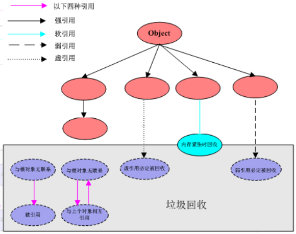

# JVM四种引用类型

## 强引用（Strong Reference）

Java中最常见的引用类型，把一个对象赋给一个引用变量，这个引用变量就是一个强引用。当一个对象被强引用变量引用时，它处于可达状态，它是不可能被垃圾回收机制回收的，即使该对象以后永远都不会被用到JVM也不会回收。因此强引用是造成Java内存泄漏的主要原因之一。

对于一个普通的对象，如果没有其他的引用关系，只要超过了引用的作用域或者显式地将相应（强）引用赋值为 null，一般认为就是可以被垃圾收集的了(具体回收时机还是要看垃圾收集策略)。

```java
class MyObject{
    @Override
    //演示
    protected void finalize() throws Throwable {
        System.out.println(Thread.currentThread().getName()+"---finalize method invoked....");
    }
}
```

```java
    public static void strongReference(){
        //创建一个对象并建立强引用
        MyObject myObject = new MyObject();
        System.out.println("-----------gc before:"+myObject);
        //手动开启GC
        System.gc();
        try { TimeUnit.SECONDS.sleep(1); } catch (InterruptedException e) { e.printStackTrace(); }
        System.out.println("-----------gc after:"+myObject);
        //将强引用赋值为 null
        myObject = null;
        //在系统内存充足时，垃圾回收器不会立即回收对象，只有在需要释放内存时，垃圾回收器才会回收不再被引用的对象
        //手动开启GC
        System.gc();
        try { TimeUnit.SECONDS.sleep(1); } catch (InterruptedException e) { e.printStackTrace(); }
        System.out.println("-----------gc final:"+myObject);
    }
output：
-----------gc before:com.zrd.rel.MyObject@4554617c
-----------gc after:com.zrd.rel.MyObject@4554617c
Finalizer---finalize method invoked....
-----------gc final:null
```

## 软引用（Soft Reference）

软引用是一种相对强引用弱化了一些的引用，需要用`java.lang.ref.SoftReference`类来实现，可以让对象豁免一些垃圾收集。对于软引用来说，当系统内存充足时，它不会被回收，如果内存不足，垃圾回收器可能会回收该对象。

```java
    public static void softReference(){
        //设置运行内存大小：-Xms10m -Xmx10m，当内存不够用的时候，soft会被回收
        SoftReference<MyObject> softReference = new SoftReference<>(new MyObject());
        System.gc();
        try { TimeUnit.SECONDS.sleep(1); } catch (InterruptedException e) { e.printStackTrace(); }
        System.out.println("-----gc after内存够用: "+softReference.get());
        try {
            //new 一个大对象
            byte[] bytes = new byte[10 * 1024 * 1024];
        }catch (Exception e){
            e.printStackTrace();
        }finally {
            System.out.println("-----gc after内存不够: "+softReference.get());
        }
    }
output：
-----gc after内存够用: com.zrd.rel.MyObject@4554617c
-----gc after内存不够: null
Finalizer---finalize method invoked....
Exception in thread "main" java.lang.OutOfMemoryError: Java heap space
	at com.zrd.rel.ReferenceDemo.softReference(ReferenceDemo.java:42)
	at com.zrd.rel.ReferenceDemo.main(ReferenceDemo.java:16)
```

## 弱引用（Weak Reference）

弱引用是一种比强引用更弱的引用类型，它比软引用的生存期更短，弱引用需要用`java.lang.ref.WeakReference`类来实现。对于只有弱引用的对象来说，只要垃圾回收机制一运行，不管JVM的内存空间是否足够，都会回收该对象占用的内存。 

```java
    public static void weakReference(){
        WeakReference<MyObject> weakReference = new WeakReference<>(new MyObject());
        System.out.println("-----gc before内存够用: "+weakReference.get());
        System.gc();
        try { TimeUnit.SECONDS.sleep(1); } catch (InterruptedException e) { e.printStackTrace(); }
        System.out.println("-----gc after内存够用: "+weakReference.get());
    }
output:
-----gc before内存够用: com.zrd.rel.MyObject@4554617c
Finalizer---finalize method invoked....
-----gc after内存够用: null
```

## 虚引用（Phantom Reference）

虚引用与其他几种引用都不同，无法通过引用直接获取到相应的引用对象。如果一个对象仅持有虚引用，那么它就和没有任何引用一样，因此它并不会决定对象的生命周期，在任何时候都可能被垃圾回收器回收。

虚引用的主要作用是跟踪对象被垃圾回收的状态，仅仅是提供了一种确保对象被finalize以后做某些事情的机制。 设置虚引用关联的唯一目的，就是在这个对象被收集器回收的时候收到一个系统通知或者后续添加进一步的处理。

**虚引用必须和引用队列 (`ReferenceQueue`)联合使用**

```java
    public static void phantomReference(){
        MyObject myObject = new MyObject();
        ReferenceQueue<MyObject> referenceQueue = new ReferenceQueue<>();
        PhantomReference<MyObject> phantomRef = new PhantomReference<>(myObject, referenceQueue);
        // 对象实例不能通过虚引用直接获取
        System.out.println("myObject: " + phantomRef.get());
        System.gc();
        System.out.println(referenceQueue.poll());
    }
output:
myObject: null
null
```

## GC Roots和四种引用




