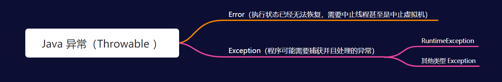
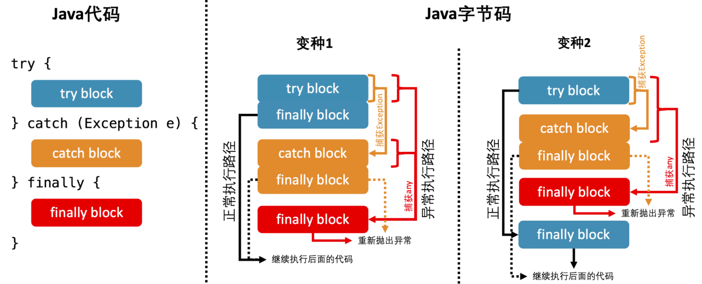

# JVM是如何处理异常的

## 异常的基本概念

在 Java 语言规范中，所有异常都是 Throwable 类或者其子类的实例。Throwable 有两大直接子类：Error 和 Exception。



RuntimeException 和 Error 属于 Java 里的非检查异常（unchecked exception）。其他异常则属于检查异常（checked exception），在触发时需要显式捕获，或者在方法头用 throws 关键字声明。

## JVM 是如何捕获异常的？

Java 字节码中，每个方法对应一个异常表。异常表中的每一个条目代表一个异常处理器，并且由 from 指针、to 指针、target 指针以及所捕获的异常类型构成。这些指针的值是字节码索引（bytecode index，bci），用以定位字节码。

其中，from 指针和 to 指针标示了该异常处理器所监控的范围，例如 try 代码块所覆盖的范围。target 指针则指向异常处理器的起始位置，例如 catch 代码块的起始位置

```java
package com.zrd.jvm;

public class JvmExceptionCatch {
    public static void main(String[] args) {
        try {
            int i = 10;
            int j = 20;
            int k = i / j ;
        } catch (Exception e) {
            e.printStackTrace();
        }
    }
}
//对应字节码文件
 public static void main(java.lang.String[]);
    descriptor: ([Ljava/lang/String;)V
    flags: ACC_PUBLIC, ACC_STATIC
    Code:
      stack=2, locals=4, args_size=1
         0: bipush        10
         2: istore_1
         3: bipush        20
         5: istore_2
         6: iload_1
         7: iload_2
         8: idiv
         9: istore_3
        10: goto          18
        13: astore_1
        14: aload_1
        15: invokevirtual #3                  // Method java/lang/Exception.printStackTrace:()V
        18: return
      Exception table:
         from    to  target type
             0    10    13   Class java/lang/Exception
      LineNumberTable:
        line 6: 0
        line 7: 3
        line 8: 6
        line 11: 10
        line 9: 13
        line 10: 14
        line 12: 18
      StackMapTable: number_of_entries = 2
        frame_type = 77 /* same_locals_1_stack_item */
          stack = [ class java/lang/Exception ]
```

编译过后，该方法的异常表拥有一个条目。其 from 指针和 to 指针分别为 0 和 10，代表它的监控范围从索引为 0 的字节码开始，到索引为 10 的字节码结束（不包括 10）。该条目的 target 指针是 13，代表这个异常处理器从索引为 13 的字节码开始。条目的最后一列，代表该异常处理器所捕获的异常类型正是 Exception。

当程序触发异常时，JVM 会上至下遍历异常表中的所有条目，并判断所抛出的异常和该条目想要捕获的异常是否匹配。如果匹配，JVM 会将控制流转移至该条目 target 指针指向的字节码。

如果遍历完所有异常表条目，JVM 仍未匹配到异常处理器，那么会弹出当前方法对应的 Java 栈帧，并且在调用者中重复上述操作。在最坏情况下，JVM 需要遍历当前线程 Java 栈上所有方法的异常表。

对于 finally 代码块的处理，当前版本 Java 编译器的做法是复制 finally 代码块的内容，分别放在 try-catch 代码块所有正常执行路径以及异常执行路径的出口中。



针对异常执行路径，Java 编译器会生成一个或多个异常表条目，监控整个 try-catch 代码块，并且捕获所有种类的异常（在 javap 中以 any 指代）。这些异常表条目的 target 指针将指向另一份复制的 finally 代码块。并且，在这个 finally 代码块的最后，Java 编译器会重新抛出所捕获的异常。

例如，在catch 代码块捕获了异常，并且触发了另一个异常，那么 finally 会捕获后者，忽略掉原本的异常。

## 问题

### Q：为什么使用异常捕获的代码比较耗费性能？

构造异常实例时，JVM 便需要生成该异常的栈轨迹（stack trace）。该操作会逐一访问当前线程的 Java 栈帧，并且记录下各种调试信息，包括栈帧所指向方法的名字，方法所在的类名、文件名，以及在代码中的第几行触发该异常。

### Q：finally是怎么实现无论异常与否都能被执行的？

Java 编译器在编译代码时，会复制finally代码块的内容，然后分别放在try-catch代码块所有的正常执行路径及异常执行路径的出口中。

### Q：finally 中有 return 语句，catch 内 throw 的异常会被忽略，为什么？

catch 里抛的异常会被 finally 捕获了，再执行完 finally 代码后重新抛出该异常。由于finally代码块有个 return 语句，在重新抛出前就返回了。

