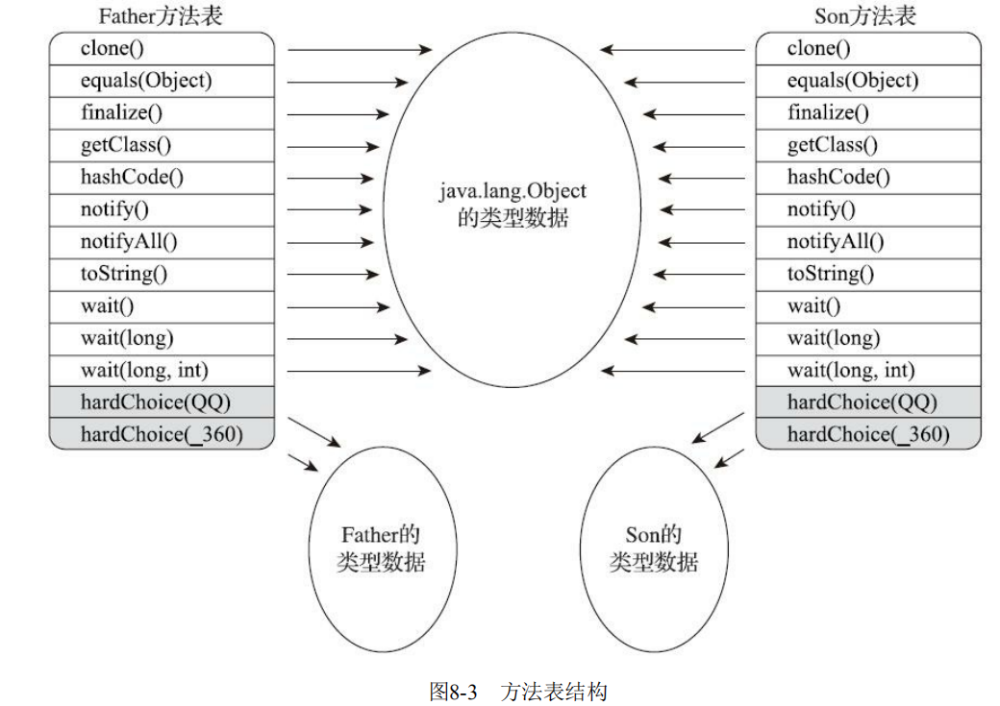

# JVM是如何执行方法调用的

## 前言

先看一段代码

```java
public class MethodInvokeDemo {
    public void invoke(Object o ,Object ... obj){}
    public void invoke(String s ,Object o ,Object ... obj){}

    void testMethodInvoke1(){
        // 调用第二个invoke方法
        invoke(null, 1);
    }
    void testMethodInvoke2(){
        // 调用第二个invoke方法
        invoke(null, 1,2);
    }
    void testMethodInvoke3(){
        // 调用第一个invoke方法，但是 javac 编译警告
        /**
         MethodInvokeDemo.java:23: 警告: 最后一个参数使用了不准确的变量类型的 varargs(可变参数) 方法的非 varargs 调用;
         invoke(null, null);
                     ^
         对于 varargs 调用, 应使用 Object
         对于非 varargs 调用, 应使用 Object[], 这样也可以抑制此警告
         1 个警告
         */
        invoke(null, null);
    }
    void testMethodInvoke4(){
        // 只有手动绕开可变长参数的语法糖，才能调用第一个invoke方法
        invoke(null, new Object[]{1});
    }
}
```

上述代码定义了两个重载方法，其中，第一个接收一个 Object，以及声明为 Object…的变长参数；而第二个则接收一个 String、一个 Object，以及声明为 Object…的变长参数。

这里我想调用第一个方法，传入的参数为 (null, 1)，然而，Java 编译器直接将我的方法调用识别为调用第二个方法，这究竟是为什么呢？

带着这个问题，我们来看一看 JVM 是怎么识别目标方法的。

## 解析

在之前 [JVM类加载机制](./JVM类加载机制.md) 中我们说到过，所有方法调用的目标方法在 Class 文件里面都是一个常量池中的符号引用，在类加载的解析阶段，会将其中一些符号引用转化为直接引用。但是，这种解析成立的前提是：方法在程序真正运行之前就有一个可确定的调用版本，并且这个方法的调用版本在运行期是不可变的。这类方法的调用被称为解析（Resolution）。

调用不同类型的方法，字节码指令集里设计了不同的指令。JVM 支持以下五种方法调用字节码指令：

1. invokestatic：用于调用静态方法。
2. invokespecial：用于调用私有实例方法、构造器，以及使用 super 关键字调用父类的实例方法或构造器，和所实现接口的默认方法。
3. invokevirtual：用于调用非私有实例方法（虚方法）。
4. invokeinterface：用于调用接口方法。
5. invokedynamic：用于调用动态方法。

`invokestatic` 和 `invokespecial` 指令调用的方法，都可以在解析阶段确定唯一的调用版本。包括：静态方法、私有方法、实例构造器、父类方法（通过super关键字来调用父类方法，本意就是想要调用父类的特定方法，而不是根据具体类型决定目标方法，所以属于静态绑定）四种，再加上被`final`修饰的方法（尽管使用`invokevirtual`调用，但`final`方法因为不会被覆盖，所以JVM 能够确定唯一的调用版本），共五种。这些方法统称为 “非虚方法（Non-Virtual Method）”，与之相反，其他方法则被成为“虚方法（Virtual Method）”。

## 重载

**重载（Overload）：**同一个类中，方法名称相同，参数类型列表不同。重载与返回值类型无关。

我们使用`javap`命令来看一下上边代码反编译字节码后的情况

```java
Compiled from "MethodInvokeDemo.java"
public class com.zrd.jvm.MethodInvokeDemo {
  public com.zrd.jvm.MethodInvokeDemo();
    Code:
       0: aload_0
       1: invokespecial #1                  // Method java/lang/Object."<init>":()V
       4: return

  public void invoke(java.lang.Object, java.lang.Object...);
    Code:
       0: return

  public void invoke(java.lang.String, java.lang.Object, java.lang.Object...);
    Code:
       0: return

  void testMethodInvoke1();
    Code:
       0: aload_0
       1: aconst_null
       2: iconst_1
       3: invokestatic  #2                  // Method java/lang/Integer.valueOf:(I)Ljava/lang/Integer;
       6: iconst_0
       7: anewarray     #3                  // class java/lang/Object
      10: invokevirtual #4                  // Method invoke:(Ljava/lang/String;Ljava/lang/Object;[Ljava/lang/Object;)V
      13: return

  void testMethodInvoke2();
    Code:
       0: aload_0
       1: aconst_null
       2: iconst_1
       3: invokestatic  #2                  // Method java/lang/Integer.valueOf:(I)Ljava/lang/Integer;
       6: iconst_1
       7: anewarray     #3                  // class java/lang/Object
      10: dup
      11: iconst_0
      12: iconst_2
      13: invokestatic  #2                  // Method java/lang/Integer.valueOf:(I)Ljava/lang/Integer;
      16: aastore
      17: invokevirtual #4                  // Method invoke:(Ljava/lang/String;Ljava/lang/Object;[Ljava/lang/Object;)V
      20: return

  void testMethodInvoke3();
    Code:
       0: aload_0
       1: aconst_null
       2: aconst_null
       3: invokevirtual #5                  // Method invoke:(Ljava/lang/Object;[Ljava/lang/Object;)V
       6: return

  void testMethodInvoke4();
    Code:
       0: aload_0
       1: aconst_null
       2: iconst_1
       3: anewarray     #3                  // class java/lang/Object
       6: dup
       7: iconst_0
       8: iconst_1
       9: invokestatic  #2                  // Method java/lang/Integer.valueOf:(I)Ljava/lang/Integer;
      12: aastore
      13: invokevirtual #5                  // Method invoke:(Ljava/lang/Object;[Ljava/lang/Object;)V
      16: return
}
```

上面有许多字节码指令，我们现在只需要关心方法调用指令`invokevirtual（用于调用非私有实例方法）`，以`test1()`方法为例：`Method invoke:(Ljava/lang/String;Ljava/lang/Object;[Ljava/lang/Object;)V`，`V`是方法描述符，这里翻译过来就是`void invoke(String, Object, Object[])`，Java 的可变长参数实际上就是数组，所以等同于`void invoke(String, Object, Object...)`。

所以，重载的方法在编译过程中即可完成。具体到每一个方法调用，Java 编译器会根据所传入参数的**声明类型**（注意与实际类型区分）来选取重载方法。选取的过程共分为三个阶段：

1. 在不考虑对基本类型自动装拆箱（auto-boxing，auto-unboxing），以及可变长参数的情况下选取重载方法；
2. 如果在第 1 个阶段中没有找到适配的方法，那么在允许自动装拆箱，但不允许可变长参数的情况下选取重载方法；
3. 如果在第 2 个阶段中没有找到适配的方法，那么在允许自动装拆箱以及可变长参数的情况下选取重载方法。

如果 Java 编译器在同一个阶段中找到了多个适配的方法，那么它会在其中选择一个最为贴切的，而决定贴切程度的一个关键就是形式参数类型的继承关系。

在`test1()`方法调用`  invoke(null, 1)`，当传入 null 时，它既可以匹配第一个方法中声明为 Object 的形式参数，也可以匹配第二个方法中声明为 String 的形式参数。由于 String 是 Object 的子类，因此 Java 编译器会认为第二个方法更为贴切。

重载方法的区分在编译阶段已经完成，所以理论上我们可以把重载称之为静态绑定（static binding）。但是父类重载的方法又可能被子类重写，所以这种父类的重载方法就没办法使用静态绑定，基于这种情况，Java 编译器在处理非静态非私有非final方法时，都是直接使用动态绑定的（final方法因为不会被继承，所以使用静态绑定） 。

确切来说，静态绑定是指在解析时便能够直接识别目标方法。如：不可被子类继承的方法（静态方法，私有方法，final方法）都会被编译成静态绑定。

## 重写

**Java 语言中的定义：**

1. 子类定义一个方法与父类方法的名字相同且参数类型相同
2. 子类方法的返回值类型与父类一样或是父类返回值类型的子类
3. 两者都是非私有、非静态方法

**重写是子类与父类之间多态性的一种表现。**

**JVM 中的定义：**

1. 子类方法的名字与**方法描述符**与父类方法相同
2. 两者都是非私有、非静态方法

JVM 中关于方法重写的判定同样基于方法描述符（由方法的参数类型以及返回类型所构成）。如果子类定义了与父类中非私有、非静态方法同名的方法，那么只有当这两个方法的参数类型以及返回类型一致，JVM 才会判定为重写。对于 Java 语言中重写而 JVM 中非重写的情况，编译器会通过生成**桥接方法**来实现 Java 中的重写语义。

**什么是桥接方法那？什么时候生成桥接方法？**

下面通过两个例子具体了解一下：

1. **重写方法的返回类型不一致（协变返回类型）**

   ```java
   public class MethodOverrideDemo {
       public static void main(String[] args) {
           Father father = new Son();
           System.out.println(father.printMsg("hello"));
       }
   }
   
   class Father {
       public Object printMsg(String message) {
           return "Father say :"+message;
       }
   }
   
   class Son extends Father {
       public String printMsg(String message) {
           return "Son say :"+message;
       }
   }
   ```

   使用`javap`命令查看`MethodOverrideDemo`的反编译字节码

   ```java
   javac MethodOverrideDemo.java
   //上面采用的是内部类的方式，所以直接查看 Son.class 的反编译字节码    
   javap -v -c Son.class 
   ```

   ```java
      com.zrd.jvm.Son();
       descriptor: ()V
       flags:
       Code:
         stack=1, locals=1, args_size=1
            0: aload_0
            1: invokespecial #1                  // Method com/zrd/jvm/Father."<init>":()V
            4: return
         LineNumberTable:
           line 23: 0
   
     public java.lang.String printMsg(java.lang.String);
       descriptor: (Ljava/lang/String;)Ljava/lang/String;
       flags: ACC_PUBLIC
       Code:
         stack=2, locals=2, args_size=2
            0: new           #2                  // class java/lang/StringBuilder
            3: dup
            4: invokespecial #3                  // Method java/lang/StringBuilder."<init>":()V
            7: ldc           #4                  // String Son say :
            9: invokevirtual #5                  // Method java/lang/StringBuilder.append:(Ljava/lang/String;)Ljava/lang/StringBuilder;
           12: aload_1
           13: invokevirtual #5                  // Method java/lang/StringBuilder.append:(Ljava/lang/String;)Ljava/lang/StringBuilder;
           16: invokevirtual #6                  // Method java/lang/StringBuilder.toString:()Ljava/lang/String;
           19: areturn
         LineNumberTable:
           line 25: 0
     //-------------------桥接方法----------------------------------
     public java.lang.Object printMsg(java.lang.String);
       descriptor: (Ljava/lang/String;)Ljava/lang/Object;
       //ACC_BRIDGE：表示该方法是由编译器产生的桥接方法
       //ACC_SYNTHETIC：表示该方法是由编译器自动生成
       flags: ACC_PUBLIC, ACC_BRIDGE, ACC_SYNTHETIC
       Code:
         stack=2, locals=2, args_size=2
            0: aload_0
            1: aload_1
            2: invokevirtual #7                  // Method printMsg:(Ljava/lang/String;)Ljava/lang/String;
            5: areturn
         LineNumberTable:
           line 23: 0
   }
   SourceFile: "MethodOverrideDemo.java"
   ```

   父类 Father 的 `printMsg` 方法的返回值是 Object 类型，子类 Son 重写 `printMsg` 返回的值类型是 String 类型，对于 Java 语言来说该方法是重写，但对于 JVM 来说却不是重写的，只有当两个方法的参数类型以及返回类型一致时，JVM 才会判定为重写，

   **编译器这么做的原因是什么呢？**

   因为在 JVM 方法中，返回类型也是方法签名的一部分，而桥接方法的签名和其父类的方法签名一致，以此就实现了协变返回值类型。
2. **范型参数类型造成的方法参数类型不一致（类型擦除）**

   ```java
   public class MethodOverrideDemo {
       public static void main(String[] args) {
           Father father = new Son();
           System.out.println(father.printMsg("hello"));
       }
   }
   class Father<T> {
       public Object printMsg(T message) {
           return "Father say :"+message;
       }
   }
   
   class Son extends Father<String> {
       @Override
       public String printMsg(String message) {
           return "Son say :"+message;
       }
   }
   ```

   使用`javap`命令先看一下`Father`类的反编译字节码

   ```java
     com.zrd.jvm.Father();
       descriptor: ()V
       flags:
       Code:
         stack=1, locals=1, args_size=1
            0: aload_0
            1: invokespecial #1                  // Method java/lang/Object."<init>":()V
            4: return
         LineNumberTable:
           line 30: 0 
   
     public java.lang.String printMsg(T);
       //--------------- 泛型 T 被替换成了 Object  ----------------
       descriptor: (Ljava/lang/Object;)Ljava/lang/String;
       flags: ACC_PUBLIC
       Code:
         stack=2, locals=2, args_size=2
            0: new           #2                  // class java/lang/StringBuilder
            3: dup
            4: invokespecial #3                  // Method java/lang/StringBuilder."<init>":()V
            7: ldc           #4                  // String Father say :
            9: invokevirtual #5                  // Method java/lang/StringBuilder.append:(Ljava/lang/String;)Ljava/lang/StringBuilder;
           12: aload_1
           13: invokevirtual #6                  // Method java/lang/StringBuilder.append:(Ljava/lang/Object;)Ljava/lang/StringBuilder;
           16: invokevirtual #7                  // Method java/lang/StringBuilder.toString:()Ljava/lang/String;
           19: areturn
         LineNumberTable:
           line 32: 0
       Signature: #17                          // (TT;)Ljava/lang/String;
   }
   Signature: #18                          // <T:Ljava/lang/Object;>Ljava/lang/Object;
   SourceFile: "MethodOverrideDemo.java"
   ```

   接下来再看一下`Son`类的反编译字节码

   ```java
    com.zrd.jvm.Son();
       descriptor: ()V
       flags:
       Code:
         stack=1, locals=1, args_size=1
            0: aload_0
            1: invokespecial #1                  // Method com/zrd/jvm/Father."<init>":()V
            4: return
         LineNumberTable:
           line 36: 0
   
     public java.lang.String printMsg(java.lang.String);
       descriptor: (Ljava/lang/String;)Ljava/lang/String;
       flags: ACC_PUBLIC
       Code:
         stack=2, locals=2, args_size=2
            0: new           #2                  // class java/lang/StringBuilder
            3: dup
            4: invokespecial #3                  // Method java/lang/StringBuilder."<init>":()V
            7: ldc           #4                  // String Son say :
            9: invokevirtual #5                  // Method java/lang/StringBuilder.append:(Ljava/lang/String;)Ljava/lang/StringBuilder;
           12: aload_1
           13: invokevirtual #5                  // Method java/lang/StringBuilder.append:(Ljava/lang/String;)Ljava/lang/StringBuilder;
           16: invokevirtual #6                  // Method java/lang/StringBuilder.toString:()Ljava/lang/String;
           19: areturn
         LineNumberTable:
           line 39: 0
     //------与父类参数类型一直的桥接方法
     public java.lang.String printMsg(java.lang.Object);
       descriptor: (Ljava/lang/Object;)Ljava/lang/String;
       flags: ACC_PUBLIC, ACC_BRIDGE, ACC_SYNTHETIC
       Code:
         stack=2, locals=2, args_size=2
            0: aload_0
            1: aload_1
            2: checkcast     #7                  // class java/lang/String
            5: invokevirtual #8                  // Method printMsg:(Ljava/lang/String;)Ljava/lang/String;
            8: areturn
         LineNumberTable:
           line 36: 0
   }
   Signature: #19                          // Lcom/zrd/jvm/Father<Ljava/lang/String;>;
   SourceFile: "MethodOverrideDemo.java"
   ```

   当一个子类在继承（或实现）一个父类（或接口）的泛型方法时，在子类中明确指定了泛型类型，那么在编译时编译器会自动生成桥接方法。

   在编译期间 Java编译器会将类型参数替换为其上界（类型参数中extends子句的类型），如果上界没有定义，则默认为Object，这就叫做类型擦除。

   这也是为什么泛型是Java 1.5才引进的，在这之前是没有泛型的概念的，但泛型代码能够很好地和之前版本的代码很好地兼容的原因。

   对于重写，需要在运行过程中根据调用者的动态类型来识别目标方法，所以理论上我们也可称之为动态绑定（dynamic binding）。

## 调用指令的符号引用

在编译过程中，我们并不知道目标方法的具体内存地址。因此，Java 编译器会暂时用符号引用来表示该目标方法。这一符号引用包括目标方法所在的类或接口的名字，以及目标方法的方法名和方法描述符。

符号引用存储在 Class 文件的常量池之中。根据目标方法是否为接口方法，这些引用可分为接口符号引用和非接口符号引用。

通过之前 [JVM类加载机制](./JVM类加载机制.md) 文章我们知道在类的解析阶段，JVM 会将符号引用解析为实际引用。

对于**非接口符号引用**，JVM 会按照如下步骤进行查找：

1. 找到该符号引用所指向的类（对象的实际类型），记作 **C**
2. 在类型 **C** 中查找与常量池中的描述符和名称都相符的方法，找到则进行访问权限校验，通过则返回这个方法的直接引用，查找过程结束；不通过则返回`java.lang.IllegalAccessError`异常
3. 如果没有找到，在 **C** 的父类中按照第二步继续搜索，直至 Object 类
4. 如果没有找到，在 **C** 所直接实现或间接实现的接口中搜索，这一步搜索得到的目标方法必须是非私有、非静态的。并且，如果目标方法在间接实现的接口中，则需满足 **C** 与该接口之间没有其他符合条件的目标方法。如果有多个符合条件的目标方法，则任意返回其中一个。
5. 如果始终没有找到合适的方法，则抛出`java.lang.AbstractMethodError`异常

对于**接口符号引用**，JVM会按照如下步骤进行查找：

1. 找到该符号引用所指向的接口（对象的实际类型），记作 **I**
2. 在 **I** 中查找与常量池中的描述符和名称都相符的方法，找到则进行访问权限校验，通过则返回这个方法的直接引用，查找过程结束；不通过则返回`java.lang.IllegalAccessError`异常
3. 如果没有找到，在 Object 类中的公有实例方法中搜索（接口也是 Object 的子类）
4. 如果没有找到，则在 **I** 的超接口中搜索。这一步的搜索结果的要求与非接口符号引用步骤 4 的要求一致
5. 如果始终没有找到合适的方法，则抛出`java.lang.AbstractMethodError`异常

经过上述的解析步骤之后，符号引用会被解析成实际引用。对于静态绑定的方法调用而言，实际引用是一个指向方法的指针。对于需要动态绑定的方法调用而言，实际引用则是一个方法表的索引。

## 方法表

JVM 中虚方法调用包括 invokevirtual 指令和 invokeinterface 指令。如果这两种指令所声明的目标方法被标记为 final，那么 Java 虚拟机会采用静态绑定。

否则，JVM 将采用动态绑定，在运行过程中根据调用者的动态类型，来确定虚方法调用的目标方法。动态绑定的目标方法选择过程需要运行时在接收者类型的方法元数据中搜索合适的目标方法，因此，JVM基于性能的考虑，采取了一种用空间换取时间的策略来实现动态绑定。JVM 为每个类生成一张方法表，使用虚方法表索引来代替元数据查找，可以提高性能快速定位目标方法。

下面以 invokevirtual 所使用的虚方法表（Virtual Method Table，vtable）为例介绍方法表的用法。invokeinterface 所使用的接口方法表（Interface Method Table，itable）稍微复杂些，但是原理其实是类似的。



方法表本质上是一个数组，存放着各个方法的实际入口地址。如果子类中重写父类的某个方法，子类虚方法表中的地址会被替换为指向子类实现版本的入口地址。如果没有被子类重写，则在子类的虚方法表中的地址入口和父类相同方法的地址入口是一致的，都指向父类的实现入口。

在上图中，Son重写了Father的全部方法，因此Son的方法表没有指向Father类型数据的箭头。但是Son和Father都没有重写来自Object的方法，所以它们的方法表中所有从Object继承来的方法都指向了Object的数据类型。

方法表满足两个特质：

1. 子类方法表中包含父类方法表中的所有方法
2. 子类方法在方法表中的索引值，与它所重写的父类方法的索引值相同（当类型变化时，仅需要变更查找的虚方法表，就可以从不同的虚方法表中按索引转换出所需的入口地址）

虚方法表一般在类加载的链接阶段进行初始化，准备了类的变量初始值后，虚拟机会把该类的虚方法表也一同初始化完毕。

实际上，使用了方法表的动态绑定与静态绑定相比，仅仅多出几个内存解引用操作：访问栈上的调用者，读取调用者的动态类型，读取该类型的方法表，读取方法表中某个索引值所对应的目标方法。

那么我们是否可以认为虚方法调用对性能没有太大影响呢？

其实是不能的，查虚方法表是动态绑定的一种优化手段，实际上仅存在于解释执行中，或者即时编译代码的最坏情况中。这是因为即时编译还拥有另外两种性能更好的优化手段：内联缓存（inlining cache）和方法内联（method inlining）。

## 参考资料

1. [《深入拆解Java虚拟机》郑雨迪](https://time.geekbang.org/column/intro/108)
2. 《深入理解Java虚拟机：JVM高级特性与最佳实践（第3版）周志明》
3. https://www.cnblogs.com/heihaozi/p/14142671.html
