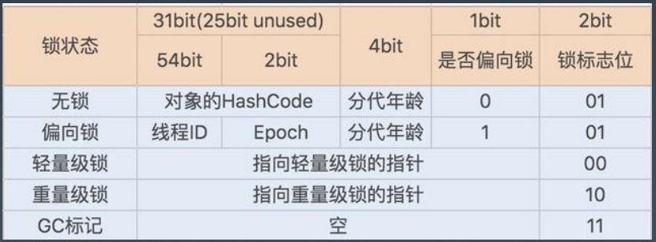

# JVM是怎么实现synchronized的

## synchronized 的实现

synchronized 是 Java 中的关键字，我们可以用它来对程序进行加锁，以达到线程同步的目的。

Java 中的每一个对象都可以作为锁，主要表现形式为：

1. 对于同步代码块，锁是 synchronized 括号里配置的对象。
2. 对于实例方法，锁是当前实例对象。
3. 对于静态方法，锁是所在类的 Class 对象。

普通同步方法用的都是同一把锁：实例对象本身，也就是new出来的具体实例对象本身，如果一个实例对象的普通同步方法获取锁后，该实例对象的其他普通同步方法必须等待获取锁的方法释放后才能获取锁。

静态同步方法用的也是同一把锁：类对象本身，一个静态同步方法获取锁后，其他的静态同步方法也都必须等待该方法释放锁后才能获取锁。

实例对象和类对象，这两把锁是不同的对象，所以静态同步方法和普通同步方法之间不会存在竞态条件。

JMM 对于 Synchronized 的规定：

- **加锁前：**必须把自己本地内存中共享变量的最新值刷到主内存
- **加锁时：**清空本地内存中的共享变量，从主内存中读取共享变量最新的值

**Java所有对象都可以做为锁，为什么？**

因为**每个对象都都有一个Monitor与之关联**。然后线程对monitor执行lock和unlock操作，相当于对对象执行上锁和解锁操作。

JVM 中 Synchronization 是基于进入和退出管程（Monitor，也可将它称为 “锁”）实现的，无论是显式同步(有明确的 monitorenter 和 monitorexit 指令,即同步代码块)还是隐式同步都是如此。

### Java 对象头

在 JVM 中，对象在堆内存中的存储布局分为三个部分：对象头（Header）、实例数据（Instance Data）和对齐填充（Padding）。而 synchronized 用的锁是存在对象头里的。

对象头部分包括了两类信息：

1. 存储对象自身的运行时数据，如哈希码（HashCode）、GC分代年龄、锁状态标志、线程持有的锁、偏向线程ID、偏向时间戳等。这部分数据的长度在32位和64位的虚拟机（未开启压缩指针）中分别为32个比特和64个比特，官方称它为 `Mark Word`。
2. 存储类型指针，即对象指向它的类型元数据的指针，JVM 通过这个指针来确定该对象是哪个类的实例。

由于对象头中存储的信息是与对象自身定义的数据无关的额外存储成本，考虑到虚拟机的空间效率，`Mark Word`被设计成一个有着动态定义的数据结构，以便在极小的空间内存储尽量多的数据，根据对象的状态复用自己的存储空间。如下图所示，在不同锁的状态下，对象头所对应不同的存储结构。

### 同步代码块

~~~java
 public void foo(Object lock) {
        synchronized (lock) {
            lock.hashCode();
        }
    }
//---将上面的Java代码通过 javap -v foo.class 命令编译为下面的字节码---
public void foo(java.lang.Object);
    descriptor: (Ljava/lang/Object;)V
    flags: ACC_PUBLIC
    Code:
      stack=2, locals=4, args_size=2
         0: aload_1
         1: dup
         2: astore_2
         3: monitorenter
         4: aload_1
         5: invokevirtual #2                  // Method java/lang/Object.hashCode:()I
         8: pop
         9: aload_2
        10: monitorexit
        11: goto          19
        14: astore_3
        15: aload_2
        16: monitorexit
        17: aload_3
        18: athrow
        19: return
      Exception table:
         from    to  target type
             4    11    14   any
            14    17    14   any
      LineNumberTable:
        line 10: 0
        line 11: 4
        line 12: 9
        line 13: 19
~~~

当声明 synchronized 代码块时，synchronized 经过 Javac 编译后，会在同步块的前后分别形成 monitorenter 和 monitorexit 这两个字节码指令。这两种指令均会消耗操作数栈上的一个 reference 类型的元素（也就是 synchronized 关键字括号里的引用），作为所要加锁解锁的锁对象。

编译后的字节码包含一个 monitorenter 指令以及多个 monitorexit 指令。这是因为 JVM 需要确保所获得的锁在正常执行路径，以及异常执行路径上都能够被解锁。

对于 monitorenter 和 monitorexit 指令的作用，我们可以抽象地理解为每个锁对象拥有一个锁计数器和一个指向持有该锁的线程的指针。

当执行 monitorenter 时，如果目标锁对象的计数器为 0，那么说明它没有被其他线程所持有。在这个情况下，JVM 会将该锁对象的持有线程设置为当前线程，并且将其计数器加 1。

在目标锁对象的计数器不为 0 的情况下，如果锁对象的持有线程是当前线程，那么 JVM 可以将其计数器加 1（synchronized为可重入锁），否则需要等待，直至持有线程释放该锁。

当执行 monitorexit 时，JVM 则需将锁对象的计数器减 1。当计数器减为 0 时，那便代表该锁已经被释放掉了。

### 同步方法

~~~java
public synchronized void fooSync(Object lock) {
    lock.hashCode();
}
//---将上面的Java代码通过 javap 命令编译为下面的字节码---
  public synchronized void fooSync(java.lang.Object);
    descriptor: (Ljava/lang/Object;)V
    flags: ACC_PUBLIC, ACC_SYNCHRONIZED
    Code:
      stack=1, locals=2, args_size=2
         0: aload_1
         1: invokevirtual #2                  // Method java/lang/Object.hashCode:()I
         4: pop
         5: return
      LineNumberTable:
        line 15: 0
        line 16: 5
~~~

如上述代码所示，当用 synchronized 标记方法时，这里的同步是隐式的，无须通过字节码指令来控制。JVM 可以从方法常量池中的方法表结构中的 ACC_SYNCHRONIZED 访问标志得知一个方法是否被声明为同步方法。

当方法调用时，调用指令将会检查方法的 ACC_SYNCHRONIZED 访问标志是否被设置，如果设置了，执行线程就要求先成功持有管程，然后才能执行方法，最后当方法完成（无论是正常完成还是非正常完成）时释放管程。在方法执行期间，执行线程持有了管程，其他任何线程都无法再获取到同一个管程。如果一个同步方法执行期间抛出了异常，并且在方法内部无法处理此异常，那这个同步方法所持有的管程将在异常抛到同步方法边界之外时自动释放。
