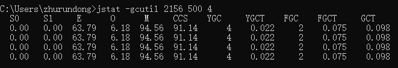

# JVM相关工具

## JDK工具包

### jps

jps： JVM Process status tool：JVM进程状态工具，查看进程基本信息

```shell
jps    ：列出Java程序进程ID和Main函数名称
jps -q ：只输出进程ID
jps -l ：输出应用程序主类的全类名，如果进程执行的是jar包，则输出jar的完整路径
jps -m ：输出传递给Java进程（主函数）的参数
jps -v ：显示虚拟机进程启动时的JVM参数，例如 -Xmx100m -Xms20m 是程序启动时指定的jvm参数
```

### jstat

jstat:JVM Statistics Monitoring Tool：查看Java程序运行时相关信息，可以通过它查看运行时堆信息的相关情况

```shell
jstat -<options> [-t] [-h<lines>] <vmid> [<interval> [<count>]]
```

**options参数说明：**

```shell
-class：显示ClassLoader的相关信息
-compiler：显示JIT编译的相关信息
-gc：显示与GC相关信息
-gccapacity：显示各个代的容量和使用情况
-gccause：显示垃圾收集相关信息（同-gcutil），同时显示最后一次或当前正在发生的垃圾收集的诱发原因
-gcnew：显示新生代信息
-gcnewcapacity：显示新生代大小和使用情况
-gcold：显示老年代信息
-gcoldcapacity：显示老年代大小
-gcpermcapacity：显示永久代大小
-gcutil：显示垃圾收集信息
```

#### 示例一：jstat -gc

```shell
jstat -gc 2156 500 4
#jstat -gc 进程ID 采样间隔500ms，采样次数4次
```


```shell
S0C ：年轻代中第一个survivor（幸存区）的容量（单位kb）
S1C ：年轻代中第二个survivor（幸存区）的容量 (单位kb)
S0U ：年轻代中第一个survivor（幸存区）目前已使用空间 (单位kb)
S1U ：年轻代中第二个survivor（幸存区）目前已使用空间 (单位kb)
EC  ：年轻代中Eden的容量 (单位kb)
EU  ：年轻代中Eden目前已使用空间 (单位kb)
OC  ：Old代的容量 (单位kb)
OU  ：Old代目前已使用空间 (单位kb)
MC  ：metaspace的容量 (单位kb)
MU  ：metaspace目前已使用空间 (单位kb)
CCSC：压缩类空间大小
CCSU：压缩类空间使用大小
YGC ：从应用程序启动到采样时年轻代中gc次数
YGCT：从应用程序启动到采样时年轻代中gc所用时间(s)
FGC ：从应用程序启动到采样时old代(全gc)gc次数
FGCT：从应用程序启动到采样时old代(全gc)gc所用时间(s)
GCT ：从应用程序启动到采样时gc用的总时间(s)
```

#### 示例二：jstat -gcutil

输出进程内存区域百分比及GC详细信息

```shell
jstat -gcutil 2156 500 4
#jstat -gc 进程ID 采样间隔500ms，采样次数4次
```



```shell
S0  ：年轻代中第一个survivor（幸存区）已使用的占当前容量百分比
S1  ：年轻代中第二个survivor（幸存区）已使用的占当前容量百分比
E   ：年轻代中Eden（伊甸园）已使用的占当前容量百分比
O   ：old代已使用的占当前容量百分比
M   ：metaspace已使用的占当前容量百分比
CCS ：压缩使用比例
YGC ：从应用程序启动到采样时年轻代中gc次数
YGCT：从应用程序启动到采样时年轻代中gc所用时间(s)
FGC ：从应用程序启动到采样时old代(全gc)gc次数
FGCT：从应用程序启动到采样时old代(全gc)gc所用时间(s)
GCT ：从应用程序启动到采样时gc用的总时间(s)
```

### jinfo

jinfo：Java Configuration Info：查看正在运行的Java程序的扩展参数，支持修改运行过程中的部分参数。

```shell
jinfo [option] <pid>
```

**option参数说明：**

```shell
-flags 打印虚拟机VM参数
-flag <name> 打印指定虚拟机VM参数
-flag [+ | -]<name> 打开或关闭虚拟机参数
-flag <name>=<value> 设置指定虚拟机参数的值
-sysprops 查看环境变量（和通过system.getProperties()是一样的）
```


### jmap

jmap:Memory Map：查看堆内存使用状况，一般结合jhat使用。

**常用命令：**

- jmap pid：查看进程的内存映像信息。使用不带选项参数的jmap打印共享对象映射，将会打印目标虚拟机中加载的每个共享对象的起始地址、映射大小以及共享对象文件的路径全称。
- jmap -heap pid：显示Java堆详细信息：打印堆的摘要信息，包括使用的GC算法、堆配置信息和各内存区域内存使用信息
- jmap -histo:live pid：显示堆中对象的统计信息：其中包括每个Java类、对象数量、内存大小(单位：字节)、完全限定的类名。打印的虚拟机内
  部的类名称将会带有一个’*’前缀。如果ja指定了live子选项，则只计算活动的对象
- jmap -clstats pid：打印类加载器信息：打印Java堆内存的方法区的类加载器的智能统计信息。对于每个类加载器而言，它的名称、活跃度、
  地址、父类加载器、它所加载的类的数量和大小都会被打印。此外，包含的字符串数量和大小也会被打印。
- jmap -finalizerinfo pid：打印等待终结的对象信息
- jmap -dump:format=b,file=heapdump.hprof pid（dump:<dump-options>）：生成堆转储快照dump文件：以二进制格式转储Java堆到指定文件中。如果指定了live子选项，堆中只有活动的对象会被转储。浏览heap dump 可以使用jhat 读取生成的文件，也可以使用MAT等堆内存分析工具。

### jhat

jhat:Java Heap Analysis Tool

- jhat 命令会解析Java堆转储文件，并启动一个 web server。然后用浏览器来查看/浏览 dump 出来的heap二进制文件。
- jhat 命令支持预先设计的查询，比如：显示某个类的所有实例。还支持对象查询语言（OQL）。 OQL有点类似SQL，专门用来查询堆转储。

```
jhat dumpfile: 分析dump文件
```


这样就启动起来了一个简易的HTTP服务，端口号是7000，本地的可以通过http://localhost:7000访问，得到这样的页面：


jhat 启动后显示的 html 页面（页面最下方）中包含有:

- All classes including platform:显示出堆中所包含的所有的类
- Show all members of the rootset :从根集能引用到的对象
- Show instance counts for all classes (including platform/excluding platform):显示平台包括的所有类的实例数量
- Show heap histogram:堆实例的分布表
- Show finalizer summary:Finalizer 摘要
- Execute Object Query Language (OQL) query:执行对象查询语句（OQL）

### jstack

jstack：Java Stack Trace：Java虚拟机自带的一种堆栈跟踪工具，用于生成java虚拟机当前时刻的线程快照。

线程快照是当前Java虚拟机内每一条线程正在执行的方法堆栈的集合，生成线程快照的主要目的是定位线程出现长时间停顿的原因，如线程间死锁、死循环、请求外部资源导致的长时间等待等。

```shell
jstack [ option ] pid 查看当前时间点，指定进程的dump堆栈信息。
jstack [ option ] pid > 文件 将当前时间点的指定进程的dump堆栈信息，写入到指定文件中。# 注:若该文件不存在，则会自动生成; 若该文件存在，则会覆盖源文件。
jstack [ option ] executable core 查看当前时间点，core文件的dump堆栈信息。
jstack [ option ] [server_id@]<remote server IP or hostname> 查看当前时间点，远程机器的dump堆栈信息。
```

**option参数说明：**

```shell
-F ： 当进程挂起了，此时'jstack [-l] pid'是没有相应的，这时候可使用此参数来强制打印堆栈信息,强制jstack），一般情况不需要使用。
-m ： 打印java和native c/c++框架的所有栈信息。可以打印JVM的堆栈，以及Native的栈帧，一般应用排查不需要使用。
-l ： 长列表. 打印关于锁的附加信息。例如属于java.util.concurrent的ownable synchronizers列表，会使得JVM停顿得长久得多（可能会差很多倍，比如普通的jstack可能几毫秒和一次GC没区别，加了-l 就是近一秒的时间），-l 建议不要用。一般情况不需要使用。
-h or -hel ： 打印帮助信息
```

**线程快照里关注下面几种状态：**

- **死锁，Deadlock（重点关注）**
- **等待资源，Waiting on condition（重点关注）**
- **等待获取管程，Waiting on monitor entry（重点关注）**
- **阻塞，Blocked（重点关注）**
- 执行中，Runnable
- 暂停，Suspended
- 对象等待中，Object.wait() 或 TIMED_WAITING
- 停止，Parked


### Java生成堆转储的方式

1. 使用 jmap -dump 选项可以在JVM运行时获取 dump
2. 使用 jconsole 选项通过 HotSpotDiagnosticMXBean 从运行时获得堆转储。
3. 在虚拟机启动时如果指定了 -XX:+HeapDumpOnOutOfMemoryError 选项，则抛出 OutOfMemoryError 时，会自动执行堆转储。

## 第三方工具

### GCEasy

采用机器学习算法解决GC日志分析问题，GCeasy内置机器智能可以自动检测JVM和Android GC日志中的问题，并推荐解决方案。[GCEasy](https://gceasy.io/)

GC日志分析是免费的，Machine Learning收费

- 几秒内解决GC和内存问题
- JVM堆优化建议
- 机器学习

### MAT

#### 介绍

MAT（Memory Analyzer tool）是一个强大的可视化内存分析工具，可以快捷、有效地帮助我们找到内存泄露和减少内存消耗。

**主要功能：**

- 找到最大的对象，因为MAT提供显示合理的累积大小（retained size）
- 探索对象图，包括inbound和outbound引用，即引用此对象的和此对象引出的
- 查找无法回收的对象，可以计算从垃圾收集器根到相关对象的路径
- 找到内存浪费，比如冗余的String对象，空集合对象

#### 安装

MAT安装有两种方式，一种是以eclipse插件方式安装，一种是独立安装。

在MAT的官方文档中有相应的安装文件下载，下载地址为：[Downloads | The Eclipse Foundation](https://eclipse.dev/mat/download/)

- eclipse插件安装：help -> install new soft点击ADD，在弹出框中添加插件地址：[Project download area | The Eclipse Foundation](https://archive.eclipse.org/mat/1.9.0/)，也可以直接在下载页面下载离线插件包，以离线方式安装。
- 独立安装：下载解压包，解压即安装（注意支持的jdk版本）

#### 相关概念说明

##### 内存泄漏与内存溢出

- 内存泄露：对象是垃圾了，还存在被GCRoots引用的情况，无法被垃圾收集器回收。

  解决方案：找出泄漏的代码位置和原因，具体问题具体解决

- 内存溢出：内存中的对象非常多，堆空间不足

  解决方案：检查堆大小设置是否合理，检查是否存在对象生命周期太长、持有状态时间过长的情况。

##### shallow heap及retained heap

- shallow heap：对象本身占用内存的大小，也就是对象内存区域的总和。
- retained heap：对象及对象引用链中所有对象的大小总和，如果一个对象被释放掉，因为该对象的释放而被释放的所有的对象的大小。相对于shallow heap，Retained heap可以更精确的反映一个对象实际占用的大小。

##### outgoing references与incoming references

- outgoing references ：表示该对象的出节点（被该对象引用的对象）。
- incoming references ：表示该对象的入节点（引用到该对象的对象）。

##### Dominator Tree

Dominator Tree对象的支配树：帮助我们快速的发现占用内存最大的块，也能帮我们分析对象之间的依赖关系。

### GCViewer

GCViewer是一款开源的GC日志分析工具。项目的 GitHub 主页对各个指标提供了完整的描述信息需要安装JDK才能使用。借助GCViewer日志分析工具，可以非常直观地分析出待调优点。

可从以下几方面来分析：

- Memory：分析Totalheap、Tenuredheap、Youngheap内存占用率及其他指标，理论上内存占用率越小越好
- Pause：分析Gc pause、Fullgc pause、Total pause三个大项中各指标，理论上GC次数越少越好，GC时长越小越好

**下载地址：**[Releases · chewiebug/GCViewer](https://github.com/chewiebug/GCViewer/releases)

```shell
# 分析gc日志，打开图形化界面
java -jar gcviewer-1.36.jar gc.log
# 分析gc日志，不打卡图形化界面，将结果直接生成
java -jar gcviewer-1.36.jar gc.log summary.csv chart.png
```

### Arthas

Arthas 是一款线上监控诊断产品，通过全局视角实时查看应用 load、内存、gc、线程的状态信息，并能在不修改应用代码的情况下，对业务问题进行诊断，包括查看方法调用的出入参、异常，监测方法执行耗时，类加载信息等，大大提升线上问题排查效率。

**GitHub文档地址：**[arthas/README_CN.md at master · alibaba/arthas · GitHub](https://github.com/alibaba/arthas/blob/master/README_CN.md)

**使用文档地址：**[简介 | arthas](https://arthas.aliyun.com/doc/)

#### 下载安装与启动

离线下载地址：[Releases · alibaba/arthas · GitHub](https://github.com/alibaba/arthas/releases)

```shell
# 下载arthas-boot.jar
curl -O https://alibaba.github.io/arthas/arthas-boot.jar
# 启动
java -jar arthas-boot.jar
D:\localServer\jvm>java -jar arthas-boot.jar
[INFO] JAVA_HOME: C:\Program Files\Java\jre1.8.0_181
[INFO] arthas-boot version: 4.0.4
[INFO] Found existing java process, please choose one and input the serial number of the process, eg : 1. Then hit ENTER.
* [1]: 5216 org.jetbrains.idea.maven.server.RemoteMavenServer36
  [2]: 7072 com.zrd.restaurantservice.RestaurantServiceApplication
  [3]: 15212 com.zrd.deliverymanservice.DeliverymanServiceApplication
  [4]: 20652
  [5]: 2156 com.zrd.orderservice.OrderServiceApplication
  [6]: 22524 org.jetbrains.jps.cmdline.Launcher
# Demo进程是第2个，则输入2，再输入回车/enter。Arthas会attach到目标进程上，并输出日志：
5
[INFO] Start download arthas from remote server: https://arthas.aliyun.com/download/4.0.4?mirror=aliyun
[INFO] File size: 13.55 MB, downloaded size: 75.45 KB, downloading ...
[INFO] Download arthas success.
[INFO] arthas home: C:\Users\zhurundong\.arthas\lib\4.0.4\arthas
[INFO] Try to attach process 2156
[INFO] Found java home from System Env JAVA_HOME: C:\Program Files\Java\jdk1.8.0_181
[INFO] Attach process 2156 success.
[INFO] arthas-client connect 127.0.0.1 3658
  ,---.  ,------. ,--------.,--.  ,--.  ,---.   ,---.
 /  O  \ |  .--. ''--.  .--'|  '--'  | /  O  \ '   .-'
|  .-.  ||  '--'.'   |  |   |  .--.  ||  .-.  |`.  `-.
|  | |  ||  |\  \    |  |   |  |  |  ||  | |  |.-'    |
`--' `--'`--' '--'   `--'   `--'  `--'`--' `--'`-----'

wiki       https://arthas.aliyun.com/doc
tutorials  https://arthas.aliyun.com/doc/arthas-tutorials.html
version    4.0.4
main_class
pid        2156
time       2025-01-05 20:16:45.631

[arthas@2156]$
```

#### 常用命令

- jvm：查看当前 JVM 的信息

- thread：查看当前 JVM 的线程堆栈信息

  -b 选项可以一键检测死锁

  -n 指定最忙的前N个线程并打印堆栈

  -1 打印线程统计信息

- trace：方法内部调用路径，并输出方法路径上的每个节点上耗时，服务间调用时间过长时使用

- stack：输出当前方法被调用的调用路径

- jad：反编译指定已加载类的源码，反编译便于理解业务

- logger：查看和修改 logger，可以动态更新日志级别

- dashboard：展示当前进程的信息，按 ctrl+c 可以中断执行

- watch：观察到指定函数的调用情况。能观察到的范围为：`返回值`、`抛出异常`、`入参`

**全部命令列表：**[命令列表 | arthas](https://arthas.aliyun.com/doc/commands.html)

#### 支持管道

Arthas支持使用管道对上述命令的结果进行进一步的处理，如 `sm java.lang.String * | grep 'index'`

- grep：搜索满足条件的结果
- plaintext：将命令的结果去除ANSI颜色
- wc：按行统计输出结果

#### 退出

如果只是退出当前的连接，可以用 quit 或者 exit 命令。Attach到目标进程上的arthas还会继续运行，端口会保持开放，下次连接时可以直接连接上。如果想完全退出arthas，可以执行 stop 命令。

通过quit 或者 exit 命令临时退出后，可以使用 `java -jar arthas-boot.jar pid` 再次连接。 


