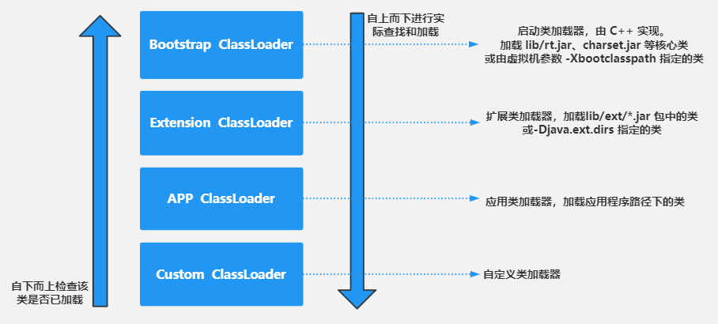

# JVM类加载机制

## 前言

Java 的语言类型分为基本类型和引用类型。基本类型有八种，它们是由 JVM 预先定义好的。引用类型可以细分为四种：类、接口、数组类和泛型参数。由于泛型参数会在编译过程中被擦除，因此 JVM 实际上只有前三种。在类、接口和数组类中，数组类是由 Java 虚拟机直接生成的，其他两种则有对应的字节流。

我们最常见的字节流形式要属由 Java 编译器生成的 class 文件。一般字节流的加载来源包括本地路径下编译生成的.class 文件，jar 包中的.class 文件，远程网络（例如网页中内嵌的小程序 Java applet）获取的，以及动态代理实时编译的二进制字节流。这些不同形式的字节流，都会被加载到 JVM 中，成为类或接口。

无论是直接生成的数组类，还是加载的类，Java 虚拟机都需要对其进行链接和初始化。

## 什么是类加载

当编译器将 Java 源码编译成 JVM 能够识别的二进制字节流文件（*.class）后，JVM 把类描述数据从 Class 文件加载到内存，并对数据进行校验、转换解析和初始化，最终形成可以被 JVM 直接使用的 Java 类型，这个过程被称为**JVM的类加载机制**。

## 类的加载过程

一个类或接口从被加载到虚拟机内存开始，到卸载出内存为止，它的整个生命周期会经历加载（Loading）、验证（Verification）、准备（Prepare）、解析（Resolution）、初始化（Initialization）、使用（Using）和卸载（Unloading）七个阶段，其中验证、准备、解析统称为连接（Linking）。如图所示：

### 加载

加载，是指根据明确知道的 class 完全限定名，来获取 class 二进制格式的字节流，并且据此在 JVM 的方法区创建类的`java.lang.Class`对象，该类的 `java.lang.Class` 对象，则作为方法区该类各种数据的访问入口。对于数组类来说，它并没有对应的字节流，而是由 Java 虚拟机直接生成的。对于其他的类来说，JVM 则需要借助类加载器来完成查找字节流的过程。

### 链接

链接，是指将创建成的类合并至JVM 中，使之能够执行的过程。它可分为验证、准备以及解析三个阶段。

1. 验证

   目的：确保被加载类能够满足 JVM 的约束条件。

   例如：验证文件是否是以 `0x cafe babe`开头，主次版本号是否在当前虚拟机处理范围之内；验证类与类之间的依赖关系，方法的参数或者返回值类型是否正确等。
2. 准备

   目的：为被加载类的静态字段分配内存并设置默认值。

   除了分配内存外，部分 JVM 还会在此阶段构造其他跟类层次相关的数据结构，比如说用来实现虚方法的动态绑定的方法表。

   在 class 文件被加载至 JVM 之前，这个类无法知道其他类及其方法、字段所对应的具体地址，甚至不知道自己方法、字段的地址。因此，每当需要引用这些成员时，Java 编译器会生成一个符号引用。在运行阶段，这个符号引用一般都能够无歧义地定位到具体目标上。

   例如，对于一个方法调用，编译器会生成一个包含目标方法所在类的名字、目标方法的名字、接收参数类型以及返回值类型的符号引用，来指代所要调用的方法。
3. 解析

   目的：将 ["准备"](siyuan://blocks/20211025211714-qy36de8) 步骤中的符号引用解析成为实际引用。

   我们编写的代码中，当一个变量引用某个对象的时候，这个引用在 class 文件中是以符号引用来存储的（相当于做了一个索引记录）。在解析阶段就需要将其解析并链接为直接引用（相当于指向实际对象）。如果有了直接引用，那引用的目标必定在堆中存在。

   如果符号引用指向一个未被加载的类，或者未被加载类的字段或方法，那么解析将触发这个类的加载（但未必触发这个类的链接以及初始化。）

### 初始化

Java 代码中，如果要初始化一个静态字段，可以在声明时直接赋值，也可以在静态代码块中对其赋值。

如果直接赋值的静态字段被`final`所修饰，且它的类型为基本类型或字符串时，那么该字段会被 Java 编译器标记为常量（`ConstantValue`），其初始化由 JVM 完成。除此之外的静态字段直接赋值操作，以及所有静态代码块中的代码，则会被 Java 编译器置于同一方法中，并把它命名为 `< clinit >`。

初始化阶段的目的，便是执行 `<clinit>` 方法为静态字段赋初始值以及为常量赋初始值。JVM 会通过加锁来确保类的  `<clinit>` 方法仅被执行一次。

## 类加载机制

在类的加载(Loading)过程中，需要通过一个类加载器将类的二进制字节流加载到 JVM 中，然后转换为一个与目标类对应的`java.lang.Class`对象，并且构造出的Class对象会有一个引用指向创建它的ClassLoader。JVM 提供了3种类加载器：

1. 启动类加载器（BootstrapClassLoader）

    启动类加载器是由 C++ 实现的，没有对应的 Java Class 对象，因此在 Java 中只能用 null 来指代。Java 9 之前，启动类加载器负责加载 JVM 自身需要的类，如存放在 JRE 的 lib 目录下 rt.jar、charset.jar 等核心类（以及由虚拟机参数 -Xbootclasspath 指定的类）
2. 扩展类加载器（ExtClassLoader）

    扩展类加载器负责加载相对次要、但又通用的类，比如存放在 JRE 的 lib/ext/*.jar 包中的类（以及由系统变量 -Djava.ext.dirs 指定的类）
3. 应用类加载器（AppClassLoader）

    应用类加载器负责加载应用程序路径下的类。（这里的应用程序路径，是指虚拟机参数 -cp/-classpath、系统变量 java.class.path 或环境变量 CLASSPATH 所指定的路径。）默认情况下，应用程序中包含的类便是由应用类加载器加载的。

Java 9 引入了模块系统，并且略微更改了上述的类加载器。扩展类加载器被改名为平台类加载器（platform class loader）。Java SE 中除了少数几个关键模块，比如说 `java.base` 是由启动类加载器加载之外，其他的模块均由平台类加载器所加载。

在 JVM 中，类的唯一性是由类加载器实例以及类的全名一同确定的。即便是同一串字节流，经由不同的类加载器加载，也会得到两个不同的类。在大型应用中，可以借助这一特性，来运行同一个类的不同版本。

### 类加载机制特点

1. 双亲委派

    当一个类加载器接收到加载请求时，它会自下而上从缓存中检查该类是否已加载，直至到顶层的启动类加载器`BootstrapClassLoader`。如果在此过程中均未找到，从启动类加载器`BootstrapClassLoader`自上而下依次查找该类并加载。如果几个类加载器均未加载到指定名称的类，那么会抛出 `ClassNotFountException`异常。
2. 负责依赖

    一个加载器在加载某个类的时候，发现这个类依赖于另外几个类或接口，也会去尝试加载这些依赖项。
3. 缓存加载

    为了提升加载效率，消除重复加载，一旦某个类被一个类加载器加载，那么它会缓存这个加载结果，不会重复加载。

#### **为什么要使用双亲委派？**

主要是为了保证 Java 官方核心类库的加载安全性，防止被开发者覆盖。

双亲委派保证了类加载器，自下而上的委派，又自上而下的加载，确保每一个类在各个类加载器中都是同一个类。例如类`java.lang.Object`，它存放在`rt.jar`之中，无论哪个类加载器要加载这个类，最终都是委派给启动类加载器加载，因此 Object 类在程序的各种类加载器环境中都是同一个类。

#### 打破双亲委派

JDK中的基础类作为API被用户调用，但是也存在API调用用户代码的情况，例如：SPI（Service Provider Interface）代码，比如：数据库驱动、common-logging日志接口实现等。

以Driver驱动为例，driver接口定义在JDK中，其实现**`由各个数据库的服务商来提供，由系统类加载器来加载`**。这个时候就需要**`启动类加载器`**来委托**`子类`**去加载Driver的实现，这就破坏了双亲委派（DriverManager.getConnection(url,user,password)打破了双亲委派）。

#### 如何破坏双亲委派

1. 重写ClassLoader的loadClass方法
2. SPI，父类委托子类加载器加载class
3. 热部署和不停机更新用的到OSGI技术

### **自定义类加载器**

除了由 Java 核心类库提供的类加载器外，还可以自定义的类加载器来加载其他格式的类，对加载方式、加载数据的格式进行自定义处理，只要能通过`classloader`返回一个Class实例即可。这就大大增强了加载器灵活性。比如我们试着实现一个可以用来处理简单加密的字节码的类加载器，用来保护我们的class字节码文件不被使用者直接拿来破解。

例如：[XlassFileClassLoader](https://github.com/zhu-rundong/java-demo/blob/master/jvm/src/main/java/com/zrd/jvm/XlassFileClassLoader.java)

### 添加引用类方法

1. 放到 JDK 的 lib/ext 下，或者 `-Djava.ext.dirs`
2. java –cp/classpath 或者 class 文件放到当前路径
3. 自定义 ClassLoader 加载
4. 拿到当前执行类的 ClassLoader，反射调用 addUrl 方法添加 Jar 或路径(JDK9 无效)

    例如：[JvmAppDynamicLoadFile](https://github.com/zhu-rundong/java-demo/blob/master/jvm/src/main/java/com/zrd/jvm/JvmAppDynamicLoadFile.java)

## 类加载时机(了解)

### **类的初始化**

1. 虚拟机启动时，初始化主类（main()方法的类）；
2. 当遇到用以新建目标类实例的 new 指令时，初始化 new 指令的目标类；
3. 当遇到调用静态方法（静态字段）的指令时，初始化该静态方法（静态字段）所在的类；
4. 子类的初始化会触发父类的初始化；
5. 如果一个接口定义了 default 方法，那么直接实现或者间接实现该接口的类的初始化，会触发该接口的初始化；
6. 使用反射 API 对某个类进行反射调用时，初始化这个类（反射调用要么是已经有实例了，要么是静态方法，都需要初始化）；
7. 当初次调用 MethodHandle 实例时，初始化该 MethodHandle 指向的方法所在的类。

### **不会初始化（可能会加载到内存）**

1. 通过子类引用父类的静态字段，只会触发父类的初始化，而不会触发子类的初始化；
2. 定义对象数组，不会触发该类的初始化（如：Student [] arr）；
3. 常量在编译期间会存入调用类的常量池中，本质上并没有直接引用定义常量的类，不会触发定义常量所在的类；
4. 通过类名获取 Class 对象，不会触发类的初始化（Hello.class 不会让 Hello 类初始化）；
5. 通过 Class.forName 加载指定类时，如果指定参数 initialize 为 false 时，也不会触发类初始化，其实这个参数是告诉虚拟机，是否要对类进行初始化。Class.forName（"jvm.Hello"）默认会加载 Hello 类；
6. 通过 ClassLoader 默认的 loadClass 方法，也不会触发初始化动作（加载了，但是不初始化）。

