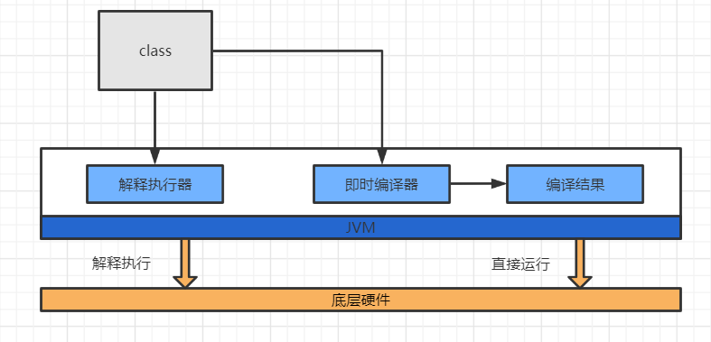

# Java代码是怎么运行的

## 前言

Java 程序的运行离不开 JRE(Java运行时环境)，而 JRE 仅包含运行 Java 程序的必需组件，包括 Java 虚拟机以及 Java 核心类库等。我们 Java 程序员经常接触到的 JDK（Java 开发工具包）同样包含了 JRE，并且还附带了一系列开发、诊断工具。

## 什么是 JVM ？

先看一下 Java 程序的执行过程：

通过 JDK 中的编译程序（javac）将 Java 程序编译为 Java字节码，在 JRE 上运行这些字节码，JVM 会翻译成各个系统对应的机器码，翻译成的机器码可以直接运行在底层硬件之上。

由此可见，Java 虚拟机是与字节码文件绑定的，虽然名字是 Java 虚拟机，但 Java 虚拟机与 Java 语言没有直接关系，它只按照 Java 虚拟机规范去读取字节码文件，并按照规定去解析、执行字节码指令。如果你写一个编译器，将 PHP 语言代码编译成符合 Java 虚拟机规范的字节码文件，那么 Java 虚拟机也是可以执行的。

那么，到底什么是虚拟机？其实 Java 虚拟机就是一个字节码翻译器，它将字节码文件翻译成各个系统对应的机器码，确保字节码文件能在各个系统正确运行。

## JVM 是怎样运行 Java 字节码的 ？

我们以标准 JDK 中的 HotSpot 虚拟机为例，从虚拟机以及底层硬件两个角度进行分析。

1. 虚拟机视角

   将 Java 代码编辑成 class 文件加载到虚拟机，加载后的 Java 类放于方法区(Method Area)。每一次方法调用，JVM 都会自动创建一个栈帧，用以存放局部变量、字节码的操作数以及一个 Class 引用（指向当前方法在运行时常量池中对应的 Class）组成。这个栈帧的大小是提前计算好的，而且 Java 虚拟机不要求栈帧在内存空间里连续分布。

   当退出当前执行的方法时，无论时正常还是异常返回，JVM 均会弹出当前线程的当前线帧，并将之舍弃。

   
2. 底层硬件

   从硬件视角，Java 字节码无法直接执行。因此，Java 虚拟机需要将字节码翻译成机器码。

   在 HotSpot 中，字节码翻译成机器码两种形式：

   1、解释执行，逐条将字节码翻译成机器码并执行（同声传译，你说一句我翻一句给观众(CPU)听）

   2、即时编译（Just-In-Time compilation，JIT），将方法中包含的所有字节码编译成机器码后再执行（线下翻译，可以花时间精简掉你的口语话表达(做编译优化)）

   前者的优势在于无需等待编译，启动速度快，而后者的优势在于实际运行速度更快。HotSpot 默认采用混合模式，综合了解释执行和即时编译两者的优点。它会先解释执行字节码，而后将其中反复执行的热点代码，以方法为单位进行即时编译。

   

HotSpot 内置了多个即时编译器：C1、C2 和 Graal。Graal 是 Java 10 正式引入的实验性即时编译器，长期目标是替代 C2 编译器。之所以引入多个即时编译器，是为了在编译时间和生成代码的执行效率之间进行取舍。

C1 又叫做 Client 编译器，面向的是对启动性能有要求的客户端 GUI 程序，采用的优化手段相对简单，因此编译时间较短。

C2 又叫做 Server 编译器，面向的是对峰值性能有要求的服务器端程序，采用的优化手段相对复杂，因此编译时间较长，但同时生成代码的执行效率较高。

从 Java 7 开始，HotSpot 默认采用分层编译的方式：热点方法首先会被 C1 编译，而后热点方法中的热点会进一步被 C2 编译。

为了不干扰应用的正常运行，HotSpot 的即时编译是放在额外的编译线程中进行的。HotSpot 会根据 CPU 的数量设置编译线程的数目，并且按 1:2 的比例配置给 C1 及 C2 编译器。

在计算资源充足的情况下，字节码的解释执行和即时编译可同时进行。编译完成后的机器码会在下次调用该方法时启用，以替换原本的解释执行。

## 问题总结

### 为什么使用 JVM？

1. JVM 提供了可移植性，Java 代码被编译为 Java 字节码，便可以在不同平台上的 JVM 上运行。
2. JVM 提供了一个代码托管的环境，提供了内存管理、垃圾回收、编译时动态校验等功能

### JVM 会把部分热点代码编译成机器码，为什么不把 Java 代码全部编译成机器码？

JVM确实有AOT (ahead of time compilation) 编译器。AOT能够在线下将Java字节码编译成机器码，主要是用来解决启动性能不好的问题。

但是 Java 语言的动态性（如反射、动态类加载）带来了额外的复杂性，影响了 Java 程序静态编译代码的质量。

其实选择线下编译和即时编译都一样，因为至多一两个小时后该即时编译的都已经编译完成了。另外，即时编译器因为有程序的运行时信息，优化效果更好，也就是说峰值性能更好。

### JVM是怎么区别出热点代码和非热点代码的？

运行时会被即时编译器编译的代码是**热点代码**，主要包括两类：

1. 被多次调用的方法

   这个比较容易理解：一个方法被调用的次数多了，自然就成了热点代码。
2. 被多次执行的方法体

   当一个方法被调用的次数虽然不多，但方法体内部存在循环次数较多的循环体。这种代码也是“热点代码”

前者是 JVM 标准的即时编译。

至于后者，虽然热点代码只是方法的一部分，但编译器仍会把「整个方法」作为编译对象，只是入口不同（并非从方法的第一行代码开始）。由于该情况发生在方法执行的过程中，也被称为栈上替换（On Stack Replacement，OSR）。也就是方法的栈帧还在栈上，但方法已经被替换了。

要判定一段代码是不是热点代码、是否触发即时编译的行为称为**热点探测（Hot Spot Code Detection）**。

1. 基于采样的热点探测

   周期性的去检查一下所有线程的调用栈顶，若发现某个（或某些）方法经常出现在栈顶，该方法就会被认为是**热点代码**

   优点：实现简单高效，而且可以通过堆栈信息获取到方法之间的调用关系；

   缺点：难以精确的确定方法热度，容易受到线程阻塞的干扰（即方法阻塞时可能长时间处于栈顶，可能产生误判）。
2. 基于计数器的热点探测

   为每个方法（或代码块）建立计数器来统计方法的执行次数，当次数超过一定的阈值就认为是**热点代码**。

   优点：统计结果更加精确严谨

   缺点：统计起来比较麻烦（需要为每个方法建立并维护计数器），不能直接获取方法的调用关系

HotSpot 使用第二种 ： 基于计数器的热点探测方法，并且 HotSpot 为每个方法准备了两类计数器：

1. 方法调用计数器

   用来统计方法被调用的次数。它在客户端和服务端模式下的默认阈值分别为 1500 次和 10000 次
2. 回边计数器

   用来统计方法中循环体代码执行的次数（字节码中遇到控制流向后跳转的指令称为**回边**），目的是为了触发栈上替换。

