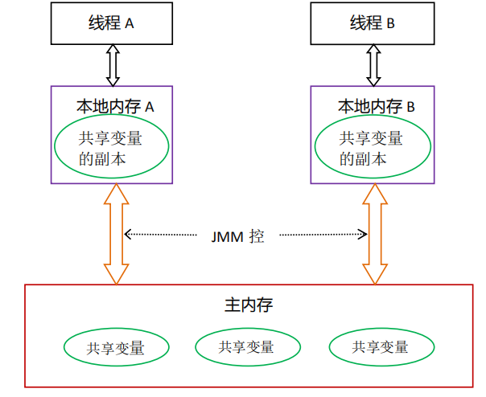
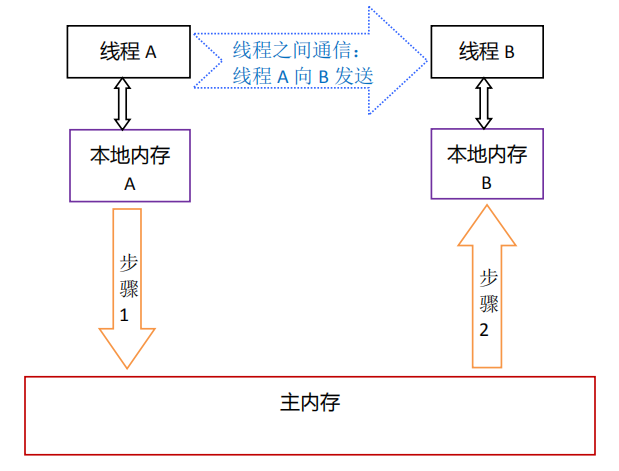
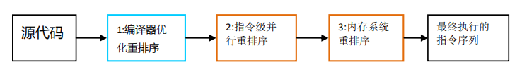

# Java内存模型

## 什么是 Java 内存模型

Java 内存模型（Java Memory Model，JMM）是一个抽象的概念。从 JDK5 开始，Java 使用新的 JSR-133 内存模型，在 JSR-133: Java Memory Model and Thread Specification 中描述了，JMM 是和多线程相关的，它是一组规则或规范。这个规范定义了多线程之间共享变量的可见性以及如何在需要的时候对共享变量进行同步。

这样的好处是屏蔽了各种硬件和操作系统的内存访问差异，实现 Java 并发程序真正的跨平台。

## 并发编程模型

在并发编程中，需要处理两个关键问题：线程之间的 **通信** 和 **同步**。

### 通信

线程的通信是指线程之间以何种机制来交换信息。在命令式编程中，线程之间的通信机制有两种：**共享内存** 和 **消息传递**。

1. **共享内存：**线程之间共享程序的公共状态，线程之间通过写-读内存中的公共状态来隐式进行通信，典型的共享内存通信方式就是通过共享对象进行通信。
2. **消息传递：**线程之间没有公共状态，线程之间必须通过明确的发送消息来显式进行通信，在 Java中典型的消息传递方式就是 wait() 和 notify()。

### 同步

同步是指程序用于控制不同线程之间操作发生相对顺序的机制。

1. 共享内存：同步是显式进行的，程序员必须显式指定某个方法或某段代码需要在线程之间互斥执行。
2. 消息传递：由于消息的发送必须在消息的接收之前，因此同步是隐式进行的。

**Java 的并发采用的是共享内存模型。**

## Java 内存模型

### 主内存与本地内存

Java 内存模型（简称 JMM）定义程序中各种共享变量的访问规则。此处的共享变量指的是实例字段、静态字段和构成数组对象的元素，不包括局部变量与方法参数，因为后者是线程私有的，不会被共享。

JMM 规定了所有的共享变量都存储在主内存（Main Memory）中，每个线程都有一个私有的本地内存（local memory），本地内存中存储了该线程以读/写共享变量的副本。线程、本地内存、主内存三者的交互关系如下图所示：

线程对共享变量的所有操作（读取、赋值等）都必须在工作内存中进行，而不能直接读写主内存中的数据。不同的线程之间也无法直接访问对方工作内存中的变量，线程间变量值的传递均需要通过主内存来完成。

以上图为例，线程A与线程B之间如要通信的话，必须要经历下面2个步骤：

1. 线程A把本地内存A中更新过的共享变量刷新到主内存中去
2. 线程B到主内存中去读取线程A之前已更新过的共享变量

下面通过示意图来说明这两个步骤。

### 重排序

在执行程序时为了提高性能，编译器和处理器经常会对指令进行重排序。重排序分成三种类型：

1. 即时编译器的重排序。编译器在不改变单线程程序语义的前提下，可以重新安排语句的执行顺序
2. 指令级并行的重排序。现代处理器采用了指令级并行技术来将多条指令重叠执行。如果不存在数据依赖性，处理器可以改变语句对应机器指令的执行顺序。
3. 内存系统的重排序。由于处理器使用缓存和读/写缓冲区，这使得加载和存储操作看上去可能是在乱序执行。

‍

从Java源代码到最终实际执行的指令序列，会经过下面三种重排序：

上述的1属于编译器重排序，2和3属于处理器重排序。由于后两种涉及具体的体系架构，我们暂且放到一边。下面我们主要来看一下编译器优化的重排序是怎么一回事。

#### 数据依赖性

如果两个操作访问同一个变量，其中一个为写操作，此时这两个操作之间存在数据依赖性。

编译器和处理器在重排序时，会遵守数据依赖性，不会改变存在数据依赖性关系的两个操作的执行顺序，即不会重排序。

**注意：**

这里所说的数据依赖性仅针对单个处理器中执行的指令序列和单个线程中执行的操作。

#### as-if-serial

在单线程情况下，要给程序一个顺序执行的假象，即经过重排序的执行结果要与顺序执行的结果保持一致。即时编译器和处理器都必须遵守 as-if-serial。

为了遵守 as-if-serial 语义，编译器和处理器不会对存在数据依赖关系的操作做重排序，因为这种重排序会改变执行结果。但是，如果操作之间不存在数据依赖关系，这些操作就可能被编译器和处理器重排序。

~~~java
double pi = 3.14; // A 
double r = 1.0; // B 
double area = pi * r * r; // C
~~~

C与A访问同一变量 pi、C与B访问同一变量 r，且存在写操作，具有依赖关系，它们之间不会进行重排序。

A与B之间不存在依赖关系，编译器和处理器可以重排序，可以变成A->B->C 或 B->A->C，但最终结果C仍是 3.14。

#### happens-before

happens-before 关系是用来描述两个操作的内存可见性的。如果操作 X happens-before 操作 Y，那么 X 的结果对于 Y 可见。

happens-before 规则定义：

**线程内：**

**程序次序规则**（Program Order Rule）：在一个线程中，在程序控制流路径中靠前的字节码 happens-before 靠后的字节码。然而，这并不意味着前者一定在后者之前执行，如果后者没有数据依赖于前者，那么它们可能会被重排序。

**线程间：**

1. **监视器锁规则**（Monitor Lock Rule）: 对同一把锁的，解锁操作 happens-before 之后（这里指时间顺序先后）加锁操作。
2. **volatile变量规则**（Volatile Variable Rule）：volatile 字段的写操作 happens-before 之后（这里指时间顺序先后）对同一字段的读操作。
3. **线程启动规则**（Thread Start Rule）： Thread.start() 方法 happens-before 该线程的第一个操作
4. **线程终止规则**（Thread Termination Rule）：线程的最后一个操作 happens-before 它的终止事件（即其他线程通过 Thread.isAlive() 或 Thread.join() 判断该线程是否中止）。
5. **线程中断规则**（Thread Interruption Rule）：对线程 interrupt() 方法的调用 happens-before 被中断线程所收到的中断事件（即被中断线程的 InterruptedException 异常，或者第三个线程针对被中断线程的 Thread.interrupted 或者 Thread.isInterrupted 调用）。
6. **对象终结规则**（Finalizer Rule）：一个对象的初始化完成 happens-before 于它的`finalize()`方法的开始。
7. **传递性**（Transitivity）：A在B之前发生，B在C之前发生，那么A在C之前发生。

~~~java
int a=0, b=0;

public void method1() {
  int r2 = a;
  b = 1;
}

public void method2() {
  int r1 = b;
  a = 2;
}
~~~

在多线程环境下，假设这两个方法分别跑在两个不同的线程之上，（r1，r2）的可能值都有哪些？

如果 JVM 在执行了任一方法的第一条赋值语句之后便切换线程，那么最终结果将可能出现（0，0）的情况。除上述三种情况之外，Java 语言规范第 17.4 小节还介绍了一种看似不可能的情况（1，2）。

上述代码没有定义任何 happens-before 关系，仅拥有默认的线程内 happens-before 关系。也就是 r2 的赋值操作 happens-before b 的赋值操作，r1 的赋值操作 happens-before a 的赋值操作。

拥有 happens-before 关系的两对赋值操作之间没有数据依赖，因此即时编译器、处理器都可能对其进行重排序。举例来说，只要将 b 的赋值操作排在 r2 的赋值操作之前，那么便可以按照赋值 b，赋值 r1，赋值 a，赋值 r2 的顺序得到（1，2）的结果。

~~~java
Thread1      Thread2
  |            |
 b=1           |
  |          r1=b
  |           a=2
r2=a           | 
~~~

那么如何解决这个问题呢？答案是，将 a 或者 b 设置为 **volatile** 字段。

### volatile

volatile 变量可以看成一种轻量级的、不保证原子性的同步。具有可见性和禁止指令重排两个特性。

#### 保证内存可见性

可见性是指线程之间的可见性，多个线程访问同一个  volatile 变量时，一个线程修改了这个变量的值，其他线程能够立即看得到修改的值。

**volatile 通过强制读写内存保证可见性：**

- 当写一个 volatile 变量时，JMM 会把该线程对应的本地内存中的共享变量值立即刷新到主内存（指向同一个主内存地址的其他线程缓存都会失效）。
- 当读一个 volatile 变量时，JMM 会把该线程对应的本地内存置为无效，线程接下来将从主内存中读取共享变量。

换句话说，volatile 字段的每次访问均需要直接从主内存中读写。

volatile 变量，对该变量的读/写就具有原子性。如果是多个 volatile 操作或类似于 volatile++ 这种复合操作，这些操作整体上不具有原子性。

#### 禁止指令重排

Java 内存模型是通过内存屏障（memory barrier）来禁止重排序的。

对于 volatile 变量，编译器在生成字节码时，会在指令序列中插入内存屏障来禁止特定类型的处理器重排序

1. 在每个volatile写操作的前面插入一个StoreStore屏障。
2. 在每个volatile写操作的后面插入一个StoreLoad屏障。
3. 在每个volatile读操作的后面插入一个LoadLoad屏障。
4. 在每个volatile读操作的后面插入一个LoadStore屏障。

所插入的内存屏障将不允许 volatile 变量写操作之前的内存访问被重排序至其之后；也将不允许 volatile 变量读操作之后的内存访问被重排序至其之前。

#### volatile 的应用

**状态标志**

当 shutdown() 方法被调用时，能保证所有线程中执行的 doWork() 方法都立即停下来。

~~~java
volatile boolean shutdownRequested; 
public void shutdown() { 
    shutdownRequested = true; 
}
public void doWork() {
    while (!shutdownRequested) { 
        // 代码的业务逻辑
    } 
}
~~~

**基于双重检验的单例模式（懒汉型）**

~~~~java
private volatile static Singleton instance;   
  
public static Singleton getInstance(){   
    //第一次null检查     
    if(instance == null){            
        synchronized(Singleton.class) {   
            //第二次null检查       
            if(instance == null){    
                // 非原子操作
                instance = new Singleton();
            }  
        }           
    }  
    return instance;     
}    
~~~~

如果 instance 没有被 volatile 修饰，则因为内存模型允许所谓的“无序写入”，可能导致失败。某个线程可能会获得一个**未完全初始化的实例**，因为 `instance = new Singleton();`并不是一个原子操作。其实际上可以抽象为下面几条JVM指令：

~~~java
memory =allocate();    //1：分配对象的内存空间 
ctorInstance(memory);  //2：初始化对象 
instance =memory;      //3：设置instance指向刚分配的内存地址
~~~

上面操作2依赖于操作1，但是操作3并不依赖于操作2。所以JVM是可以针对它们进行指令的优化重排序的，经过重排序后如下：

~~~java
memory =allocate();    //1：分配对象的内存空间 
instance =memory;      //3：instance指向刚分配的内存地址，此时对象还未初始化
ctorInstance(memory);  //2：初始化对象
~~~

 指令重排之后，instance 指向分配好的内存放在了前面，而这段内存的初始化被排在了后面。在线程 A 执行这段赋值语句，在初始化分配对象之前就已经将其赋值给 instance 引用，恰好另一个线程B 进入方法判断 instance 引用不为 null，然后就将其返回使用，导致出错。

### 原子性、可见性与有序性

Java 内存模型是围绕着在并发过程中如何处理原子性、可见性和有序性这三个特征来建立的，我们逐个来看一下哪些操作实现了这三个特性。

#### 原子性（Atomicity）

Java 中，基本数据类型的访问、读写都是具备原子性的（例外就是 long 和 double 的非原子性协定，步过不必在意这些几乎不会发生的例外情况）。

Java内存模型还提供了 lock 和 unlock 操作来满足一个更大范围的原子性保证的需求，尽管虚拟机未把 lock 和 unlock 操作直接开放给用户使用，但是却提供了更高层次的字节码指令 monitorenter 和 monitorexit 来隐式地使用这两个操作。这两个字节码指令反映到Java 代码中就是同步块——synchronized 关键字，因此在synchronized块之间的操作也具备原子性。

#### 可见性（Visibility）

可见性就是指当一个线程修改了共享变量的值时，其他线程能够立即得知这个修改。上文中已对 volatile 做了讲解。除了 volatile 之外，Java 还有两个关键字能实现可见性，它们是 synchronized 和 final。

同步块的可见性是由`对一个变量执行unlock操作之前，必须先把此变量同步回主内存中（执行store、write操作）`这条规则获得的（下一篇会详细讲解 synchronized）。

final 关键字的可见性是指：被 final 修饰的字段在构造器中一旦被初始化完 成，并且构造器没有把`this`的引用传递出去（this引用逃逸是一件很危险的事情，其他线程有可能通过这个引用访问到“初始化了一半”的对象），那么在其他线程中就能看见 final 字段的值。

#### 有序性（Ordering）

Java 程序中天然的有序性可以总结为一句话：如果在本线程内观察，所有的操作都是有序的；如果在一个线程中观察另一个线程，所有的操作都是无序的。前半句是指`线程内似表现为串行的语义（Within-Thread As-If-Serial Semantics）`，后半句是指`指令重排序`现象和`工作内存与主内存同步延迟`现象。

Java语言提供了 volatile 和 synchronized 两个关键字来保证线程之间操作的有序性，volatile 关键字本身就包含了禁止指令重排序的语义，而synchronized则是由`一个变量在同一个时刻只允许一条线程对其进行lock操作`这条规则获得的，这个规则决定了持有同一个锁的两个同步块只能串行地进入。

## 参考资料

1. 《Java并发编程的艺术 方腾飞》
2. 《深入理解Java虚拟机：JVM高级特性与最佳实践（第3版）周志明》
