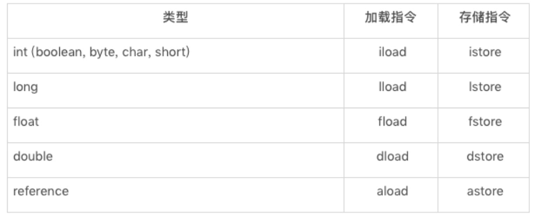

# Java字节码

## 什么是字节码？

Java ByteCode 由单字节（byte）的指令组成，理论上最多支持 256 个操作码（opcode）。 实际上 Java 只使用了200左右的操作码， 还有一些操作码则保留给调试操作。

根据指令的性质，主要分为四个大类：

1. 栈操作指令，包括与局部变量交互的指令
2. 程序流程控制指令
3. 对象操作指令，包括方法调用指令
4. 算术运算以及类型转换指令

JVM 是一台基于栈的计算机器。每一次方法调用，JVM 都会自动创建一个栈帧，而栈帧由操作数栈、 局部变量数组以及一个 Class 引用（向当前方法在运行时常量池中对应的 Class）组成。

## 栈操作指令

操作数栈主要来存放计算的操作数以及返回结果。

具体来说便是：执行每一条指令之前，JVM 要求该指令的操作数已被压入操作数栈中。在执行指令时，JVM 会将该指令所需的操作数弹出，并且将指令的结果重新压入栈中。

以加法指令 iadd 为例。假设在执行该指令前，栈顶的两个元素分别为 int 值 1 和 int 值 2，那么 iadd 指令将弹出这两个 int，并将求得的和 int 值 3 压入栈中。

​						


由于 iadd 指令只消耗栈顶的两个元素，因此，对于离栈顶距离为 2 的元素，即图中的问号，iadd 指令并不关心它是否存在，更加不会对其进行修改。

此外，Java 字节码中 dup（复制栈顶元素）、pop（舍弃栈顶元素）也是直接作用在操作数栈上。

dup 指令常用于复制 new 指令所生成的未经初始化的引用。例如下面这段代码，当执行 new 指令时，JVM 将指向一块已分配的、未初始化的内存的引用压入操作数栈中。

```java
  public void foo() {
    Object o = new Object();
  }
  // 对应的字节码如下：
  public void foo();
    0  new java.lang.Object [3]
    3  dup
    4  invokespecial java.lang.Object() [8]
    7  astore_1 [o]
    8  return
```

接下来，我们以这个引用为调用者，通过 `invokespecial 指令`调用其构造器。要注意，该指令将消耗操作数栈上的元素，作为它的调用者以及参数（不过 Object 的构造器不需要参数）。当调用返回之后，操作数栈上仍有原本由 new 指令生成的引用，可用于接下来的操作。

pop 指令则常用于舍弃调用指令的返回结果。例如下面这段代码，调用静态方法 bar，但是却不用其返回值。

```java
  public static boolean bar() {
    return false;
  }
  public void foo() {
    bar();
  }
  // foo方法对应的字节码如下：
  public void foo();
    0  invokestatic FooTest.bar() : boolean [24]
    3  pop
    4  return
```

由于对应的 `invokestatic 指令`仍旧会将返回值压入 foo 方法的操作数栈中，因此 JVM 需要额外执行 pop 指令，将返回值舍弃。

操作数栈的每一个元素可以是任意Java数据类型，包括 long 和 double 在内的。32位数据类型所占的栈容量为1，64位数据类型所占的栈容量为2。当遇到这些 64 位数据类型的值时，我们需要同时复制栈顶两个单元的 dup2 指令，以及弹出栈顶两个单元的 pop2 指令。

除此之外，不算常见但也是直接作用于操作数栈的还有 swap 指令，它将交换栈顶两个元素的值。

在 Java 字节码中，还有一部分指令可以直接将常量加载到操作数栈上。以 int 类型为例，JVM 既可以通过 iconst 指令加载 -1 至 5 之间的 int 值，也可以通过 bipush、sipush 加载一个字节、两个字节所能代表的 int 值。

JVM 还可以通过 ldc 加载常量池中的常量值，例如 ldc 18 将加载常量池中的第 18 项。

下面是常数加载指令表：

​		

正常情况下，操作数栈的压入弹出都是一条条指令完成的。唯一的例外情况是在抛异常时，JVM 会清除操作数栈上的所有内容，而后将异常实例压入操作数栈上。

### 与局部变量交互的指令

Java 方法栈桢的另外一个重要组成部分则是局部变量区，可以把它当成一个数组，依次存放 this 指针（仅非静态方法），所传入的参数，以及字节码中的局部变量。

和操作数栈一样，long 类型以及 double 类型的值将占据两个单元，其余类型仅占据一个单元。

```java
public void foo(long l, float f) {
  {
    int i = 0;
  }
  {
    String s = "Hello, World";
  }
}
```

以上面这段代码中的 foo 方法为例，由于它是一个实例方法，因此局部变量数组的第 0 个单元存放着 this 指针。第一个参数为 long 类型，于是数组的 1、2 两个单元存放着所传入的 long 类型参数的值。第二个参数则是 float 类型，于是数组的第 3 个单元存放着所传入的 float 类型参数的值。

对于局部变量 i 和 s，由于这两个局部变量的生命周期没有重合之处，因此，Java 编译器可以将它们编排至同一单元中。也就是说，局部变量数组的第 4 个单元将为 i 或者 s。

存储在局部变量区的值，通常需要加载至操作数栈中，方能进行计算，得到计算结果后再存储至局部变量数组中。这些加载、存储指令是区分类型的。例如，int 类型的加载指令为 iload，存储指令为 istore。

**局部变量区访问指令表：**

​		

局部变量数组的加载、存储指令都需要指明所加载单元的下标。例如，aload 0 指的是加载第 0 个单元所存储的引用，在前面示例中的 foo 方法里指的便是加载 this 指针。

Java 字节码中唯一能够直接作用于局部变量区的指令是 iinc M N（M 为非负整数，N 为整数）。该指令指的是将局部变量数组的第 M 个单元中的 int 值增加 N，常用于 for 循环中自增量的更新。

```java
  public void foo() {
    for (int i = 100; i>=0; i--) {}
  }
  // 对应的字节码如下：
  public void foo();
     0  bipush 100
     2  istore_1 [i]
     3  goto 9
     6  iinc 1 -1 [i] // i--
     9  iload_1 [i]
    10  ifge 6
    13  return
```

看一个完整例子：

```java
public static int bar(int i) {
  return ((i + 1) - 2) * 3 / 4;
}
// 对应的字节码如下：
Code:
  stack=2, locals=1, args_size=1
     0: iload_0
     1: iconst_1
     2: iadd
     3: iconst_2
     4: isub
     5: iconst_3
     6: imul
     7: iconst_4
     8: idiv
     9: ireturn
```

上面代码对应的字节码中的 stack=2, locals=1 代表该方法需要的操作数栈空间为 2，局部变量数组空间为 1。当调用 bar(5) 时，每条指令执行前后局部变量数组空间以及操作数栈的分布如下：

​				

## 程序流程控制指令

主要包括无条件跳转 goto，条件跳转指令，tableswitch 和 lookupswtich（前者针对密集的 cases，后者针对稀疏的 cases），返回指令，以及被废弃的 jsr，ret 指令。其中返回指令是区分类型的。例如，返回 int 值的指令为 ireturn。

**返回指令表**

​		

除返回指令外，其他的控制流指令均附带一个或者多个字节码偏移量，代表需要跳转到的位置。例如下面的 abs 方法中偏移量为 1 的条件跳转指令，当栈顶元素小于 0 时，跳转至偏移量为 6 的字节码。

```java
 public int abs(int i) {
    if (i >= 0) {
      return i;
    }
    return -i;
  }
  // 对应的字节码如下所示：
  public int abs(int i);
    0  iload_1 [i]
    1  iflt 6
    4  iload_1 [i]
    5  ireturn
    6  iload_1 [i]
    7  ineg
    8  ireturn
```

## 对象操作指令

主要包括各类具备高层语义的字节码，例如：new（后跟目标类，生成该类的未初始化的对象），instanceof（后跟目标类，判断栈顶元素是否为目标类 / 接口的实例。是则压入 1，否则压入 0），checkcast（后跟目标类，判断栈顶元素是否为目标类 / 接口的实例。如果不是便抛出异常），athrow（将栈顶异常抛出），以及 monitorenter（为栈顶对象加锁）和 monitorexit（为栈顶对象解锁）。

此外，该类型的指令还包括字段访问指令，即静态字段访问指令 getstatic、putstatic，和实例字段访问指令 getfield、putfield。这四条指令均附带用以定位目标字段的信息，但所消耗的操作数栈元素皆不同。

### 数组相关指令

数组相关指令，包括新建基本类型数组的 newarray，新建引用类型数组的 anewarray，生成多维数组的 multianewarray，以及求数组长度的 arraylength。另外，它还包括数组的加载指令以及存储指令。这些指令是区分类型的。例如，int 数组的加载指令为 iaload，存储指令为 iastore。

**数组访问指令表**

​		

### 方法调用指令

1. Invokestatic：顾名思义，这个指令用于调用某个类的静态方法，这是方法调用指令中最快的一个。
2. Invokespecial ：用来调用构造函数，但也可以用于调用同一个类中的 private 方法, 以及可见的超类方法。
3. invokevirtual ：如果是具体类型的目标对象，invokevirtual 用于调用公共、受保护和 package 级的私有方法。
4. invokeinterface ：当通过接口引用来调用方法时，将会编译为 invokeinterface 指令。
5. invokedynamic ： JDK7 新增加的指令，是实现“动态类型语言”（Dynamically Typed  Language）支持而进行的升级改进，同时也是 JDK8 以后支持 lambda 表达式的实现基础。

除 invokedynamic 外，其他的方法调用指令所消耗的操作数栈元素是根据调用类型以及目标方法描述符来确定的。在进行方法调用之前，程序需要依次压入调用者（invokestatic 不需要），以及各个参数。

```java
 public int neg(int i) {
    return -i;
  }
  public int foo(int i) {
    return neg(neg(i));
  }
  // foo方法对应的字节码如下：foo方法对应的字节码如下：
  public int foo(int i);
    0  aload_0 [this]
    1  aload_0 [this]
    2  iload_1 [i]
    3  invokevirtual FooTest.neg(int) : int [25]
    6  invokevirtual FooTest.neg(int) : int [25]
    9  ireturn
```

以上面这段代码为例，当调用 foo(2) 时，每条指令执行前后局部变量数组空间以及操作数栈的分布如下所示：

​		

## 算术运算及类型转换指令

**算术运算指令表**

​		

**类型转换指令表**

​		

