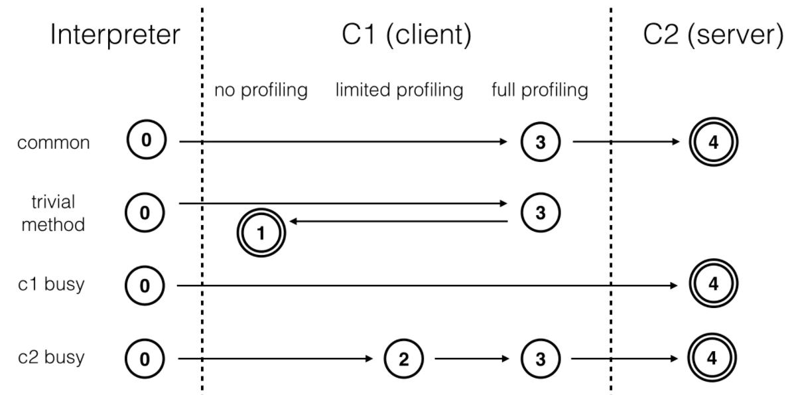
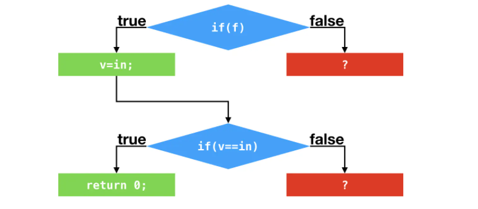
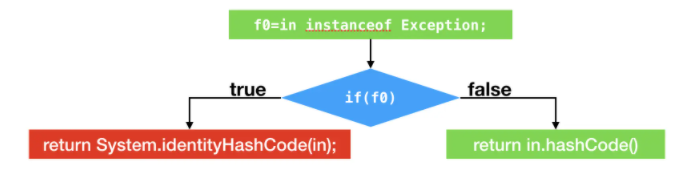
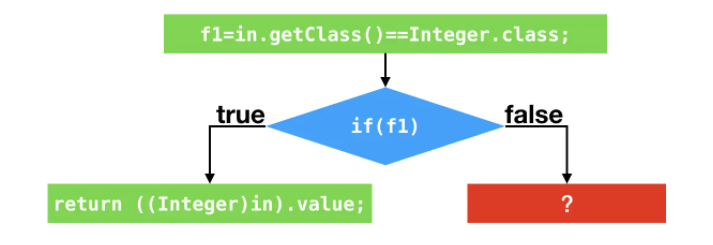

# 即时编译

## 前言

Java 程序最初都是通过解释器 （Interpreter）进行解释执行的，当虚拟机发现某个方法或代码块的运行特别频繁，就会把这些代码认定为 **热点代码**（Hot Spot Code），为了提高热点代码的执行效率，在运行时，虚拟机将会把这些代码编译成本地机器码，直接运行在底层硬件之上，运行时完成这个任务的后端编译器被称为即时编译器。

## 分层编译

HotSpot 虚拟机包含多个即时编译器 C1（Client Compiler）、C2（Server Compiler）以及 Graal 编译器（一个实验性质的即时编译器，JDK 10时才出现的，长期目标是代替 C2）。

在 Java 7 以前，HotSpot 虚拟机通常是采用解释器与编译器搭配使用的混合模式。我们也可以根据程序的特性选择对应的即时编译器。对于执行时间较短的，或者对启动性能有要求的程序，我们采用编译效率较快的 C1，对应参数 -client。对于执行时间较长的，或者对峰值性能有要求的程序，我们采用生成代码执行效率较快的 C2，对应参数 -server。

由于即时编译器编译本地代码需要占用程序运行时间，而且想要编译出优化程度更高的代码，解释器可能还要替编译器收集性能监控信 息，这对解释执行阶段的速度也有所影响。为了在 C1 的启动性能优势与 C2 的峰值性能优势之间达到最佳平衡， HotSpot 虚拟机在Java 7 引入了分层编译（`对应参数 -XX:+TieredCompilation`）的概念。

分层编译将 JVM 的执行状态分为了五个层次：

- 第 0 层，程序纯解释执行。
- 第 1 层，使用 C1 代码器将字节码编译为本地代码来运行，进行简单可靠的稳定优化，不开启性能分析。
- 第 2 层，仍然使用 C1 执行，仅开启方法调用次数及回边次数统计等有限的性能分析。
- 第 3 层，仍然使用 C1 执行，开启全部性能分析，除了第 2 层的统计信息外，还会收集如分支跳转、虚方法调用版本等全部的统计信息。
- 第 4 层，使用 C2 将字节码编译为本地代码来执行

​        以上层次并不是固定不变的，根据不同的运行参数和版本，虚拟机可以调整分层的数量。在 5 个层次的执行状态中，1 层和 4 层为终止状态。当一个方法被终止状态编译过后，如果编译后的代码并没有失效，那么 JVM 是不会再次发出该方法的编译请求的。各层次编译之间的交互、转换关系如图所示：

- common：热点方法会被 3 层的 C1 编译，然后再被 4 层的 C2 编译
- trivial method：方法的字节码数目比较少（如 getter/setter），而且 3 层的 profiling 没有可收集的数据。那么，JVM 断定该方法对于 C1 代码和 C2 代码的执行效率相同。在这种情况下，JVM 会在 3 层编译之后，直接选择用 1 层的 C1 编译。由于这是一个终止状态，因此 JVM 不会继续用 4 层的 C2 编译。
- C1 busy：在 C1 忙碌的情况下，JVM 在解释执行过程中对程序进行 profiling，而后直接由 4 层的 C2 编译。
- C2 busy：在 C2 忙碌的情况下，方法会被 2 层的 C1 编译，然后再被 3 层的 C1 编译，以减少方法在 3 层的执行时间。

Java 8 默认开启了分层编译。不管是开启还是关闭分层编译，原本用来选择即时编译器的参数 -client 和 -server 都是无效的。当关闭分层编译的情况下，JVM 将直接采用 C2。

如果希望只用 C1，那么可以在打开分层编译的情况下使用参数 `-XX:TieredStopAtLevel=1`。在这种情况下，JVM 会在解释执行之后直接由 1 层的 C1 进行编译。

## 即时编译的触发

JVM 是根据方法的调用次数以及循环回边的执行次数来触发即时编译的。为此，HotSpot 为每个方法准备了两类计数器：方法调用计数器（Invocation Counter）和回边计数器（Back Edge Counter，“回边”的意思就是指在循环边界往回跳转，在字节码中遇到控制流向后跳转的指令被称为“回边”）。当虚拟机运行参数确定的前提下，这两个计数器都有一个明确的阈值，计数器阈值一旦溢出，就会触发即时编译。

首先来看方法调用计数器。顾名思义，这个计数器就是用于统计方法被调用的次数，它的默认阈值在 C1 下是1500次，在 C2 下是10000次（对应虚拟机参数`-XX：CompileThreshold`）。

在不启用分层编译的情况下，当方法的调用次数和循环回边的次数的和，超过方法计数器的阈值时，便会触发即时编译。

在默认设置下，方法调用计数器统计的并不是方法被调用的绝对次数，而是一段时间之内方法被调用的次数。当超过一定的时间限度，如果方法的调用次数仍然不足以让它提交给即时编译器编译，那该方法的调用计数器就会被减少一半，这个过程被称为方法调用计数器热度的衰减（Counter Decay），而这段时间就称为此方法统计的半衰周期（Counter Half Life Time）。热度衰减的动作是在虚拟机进行垃圾收集时进行的，可以使用虚拟机参数`-XX：-UseCounterDecay`关闭热度衰减，让方法计数器统计方法调用的绝对次数，这样只要系统运行时间足够长，程序中绝大部分方法都会被编译成本地代码。另外还可以使用`-XX：CounterHalfLifeTime`参数设置半衰周期的时间，单位是秒。

至于回边计数器，JVM 还存在着另一种以循环为单位的即时编译，叫做 On-Stack-Replacement（栈上替换，OSR）编译。循环回边计数器便是用来触发这种类型的编译的。它的作用是统计一个方法中循环体代码执行的次数（准确来说，这里应当是回边的次数而不是循环次数，因为并非所有的循环都是回边，如空循环实际上就可以视为自己跳转到自己的过程，因此并不算作控制流向后跳转，也不会被回边计数器统计），建立回边计数器统计的目的是为了触发栈上的替换编译。

OSR 实际上是一种技术，它指的是在程序执行过程中，动态地替换掉 Java 方法栈桢，从而使得程序能够在非方法入口处（编译时会传入执行入口点字节码序号，Byte Code Index，BCI）进行解释执行。OSR 编译可以用来解决单次调用方法包含热循环的性能优化问题。

在不启用分层编译的情况下，可以通过参数`-XX：OnStackReplacePercentage`来间接调整回边计数器的阈值，其计算公式有如下两种：

~~~~shell
-XX：CompileThreshold * -XX：OnStackReplacePercentage / 100。
其中-XX： OnStackReplacePercentage默认值为933，如果都取默认值，那 C1 下回边计数器的阈值为 13995。

-XX： CompileThreshold *（-XX：OnStackReplacePercentage - -XX： InterpreterProfilePercentage）/ 100。
其中-XX：OnStackReplacePercentage 默认值为140，- XX：InterpreterProfilePercentage默认值为33，如果都取默认值，那 C2 下回边计数器的阈 值为10700。

-XX：CompileThreshold：方法调用计数器阈值
-XX：OnStackReplacePercentage：OSR 比率
-XX：InterpreterProfilePercentage：解释器监控比率
~~~~

当启用分层编译时，JVM 将不再采用由参数 `-XX:CompileThreshold`、`-XX: OnStackReplacePercentage`  指定的阈值（该参数失效），而是将根据当前待编译的方法数以及编译线程数来动态调整。

动态调整其实并不复杂：在比较阈值时，JVM 会将阈值与某个系数 s 相乘。该系数与当前待编译的方法数目成正相关，与编译线程的数目成负相关。

**系数的计算方法为：**

~~~shell
s = queue_size_X / (TierXLoadFeedback * compiler_count_X) + 1

其中X是执行层次，可取 3 或者 4；
queue_size_X是执行层次为 X 的待编译方法的数目；
TierXLoadFeedback是预设好的参数，其中Tier3LoadFeedback为 5，Tier4LoadFeedback为 3；
compiler_count_X是层次 X 的编译线程数目。
~~~

在 64 位 JVM 中，默认情况下编译线程的总数目是根据处理器数量来调整的（`对应参数 -XX:+CICompilerCountPerCPU，默认为 true`；当通过参数 `-XX:+CICompilerCount=N` 强制设定总编译线程数目时，`CICompilerCountPerCPU` 将被设置为 false）

JVM 会将这些编译线程按照 1 : 2 的比例分配给 C1 和 C2（至少各为 1 个）。例如，对于一个四核机器来说，总的编译线程数目为 3，其中包含一个 C1 编译线程和两个 C2 编译线程。

那么，对于四核及以上的机器，总的编译线程的数目为：

~~~shell
n = log2(N) * log2(log2(N)) * 3 / 2
其中 N 为 CPU 核心数目。
~~~

当启用分层编译时，即时编译具体的触发条件如下：

~~~shell
当方法调用次数大于由参数-XX:TierXInvocationThreshold指定的阈值乘以系数，
或
当方法调用次数大于由参数-XX:TierXMINInvocationThreshold指定的阈值乘以系数，并且方法调用次数和循环回边次数之和大于由参数-XX:TierXCompileThreshold指定的阈值乘以系数时，便会触发 X 层即时编译。

触发条件为：
i > TierXInvocationThreshold * s
|| 
(i > TierXMinInvocationThreshold * s  && i + b > TierXCompileThreshold * s)
~~~

其中 i 为调用次数，b 为循环回边次数。

## Profiling

Profiling（性能分析），是指程序执行过程中，收集能够反映程序执行状态的数据。这里所收集的数据被称之为程序的 profile。

在上面分层编译中，我们了解到 0 层、2 层和 3 层都会进行 profiling。其中，最为基础的便是方法的调用次数以及循环回边的执行次数。它们被用于触发即时编译。

此外，0 层和 3 层还会收集用于 4 层 C2 编译的数据，比如说分支跳转字节码的分支 profile（branch profile）和类型 profile（receiver type profile）。其中分支 profile 主要包括包括跳转次数和不跳转次数；类型 profile主要包括非私有实例方法调用指令、强制类型转换 checkcast 指令、类型测试 instanceof 指令，和引用类型的数组存储 aastore 指令。

当方法被 3 层 C1 所编译时，生成的 C1 代码将收集条件跳转指令的分支 profile，以及类型相关指令的类型 profile。通常情况下，在 0 层解释执行过程中不会收集分支 profile 以及类型 profile。只有在比较极端的情况下，例如等待 C1 编译的方法数目太多时，JVM 才会开始在解释执行过程中收集这些 profile。

**profile 的收集会给程序带来不少的性能开销，那么这些耗费巨大代价收集而来的 profile 具体有什么作用呢？**

答案是，C2 可以根据收集得到的数据进行猜测，假设接下来的执行同样会按照所收集的 profile 进行，从而作出比较激进的优化。

### 基于分支 profile 的优化

~~~java
public static int foo(boolean f, int in) {
  int v;
  if (f) {
    v = in;
  } else {
    v = (int) Math.sin(in);
  }

  if (v == in) {
    return 0;
  } else {
    return (int) Math.cos(v);
  }
}
~~~

上述代码所示，如果所传入的 boolean f 的值为 true，那么两次 if 条件跳转指令所对应的分支 profile 中，跳转的次数都为 0。

C2 可以根据这两个分支 profile 作出假设，在接下来的执行过程中，这两个条件跳转指令仍旧不会发生跳转。基于这个假设，C2 便不再编译这两个条件跳转语句所对应的 false 分支了，这个称之为**剪枝**。

经过“剪枝”之后，在第二个条件跳转处，v 的值只有可能为所输入的 int 值。因此，该条件跳转可以进一步被优化掉。最终的结果是，在第一个条件跳转之后，C2 代码将直接返回 0。

根据条件跳转指令的分支 profile，即时编译器可以将从未执行过的分支剪掉，以避免编译这些很有可能不会用到的代码，从而节省编译时间以及部署代码所要消耗的内存空间。

“剪枝”将精简程序的数据流，从而触发更多的优化。但是在现实中，分支 profile 出现仅跳转或者仅不跳转的情况并不多见。

当然，即时编译器对分支 profile 的利用也不仅限于“剪枝”。它还会根据分支 profile，计算每一条程序执行路径的概率，以便某些编译器优化优先处理概率较高的路径。

### 基于类型 profile 的优化

~~~java
public static int hash(Object in) {
  if (in instanceof Exception) {
    return System.identityHashCode(in);
  } else {
    return in.hashCode();
  }
}
~~~

假设所传入的 Object 皆为 Integer 实例。那么，instanceof 指令的类型 profile 仅包含 Integer，if 的分支跳转语句的分支 profile 中不跳转的次数为 0，`in.hashCode()` 的方法调用指令的类型 profile 仅包含 Integer。

在 JVM 中，如果 instanceof 的目标类型是 final 类型，那么 JVM 仅需比较测试对象的动态类型是否为该 final 类型。对象的动态类型存在对象头种，因此，获取对象的动态类型仅为单一的内存读指令。

如果目标类型不是 final 类型，比如为例子中的 Exception，那么 JVM 需要从测试对象的动态类型开始，依次测试该类，该类的父类、祖先类，该类所直接实现或者间接实现的接口是否与目标类型一致。

在上面例子中，instanceof 指令的类型 profile 仅包含 Integer。根据这个信息，即时编译器可以假设，在接下来的执行过程中，所输入的 Object 对象仍为 Integer 实例。

因此，生成的代码将测试所输入的对象的动态类型是否为 Integer。如果是的话，则执行 `Integer.hashCode()` 方法。（该优化源自 Graal，采用 C2 可能无法复现。）

然后，即时编译器会采用针对分支 profile 的优化，以及对方法调用的条件去虚化内联。

上述代码可以最终优化为极其简单的形式：

​		

和基于分支 profile 的优化一样，基于类型 profile 的优化同样也是作出假设，从而精简控制流以及数据流。这两者的核心都是假设。

对于分支 profile，即时编译器假设的是仅执行某一分支；对于类型 profile，即时编译器假设的是对象的动态类型仅为类型 profile 中的那几个。

### 去优化

当基于分支 profile 和基于类型 profile 假设失败的情况下，程序将何去何从？JVM 给出的解决方案便是去优化，即从执行即时编译生成的机器码切换回解释执行。

在生成的机器码中，即时编译器将在假设失败的位置上插入一个陷阱（trap）。该陷阱实际上是一条 call 指令，调用至 JVM 里专门负责去优化的方法。与普通的 call 指令不一样的是，去优化方法将更改栈上的返回地址，并不再返回即时编译器生成的机器码中。

在上面 profile 优化的程序控制流程图中，有很多红色方框的问号，这些问号便代表着一个个的陷阱。一旦踏入这些陷阱，便将发生去优化，并切换至解释执行。

由于即时编译器采用了许多优化方式，其生成的代码和原本的字节码的差异非常之大。在去优化的过程中，需要将当前机器码的执行状态转换至某一字节码之前的执行状态，并从该字节码开始执行。这便要求即时编译器在编译过程中记录好这两种执行状态的映射。

当根据映射关系创建好对应的解释执行栈桢后，JVM 便会采用 OSR 技术，动态替换栈上的内容，并在目标字节码处开始解释执行。

此外，在调用 JVM 的去优化方法时，即时编译器生成的机器码可以根据产生去优化的原因来决定是否保留这一份机器码，以及何时重新编译对应的 Java 方法。比如：

- 去优化的原因与优化无关，即使重新编译也不会改变生成的机器码，那么生成的机器码可以在调用去优化方法时传入 Action_None，表示保留这一份机器码，在下一次调用该方法时重新进入这一份机器码。
- 去优化的原因与静态分析的结果有关，例如类层次分析，那么生成的机器码可以在调用去优化方法时传入 Action_Recompile，表示不保留这一份机器码，但是可以不经过重新 profile，直接重新编译。
- 去优化的原因与基于 profile 的激进优化有关，那么生成的机器码需要在调用去优化方法时传入 Action_Reinterpret，表示不保留这一份机器码，由于基于 profile 的优化失败的时候，往往代表这程序的执行状态发生改变，因此还需要重新收集程序的 profile。

## 参考资料

1. [《深入拆解Java虚拟机》郑雨迪](https://time.geekbang.org/column/intro/108)
2. 《深入理解Java虚拟机：JVM高级特性与最佳实践（第3版）周志明》
