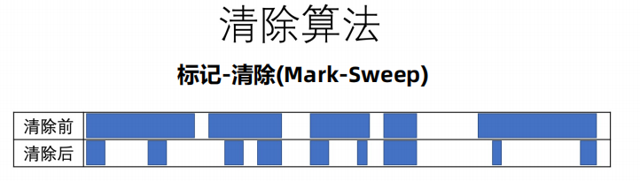
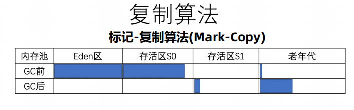
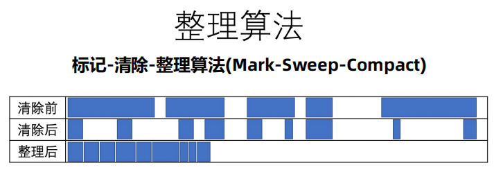
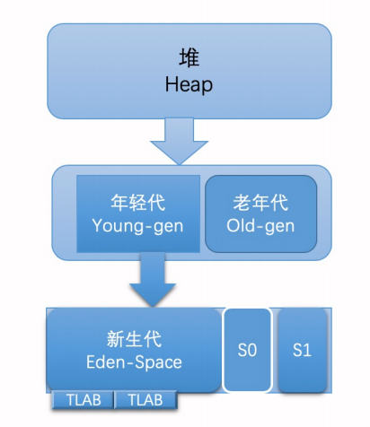
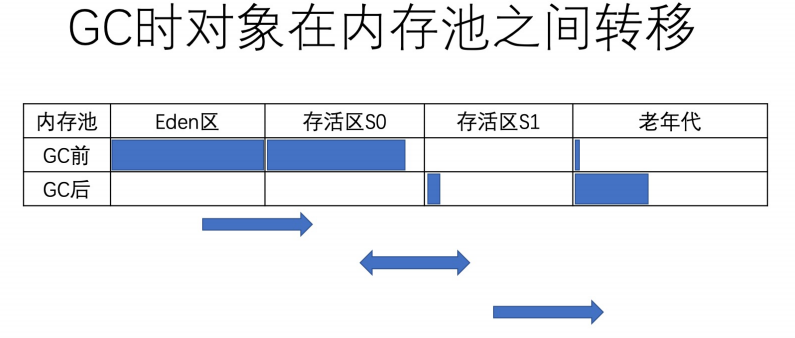

# 垃圾回收

## 前言

垃圾回收，是将已经分配出去的，但却不再使用的内存回收回来，以便能够再次分配。在 JVM 的语境下，垃圾指的是死亡的对象所占据的堆空间。

那么，如何辨别一个对象是存是亡？

## 引用计数法

在对象中添加一个引用计数器，每当有一个地方引用它，计数器值就加一；当引用失效时，计数器值就减一。当对象的引用计数器为 0，则说明该对象已经死亡，便可以被回收了。

引用计数法需要额外的空间来存储计数器，以及繁琐的更新操作。此外，它还有一个重大的漏洞，那便是无法处理循环引用对象。

举个例子，假设对象 a 与 b 相互引用，除此之外没有其他引用指向 a 或者 b，实际上这两个对象已经死了，不可能再被访问，但是它们因为互相引用着对方，导致它们的引用计数都不为零，引用计数算法也就无法回收它们，从而造成了内存泄露。

## 可达性分析算法

目前 Java 虚拟机的主流垃圾回收器采取的是可达性分析算法。这个算法的实质在于将一系列 `GC Roots` 作为初始的存活对象合集，然后从该合集出发，探索所有能够被该集合引用到的对象，并将其加入到该集合中，这个过程我们也称之为标记（mark）。最终，未被探索到的对象便是死亡的，是可以回收的。

`GC Roots` 主要包含以下几种：

1. 虚拟机栈中引用的对象（当前正在执行的方法里的局部变量和输入参数）
2. 方法区中，常量引用对象
3. 方法区中，类静态字段引用的对象（static field）
4. JNI 引用（Java Native Interface）
5. 虚拟机内部引用（例如系统类加载器、线程等）

可达性分析可以解决引用计数法所不能解决的循环引用问题。但是在实践中还是有不少其他问题。比如说，`GC` 已经标记完成，在多线程环境下，其他线程可能会更新已经访问过的对象中的引用，从而造成误报（将引用设置为 null）或者漏报（将引用指向一个新的对象）。

误报是指可达性分析误认为某个对象是可达的，实际不可达。漏报是指可达性分析没有发现某个对象可达。

这里需要明确，可达性分析会找出非垃圾，而其他对象通通被认为是垃圾。

误报并没有什么伤害，JVM 至多损失了部分垃圾回收的机会。漏报则比较麻烦，因为垃圾回收器可能回收事实上仍被引用的对象内存。一旦从原引用访问已经被回收了的对象，则很有可能会直接导致 Java 虚拟机崩溃。

怎么解决这个问题呢？

## STW以及安全点

在 JVM 里，传统的垃圾回收算法采用的是一种简单粗暴的方式，那便是 STW（Stop-the-world），停止其他非垃圾回收线程的工作，直到完成垃圾回收。这也就造成了垃圾回收所谓的暂停时间（GC pause）。

JVM 中的 STW 是通过安全点（`safepoint`）机制来实现的。当 JVM 收到 STW 请求，它便会等待所有的线程都到达安全点，才允许请求 STW 的线程进行独占的工作。

对于安全点，另外一个需要考虑的问题是，如何在垃圾收集发生时让所有线程（不包括执行 `JNI` 调用的线程）都跑到最近的安全点，然后停顿下来那？

有两种方案可供选择：抢先式中断 （Preemptive Suspension）和主动式中断（Voluntary Suspension）。现在几乎没有虚拟机实现采用抢先式中断来暂停线程响应GC事件，所以，我们主要说一下主动式中断。

主动式中断是当垃圾收集需要中断线程的时候，不直接对线程操作，而是设置一个标志位，各个线程执行过程时会不停地主动去轮询这个标志，一旦发现中断标志为真时就自己在最近的安全点上主动中断挂起。

**safepoint挂起线程的点主要有：**

1. 循环的末尾
2. 方法返回前
3. 调用方法的call之后
4. 抛出异常的位置

由于轮询操作在代码中会频繁出现，这要求它必须足够高效。HotSpot 使用内存保护陷阱的方式， 把轮询操作精简至只有一条汇编指令的程度。

## 垃圾回收的三种方式

### 标记-清除（Mark-Sweep）

标记出所有需要回收的对象，在标记完成后，统一回收掉所有被标记的对象。标记过程就是对象是否属于垃圾的判定过程。

**它的主要缺点有两个：**

第一个是执行效率不稳定，如果Java堆中包含大量对象，而且其中大部分是需要被回收的，这时必须进行大量标记和清除的动作，导致标记和清除两个过程的执行效率都随对象数量增长而降低；

第二个是内存空间的碎片化问题，标记、清除之后会产生大量不连续的内存碎片，空间碎片太多可能会导致当以后在程序运行过程中需要分配较大对象时无法找到足够的连续内存而不得不提前触发另一次垃圾收集动作。

### 标记-复制（Mark-Copy）

把内存区域分为两等分，分别用两个指针 from 和 to 来维护，并且只是用 from 指针指向的内存区域来分配内存。当发生垃圾回收时，便把存活的对象复制到 to 指针指向的内存区域中，并且交换 from 指针和 to 指针的内容。

标记-复制这种回收方式同样能够解决内存碎片化的问题，但是它的缺点也极其明显，即堆空间的使用效率低下。

### 标记-清除-整理(Mark-Sweep-Compact)

标记-复制算法在对象存活率较高时就要进行较多的复制操作，效率将会降低。更关键的是，如果不想浪费50%的空间，就需要有额外的空间进行分配担保，以应对被使用的内存中所有对象都100%存活的极端情况，所以在老年代一般不能直接选中这种算法。

标记-整理-算法其中的标记过程仍然与“标记-清除”算法一样，但后续步骤不是直接对可回收对象进行清理，而是让所有存活的对象都向内存空间一端移动，然后直接清理掉边界以外的内存。

这种算法空间利用率高，没有空间碎片，但是移动存活对象并更新所有引用这些对象的地方将会是一种极为负重的操作，而且这种对象移动操作必须全程暂停用户应用程序才能进行。

## JVM的堆划分

**分代假设：**大部分的 Java 对象只存活一小段时间，而存活下来的小部分 Java 对象则会存活很长一段时间。

基于这个假设，JVM 将堆空间划分为两代，分别叫做新生代和老年代。新生代又被划分为 Eden 区，以及两个大小相同的 Survivor 区，并且其中一个 Survivor 区是空的。

这样，JVM 就可以给不同代使用不同的回收算法

- 年轻代：选择复制算法，弱分代假说
- 老年代：选择标记-清除或标记-清除-整理，强分代假说

默认情况下，JVM 采取的是一种动态分配的策略（对应 JVM 参数 `-XX:+UsePSAdaptiveSurvivorSizePolicy`），根据生成对象的速率，以及 Survivor 区的使用情况动态调整 Eden 区和 Survivor 区的比例（默认 8 : 1 : 1）。

我们可以通过参数 `-XX:SurvivorRatio` 来固定这个比例。但是需要注意的是，由于其中一个 Survivor 区会一直为空，因此比例越低浪费的堆空间将越高。例如：当`-XX:SurvivorRatio=6`，每个 survivor 区域占用的内存是新生代内存大小的 1/8（8 = 1（survivor） + 1（survivor） + 6（eden））；当`-XX:SurvivorRatio=4`，每个 survivor 区域占用的内存是新生代内存大小的 1/6（4 = 1（survivor） + 1（survivor） + 4（eden））；因为其中一个survivor一定是空的，所以浪费的空间就会加大。

当我们调用 new 指令时，它会在 Eden 区中划出一块作为存储对象的内存。由于堆空间是线程共享的，因此直接在这里边划空间是需要进行同步的。否则，将有可能出现两个对象共用一段内存的事故。

JVM 的解决方法是：每个线程可以向 JVM 申请一段连续的内存，比如 2048 字节，作为线程私有的 TLAB（Thread Local Allocation Buffer，对应虚拟机参数 `-XX:+UseTLAB`，默认开启）。

这个操作需要加锁，线程需要维护两个指针（实际上可能更多，但重要也就两个），一个指向 TLAB 中空余内存的起始位置，一个则指向 TLAB 末尾。

接下来的 new 指令，便可以直接通过指针加法（bump the pointer）来实现，即把指向空余内存位置的指针加上所请求的字节数。如果加法后空余内存指针的值仍小于或等于指向末尾的指针，则代表分配成功。否则，TLAB 已经没有足够的空间来满足本次新建操作。这个时候，便需要当前线程重新申请新的 TLAB。

当 Eden 区的空间耗尽了，JVM 便会触发一次 Minor GC（新生代），来收集新生代的垃圾。新生代的两个 Survivor 区，我们分别用 from 和 to 来指代。其中 to 指向的 Survivor 区是空的。当发生 Minor GC 时，Eden 区和 from 指向的 Survivor 区中的存活对象会被复制到 to 指向的 Survivor 区中，然后交换 from 和 to 指针，以保证下一次 Minor GC 时，to 指向的 Survivor 区还是空的。

JVM 会记录 Survivor 区中的对象一共被来回复制了几次。如果一个对象被复制的次数为 15（ `-XX:+MaxTenuringThreshold=15`），那么该对象将被晋升（promote）至老年代。另外，如果单个 Survivor 区已经被占用了 50%（ `-XX:TargetSurvivorRatio`），那么较高复制次数的对象也会被晋升至老年代。

老年代默认都是存活对象，采用移动方式：

1. 标记所有通过 GC Roots 可达的对象；
2. 删除所有不可达对象；
3. 整理老年代空间中的内容，方法是将所有的存活对象复制，从老年代空间开始的地方依次存放。

Minor GC 只针对新生代进行垃圾回收。但是，它却有一个问题，那就是老年代的对象可能引用新生代的对象。也就是说，在标记存活对象的时候，我们需要扫描老年代中的对象。如果该对象拥有对新生代对象的引用，那么这个引用也会被作为 GC Roots。

那么怎么避免扫描整个老年代？JVM 引入了名为卡表的技术。

## 卡表

卡表是通过 byte 数组来实现的，它将整个堆划分为一个个大小为 512 字节的卡，并且维护一个卡表，用来存储每张卡的一个标识位。这个标识位代表对应的卡是否可能存有指向新生代对象的引用。如果可能存在，那么我们就认为这张卡是脏的。

一个卡的内存中通常包含不止一个对象，只要卡内有一个（或更多）对象的字段存在着跨代指针，那就将对应卡表的数组元素的值标识为1，称为这个元素变脏（Dirty），没有则标识为0。在垃圾收集发生时，只要筛选出卡表中变脏的元素，就能轻易得出哪些卡页内存块中包含跨代指针，把它们加入GC Roots中一并扫描。当完成所有脏卡的扫描之后，JVM 便会将所有脏卡的标识位清零。

**那么卡是如何变脏的？**

## 写屏障

卡表元素变脏的时机：有其他分代区域中对象引用了本区域对象时，其对应的卡表元素就应该变脏。变脏时间点原则上应该发生在引用类型字段赋值的那一刻， JVM 截获引用型实例变量的写操作，并作出对应的写标识位操作。

这个操作在解释执行器中比较容易实现，JVM 负责每条字节码指令的执行，有充分的介入空间。但是在即时编译器生成的机器码中，则需要插入额外的逻辑。这也就是所谓的写屏障（write barrier）。

写屏障可以看作在虚拟机层面对`引用类型字段赋值`这个动作的 AOP 切面，在引用对象赋值时会产生一个环形（Around）通知，供程序执行额外的动作，也就是说赋值的 前后都在写屏障的覆盖范畴内。在赋值前的部分的写屏障叫作写前屏障（Pre-Write Barrier），在赋值 后的则叫作写后屏障（Post-Write Barrier）。HotSpot虚拟机的许多收集器中都有使用到写屏障，但直 至 G1 收集器出现之前，其他收集器都只用到了写后屏障。

写屏障需要尽可能地保持简洁。因此，写屏障并不会判断更新后的引用是否指向新生代中的对象，而是宁可错杀，不可放过，一律当成可能指向新生代对象的引用。

虽然写屏障不可避免地带来一些开销，但是它能够加大 Minor GC 的吞吐率（ 应用运行时间 /(应用运行时间 + 垃圾回收时间) ）。总的来说还是值得的。不过，在高并发环境下，写屏障又带来了伪共享（false sharing）问题。

伪共享是处理并发底层细节时一种经常需要考虑的问题，现代中央处理器的缓存系统中是以缓存行（Cache Line）为单位存储的，当多线程修改互相独立的变量时，如果这些变量恰好共享同一个缓存行，就会彼此影响（写回、无效化或者同步）而导致性能降低，这就是伪共享问题。

例如，处理器的缓存行大小为64字节，由于一个卡表元素占1个字节，64个卡表元素将共享同一个缓存行。这64个卡表元素对应的卡总的内存为32KB（64×512字节）。如果同时有两个 Java 线程，在这 32KB 内存中进行引用更新操作，那么也将造成存储卡表的同一部分的缓存行的写回、无效化或者同步操作，因而间接影响程序性能。

为了避免伪共享问题，一种简单的解决方案是不采用无条件的写屏障，而是先检查卡表标记，只有当该卡表元素未被标记过时才将其标记为变脏。

在JDK 7之后，HotSpot 虚拟机增加了一个新的参数`-XX：+UseCondCardMark`，用来决定是否开启卡表更新的条件判断。开启会增加一次额外判断的开销，但能够避免伪共享问题，两者各有性能损耗，是否打开要根据应用实际运行情况来进行测试权衡。

