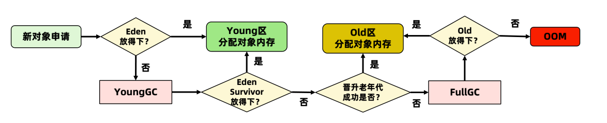

# 对象的生命周期

## 对象的创建流程

**常量池检查：**检查new指令是否能够在**常量池中定位到这个类的符号引用**，检查类之前是否被加载过

**必要信息设置：**对象属于哪个类的实例，如何才能找到类的元数据信息，对象的哈希码，对象的GC分代年龄（对象头中）

## 对象的内存分配方式

内存分配的方法有两种，不同垃圾收集器不一样

| 分配方法                   | 说明                       | 收集器          |
| -------------------------- | :------------------------- | :-------------- |
| 指针碰撞(Bump the Pointer) | 内存地址是连续的（年轻代） | Serial、ParNew  |
| 空闲列表(Free List)        | 内存地址不连续（老年代）   | CMS、Mark-Sweep |

**指针碰撞示意图**

## 内存分配安全问题

JVM给A线程分配内存的过程中，指针未修改，此时B线程同时使用了该内存，就会出现内存分配问题。

### 解决办法

**JVM中有两种解决办法：**

1. CAS乐观锁：JVM虚拟机采用CAS失败重试的方式保证更新操作的原子性
2. TLAB（Thread Local Allocation Buffer）本地线程分配缓存，为每一个线程预先分配一块内存

### **分配流程**

JVM在第一次给线程中的对象分配内存时，首先使用CAS进行TLAB的分配。当对象大于TLAB中的剩余内存或TLAB的内存已用尽时，再采用上述的CAS进行内存分配。

## 对象怎样才进入老年代

新对象大多数进入Eden，对象进入老年代有四种方式：

- 存活年龄太大，默认超过15次【-XX:MaxTenuringThreshold】
- 动态年龄判断

​	MinorGC之后，发现Survivor区中的一批对象的总大小大于这块Survivor区的50%，那么就会将此时**大于等于这批对象年龄最大值**的所有对象，直接进入老年代。例如：Survivor区中有一批对象，年龄分别为年龄1+年龄2+年龄n的多个对象，对象总和大小超过了Survivor区域的50%，此时就会把**年龄n及以上**的对象都放入老年代。

- 大对象直接进入老年代，默认1M【 -XX:PretenureSizeThreshold 】，这样可以避免大对象分配内存时，Eden和Survivor区的复制操作降低效率。
- MinorGC后存活对象太多无法放入Survivor

### 空间担保机制

当新生代无法分配内存的时，我们想把新生代的老对象转移到老年代，然后把新对象放入腾空的新生代。此种机制称之为内存担保。

**老年代的担保示意图**

**Minor GC之后：**

- 剩余存活对象小于Survivor区大小，直接进入Survivor区
- 剩余存活对象大于Survivor区大小，但是小于老年代可用内存，直接进入老年代
- 剩余存活对象大于Survivor区大小，也大于老年代可用内存，进行Full GC
- 任然没有足够内存存放Minor GC的剩余对象，就会OOM

## 对象内存布局

堆内存中，一个对象在内存中存储的布局可以分为三块区域

### 对象头

Java对象头占8byte。如果是数组则占12byte。因为JVM里数组size需要使用4byte存储。

#### 标记字段（MarkWord）

1. 用于存储对象自身的运行时数据，它是synchronized实现轻量级锁和偏向锁的关键
2. 默认存储：对象HashCode、GC分代年龄、锁状态等信息
3. 存储数据结构并不是固定的，为了节省空间，也会随着锁标志位的变化，存储数据发生变化，变化状态如下：

#### 类型指针（KlassPoint）

对象指向它的类元数据的指针，虚拟机通过这个指针来确定这个对象是哪个类的实例。开启指针压缩存储空间4byte，不开启8byte，JDK1.6+默认开启。

#### 数组长度

如果对象是数组，则记录数组长度，占4个byte，如果对象不是数组则不存在。

#### 对齐填充

保证数组的大小永远是8字节的整数倍

### 实例数据

对象内部的成员变量

### 对齐填充（Padding）

JVM内对象都采用8byte对齐，不够8byte的会自动补齐

## 如何访问一个对象

**两种方式：**

**1、句柄：稳定，对象被移动只需要修改句柄中的地址**

**2、直接指针：访问速度快，节省了一次指针定位的开销**

