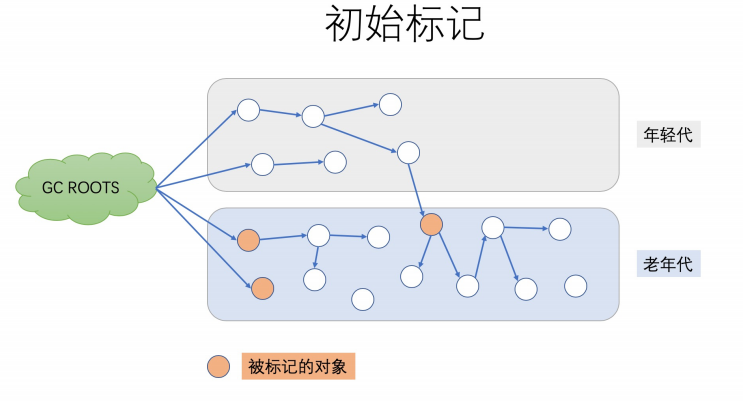
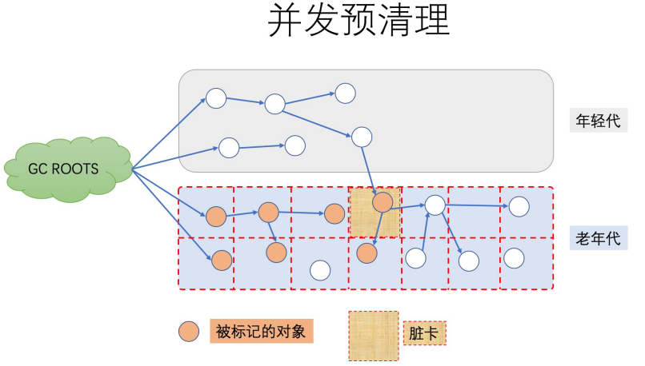
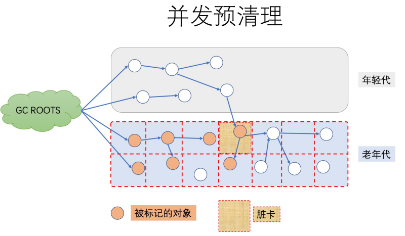
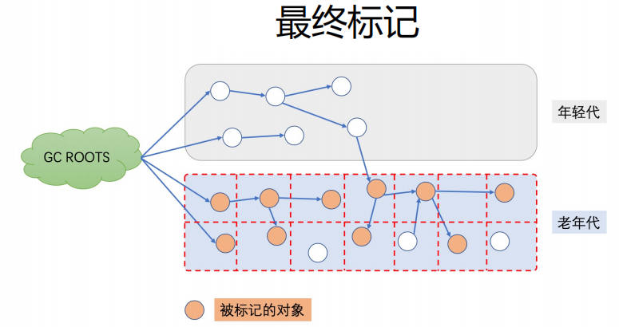
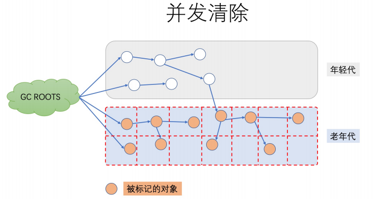
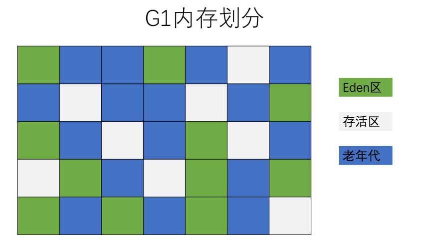
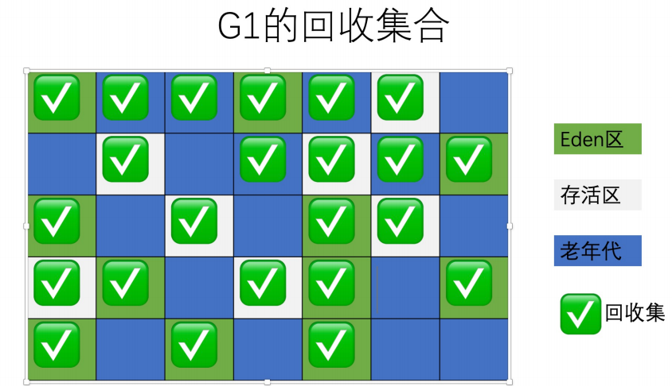
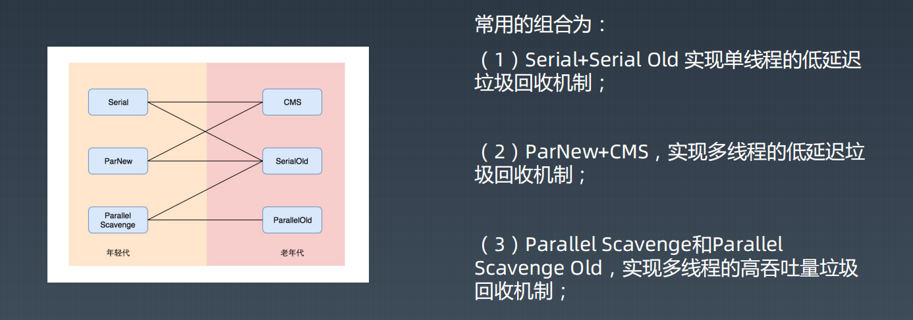

# 常见的GC分析及总结

## Serial GC

Serial GC（串行GC）是最基础、历史最悠久的收集器。它是一个单线程工作的收集器。**启用参数：**​`-XX:+UseSerialGC`

Serial GC 对年轻代使用 mark-copy（标记-复制） 算法，对老年代使用 mark-sweep-compact（标记-清除-整理）算法。

两者都是单线程的垃圾收集器，不能进行并行处理，所以都会触发全线暂停（STW），停止所有的应用线程。

**Serial GC 只适合几百 MB 堆内存的 JVM，而且是单核 CPU 时比较有用，why？**

Serial GC由于没有线程交互的开销，专心做垃圾收集自然可以获得最高的单线程收集效率。Serial GC 只收集几十兆甚至一两百兆的新生代（仅仅是指新生代使用的内存），垃圾收集的停顿时间完全可以控制在十几、几十毫秒，最多一百多毫秒以内，只要不是频繁发生收集，这点停顿时间对许多用户来说是完全可以接受的。

## ParNew GC

Parallel New 可以看成 Serial 的多线程版本。它除了同时使用多条线程进行垃圾收集之外，其余的行为包括 SerialGC 可用的所有控制参数（例如：`-XX：SurvivorRatio`、`-XX：PretenureSizeThreshold`、`-XX：HandlePromotionFailure`等）、收集算法、STW、对象分配规则、回收策略等都与 Serial GC 完全一致。

除了Serial GC 外，目前只有它能与 CMS GC 配合工作。 可以使用`-XX:+UseParNewGC`选项来强制指定或者禁用它。

## Parallel Scavenge GC

Parallel Scavenge（并行GC） 和 Parallel New 类似，但更加注重吞吐率。此外，Parallel Scavenge 不能与 CMS 一起使用。

Parallel Scavenge 在年轻代使用 mark-copy（标记-复制）算法，在老年代使用 mark-sweep-compact（标记-清除-整理）算法。 年轻代和老年代的垃圾回收都会触发 STW 事件。

Parallel Scavenge 的几个重要参数：

**-XX：MaxGCPauseMillis：**允许的值是一个大于0的毫秒数，收集器将尽力保证内存回收花费的时间不超过用户设定值。但是，这个值不能过小，垃圾收集停顿时间缩短是以牺牲吞吐量和新生代空间为代价换取的，系统把新生代调得小一些，虽然垃圾收集停顿时间缩短，但这也直接导致垃圾收集发生得更频繁，原来10秒收集一次、每次停顿100毫秒，现在变成5秒收集一次、每次停顿70毫秒。停顿时间的确在下降，但吞吐量也降下来了。

**-XX：GCTimeRatio：**值是一个大于0小于100的整数，也就是垃圾收集时间占总时间的 比率，相当于吞吐量的倒数。譬如把此参数设置为19，那允许的最大垃圾收集时间就占总时间的5% （即1/(1+19)），默认值为99，即允许最大1%（即1/(1+99)）的垃圾收集时间。

**数-XX：+UseAdaptiveSizePolicy：**是一个开关参数，当这个参数被激活之后，就不需要人工指定新生代的大小（-Xmn）、Eden与Survivor区的比例（-XX：SurvivorRatio）、晋升老年代对象大小（-XX：PretenureSizeThreshold）等细节参数，虚拟机会根据当前系统的运行情况收集性能监控信息，动态调整这些参数以提供最合适的停顿时间或者最大的吞吐量。这种调节方式称为垃圾收集的自适应的调节策略（GC Ergonomics）。

**-XX：ParallelGCThreads=N：** 指定 GC 线程数， 其默认值为 CPU 核心数。

Parallel Scavenge GC 适用于多核服务器，因为对系统资源的有效使用，能达到更高的吞吐量:

- 在 GC 期间，所有 CPU 内核都在并行清理垃圾，所以总暂停时间更短；
- 在两次 GC 周期的间隔期，没有 GC 线程在运行，不会消耗任何系统资源。

**启用参数：**​`-XX:+UseParallelGC`，启用该收集器后，将使用Parallel Scavenge（年轻代）+Serial Old(老年代)的组合进行GC。

## Serial Old GC

Serial Old是Serial收集器的老年代版本，它同样是一个单线程收集器，对年轻代使用 mark-copy（标记-复制） 算法，对老年代使用 mark-sweep-compact（标记-清除-整理）算法。

Serial Old GC 主要供客户端模式下的 HotSpot 虚拟机使用。

如果在服务端模式下，主要有两种用途：

1. 在JDK 5以及之前的版本中与Parallel Scavenge收集器搭配使用，
2. 作为CMS 收集器发生失败时的后备预案，在并发收集发生Concurrent Mode Failure时使用

## Parallel Old GC

Parallel Old是Parallel Scavenge收集器的老年代版本，支持多线程并发收集，基于标记-整理算法实现。

**启用参数：**​`-XX：+UseParallelOldGC`

Parallel Old GC 是从 JDK 6时才开始提供的。

## CMS GC

CMS（Concurrent Mark Sweep）收集器是一种以获取最短回收停顿时间为目标的收集器（JDK9 被标记弃用，JDK14 被删除）。**启用参数：**​`-XX:+UseConcMarkSweepGC`。

CMS 对年轻代采用并行 STW 方式的 mark-copy (标记-复制)算法，对老年代主要使用并发 mark-sweep (标记-清除)算法。

CMS GC 的设计目标是避免在老年代垃圾收集时出现长时间的卡顿，主要通过两种手段来达成此目标：

1. 不对老年代进行整理，而是使用空闲列表（free-lists）来管理内存空间的回收
2. mark-and-sweep （标记-清除）分为多个阶段，其中大多数阶段 GC 的工作和应用线程是一起并发执行的。也就是说，在这些阶段并没有明显的应用线程暂停。但是，它仍然和应用线程争抢 CPU 时间。默认情况下，CMS 使用的并发线程数等于 CPU 核心数的 1/4。

如果服务器是多核 CPU，并且主要调优目标是**降低 GC 停顿导致的系统延迟**，那么使用 CMS 是个很明智的选择。进行老年代的并发回收时，可能会伴随着多次年轻代的 minor GC。

**CMS GC 的六个阶段：**

**1、 Initial Mark（初始标记）**

**这个阶段伴随着 STW** 暂停。初始标记的目标是标记所有的根对象，包括根对象直接引用的对象，以及被年轻代中所有存活对象所引用的对象（老年代单独回收）。

**2、 Concurrent Mark（并发标记）**

在此阶段，CMS GC 遍历老年代，标记所有的存活对象，从前一阶段 “Initial Mark” 找到的根对象开始算起。 “并发标记”阶段，就是与应用程序同时运行，不用暂停的阶段。

**三、 Concurrent Preclean（并发预清理）**

此阶段同样是与应用线程并发执行的，不需要停止应用线程。 因为前一阶段【并发标记】与程序并发运行，可能有一些引用关系已经发生了改变。如果在并发标记过程中引用关系发生了变化，JVM 会通过“Card（卡片）”的方式将发生了改变的区域标记为“脏”区，这就是所谓的卡片标记（Card Marking）。

**四、 Final Remark（最终标记）**

最终标记阶段是此次 GC 事件中的第二次（也是最后一次）STW 停顿。本阶段的目标是完成老年代中所有存活对象的标记.。因为之前的预清理阶段是并发执行的，有可能 GC 线程跟不上应用程序的修改速度。所以需要一次STW 暂停来处理各种复杂的情况。

通常 CMS 会尝试在年轻代尽可能空的情况下执行 Final Remark 阶段，以免连续触发多次 STW 事件。

**五、 Concurrent Sweep（并发清除）**

此阶段与应用程序并发执行，不需要 STW 停顿。JVM 在此阶段删除不再使用的对象，并回收他们占用的内存空间。

**六、 Concurrent Reset（并发重置）**

此阶段与应用程序并发执行，重置 CMS 算法相关的内部数据，为下一次 GC 循环做准备。

CMS 垃圾收集器只要优点是：并发收集、低停顿。 当然，CMS 也有一些缺点，其中最大的问题就是老年代内存碎片问题（因为不压缩），在某些情况下 GC 会造成不可预测的暂停时间，特别是堆内存较大的情况下。

## G1 GC

G1 的全称是 Garbage-First，意为垃圾优先，哪一块的垃圾最多就优先清理它。

**G1 GC 最主要的设计目标是：**将 STW 停顿的时间和分布，变成可预期且可配置的。

G1 GC 是一款软实时垃圾收集器，可以为其设置某项特定的性能指标。为了达成可预期停顿时间的指标，G1 GC 有一些独特的实现。

首先，堆不再分成年轻代和老年代，而是划分为多个（通常是 2048 个）可以存放对象的小块堆区域(smaller heap regions)。每个小块，可能一会被定义成 Eden 区，一会被指定为 Survivor区或者Old 区。在逻辑上，所有的 Eden 区和 Survivor区合起来就是年轻代，所有的 Old 区拼在一起那就是老年代。

这样划分之后，使得 G1 不必每次都去收集整个堆空间，而是以增量的方式来进行处理：每次只处理一部分内存块，称为此次 GC 的回收集(collection set)。每次 GC 暂停都会收集所有年轻代的内存块，但一般只包含部分老年代的内存块。

G1 的另一项创新是，在并发阶段估算每个小堆块存活对象的总数。构建回收集的原则是：垃圾最多的小块会被优先收集。这也是 G1 名称的由来。

**G1 GC 配置参数**

|参数名称|参数描述|
| ------------------------------------------------| -----------------------------------------------------------------------------------------------------------------------------------------------------------------------------------------------------------------------------------------------------------------------------------------------------------------------------------------------------------------------------------------------------------------|
|-XX:+UseG1GC|启用 G1 GC（-XX:+UseG1GC -XX:MaxGCPauseMillis=50）|
|-XX:G1NewSizePercent|初始年轻代占整个 Java Heap 的大小，默认值为 5%|
|-XX:G1MaxNewSizePercent|最大年轻代占整个 Java Heap 的大小，默认值为 60%|
|-XX:G1HeapRegionSize|设置每个 Region 的大小，单位 MB，需要为 1，2，4，8，16，32 中的某个值，默认是堆内存的 1/2000。如果这个值设置比较大，那么大对象就可以进入 Region 了|
|-XX:ConcGCThreads|与 Java 应用一起执行的 GC 线程数量，默认是 Java 线程的 1/4，减少这个参数的数值可能会提升并行回收的效率，提高系统内部吞吐量。如果这个数值过低，参与回收垃圾的线程不足，也会导致并行回收机制耗时加长|
|-XX:MaxGCPauseMills|预期 G1 每次执行 GC 操作的暂停时间，单位是毫秒，默认值是 200 毫秒，G1 会尽量保证控制在这个范围内|
|-XX:+InitiatingHeapOccupancyPercent（简称 IHOP）|G1 内部并行回收循环启动的阈值，默认为 Java Heap 的 45%。这个可以理解为老年代使用大于等于 45% 的时候，JVM 会启动垃圾回收。这个值非常重要，它决定了在 什么时间启动老年代的并行回收|
|-XX:G1HeapWastePercent|G1停止回收的最小内存大小，默认是堆大小的 5%。GC 会收集所有的 Region 中的对象，但是如果下降到了 5%，就会停下来不再收集了。就是说，不必每次回收就把所有的垃圾都处理完，可以遗留少量的下次处理，这样也降低了单次消耗的时间|
|-XX：+GCTimeRatio|这个参数就是计算花在 Java 应用线程上和花在 GC 线程上的时间比率，默认是 9，跟新生代内存的分配比例一致。这个参数主要的目的是让用户可以控制花在应用上的时间，G1 的计算公式是 100/（1+GCTimeRatio）。这样如果参数设置为 9，则最多 10% 的时间会花在 GC 工作上面。Parallel GC 的默认值是 99，表示 1% 的时间被用在 GC 上面，这是因为 Parallel GC 贯穿整个 GC，而 G1 则根据 Region 来进行划分，不需要全局性扫描整个内存堆|
|-XX:G1MixedGCCountTarget|设置并行循环之后需要有多少个混合 GC 启动，默认值是 8 个。老年代 Regions 的回收时间通常比年轻代的收集时间要长一些。所以如果混合收集器比较多，可以允许 G1 延长老年代的收集时间|
|-XX:+G1PrintRegionLivenessInfo|这个参数需要和 -XX:+UnlockDiagnosticVMOptions 配合启动，打印 JVM 的调试信息，每个 Region 里的对象存活信息|
|-XX:G1ReservePercent|G1 为了保留一些空间用于年代之间的提升，默认值是堆空间的 10%。因为大量执行回收的地方在年轻代（存活时间较短），所以如果你的应用里面有比较大的堆内存空间、比较多的大对象存活，这里需要保留一些内存|
|-XX:+G1SummarizeRSetStats|这也是一个 VM 的调试信息。如果启用，会在 VM 退出的时候打印出 Rsets 的详细总结信息。如果启用 -XX:G1SummaryRSetStatsPeriod 参数，就会阶段性地打印 Rsets 信息|
|-XX:+G1TraceConcRefinement|这个也是一个 VM 的调试信息，如果启用，并行回收阶段的日志就会被详细打印出来|
|-XX:+UseStringDeduplication|手动开启 Java String 对象的去重工作，这个是 JDK8u20 版本之后新增的参数，主要用于相同 String 避免重复申请内存，节约 Region 的使用|

**G1 GC 的注意事项**

某些情况下 G1 触发了 Full GC，这时 G1 会退化使用 Serial 收集器来完成垃圾的清理工作，它仅仅使用单线程来完成 GC 工作，GC 暂停时间将达到秒级别的。

**一、并发模式失败**

G1 启动标记周期，但在 Mix GC 之前，老年代就被填满，这时候 G1 会放弃标记周期。

**解决办法：**

增加堆大小， 或者调整周期（例如增加线程数-XX：ConcGCThreads 等）。

**二、晋升失败没有足够的内存供存活对象或晋升对象使用，由此触发了 Full GC(to-space exhausted/to-space overflow）。**

**解决办法：**

1. 增加 –XX:G1ReservePercent 选项的值（并相应增加总的堆大小）增加预留内存量。
2. 通过减少 –XX:InitiatingHeapOccupancyPercent 提前启动标记周期。
3. 也可以通过增加 –XX:ConcGCThreads 选项的值来增加并行标记线程的数目。

**三、巨型对象分配失败**

当巨型对象找不到合适的空间进行分配时，就会启动 Full GC，来释放空间。

**解决办法：**

增加内存或者增大 -XX:G1HeapRegionSize

## GC 总结

Java 目前支持的所有 GC 算法，一共有 7 类:

1. 串行 GC（Serial GC）: 单线程执行，应用需要暂停；
2. 并行 GC（ParNew、Parallel Scavenge、Parallel Old）: 多线程并行地执行垃圾回收，关注与高吞吐；
3. CMS（Concurrent Mark-Sweep）: 多线程并发标记和清除，关注与降低延迟；
4. G1（G First）: 通过划分多个内存区域做增量整理和回收，进一步降低延迟；
5. ZGC（Z Garbage Collector）: 通过着色指针和读屏障，实现几乎全部的并发执行，几毫秒级别的延迟，线性可扩展；
6. Epsilon: 实验性的 GC，供性能分析使用；
7. Shenandoah: G1 的改进版本，跟 ZGC 类似。

可以看出 GC 算法和实现的**演进路线：**

1. 串行 -> 并行: 重复利用多核 CPU 的优势，大幅降低 GC 暂停时间，提升吞吐量。
2. 并行 -> 并发： 不只开多个 GC 线程并行回收，还将GC操作拆分为多个步骤，让很多繁重的任务和应用线程一起并 发执行，减少了单次 GC 暂停持续的时间，这能有效降低业务系统的延迟。
3. CMS -> G1： G1 可以说是在 CMS 基础上进行迭代和优化开发出来的，划分为多个小堆块进行增量回收，这样就更 进一步地降低了单次 GC 暂停的时间
4. G1 -> ZGC：ZGC 号称无停顿垃圾收集器，这又是一次极大的改进。ZGC 和 G1 有一些相似的地方，但是底层的算法 和思想又有了全新的突破。

**各个 GC 对比**

**常用的 GC 组合**

**GC 如何选择**

**选择正确的 GC 算法，唯一可行的方式就是去尝试，一般性的指导原则：**

1. 如果系统考虑吞吐优先，CPU 资源都用来最大程度处理业务，用 Parallel GC；
2. 如果系统考虑低延迟有限，每次 GC 时间尽量短，用 CMS GC；
3. 如果系统内存堆较大，同时希望整体来看平均 GC 时间可控，使用 G1 GC。

**对于内存大小的考量：**

1. 一般 4G 以上，算是比较大，用 G1 的性价比较高。
2. 一般超过 8G，比如 16G-64G 内存，非常推荐使用 G1 GC。

**脱离场景谈性能都是耍流氓。**

目前绝大部分 Java 应用系统，堆内存并不大比如 2G-4G 以内，而且对 10ms 这种低延迟的 GC 暂停不敏感，也就是说处理一个业务步骤，大概几百毫秒都是可以接受的，GC 暂停 100ms 还是 10ms 没多大区别。另一方面，系统的吞吐量反而往往是我们追求的重点，这时候就需要考虑采用并行 GC。

如果堆内存再大一些，可以考虑 G1 GC。如果内存非常大（比如超过 16G，甚至是 64G、128G），或者是对延迟非常敏感（比如高频量化交易系统），就需要考虑使用新 GC（ZGC/Shenandoah）。

## 附录

1. **`并发`**​**和**​**`并行`**​**概念的收集器：**

**并行（Parallel）：**并行描述的是多条垃圾收集器线程之间的关系，说明同一时间有多条这样的线程在协同工作，通常默认此时用户线程是处于等待状态。

**并发（Concurrent）：**并发描述的是垃圾收集器线程与用户线程之间的关系，说明同一时间垃圾收集器线程与用户线程都在运行。由于用户线程并未被冻结，所以程序仍然能响应服务请求，但由于垃圾收集器线程占用了一部分系统资源，此时应用程序的处理的吞吐量将受到一定影响。

2. **JDK 默认GC**

JDK8 之前默认Parallel Scavenge GC，JDK8之后默认 G1。
