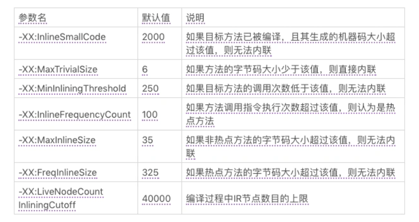

# 方法内联

## 前言

方法内联是在编译过程中遇到方法调用时，将目标方法的方法体纳入编译范围之中，并取代原方法调用的优化手段。它不仅可以消除方法调用成本，还可以进一步触发更多的优化，为其他优化手段建立良好的基础。

以 getter/setter 为例，如果没有方法内联，在调用 getter/setter 时，程序需要保存当前方法的执行位置，创建并压入用于 getter/setter 的栈帧、访问字段、弹出栈帧，最后再恢复当前方法的执行。而当内联了对 getter/setter 的方法调用后，上述操作仅剩字段访问。

## 方法内联的条件

方法内联能够触发更多的优化。通常而言，内联越多，生成代码的执行效率越高。然而，对于即时编译器来说，内联越多，编译时间也就越长，而程序达到峰值性能的时刻也将被推迟。

此外，内联越多也将导致生成的机器码越长。在 JVM 里，编译生成的机器码会被部署到 Code Cache（对应 JVM参数 `-XX:ReservedCodeCacheSize` ） 中。当编译生成的机器码越长，越容易填满 Code Cache，从而出现“即时编译已被关闭的警告信息（Code Cache is full. Compiler has been disabled）”。

因此，即时编译器不会无限制地进行方法内联。下面列举即时编译器的部分内联规则：

#### 强制内联和强制不内联

- 由 `-XX:CompileCommand` 中的 inline 指令指定的方法，以及由 `@ForceInline` 注解的方法（仅限于 JDK 内部方法），会被强制内联。
- 由 `-XX:CompileCommand` 中的 dontinline 指令或 exclude 指令（表示不编译）指定的方法，以及由 `@DontInline` 注解的方法（仅限于 JDK 内部方法），则始终不会被内联。

#### 其他内联条件

首先，如果调用字节码对应的符号引用未被解析、目标方法所在的类未被初始化，或者目标方法是 native 方法，都将导致方法调用无法内联。

其次，C2 不支持内联超过 9 层的调用（对应 JVM 参数 `-XX:MaxInlineLevel` ），以及 1 层的直接递归调用（对应 JVM 参数 `-XX:MaxRecursiveInlineLevel` ）。

> 如果方法 a 调用了方法 b，而方法 b 调用了方法 c，那么我们称 b 为 a 的 1 层调用，而 c 为 a 的 2 层调用。

最后，即时编译器将根据方法调用指令所在的程序路径的热度，目标方法的调用次数及大小（热点方法）来决定方法调用能否被内联。

下图为 C2 相关的虚拟机参数，在即时编译器中的内联算法更青睐于小方法。

