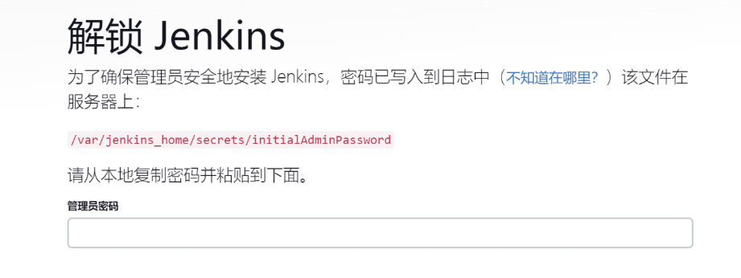
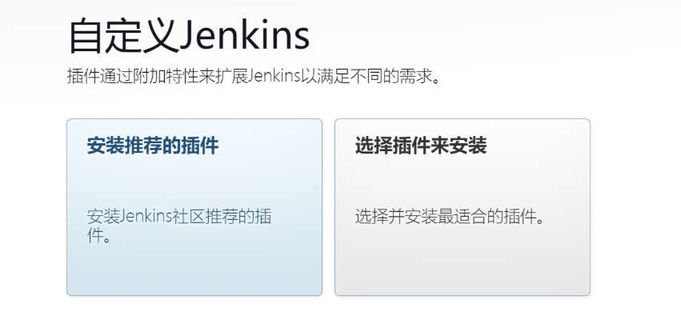
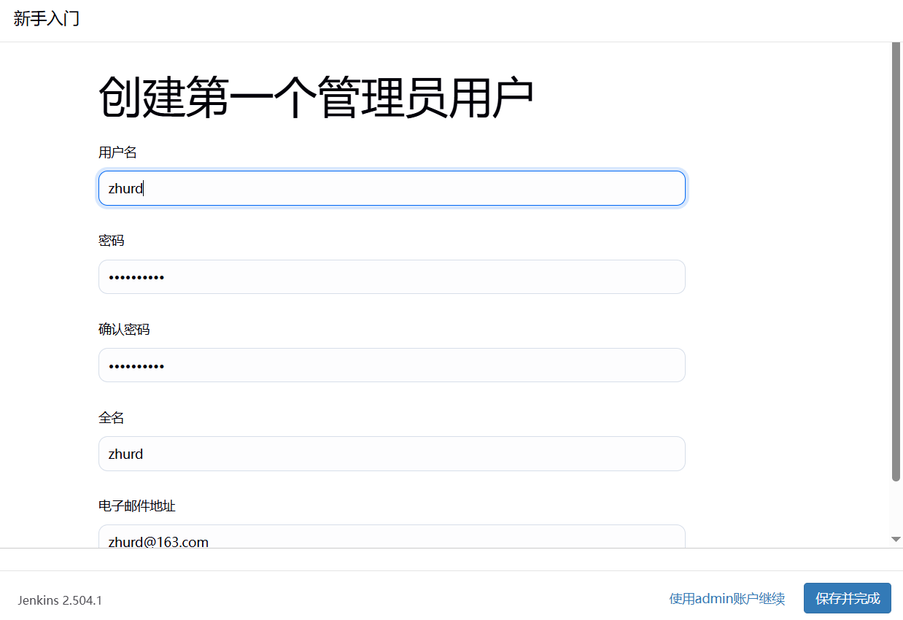
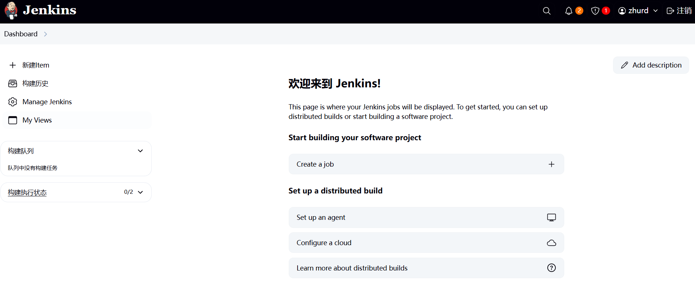
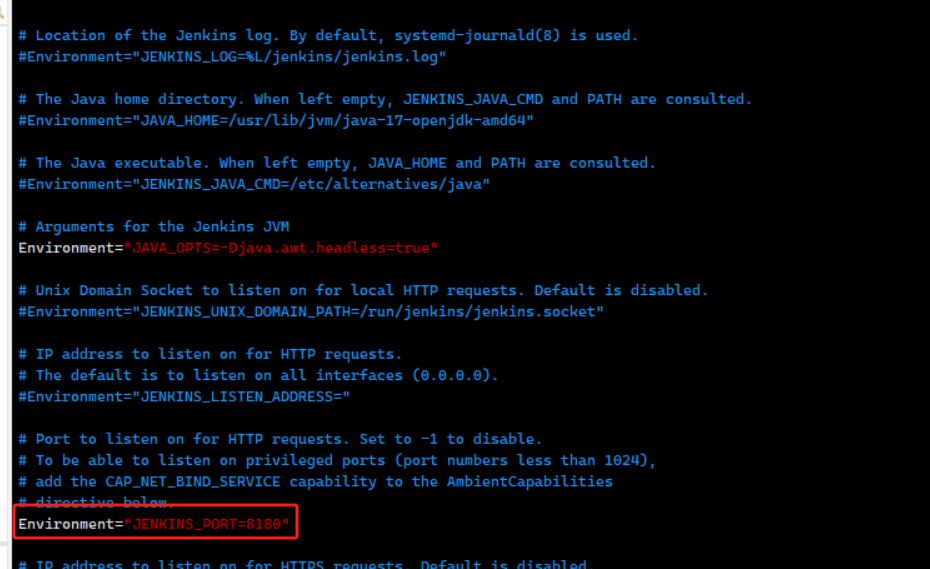
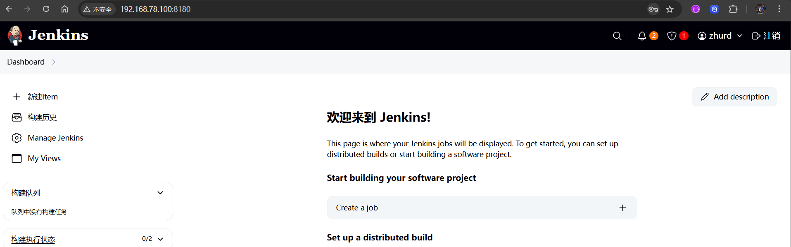

# Jenkins 安装与配置

## 下载安装 JDK17

```shell
# 下载
wget https://download.oracle.com/java/17/latest/jdk-17_linux-x64_bin.rpm
# 安装 
sudo yum -y install ./jdk-17_linux-x64_bin.rpm

# 验证
[root@centos7 ~]# java -version
openjdk version "17.0.11" 2024-04-16
OpenJDK Runtime Environment Temurin-17.0.11+9 (build 17.0.11+9)
OpenJDK 64-Bit Server VM Temurin-17.0.11+9 (build 17.0.11+9, mixed mode, sharing)
```

## 下载安装 Jenkins

### 添加 Jenkins 仓库

```shell
sudo wget -O /etc/yum.repos.d/jenkins.repo https://pkg.jenkins.io/redhat-stable/jenkins.repo

# 导入 GPG 密钥
sudo rpm --import https://pkg.jenkins.io/redhat-stable/jenkins.io-2023.key
```

### 安装 jenkins

```shell
sudo yum install -y jenkins
```

### 配置 Jenkins 使用 JDK 17

```shell
sudo vi /etc/init.d/jenkins
# 在文件中添加以下内容（路径根据实际安装调整）：
JAVA_HOME=/usr/lib/jvm/java-17-openjdk-17.0.11.0.9-1.el7_9.x86_64
PATH=$JAVA_HOME/bin:$PATH
```

### 重载配置并启动服务

```shell
# 启动Jenkins服务
sudo systemctl daemon-reload
sudo systemctl start jenkins
sudo systemctl enable jenkins
# 查看启动状态
sudo systemctl status jenkins
```

### 开放防火墙端口

```shell
sudo firewall-cmd --permanent --add-port=8080/tcp
sudo firewall-cmd --reload
```

### 获取初始管理员密码

```shell
cat /var/lib/jenkins/secrets/initialAdminPassword
```

## 配置 Jenkins

浏览器打开 `http://192.168.78.100:8080`（本机地址） 输入上面的管理员密码 `/var/lib/jenkins/secrets/initialAdminPassword`，安装插件






**创建一个管理账户（`zhurd/zhurd91222`）**



**保存并完成**




## 修改默认端口

```shell
# 修改端口
vim /usr/lib/systemd/system/jenkins.service
# 重新加载配置
sudo systemctl daemon-reload
# 重启服务
sudo systemctl restart jenkins
```







