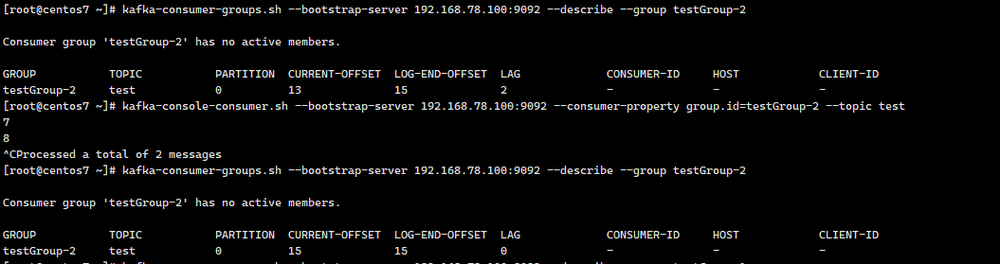
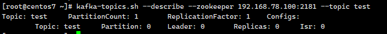

# Kafka 基本使用

## 安装

### 环境准备

由于 Kafka 是用 Scala 语言开发的，运行在 JVM 上，因此在安装 Kafka 之前需要先安装 JDK。

```
yum install java-1.8.0-openjdk* -y
```

kafka 依赖 zookeeper，所以需要先安装 zookeeper。

```shell
wget https://archive.apache.org/dist/zookeeper/zookeeper-3.5.8/apache-zookeeper-3.5.8-bin.tar.gz
tar -zxvf apache-zookeeper-3.5.8-bin.tar.gz
cd apache-zookeeper-3.5.8-bin
cp conf/zoo_sample.cfg conf/zoo.cfg

# 启动zookeeper
./bin/zkServer.sh start
# 连接zkCli客户端
./bin/zkCli.sh 
#查看zk的根目录相关节点
ls /			
```

### 下载安装包

```shell
wget https://archive.apache.org/dist/kafka/2.6.0/kafka_2.13-2.6.0.tgz  # 2.13是scala的版本，2.6.0是kafka的版本
tar -xzf kafka_2.13-2.6.0.tgz
cd kafka_2.13-2.6.0
```

### 修改配置

**修改配置文件 config/server.properties:**

```shell
#broker.id属性在kafka集群中必须要是唯一
broker.id=0
#kafka部署的机器ip和提供服务的端口号
listeners=PLAINTEXT://192.168.78.100:9092
#kafka的消息存储文件
log.dir=/usr/local/kafka/kafka_2.13-2.6.0/kafka-logs
#kafka连接zookeeper的地址
zookeeper.connect=192.168.78.100:2181
```

**server.properties 核心配置详解：**

| **Property**               | **Default**                     | **Description**                                              |
| -------------------------- | ------------------------------- | ------------------------------------------------------------ |
| broker.id                  | 0                               | 每个 broker 都可以用一个唯一的非负整数 id 进行标识；这个 id 作为 broker 的“名字“，可以选择任意数字作为 id，只要 id 是唯一的即可。 |
| log.dirs                   | /tmp/kafka-logs                 | kafka 存放数据的路径。这个路径并不是唯一的，可以是多个，路径之间只需要使用逗号分隔即可；每当创建新 partition 时，都会选择在包含最少 partitions 的路径下进行。 |
| listeners                  | PLAINTEXT://192.168.78.100:9092 | server 接受客户端连接的端口，ip 配置 kafka 本机 ip 即可            |
| zookeeper.connect          | localhost: 2181                  | zooKeeper 连接字符串的格式为：hostname: port，此处 hostname 和 port 分别是 ZooKeeper 集群中某个节点的 host 和 port；zookeeper 如果是集群，连接方式为 hostname1: port1, hostname2: port2, hostname3: port3 |
| log.retention.hours        | 168                             | 每个日志文件删除之前保存的时间。默认数据保存时间对所有 topic 都一样。 |
| num.partitions             | 1                               | 创建 topic 的默认分区数                                        |
| default.replication.factor | 1                               | 自动创建 topic 的默认副本数量，建议设置为大于等于 2             |
| min.insync.replicas        | 1                               | 当 producer 设置 acks 为-1 时，min.insync.replicas 指定 replicas 的最小数目（必须确认每一个 repica 的写数据都是成功的），如果这个数目没有达到，producer 发送消息会产生异常 |
| delete.topic.enable        | false                           | 是否允许删除主题                                             |

### 启动服务

启动脚本语法：`kafka-server-start.sh [-daemon] server.properties`

server.properties 的配置路径是一个强制的参数，-daemon 表示以后台进程运行，否则 ssh 客户端退出后，就会停止服务。(注意，在启动 kafka 时会使用 linux 主机名关联的 ip 地址，所以需要把主机名和 linux 的 ip 映射配置到本地 host 里，用 vim /etc/hosts)

```
./bin/kafka-server-start.sh -daemon ./config/server.properties   #后台启动，不会打印日志到控制台
# 或者
./bin/kafka-server-start.sh config/server.properties &
```

## 创建主题

创建一个名字为“test”的 Topic，这个 topic 只有一个 partition，并且备份因子也设置为 1。

```shell
./bin/kafka-topics.sh --create --zookeeper 192.168.78.100:2181 --replication-factor 1 --partitions 1 --topic test
```


**查看 kafka 中目前存在的 topic**

```shell
./bin/kafka-topics.sh --list --zookeeper 192.168.78.100:2181
```


除了我们通过手工的方式创建 Topic，当 producer 发布一个消息到某个指定的 Topic，这个 **Topic 如果不存在，就自动创建**。

### 创建多个分区的主题

```shell
./bin/kafka-topics.sh --create --zookeeper 192.168.78.100:2181 --replication-factor 1 --partitions 2 --topic test1
```


## 删除主题

```shell
./bin/kafka-topics.sh --delete --topic test --zookeeper 192.168.78.100:2181
```


## 发送消息

```shell
./bin/kafka-console-producer.sh --broker-list 192.168.78.100:9092 --topic test
```

## 消费消息

**kafka 默认消费最新的消息**

```shell
./bin/kafka-console-consumer.sh --bootstrap-server 192.168.78.100:9092 --topic test   
```

如果想要消费之前的消息可以通过 **`--from-beginning`** 参数指定，如下命令：

```shell
./bin/kafka-console-consumer.sh --bootstrap-server 192.168.78.100:9092 --from-beginning --topic test
```

### 消费多主题

```shell
./bin/kafka-console-consumer.sh --bootstrap-server 192.168.78.100:9092 --whitelist "test|test-1"
```

### 单播消费

一条消息只能被某一个消费者消费的模式，类似 queue 模式，只需让所有消费者在同一个消费组里即可。

例如：分别在两个客户端执行如下消费命令，然后往主题里发送消息，结果只有一个客户端能收到消息

```shell
./bin/kafka-console-consumer.sh --bootstrap-server 192.168.78.100:9092  --consumer-property group.id=testGroup-1 --topic test
```

### 多播消费

一条消息能被多个消费者消费的模式，类似 publish-subscribe 模式费，针对 Kafka **同一条消息只能被同一个消费组下的某一个消费者消费** 的特性，要实现多播只要保证这些消费者属于不同的消费组即可。

例如：再增加一个消费者，该消费者属于 testGroup-1 消费组，结果两个客户端都能收到消息

```shell
./bin/kafka-console-consumer.sh --bootstrap-server 192.168.78.100:9092 --consumer-property group.id=testGroup-2 --topic test
```

### 查看消费组名

```shell
./bin/kafka-consumer-groups.sh --bootstrap-server 192.168.78.100:9092 --list
```

### 查看消费组的消费偏移量

```shell
./bin/kafka-consumer-groups.sh --bootstrap-server 192.168.78.100:9092 --describe --group testGroup
```



- **current-offset：** 当前消费组的已消费偏移量
- **log-end-offset：** 主题对应分区消息的结束偏移量(HW)
- **lag：** 当前消费组未消费的消息数

## 查看 topic 的情况                

```shell
 ./bin/kafka-topics.sh --describe --zookeeper 192.168.78.100:2181 --topic test
```



- leader：负责给定 partition 的所有读写请求
- replicas：表示某个 partition 在哪几个 broker 上存在备份。不管这个节点是不是 leader，甚至这个节点挂了，也会列出
- isr：replicas 的一个子集，它只列出当前还存活着的，并且 **已同步备份** 了该 partition 的节点
