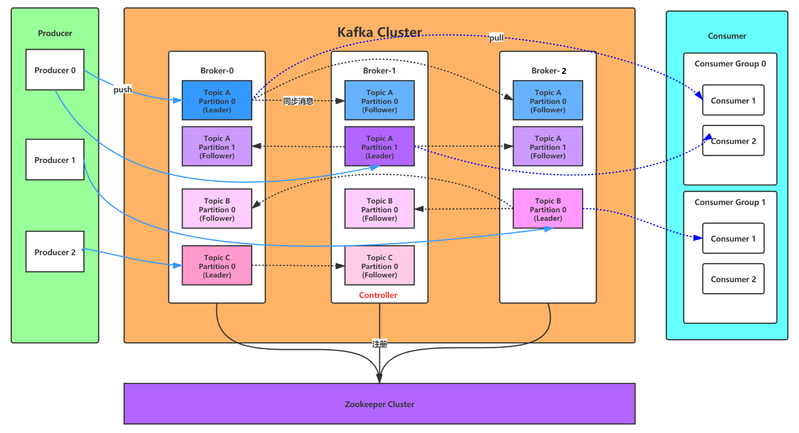
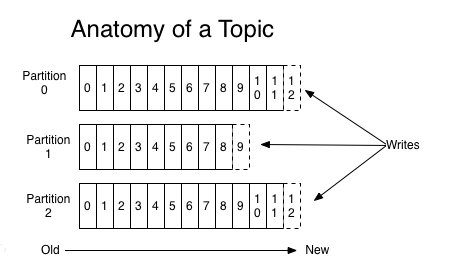

# Kafka 基本原理

## 概述

Kafka 最初由 Linkedin 公司开发，使用 scala 语言编写，是一个分布式、支持分区的（partition）、多副本的（replica），基于 zookeeper 协调的分布式消息系统。

kafka 的最大特性是可以实时的处理大量数据以满足各种需求场景：比如基于 hadoop 的批处理系统、低延迟的实时系统、Storm/Spark 流式处理引擎，web/nginx 日志、访问日志，消息服务等等。

## 基本概念

### Broker

消息中间件处理节点，一个 Kafka 节点就是一个 broker，一个或者多个 Broker 可以组成一个 Kafka 集群。

### Topic

Kafka 根据 topic 对消息进行归类，发布到 Kafka 集群的每条消息都需要指定一个 topic。

### Producer

消息生产者，向 Broker 发送消息的客户端。

### Consumer

消息消费者，从 Broker 读取消息的客户端。

### ConsumerGroup

每个 Consumer 属于一个特定的 Consumer Group，一条消息可以被多个不同的 Consumer Group 消费，但是一个 Consumer Group 中只能有一个 Consumer 能够消费该消息。

**从一个较高的层面上来看，producer 通过网络（TCP 协议）发送消息到 Kafka 集群，然后 consumer 来进行消费，如下图：**

## Topic 和消息日志 Log

**可以理解 Topic 是一个类别的名称，同类消息发送到同一个 Topic 下面。对于每一个 Topic，下面可以有多个分区(Partition)日志文件:**

Partition 是一个 **有序的 message 序列**，这些 message 按顺序添加到一个叫做 **commit log 的文件** 中。每个 partition 中的消息都有一个唯一的编号，称之为 `offset`，用来唯一标示某个分区中的 message。 

**每个 partition，都对应一个 commit log 文件**。一个 partition 中的 message 的 offset 都是唯一的，但是不同的 partition 中的 message 的 offset 可能是相同的。

kafka 一般不会删除消息，不管这些消息有没有被消费。只会根据配置的日志保留时间(log.retention.hours)确认消息多久被删除，默认保留最近一周的日志消息。kafka 的性能与保留的消息数据量大小没有关系，因此保存大量的数据消息日志信息不会有什么影响。

**每个 consumer 是基于自己在 commit log 中的消费进度(offset)来进行工作的**。在 kafka 中，**消费 offset 由 consumer 自己来维护**。一般情况下按照顺序逐条消费 commit log 中的消息，也可以通过指定 offset 来重复消费某些消息，或者跳过某些消息。

这意味 kafka 中的 consumer 对集群的影响是非常小的，添加一个或者减少一个 consumer，对于集群或者其他 consumer 来说，都是没有影响的，因为每个 consumer 维护各自的消费 offset。

**`可以这么来理解Topic，Partition和Broker`**

一个 topic，代表逻辑上的一个业务数据集，比如按数据库里不同表的数据操作消息区分放入不同 topic，订单相关操作消息放入订单 topic，用户相关操作消息放入用户 topic，对于大型网站来说，后端数据都是海量的，订单消息很可能是非常巨量的，比如有几百个 G 甚至达到 TB 级别，如果把这么多数据都放在一台机器上肯定会有容量限制问题，那么就可以在 topic 内部划分多个 partition 来分片存储数据，不同的 partition 可以位于不同的机器上，每台机器上都运行一个 Kafka 的进程 Broker。

**`为什么要对Topic下数据进行分区存储？`**

1. commit log 文件会受到所在机器的文件系统大小的限制，分区之后可以将不同的分区放在不同的机器上，相当于对数据做了 **分布式存储**，理论上一个 topic 可以处理任意数量的数据。
2. 为了 **提高并行度**。

