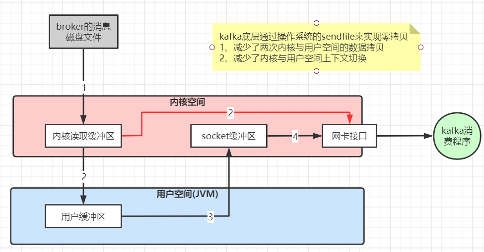

# Kafka 生产问题总结

## 消息丢失

### 消息发送端

1. **acks = 0：** 表示 producer 不需要等待任何 broker 确认收到消息的回复，就可以继续发送下一条消息。性能最高，但是最容易丢消息。大数据统计报表场景，对性能要求很高，对数据丢失不敏感的情况可以用这种。
2. **acks = 1：** 至少要等待 leader 已经成功将数据写入本地 log，但是不需要等待所有 follower 是否成功写入。就可以继续发送下一条消息。这种情况下，如果 follower 没有成功备份数据，而此时 leader 又挂掉，则消息会丢失。
3. acks =-1 或 all： 这意味着 leader 需要等待所有备份(`min.insync.replicas` 配置的备份个数，至少 >= 2)都成功写入日志，这种策略会保证只要有一个备份存活就不会丢失数据。这是最强的数据保证。一般金融级别场景才会使用这种配置。当然如果 `min.insync.replicas` 配置的是 1 则也可能丢消息，跟 acks = 1 情况类似。

### 消息消费端

如果消费这边配置的是自动提交，万一消费到数据还没处理完，就自动提交 offset 了，但是此时 consumer 直接宕机了，未处理完的数据丢失了，下次也消费不到了。

## 消息消费重复

### 消息发送端

发送消息如果配置了重试机制，比如网络抖动时间过长导致发送端发送超时，实际 broker 可能已经接收到消息，但发送方会重新发送消息。

### 消息消费端

如果消费这边配置的是自动提交，刚拉取了一批数据处理了一部分，但还没来得及提交，服务挂了，下次重启又会拉取相同的一批数据重复处理。

一般消费端都是要做 **消费幂等** 处理的。

## 消息乱序

如果发送端配置了重试机制，Kafka 不会等之前那条消息完全发送成功才去发送下一条消息，这样可能会出现，发送了 1，2，3 条消息，第一条超时了，后面两条发送成功，再重试发送第 1 条消息，这时消息在 broker 端的顺序就是 2，3，1 了。所以，是否一定要配置重试要根据业务情况而定，也可以用同步发送的模式去发消息，当然 acks 不能设置为 0，这样也能保证消息发送的有序。

Kafka 保证全链路消息顺序消费，需要从发送端开始，**将所有有序消息发送到同一个分区，然后用一个消费者去消费**，但是这种性能比较低，可以在消费者端接收到消息后将需要保证顺序消费的几条消费发到内存队列(可以搞多个)，一个内存队列开启一个线程顺序处理消息。

## 消息积压

1、线上有时因为发送方发送消息速度过快，或者消费方处理消息过慢，可能会导致 broker 积压大量未消费消息。

此种情况如果积压了大量未消费消息需要紧急处理，可以修改消费端程序，让其将收到的消息快速转发到其他 topic(可以设置很多分区)，然后再启动多个消费者同时消费新主题的不同分区。

2、由于消息数据格式变动或消费者程序有 bug，导致消费者一直消费不成功，也可能导致 broker 积压大量未消费消息。

此种情况可以将这些消费不成功的消息转发到其它队列里去(类似 **死信队列**)，后面再慢慢分析死信队列里的消息处理问题。

## 延时队列

延时队列存储的对象是延时消息。所谓的 **延时消息** 是指消息被发送以后，并不想让消费者立刻获取，而是等待特定的时间后，消费者才能获取这个消息进行消费，延时队列的使用场景有很多， 比如 ：

1. 在订单系统中， 一个用户下单之后通常有 30 分钟的时间进行支付，如果 30 分钟之内没有支付成功，那么这个订单将进行异常处理，这时就可以使用延时队列来处理这些订单。
2. 订单完成 1 小时后通知用户进行评价。

**实现思路：** 发送延时消息时先把消息按照不同的延迟时间段发送到指定的队列中（topic_1s，topic_5s，topic_10s，...topic_2h，这个一般不能支持任意时间段的延时），然后通过定时器进行轮训消费这些 topic，查看消息是否到期，如果到期就把这个消息发送到具体业务处理的 topic 中，队列中消息越靠前的到期时间越早，具体来说就是定时器在一次消费过程中，对消息的发送时间做判断，看下是否延迟到对应时间了，如果到了就转发，如果还没到这一次定时任务就可以提前结束了。

## 消息回溯

如果某段时间对已消费消息计算的结果觉得有问题，可能是由于程序 bug 导致的计算错误，当程序 bug 修复后，这时可能需要对之前已消费的消息重新消费，可以指定从多久之前的消息回溯消费，这种可以用 consumer 的 `offsetsForTimes、seek` 等方法指定从某个 offset 偏移的消息开始消费。

## 消息传递保证

- at most once(消费者最多收到一次消息，0--1 次)：acks = 0 可以实现。
- at least once(消费者至少收到一次消息，1--多次)：ack = all 可以实现。
- exactly once(消费者刚好收到一次消息)：at least once 加上“消费者幂等性”可以实现，还可以用 **Kafka 生产者的幂等性** 来实现。

### Kafka 生产者的幂等性

因为发送端重试导致的消息重复发送问题，Kafka 的幂等性可以保证重复发送的消息只接收一次，只需在生产者加上参数 `props.put("enable.idempotence", true)` 即可，默认是 false 不开启。	

**实现原理：** Kafka 每次发送消息会生成 PID 和 Sequence Number，并将这两个属性一起发送给 broker，broker 会将 PID 和 Sequence Number 跟消息绑定一起存起来，下次如果生产者重发相同消息，broker 会检查 PID 和 Sequence Number，如果相同不会再接收。

```yaml
PID：每个新的 Producer 在初始化的时候会被分配一个唯一的 PID，这 个PID 对用户完全是透明的，生产者如果重启则会生成新的PID。
Sequence Number：对于每个 PID，该 Producer 发送到每个 Partition 的数据都有对应的序列号，这些序列号是从0开始单调递增的。
```

## Kafka 事务

Kafka 的事务不同于 Rocket MQ，Rocket MQ 是保障本地事务(比如数据库)与 MQ 消息发送的事务一致性，Kafka 的事务主要是保障一次发送多条消息的事务一致性(要么同时成功要么同时失败)。

一般在 Kafka 的流式计算场景用得多一点，比如，Kafka 需要对一个 topic 里的消息做不同的流式计算处理，处理完分别发到不同的 topic 里，这些 topic 分别被不同的下游系统消费(比如 redis，es 等)，这种我们希望系统发送到多个 topic 的数据保持事务一致性。

## Kafka 高性能原因

- 磁盘顺序读写：Kafka 消息不能修改以及不会从文件中间删除保证了磁盘顺序读，Kafka 的消息写入文件都是追加在文件末尾，不会写入文件中的某个位置(随机写)保证了磁盘顺序写。
- 数据传输的零拷贝
- 读写数据的批量 batch 处理以及压缩传输

**数据传输零拷贝原理：**




