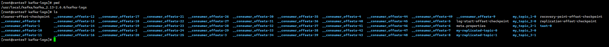
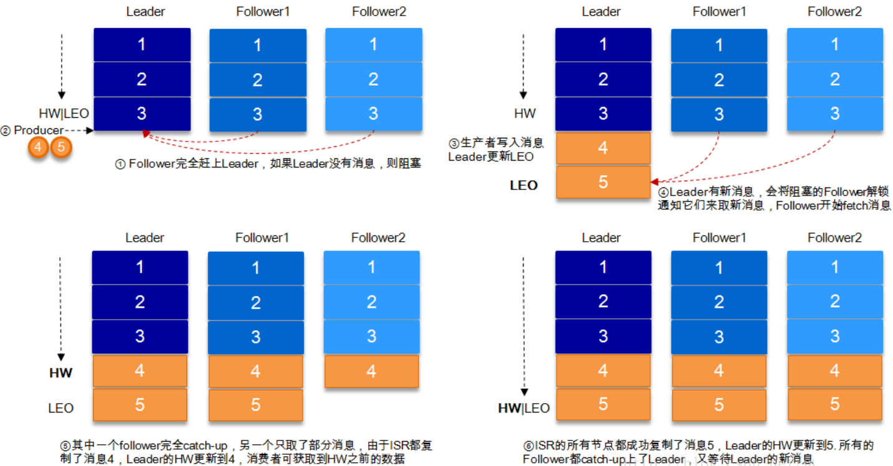

# Kafka 设计原理

## Kafka 核心总控制器

在 Kafka 集群中会有一个或者多个 broker，其中有一个 broker 会被选举为控制器（Kafka Controller），它负责管理整个集群中所有分区和副本的状态。

- 当某个分区的 leader 副本出现故障时，由控制器负责为该分区选举新的 leader 副本。
- 当检测到某个分区的 ISR 集合发生变化时，由控制器负责通知所有 broker 更新其元数据信息。
- 当使用 kafka-topics.sh 脚本为某个 topic 增加分区数量时，同样还是由控制器负责让新分区被其他节点感知到。

### Controller 选举机制

在 kafka 集群启动的时候，会自动选举一台 broker 作为 controller 来管理整个集群，选举的过程是集群中每个 broker 都会尝试在 zookeeper 上创建一个 **/controller 临时节点**，zookeeper 会保证有且仅有一个 broker 能创建成功，这个 broker 就会成为集群的总控器 controller。

当这个 controller 角色的 broker 宕机了，此时 zookeeper 临时节点会消失，集群里其他 broker 会一直监听这个临时节点，发现临时节点消失了，就竞争再次创建临时节点，就是上面说的选举机制，zookeeper 又会保证有一个 broker 成为新的 controller。

具备控制器身份的 broker 需要比其他普通的 broker 多一份职责，具体细节如下：

1. **监听 broker 相关的变化**。为 Zookeeper 中的/brokers/ids/节点添加 BrokerChangeListener，用来处理 broker 增减的变化。
2. **监听 topic 相关的变化**。为 Zookeeper 中的/brokers/topics 节点添加 TopicChangeListener，用来处理 topic 增减的变化；为 Zookeeper 中的/admin/delete_topics 节点添加 TopicDeletionListener，用来处理删除 topic 的动作。
3. 从 Zookeeper 中读取获取当前所有与 topic、partition 以及 broker 有关的信息并进行相应的管理。对于所有 topic 所对应的 Zookeeper 中的/brokers/topics/[topic] 节点添加 PartitionModificationsListener，用来监听 topic 中的分区分配变化。
4. 更新集群的元数据信息，同步到其他普通的 broker 节点中。

### Partition 副本选举 Leader 机制

controller 感知到分区 leader 所在的 broker 挂了(controller 监听了很多 zk 节点可以感知到 broker 存活)，controller 会从 ISR 列表(参数 unclean.leader.election.enable = false 的前提下)里挑第一个 broker 作为 leader(第一个 broker 最先放进 ISR 列表，可能是同步数据最多的副本)，如果参数 unclean.leader.election.enable 为 true，代表在 ISR 列表里所有副本都挂了的时候可以在 ISR 列表以外的副本中选 leader，这种设置，可以提高可用性，但是选出的新 leader 有可能数据少很多。

**副本进入 ISR 列表有两个条件：**

1. 副本节点不能产生网络分区，必须能与 zookeeper 保持会话以及跟 leader 副本网络连通
2. 副本能复制 leader 上的所有写操作，并且不能落后太多。(与 leader 副本同步滞后的副本，是由 replica.lag.time.max.ms 配置决定的，超过这个时间都没有跟 leader 同步过的一次的副本会被移出 ISR 列表)

## 消费者消费消息的 offset 记录机制

每个 consumer 会定期将自己消费分区的 offset 提交给 kafka 内部 topic：**__consumer_offsets**，提交过去的时候，**key 是 consumerGroupId+topic+分区号，value 就是当前 offset 的值**，kafka 会定期清理 topic 里的消息，最后就保留最新的那条数据。

因为__consumer_offsets 可能会接收高并发的请求，kafka 默认给其 ** 分配 50 个分区 **(可以通过 offsets.topic.num.partitions 设置)，这样可以通过加机器的方式增加并发。



通过如下公式可以选出 consumer 消费的 offset 要提交到__consumer_offsets 的哪个分区

```yaml
hash(consumerGroupId)  %  __consumer_offsets主题的分区数
```

## 消费者 Rebalance 机制

**rebalance** 就是如果消费组里的消费者数量有变化或消费的分区数有变化，kafka 会重新分配消费者消费分区的关系。

**`注意：`** rebalance 只针对 subscribe 这种不指定分区消费的情况，如果通过 assign 这种消费方式指定了分区，kafka 不会进行 rebanlance。

**如下情况可能会触发消费者 rebalance:**

1. 消费组里的 consumer 增加或减少了
2. 动态给 topic 增加了分区
3. 消费组订阅了更多的 topic

rebalance 过程中，消费者无法从 kafka 消费消息，这对 kafka 的 TPS 会有影响，如果 kafka 集群内节点较多，那重平衡可能会耗时极多，所以应尽量避免在系统高峰期的重平衡发生。

### Rebalance 分区分配策略

Kafka 提供了消费者客户端参数 `partition.assignment.strategy` 来设置消费者与订阅主题之间的分区分配策略。主要有三种策略：range、round-robin、sticky。**默认情况为 range 分配策略**。

假设一个主题有 10 个分区(0-9)，现在有三个 consumer 消费：

#### range 策略

按照分区序号排序，假设 n＝ 分区数 ／ 消费者数量 = 3， m＝ 分区数%消费者数量 = 1，那么前 m 个消费者每个分配 n+1 个分区，后面的（消费者数量 －m ）个消费者每个分配 n 个分区。

比如分区 0~3 给一个 consumer，分区 4~6 给一个 consumer，分区 7~9 给一个 consumer。

#### round-robin 策略

**轮询分配**，比如分区 0、3、6、9 给一个 consumer，分区 1、4、7 给一个 consumer，分区 2、5、8 给一个 consumer

#### sticky 策略

初始时分配策略与 round-robin 类似，但是在 rebalance 的时候，需要保证如下两个原则：

1. 分区的分配要尽可能均匀 
2. 分区的分配尽可能与上次分配的保持相同

当两者发生冲突时，第一个目标优先于第二个目标，这样可以最大程度维持原来的分区分配的策略。

比如对于第一种 range 情况的分配，如果第三个 consumer 挂了，那么重新用 sticky 策略分配的结果如下：

- consumer1 除了原有的 0~3，会再分配一个 7；
- consumer2 除了原有的 4~6，会再分配 8 和 9

**sticky 策略只会重新分配第三个 consumer 的 7~9 分区，而 range 策略会从 0 开始，重新分配所有分区。**

## HW 与 LEO

HW（HighWatermark）俗称高水位，取一个 partition 对应的 **ISR 中最小的 LEO(log-end-offset)作为 HW**，consumer 最多只能消费到 HW 所在的位置。

每个 replica 都有 HW, leader 和 follower 各自负责更新自己的 HW 的状态。对于 leader 新写入的消息，consumer 不能立刻消费，leader 会等待该消息被 **所有 ISR 中的 replicas 同步后更新 HW，此时消息才能被 consumer 消费**。这样就保证了如果 leader 所在的 broker 失效，该消息仍然可以从新选举的 leader 中获取。对于来自内部 broker 的读取请求，没有 HW 的限制。

下图说明了当 producer 生产消息至 broker 后，ISR 以及 HW 和 LEO 的流转过程：




由此可见，Kafka 的复制机制既不是完全的同步复制，也不是单纯的异步复制。同步复制要求所有能工作的 follower 都复制完，这条消息才会被 commit，这种复制方式极大的影响了吞吐率。而异步复制方式下，follower 异步的从 leader 复制数据，数据只要被 leader 写入 log 就被认为已经 commit，这种情况下如果 follower 都还没有复制完，落后于 leader 时，突然 leader 宕机，则会丢失数据。而 Kafka 的这种使用 ISR 的方式则很好的均衡了确保数据不丢失以及吞吐率。

**结合 HW 和 LEO 来看下 acks = 1 的情况**

.png)

## 日志分段存储

Kafka 一个分区的消息数据对应存储在一个文件夹下，以 topic 名称+分区号命名，消息在分区内是分段(segment)存储，每个段的消息都存储在不一样的 log 文件里，这种特性方便 old segment file 快速被删除，kafka 规定了一个段位的 log 文件最大为 1G，做这个限制目的是为了方便把 log 文件加载到内存去操作。

```yaml
# 部分消息的offset索引文件，kafka每次往分区发4K(可配置)消息就会记录一条当前消息的offset到index文件，
# 如果要定位消息的offset会先在这个文件里快速定位，再去log文件里找具体消息
00000000000000000000.index
# 消息存储文件，主要存offset和消息体
00000000000000000000.log
# 消息的发送时间索引文件，kafka每次往分区发4K(可配置)消息就会记录一条当前消息的发送时间戳与对应的offset到timeindex文件，
# 如果需要按照时间来定位消息的offset，会先在这个文件里查找
00000000000000000000.timeindex

00000000000005367851.index
00000000000005367851.log
00000000000005367851.timeindex

00000000000009936472.index
00000000000009936472.log
00000000000009936472.timeindex
```


这个 9936472 之类的数字，就是代表了这个日志段文件里包含的起始 Offset，也就说明这个分区里至少都写入了接近 1000 万条数据了。

Kafka Broker 有一个参数：`log.segment.bytes`，限定了每个日志段文件的大小，最大 1GB。

一个日志段文件满了，就自动开一个新的日志段文件来写入，避免单个文件过大，影响文件的读写性能，这个过程叫做 **log rolling**，正在被写入的那个日志段文件，叫做 **active log segment**。
