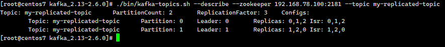
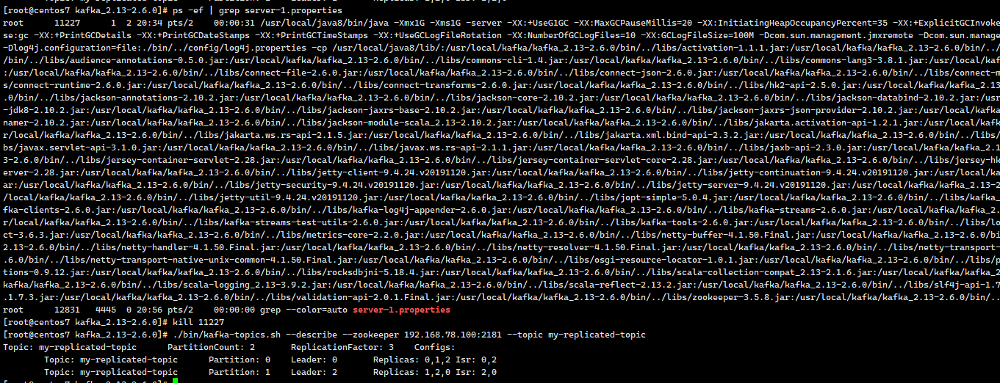
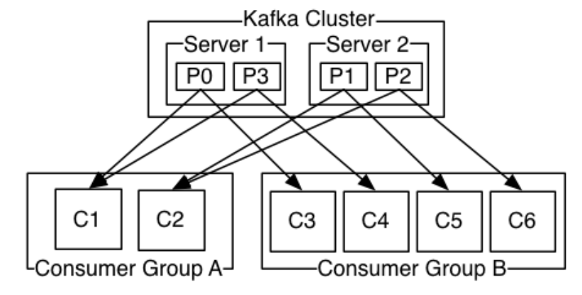

# kafka 集群实战

## 环境搭建

对于 kafka 来说，一个单独的 broker 意味着 kafka 集群中只有一个节点。要想增加 kafka 集群中的节点数量，只需要多启动几个 broker 实例即可。现在在一台机器上同时启动三个 broker 实例，模拟集群环境。

**首先，创建其他 2 个 broker 的配置文件：**

```shell
cp config/server.properties config/server-1.properties
cp config/server.properties config/server-2.properties
```

**配置文件的需要修改的内容分别如下：**

**config/server-1.properties:**

```properties
#broker.id属性在kafka集群中必须要是唯一
broker.id=1
#kafka部署的机器ip和提供服务的端口号
listeners=PLAINTEXT://192.168.78.100:9093
log.dir=/usr/local/data/kafka-logs-1
#kafka连接zookeeper的地址，要把多个kafka实例组成集群，对应连接的zookeeper必须相同
zookeeper.connect=192.168.78.100:2181
```

**config/server-2.properties:**

```properties
#broker.id属性在kafka集群中必须要是唯一
broker.id=2
#kafka部署的机器ip和提供服务的端口号
listeners=PLAINTEXT://192.168.78.100:9094
log.dir=/usr/local/data/kafka-logs-2
#kafka连接zookeeper的地址，要把多个kafka实例组成集群，对应连接的zookeeper必须相同
zookeeper.connect=192.168.78.100:2181
```

启动这 2 个 broker 实例

```shell
./bin/kafka-server-start.sh -daemon config/server-1.properties
./bin/kafka-server-start.sh -daemon config/server-2.properties
```

创建一个新的 topic，副本数设置为 3，分区数设置为 2：

```shell
./bin/kafka-topics.sh --create --zookeeper 192.168.78.100:2181 --replication-factor 3 --partitions 2 --topic my-replicated-topic
```

**查看 topic 的情况**

```shell
./bin/kafka-topics.sh --describe --zookeeper 192.168.78.100:2181 --topic my-replicated-topic
```



- leader：数值为某个 broker，负责给定 partition 的所有读写请求
- replicas：表示某个 partition 在哪几个 broker 上存在备份。不管这个节点是不是 leader，甚至这个节点挂了，也会列出
- isr：replicas 的一个子集，它只列出当前还存活着的，并且 **已同步备份** 了该 partition 的节点

**容错性测试**

因为 broker1 目前是 my-replicated-topic 的分区 1 的 leader，现在将其 kill        



分区 1 的 leader 变成了 broker 2，在 Isr 中，已经没有了 1 号节点，leader 的选举也是从 ISR(in-sync replica)中进行的。

## 集群消费

log 的 partitions 分布在 kafka 集群中不同的 broker 上，每个 broker 可以请求备份其他 broker 上 partition 上的数据。kafka 集群支持配置一个 partition 备份的数量。

针对每个 partition，都有一个 broker 起到 `leader` 的作用，0 个或多个其他的 broker 作为 `follwers` 的作用。**leader 处理所有的针对这个 partition 的读写请求，而 followers 被动复制 leader 的结果，不提供读写(主要是为了保证多副本数据与消费的一致性)**。如果这个 leader 失效了，其中的一个 follower 将会自动的变成新的 leader。

### Producers

生产者将消息发送到 topic 中去，同时负责选择将 message 发送到 topic 的哪一个 partition 中。通过 round-robin 做简单的负载均衡。也可以根据消息中的某一个关键字来进行区分。通常第二种方式使用的更多。

### Consumers

传统的消息传递模式有 2 种：队列( queue) 和（publish-subscribe）

- queue 模式：多个 consumer 从服务器中读取数据，消息只会到达一个 consumer
- publish-subscribe 模式：消息会被广播给所有的 consumer

Kafka 基于这 2 种模式提供了一种 consumer 的抽象概念：consumer group

- queue 模式：所有的 consumer 都位于同一个 consumer group 下
- publish-subscribe 模式：所有的 consumer 都有着自己唯一的 consumer group



上图说明：由 2 个 broker 组成的 kafka 集群，某个主题总共有 4 个 partition(P0-P3)，分别位于不同的 broker 上。这个集群由 2 个 Consumer Group 消费， A 有 2 个 consumer instances ，B 有 4 个。

通常一个 topic 会有几个 consumer group，每个 consumer group 都是一个逻辑上的订阅者（ logical subscriber ）。每个 consumer group 由多个 consumer instance 组成，从而达到可扩展和容灾的功能。

## 消费顺序

一个 partition 同一个时刻在一个 consumer group 中只能有一个 consumer instance 在消费，从而保证消费顺序。

**consumer group 中的 consumer instance 的数量不能比一个 Topic 中的 partition 的数量多，否则，多出来的 consumer 消费不到消息。**

Kafka 只在 partition 的范围内保证消息消费的局部顺序性，不能在同一个 topic 中的多个 partition 中保证总的消费顺序性。

如果有在总体上保证消费顺序的需求，可以通过将 topic 的 partition 数量设置为 1，将 consumer group 中的 consumer instance 数量也设置为 1，但是这样会影响性能，**所以 kafka 的顺序消费很少用**。
