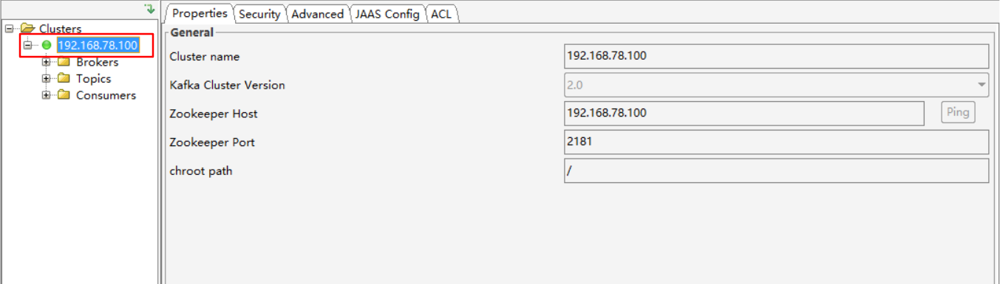

# 本机连不上虚拟机的 kafka 解决方案

## 前提

**`本机能够 ping 通虚拟机IP，但是无法连接虚拟机的Kafka`**

#### 1、查看防火墙状态

```shell
[root@centos7 ~]# systemctl status firewalld.service
● firewalld.service - firewalld - dynamic firewall daemon
   Loaded: loaded (/usr/lib/systemd/system/firewalld.service; disabled; vendor preset: enabled)
   Active: inactive (dead)
     Docs: man:firewalld(1)

11月 14 15:11:49 centos7 systemd[1]: Starting firewalld - dynamic firewall daemon...
11月 14 15:11:49 centos7 systemd[1]: Started firewalld - dynamic firewall daemon.
11月 14 18:36:24 centos7 systemd[1]: Stopping firewalld - dynamic firewall daemon...
11月 14 18:36:24 centos7 systemd[1]: Stopped firewalld - dynamic firewall daemon.
```

如果是 `dead` 状态，防火墙未开启，需要开启防火墙，否则开放端口会报 **FirewallD is not running** 错误。

```shell
# 开启防火墙
systemctl start firewalld
```

#### 2、开放端口

```shell
# zookeeper
firewall-cmd --zone=public --add-port=2181/tcp --permanent
# kafka 
firewall-cmd --zone=public --add-port=9092/tcp --permanent
```

#### 3、修改 kafka 配置 server.properties

```shell
# kafka 部署的机器 ip 和提供服务的端口号
listeners=PLAINTEXT://192.168.78.100:9092
# kafka 连接 zookeeper 的地址
zookeeper.connect=192.168.78.100:2181
```

#### 4、关闭防火墙

```shell
systemctl stop firewalld
```

#### 5、连接


