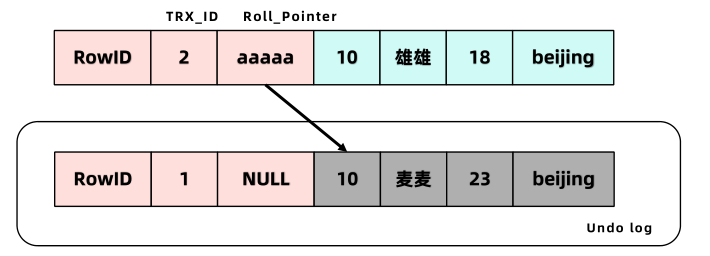
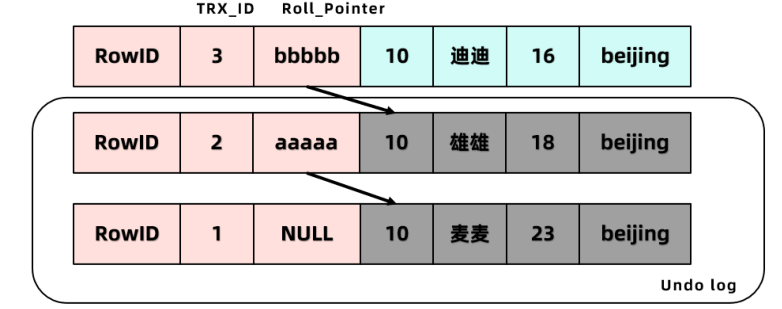
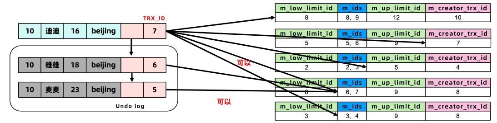
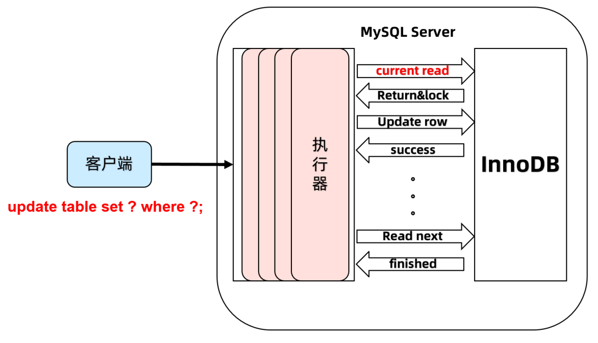

# MySQL 事务

## 事务基础

### 什么是事务

事务指的是逻辑上的一组操作，这组操作的组成单元 **要么全都成功，要么全都失败。**

事务本质上是个 **并发编程问题。**

事务由存储引擎实现，MySQL 中只有 InnoDB 支持事务。

### 事务四大特性 ACID

- **原子性（Atomicity）：** 事务最小工作单元，事务中的操作要么都发生，要么都不发生。
- **一致性（Consistency）：** 事务前后数据的完整性必须保持一致。
- **隔离性（Isolation）：** 多个用户并发访问数据库时，一个用户的事务不能被其它用户的事务所干扰，多个并发事务之间数据要相互隔离。隔离性由隔离级别保障。
- **持久性（Durability）：** 一个事务一旦被提交，它对数据库中数据的改变是永久性的。

### 事务并发问题

1. **脏读：** 一个事务读到了另一个事务 **未提交** 的数据
2. **不可重复读：** 一个事务读到另一个事务 **已经 Update** 的数据。引发事务中的多次查询结果不一致
3. **虚读/幻读：** 一个事务读到另一个事务 **已经 Insert** 的数据。导致事务中多次查询的结果不一致

### 隔离级别

- **读未提交 RU：** Read Uncommitted，一个事务读到另一个事务没有提交的数据。

  存在：3 个问题：脏读、不可重复读、幻读

- **读已提交 RC：** Read Committed，一个事务读到另一个事务已经提交的数据。

  存在：2 个问题：不可重复读、幻读

- **可重复读 RR：** Repeatable Read，在一个事务中读到的数据始终保持一致，无论另一个事务是否提交。

  存在：1 个问题：幻读

- **串行化读：** Serializable，同时只能执行一个事务，相当于事务中的单线程。所以没有任何问题。

**安全和性能对比：**

- 安全性： serializable > repeatable read > read committed > read uncommitted
- 性能 ： serializable < repeatable read < read committed < read uncommitted

**常见数据库的默认隔离级别：**

- MySQL： repeatable read
- Oracle： read committed

## 事务底层原理

### 如何解决丢失更新问题？

1. 基于锁的并发控制 LBCC（Lock Based Concurrency Control），简单粗暴，一个事务去读取一条数据的时候，就上锁，不允许其他事务来操作。
2. 基于版本并发控制 MVCC（Multi Version Concurrency Control），读不加锁，读写不冲突。

### MVCC 实现原理【InnoDB】

#### 什么是 MVCC

**MVCC 全称叫多版本并发控制，是 RDBMS（关系型数据库） 常用的一种并发控制方法，用来对数据库数据进行并发访问，实现事务。** 核心思想是 **读不加锁，读写不冲突**。在读多写少的 OLTP（联机事务处理） 应用中，读写不冲突非常重要，极大的增加了系统的并发性能，这也是为什么几乎所有的 RDBMS，都支持 MVCC 的原因。

**`MVCC 实现原理关键在于数据快照，不同的事务访问不同版本的数据快照，从而实现事务下对数据的隔离级别。`**

**MVCC 的实现依赖与 Undo 日志 与 Read View。**

#### Undo 日志 

在对数据修改时，InnoDB 会产生一定量的 Undo 日志, 如果事务执行失败或者用户用一条 Rollback 语句请求回滚，则利用 Undo 日志回滚到历史版本。

Undo 存放在数据库内部的一个特殊段（segment）中，这个段称为 Undo 段（undo segment）。Undo 段位于系统表空间内，也可以设置为 Undo 表空间。

**Undo 日志保存了记录修改前的快照。** 所以，对于更新和删除操作，InnoDB 并不是真正的删除原来的记录，而是设置记录的 delete mark 为 1。因此为了解决数据 Page 和 Undo 日志膨胀问题，则需要回收机制进行清理 Undo 日志。

##### Undo 日志分类

- Insert Undo 日志：是在 Insert 操作中产生的 Undo 日志
- Update Undo 日志：是 Update 或 Delete 操作中产生的 Undo 日志

##### Undo 日志如何产生及回收

```mysql
insert into user(id,name,age,address) values (10,'麦麦',23,'beijing')
```

**事务 01：** 初始状态，insert 操作记录只对本事务可见，对其他事务不可见，所以事务提交后直接删除 Undo 日志无需回收（**无需记录**）。


```mysql
update user set name='雄雄',age=18 where id=10;
```

**事务 02：** 第一次修改，Update 操作对已经存在行记录产生影响，为了实现 MVCC，修改提交事务后，不能立即删除 Update Undo 日志而是会将其存入 Undo 日志链表中，等待 Purge 线程回收。




```mysql
update user set name='迪迪',age=16 where id=10;
```

**事务 03：** 第二次修改



#### ReadView

**MVCC 的核心问题就是：判断一下版本链中的哪个版本是当前事务可见的。**

- 对于使用 `RU` 隔离级别的事务来说，直接读取记录的最新版本，不需要 Undo log。
- 对于使用 `串行化` 隔离级别的事务来说，使用加锁的方式来访问记录，不需要 Undo log。
- 对于使用 `RC 和 RR` 隔离级别的事务来说，需要用到 undo 日志的版本链。

##### 什么是 ReadView？

ReadView 是张存储事务 id 的列表，主要包含当前系统中有哪些活跃的读写事务 id，结合 Undo 日志的默认字段【trx_id】来控制那个版本的 Undo 日志可被其他事务看见。

**四列：**

- **m_ids：** 表示在生成 ReadView 时，当前系统中 **活跃的读写事务 id 列表**
- **m_low_limit_id：事务 id 下限**，表示当前系统中活跃的读写事务中最小的事务 id，m_ids 事务列表中的最小事务 id
- **m_up_limit_id：事务 id 上限**，表示生成 ReadView 时，系统中应该分配给下一个事务的 id 值
- m_creator_trx_id：表示生成该 ReadView 的事务的事务 id


##### 什么时候生成 ReadView？

- 开启事务之后，在第一次查询(select)时，生成 ReadView

- RC 和 RR 隔离级别的差异本质是因为 ReadView 的生成时机不同

  - RC：每次查询开始时都会生成一个独立的 ReadView，每次查询时都基于最新的数据生成 Read View，因此可能看到不同的数据版本

  - RU：只在第一次查询(select)时，生成 ReadView，之后复用同一个 Read View


##### 如何判断可见性？

开启事务执行第一次查询时，首先生成 ReadView，然后依据 Undo 日志和 ReadView 按照判断可见性。

**判断规则如下：**

1. TRX_ID **小于** m_low_limit_id，表明生成该版本的事务在生成 ReadView 前已经提交（历史数据），可以被当前事务访问。

2. TRX_ID **等于** m_create_trx_id，可以被当前事务访问

3. TRX_ID **大于** m_up_limit_id，在生成 ReadView 后才产生的数据，不可以被当前事务访问

4. TRX_ID **在 low 和 up 的 limit 之间**，则需要判断是否在 m_ids 里面

   - 如果在，说明创建 ReadView 时生成该版本的事务还是活跃的，不可以访问

   - 如果不在，说明创建 ReadView 时生成该版本的事务已经被提交，可以访问



循环判断 Undo log 中的版本链某一的版本是否对当前事务可见，**如果循环到最后一个版本也不可见的话，那么就意味着该条记录对该事务不可见**，查询结果就不包含该记录。

**MVCC 只在 RR 和 RC 两个隔离级别下工作。RU 和串行化隔离级别不需要 MVCC，为什么？**

- RU 总是读取最新的数据行，本身就没有隔离性，也不解决并发潜在问题，因此不需要。
- SERIALIZABLE 会对所有读取的行都加锁，相当于串行执行，线程之间绝对隔离，也不需要。

#### MVCC 下的读操作

在 MVCC 并发控制中，读操作可以分成两类 **：快照读 (Snapshot Read)与当前读 (Current Read)**

- **快照读：** 读取的是记录的可见版本 (有可能是历史版本)，不用加锁。
- **当前读：** 读取的是记录的最新版本，并且当前读返回的记录，都会加上锁，保证其他事务不会再并发修改这条记录。

**快照读** 也就是一致性非锁定读(Consistent Nonlocking Read)，是指 InnoDB 存储引擎通过多版本控制(MVCC)读取当前数据库中行数据的方式。如果读取的行正在执行 DELETE 或 UPDATE 操作，这时读取操作不会因此去等待行上锁的释放。相反地，InnoDB 会去读取行的一个最新可见快照。ReadView 的读取操作就是快照读。

```mysql
# 快照读：简单的select操作，属于快照读，不加锁。
select * from table where ?;

# 当前读：特殊的读操作，插入/更新/删除操作，属于当前读，需要加锁。
select * from table where ? lock in share mode; # 加读锁
select * from table where ? for update;# 加写锁
insert into table values (…);# 加写锁
update table set ? where ?;# 加写锁
delete from table where ?;# 加写锁
# 所有以上的语句，都属于当前读，读取记录的最新版本。并且，读取之后，还需要保证其他并发事务不能修改当前记录，对读取记录加锁。
# 其中，除了第一条语句，对读取记录加读锁外，其他的操作都加的是写锁。
```

#### 一个 CURD 中 CUD 操作的具体流程



**当 Update SQL 被发给 MySQL 后：**

1. MySQL Server 根据 Where 条件，先从 InnoDB 读回第一条符合条件记录，**当前读**
2. MySQL Server 收到记录，并对记录 **加写锁 (current read)**
3. 加锁后发起 Update 操作更新记录
4. 本条记录操作完毕后，接着读取下一条，然后继续上述操作，直到没有满足条件的记录为止
5. 提交事务，释放锁（因此，Update 操作内部，就包含了一个当前读）

同理，Delete 操作也一样。Insert 操作会稍微有些不同，简单来说，就是 Insert 操作可能会触发 Unique Key 的冲突检查，也会进行一个当前读。

**注意：** 根据上图的交互，针对一条当前读的 SQL 语句，InnoDB 与 MySQL Server 的交互，是一条一条进行的，因此，加锁也是一条一条进行的。先对一条满足条件的记录加锁，返回给 MySQL Server，做一些 DML 操作；然后在读取下一条加锁，直至读取完毕。


