# MySQL 优化

## 客户端优化

使用 Druid 作为数据源，连接池相关参数配置如下：

```properties
# 连接池配置
# 初始化连接数
spring.datasource.druid.initial-size=1
# 最小空闲连接数，一般设置和initial-size一致
spring.datasource.druid.min-idle=1
# 最大活动连接数
spring.datasource.druid.max-active=20
# 从连接池获取连接超时时间
spring.datasource.druid.max-wait=60000
# 配置间隔多久启动一次销毁线程，对连接池内的空闲的connection进行检测，单位是毫秒。
# 1.如果连接空闲并且超过minIdle以外的连接，如果空闲时间超过minEvictableIdleTimeMillis设置的连接物理关闭。
# 2.在minIdle以内的不处理。
spring.datasource.druid.time-between-eviction-runs-millis=60000
# 配置一个连接在池中连接最小可清理的空闲时间，单位是毫秒
spring.datasource.druid.min-evictable-idle-time-millis=300000
# 打开后，增强timeBetweenEvictionRunsMillis的周期性连接检查，minIdle内的空闲连接
# 设置从连接池获取连接时是否检查连接有效性，true时，每次都检查;false时，不检查
spring.datasource.druid.test-on-borrow=false
# 设置往连接池归还连接时是否检查连接有效性，true时，每次都检查;false时，不检查
spring.datasource.druid.test-on-return=false
# 设置从连接池获取连接时是否检查连接有效性
# 为true时，如果连接空闲时间超过minEvictableIdleTimeMillis进行检查，否则不检查
# 为false时，不检查
spring.datasource.druid.test-while-idle=true
# 检验连接是否有效的查询语句
# 如果数据库Driver支持ping()方法，则优先使用ping()方法进行检查，否则使用
validationQuery查询进行检查
spring.datasource.druid.validation-query=select 1 from dual
# 每次检查强制验证连接有效性
spring.datasource.druid.keep-alive=true
```

### 连接池参数设置

#### MaxWait

**参数表示从连接池获取连接的超时等待时间，单位毫秒。** 应用程序从客户端连接池获取中获取连接的超时等待时间。

**注意：这个参数只管理获取连接的超时。** 获取连接等待的直接原因是池里没有可用连接，具体包括如下四种情况：

1. 连接池未初始化
2. 连接长久未使用已被释放
3. 连接使用中需要新建连接
4. 连接池已耗尽需等待连接用完后归还

**MaxWait 未配置或者配置为 0 时，表示不设等待超时时间。**

**配置建议：** 如果内网状态良好，获取连接等待时间 800，网络状况不佳，推荐设置为 1200。原因是 TCP 重连的时间一般是 1 秒。

#### MaxActive

**最大连接池数量，允许的最大同时使用中的连接数。**

**配置 maxActive 不是越大越好。 为什么？**

1. 20 个连接可以产生足够的吞吐量，只要 SQL 执行不耗时，20 个连接足以产生 2000 以上 TPS
2. 如果设置过大，多个服务连接数据库超过数据库最大的连接数，会出现资源争抢踩踏，导致服务器报错。反而会造成服务器性能下降。
3. 大多数业务场景及应用中，设置为 10、20、30 均为合适的值，判断标准主要是应用的数量，及数据库最大连接数的值。如果只有一个数据库配置一个应用可以设置为 0。

**配置建议：** 大多数场景下，20 连接足够使用，当然这个参数的配置还需要结合业务场景的特点给与配置，一般标准是配置成为正常使用连接数的 3-4 倍即可。

### 连接属性设置

#### connectTimeout

表示 **等待和 MySQL 数据库建立 socket 链接的超时时间**。如果与服务器(这里指数据库)请求建立连接的时间超过 connectionTimeout，就会抛连接超时异常，即服务器连接超时。

connectionTimeout 默认值是 0，表示不会连接超时。配置的单位是毫秒。

推荐配置：connectionTimeout = 3000

#### socketTimeout

表示 **客户端和 MySQL 数据库建立 socket 后，读写 socket 时的等待的超时时间。** 如果与服务器连接成功，就开始数据传输，如果服务器处理数据等待用时过长，超过了 SocketTimeOut，就会抛出 SocketTimeOutException，即服务器响应超时，服务器没有在规定的时间内返回给客户端数据。

socketTimeout 可以不设置，默认值是 30 分钟，在 Linux 中配置，单位毫秒。

推荐配置：socketTimeout = 1200

## SQL 语句优化

### 查看 SQL 执行计划

MySQL 提供了一个 Explain 命令, 它可以对 SELECT 语句的执行计划进行分析，并输出 SELECT 执行的详细信息，以供开发人员针对性优化。

```sql
EXPLAIN SELECT * FROM tb_seckill_goods
```

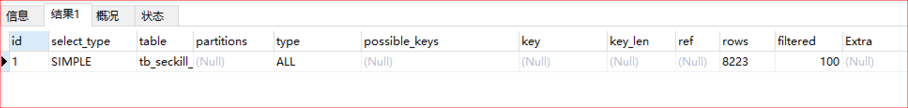

- id：SELECT 识别符，这是 SELECT 查询序列号
- **select_type（重要）：** 表示单位查询的查询类型，比如：普通查询、联合查询(union、union all)、子查询等复杂查询
- table：表示查询的表
- partitions：使用的哪些分区（对于非分区表值为 null）
- **type（重要）：** 表示表的连接类型
- possible_keys：此次查询中可能选用的索引
- key：查询真正使用到的索引
- key_len：显示 MySQL 决定使用的索引 size
- ref：哪个字段或常数与 key 一起被使用
- rows：显示此查询一共扫描了多少行，这个是一个估计值，不是精确的值。
- filtered: 表示此查询条件所过滤的数据的百分比
- **Extra（重要）：** 额外信息

#### select_type

单位查询的查询类型，比如：普通查询、联合查询(union、union all)、子查询等复杂查询。

**有以下几种值：**

1. simple：**普通查询**，表示不需要 union 操作或者不包含子查询的简单查询。有连接查询时，外层的查询为 simple。

   - primary：查询的主要部分，一个需要 union 操作或者含有子查询的 select 位于最外层的单位查询的 select_type 即为 primary
2. union：**连接查询**

   - derived：在 from 列表中包含的子查询被标记为 derived（衍生），MySQL 会递归执行这些子查询，把结果放在临时表中
   - union：若第二个 select 出现在 union 之后，则被标记为 union，若 union 包含在 from 子句的子查询中，外层 select 将被标记为 derived
   - union result：从 union 表获取结果的 select
3. dependent union：**依赖连接查询**，与 union 一样出现在 union 或 union all 语句中，但是这个查询要受到外部查询的影响
4. subquery： **子查询**，除了 from 字句中包含的子查询外，其他地方出现的子查询都可能是 subquery
5. dependent subquery： **依赖子查询**，与 dependent union 类似，表示这个 subquery 的查询要受到外部表查询的影响
6. derived：**派生表**，from 字句中出现的子查询，也叫做派生表，其他数据库中可能叫做内联视图或嵌套 select

##### simple 简单查询

```sql
-- simple： 表示不需要union操作或者不包含子查询的简单select查询。有连接查询时，外层的查询为simple。
explain select * from tb_seckill_goods;
```

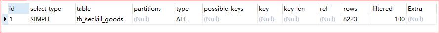

##### union 连接查询

```sql
explain select * from tb_seckill_goods a union select * from tb_seckill_goodsb;
-- 一个需要 union 操作或者含有子查询的 select 位于最外层的单位查询的 select_type 即为 primary
-- UNION 若第二个SELECT出现在UNION之后，则被标记为UNION
```

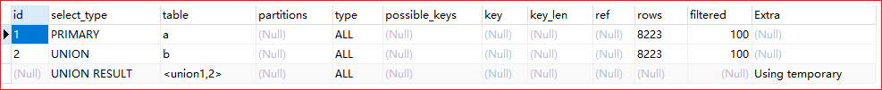

```sql
explain select * from ( select * from tb_seckill_goods a union select * from tb_seckill_goods b) c;
-- union： union连接的两个select查询，第一个查询是dervied派生表，除了第一个表外，第二个以后的表select_type都是union
-- DERIVED 在FROM列表中包含的子查询被标记为DERIVED（衍生），MySQL会递归执行这些子查询，把结果放在临时表中
```

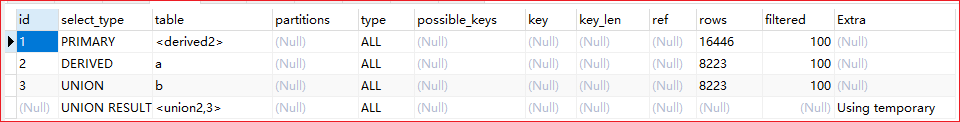

```sql
explain select * from tb_seckill_goods a where a.id in (select id from tb_seckill_goods b union select id from tb_seckill_goods c);
-- dependent union：与union一样，出现在union 或union all语句中，但是这个查询要受到外部查询的影响
-- UNION RESULT 从UNION表获取结果的SELECT
```

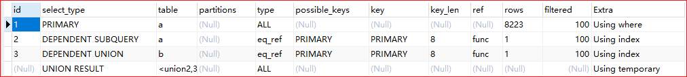

##### subquery 子查询

```sql
explain select (select id from tb_seckill_goods where price=5346.94) from tb_spu;
-- subquery 除了from字句中包含的子查询外，其他地方出现的子查询都可能是subquery
```

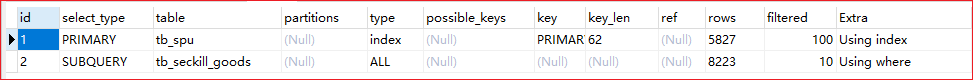

```sql
explain select (select id from tb_seckill_goods a where a.id=b.id) from tb_seckill_goods b;
-- dependent subquery 与dependent union类似，表示这个subquery的查询要受到外部表查询的影响
```

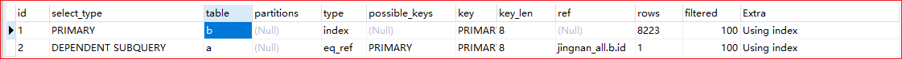

#### type

显示的是单位查询的 **连接类型或者理解为访问类型**，访问性能依次从好到差：

1. system：表中只有一行数据或者是空表。等于系统表，这是 const 类型的特列，平时不会出现，可以忽略不计
2. **const（重要）**：使用 **唯一索引或者主键**，返回记录一定是 1 行记录的等值 where 条件时，通常 type 是 const。其他数据库也叫做唯一索引扫描。
3. **eq_ref（重要）**：**唯一性索引扫描**，对于每个索引键，表中只有一条记录与之匹配。
4. **ref（重要）**：**非唯一性索引扫描**，返回匹配某个单独值的所有行，本质上也是一种索引访问，它返回所有匹配某个单独值的行，然而，它可能会找到多个符合条件的行，所以他应该属于查找和扫描的混合体。
5. fulltext：全文索引检索，要注意，全文索引的优先级很高，若全文索引和普通索引同时存在时，mysql 不管代价，优先选择使用全文索引
6. ref_or_null：与 ref 方法类似，只是增加了 null 值的比较。实际用的不多。
7. unique_subquery：用于 where 中的 in 形式子查询，子查询返回不重复值唯一值
8. index_subquery：用于 in 形式子查询使用到了辅助索引或者 in 常数列表，子查询可能返回重复值，可以使用索引将子查询去重。
9. **range（重要）**：**索引范围扫描**，常见于使用 >,<, is null, between , in , like 等运算符的查询中。
10. index_merge：表示查询使用了两个以上的索引，最后取交集或者并集，常见 and ，or 的条件使用了不同的索引，官方排序这个在 ref_or_null 之后，但是实际上由于要读取所有索引，性能可能大部分时间都不如 range。
11. **index（重要）**：select 结果列中使用到了索引，type 会显示为 index。**全部索引扫描**，把索引从头到尾扫一遍，常见于使用索引列就可以处理不需要读取数据文件的查询、可以使用索引排序或者分组的查询。
12. **all（重要）**：这个就是 **全表扫描** 数据文件，然后再 **在 server 层进行过滤** 返回符合要求的记录。

##### const

使用 **唯一索引或者主键**，返回记录一定是 1 行记录的等值 where 条件时，通常 type 是 const。

```sql
explain select * from tb_seckill_goods where id=1;
```

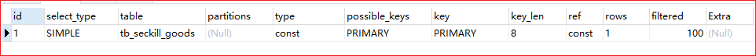

##### eq_ref

连接字段 **主键或者唯一性索引。**
此类型通常出现在多表的 join 查询，表示对于前表的每一个结果，都只能匹配到后表的一行结果。并且查询的比较操作通常是 '=', 查询效率较高。

```sql
explain select * from tb_seckill_goods a left join tb_seckill_goods b on a.id=b.id;
```

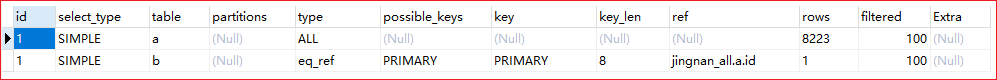

##### ref

**非唯一性索引扫描**，返回匹配某个单独值的所有行，本质上也是一种索引访问，它返回所有匹配某个单独值的行，然而，它可能会找到多个符合条件的行，所以他应该属于查找和扫描的混合体。

```sql
-- ref 组合索引
explain select * from tb_seckill_goods where title="华为手机";
explain select * from tb_seckill_goods a left join tb_seckill_goods b on a.title=b.title;
-- ref 非唯一索引
explain select * from tb_seckill_goods where price=5346.94;
```

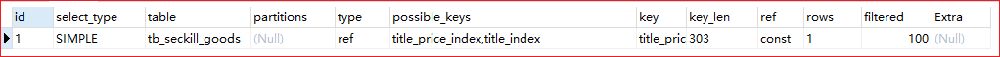

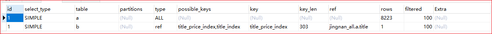

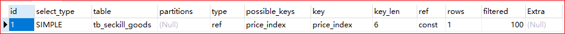

##### range

**索引范围查询**，常见于使用 >,<, is null, between , in , like 等运算符的查询中。

```sql
explain select * from tb_seckill_goods where title like '华为%';
```

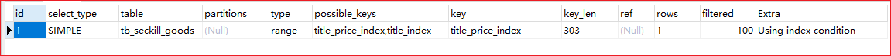

##### index

select **结果列中使用到了索引**，type 会显示为 index。全部索引扫描，把索引从头到尾扫一遍，常见于使用索引列就可以处理不需要读取数据文件的查询、可以使用索引排序或者分组的查询。

```sql
explain select title from tb_seckill_goods ;
```

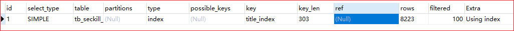

##### all

**全表扫描** 数据文件，然后再在 server 层进行过滤返回符合要求的记录。

```sql
explain select * from tb_seckill_goods;
```

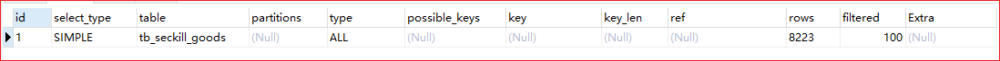

**注意：**

1. 除了 all 之外，其他的 type 都可以使用到索引
2. 最少要使用到 range 级别

#### Extra

这个列包含不适合在其他列中显示的，但十分重要的额外的信息，这个列可以显示的信息非常多，有几十种。说明几个经常遇到的。

##### Using filesort

使用了文件排序，说明 mysql 会对数据使用一个外部的索引排序，而不是按照表内的索引顺序进行读取。MySQL 中 **无法利用索引完成的排序操作称为“文件排序”**。**这种操作需要优化 sql**。

```sql
-- 无索引，按照文件排序
explain select price from tb_seckill_goods where price >100 order by cost_price;
-- 有索引，不按照文件排序
explain select price from tb_seckill_goods where price >100 order by price;
```

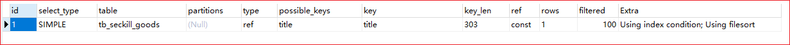

##### Using index

表示相应的 SELECT 查询中使用到了索引，避免访问表的数据行，这种查询的效率很高。

- 如果同时出现 Using Where ，索引在 where 之后，用作查询条件
- 如果没有同时出现 Using Where ，索引在 where 之前，用作查询结果读取

```sql
-- 使用where，索引在where之后，用作查询条件
explain select id,title,price from tb_seckill_goods where price>100;
-- 没有使用where，索引在where之前，用作查询结果读取
explain select id,title,price from tb_seckill_goods;
```

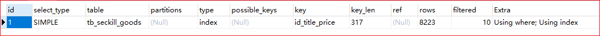

##### Using where

表示 MySQL 将对 InnoDB 提取的结果在 SQL Layer 层进行过滤，过滤条件字段无索引。

```sql
-- 只有where
explain select * from tb_seckill_goods where cost_price>100;
```

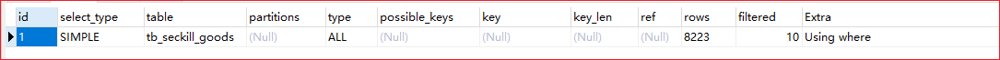

##### Using join buffer

表明使用了连接缓存，比如说在查询的时候，多表 join 的次数非常多，那么将配置文件中的缓冲区的 join buffer 调大一些。

### 索引优化


