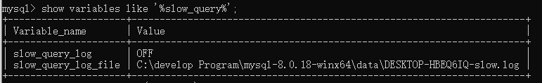
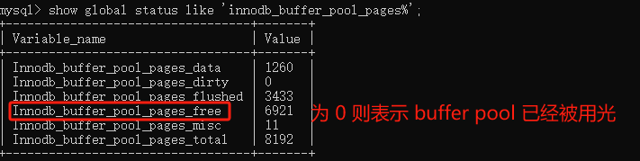

# MySQL 优化

## 客户端优化

使用 Druid 作为数据源，连接池相关参数配置如下：

```properties
# 连接池配置
# 初始化连接数
spring.datasource.druid.initial-size=1
# 最小空闲连接数，一般设置和initial-size一致
spring.datasource.druid.min-idle=1
# 最大活动连接数
spring.datasource.druid.max-active=20
# 从连接池获取连接超时时间
spring.datasource.druid.max-wait=60000
# 配置间隔多久启动一次销毁线程，对连接池内的空闲的connection进行检测，单位是毫秒。
# 1.如果连接空闲并且超过minIdle以外的连接，如果空闲时间超过minEvictableIdleTimeMillis设置的连接物理关闭。
# 2.在minIdle以内的不处理。
spring.datasource.druid.time-between-eviction-runs-millis=60000
# 配置一个连接在池中连接最小可清理的空闲时间，单位是毫秒
spring.datasource.druid.min-evictable-idle-time-millis=300000
# 打开后，增强timeBetweenEvictionRunsMillis的周期性连接检查，minIdle内的空闲连接
# 设置从连接池获取连接时是否检查连接有效性，true时，每次都检查;false时，不检查
spring.datasource.druid.test-on-borrow=false
# 设置往连接池归还连接时是否检查连接有效性，true时，每次都检查;false时，不检查
spring.datasource.druid.test-on-return=false
# 设置从连接池获取连接时是否检查连接有效性
# 为true时，如果连接空闲时间超过minEvictableIdleTimeMillis进行检查，否则不检查
# 为false时，不检查
spring.datasource.druid.test-while-idle=true
# 检验连接是否有效的查询语句
# 如果数据库Driver支持ping()方法，则优先使用ping()方法进行检查，否则使用
validationQuery查询进行检查
spring.datasource.druid.validation-query=select 1 from dual
# 每次检查强制验证连接有效性
spring.datasource.druid.keep-alive=true
```

### 连接池参数设置

#### MaxWait

**参数表示从连接池获取连接的超时等待时间，单位毫秒。** 应用程序从客户端连接池获取中获取连接的超时等待时间。

**注意：这个参数只管理获取连接的超时。** 获取连接等待的直接原因是池里没有可用连接，具体包括如下四种情况：

1. 连接池未初始化
2. 连接长久未使用已被释放
3. 连接使用中需要新建连接
4. 连接池已耗尽需等待连接用完后归还

**MaxWait 未配置或者配置为 0 时，表示不设等待超时时间。**

**配置建议：** 如果内网状态良好，获取连接等待时间 800，网络状况不佳，推荐设置为 1200。原因是 TCP 重连的时间一般是 1 秒。

#### MaxActive

**最大连接池数量，允许的最大同时使用中的连接数。**

**配置 maxActive 不是越大越好。 为什么？**

1. 20 个连接可以产生足够的吞吐量，只要 SQL 执行不耗时，20 个连接足以产生 2000 以上 TPS
2. 如果设置过大，多个服务连接数据库超过数据库最大的连接数，会出现资源争抢踩踏，导致服务器报错。反而会造成服务器性能下降。
3. 大多数业务场景及应用中，设置为 10、20、30 均为合适的值，判断标准主要是应用的数量，及数据库最大连接数的值。如果只有一个数据库配置一个应用可以设置为 0。

**配置建议：** 大多数场景下，20 连接足够使用，当然这个参数的配置还需要结合业务场景的特点给与配置，一般标准是配置成为正常使用连接数的 3-4 倍即可。

### 连接属性设置

#### connectTimeout

表示 **等待和 MySQL 数据库建立 socket 链接的超时时间**。如果与服务器(这里指数据库)请求建立连接的时间超过 connectionTimeout，就会抛连接超时异常，即服务器连接超时。

connectionTimeout 默认值是 0，表示不会连接超时。配置的单位是毫秒。

推荐配置：connectionTimeout = 3000

#### socketTimeout

表示 **客户端和 MySQL 数据库建立 socket 后，读写 socket 时的等待的超时时间。** 如果与服务器连接成功，就开始数据传输，如果服务器处理数据等待用时过长，超过了 SocketTimeOut，就会抛出 SocketTimeOutException，即服务器响应超时，服务器没有在规定的时间内返回给客户端数据。

socketTimeout 可以不设置，默认值是 30 分钟，在 Linux 中配置，单位毫秒。

推荐配置：socketTimeout = 1200

## SQL 语句优化

### 查看 SQL 执行计划

MySQL 提供了一个 Explain 命令, 它可以对 SELECT 语句的执行计划进行分析，并输出 SELECT 执行的详细信息，以供开发人员针对性优化。

```sql
EXPLAIN SELECT * FROM tb_seckill_goods
```


- id：SELECT 识别符，这是 SELECT 查询序列号
- **select_type（重要）：** 表示单位查询的查询类型，比如：普通查询、联合查询(union、union all)、子查询等复杂查询
- table：表示查询的表
- partitions：使用的哪些分区（对于非分区表值为 null）
- **type（重要）：** 表示表的连接类型
- possible_keys：此次查询中可能选用的索引
- key：查询真正使用到的索引
- key_len：显示 MySQL 决定使用的索引 size
- ref：哪个字段或常数与 key 一起被使用
- rows：显示此查询一共扫描了多少行，这个是一个估计值，不是精确的值。
- filtered: 表示此查询条件所过滤的数据的百分比
- **Extra（重要）：** 额外信息

#### select_type

单位查询的查询类型，比如：普通查询、联合查询(union、union all)、子查询等复杂查询。

**有以下几种值：**

1. simple：**普通查询**，表示不需要 union 操作或者不包含子查询的简单查询。有连接查询时，外层的查询为 simple。

   - primary：查询的主要部分，一个需要 union 操作或者含有子查询的 select 位于最外层的单位查询的 select_type 即为 primary
2. union：**连接查询**

   - derived：在 from 列表中包含的子查询被标记为 derived（衍生），MySQL 会递归执行这些子查询，把结果放在临时表中
   - union：若第二个 select 出现在 union 之后，则被标记为 union，若 union 包含在 from 子句的子查询中，外层 select 将被标记为 derived
   - union result：从 union 表获取结果的 select
3. dependent union：**依赖连接查询**，与 union 一样出现在 union 或 union all 语句中，但是这个查询要受到外部查询的影响
4. subquery： **子查询**，除了 from 字句中包含的子查询外，其他地方出现的子查询都可能是 subquery
5. dependent subquery： **依赖子查询**，与 dependent union 类似，表示这个 subquery 的查询要受到外部表查询的影响
6. derived：**派生表**，from 字句中出现的子查询，也叫做派生表，其他数据库中可能叫做内联视图或嵌套 select

##### simple 简单查询

```sql
-- simple： 表示不需要union操作或者不包含子查询的简单select查询。有连接查询时，外层的查询为simple。
explain select * from tb_seckill_goods;
```


##### union 连接查询

```sql
explain select * from tb_seckill_goods a union select * from tb_seckill_goodsb;
-- 一个需要 union 操作或者含有子查询的 select 位于最外层的单位查询的 select_type 即为 primary
-- UNION 若第二个SELECT出现在UNION之后，则被标记为UNION
```


```sql
explain select * from ( select * from tb_seckill_goods a union select * from tb_seckill_goods b) c;
-- union： union连接的两个select查询，第一个查询是dervied派生表，除了第一个表外，第二个以后的表select_type都是union
-- DERIVED 在FROM列表中包含的子查询被标记为DERIVED（衍生），MySQL会递归执行这些子查询，把结果放在临时表中
```


```sql
explain select * from tb_seckill_goods a where a.id in (select id from tb_seckill_goods b union select id from tb_seckill_goods c);
-- dependent union：与union一样，出现在union 或union all语句中，但是这个查询要受到外部查询的影响
-- UNION RESULT 从UNION表获取结果的SELECT
```


##### subquery 子查询

```sql
explain select (select id from tb_seckill_goods where price=5346.94) from tb_spu;
-- subquery 除了from字句中包含的子查询外，其他地方出现的子查询都可能是subquery
```


```sql
explain select (select id from tb_seckill_goods a where a.id=b.id) from tb_seckill_goods b;
-- dependent subquery 与dependent union类似，表示这个subquery的查询要受到外部表查询的影响
```


#### type

显示的是单位查询的 **连接类型或者理解为访问类型**，访问性能依次从好到差：

1. system：表中只有一行数据或者是空表。等于系统表，这是 const 类型的特列，平时不会出现，可以忽略不计
2. **const（重要）**：使用 **唯一索引或者主键**，返回记录一定是 1 行记录的等值 where 条件时，通常 type 是 const。其他数据库也叫做唯一索引扫描。
3. **eq_ref（重要）**：**唯一性索引扫描**，对于每个索引键，表中只有一条记录与之匹配。
4. **ref（重要）**：**非唯一性索引扫描**，返回匹配某个单独值的所有行，本质上也是一种索引访问，它返回所有匹配某个单独值的行，然而，它可能会找到多个符合条件的行，所以他应该属于查找和扫描的混合体。
5. fulltext：全文索引检索，要注意，全文索引的优先级很高，若全文索引和普通索引同时存在时，mysql 不管代价，优先选择使用全文索引
6. ref_or_null：与 ref 方法类似，只是增加了 null 值的比较。实际用的不多。
7. unique_subquery：用于 where 中的 in 形式子查询，子查询返回不重复值唯一值
8. index_subquery：用于 in 形式子查询使用到了辅助索引或者 in 常数列表，子查询可能返回重复值，可以使用索引将子查询去重。
9. **range（重要）**：**索引范围扫描**，常见于使用 >,<, is null, between , in , like 等运算符的查询中。
10. index_merge：表示查询使用了两个以上的索引，最后取交集或者并集，常见 and ，or 的条件使用了不同的索引，官方排序这个在 ref_or_null 之后，但是实际上由于要读取所有索引，性能可能大部分时间都不如 range。
11. **index（重要）**：select 结果列中使用到了索引，type 会显示为 index。**全部索引扫描**，把索引从头到尾扫一遍，常见于使用索引列就可以处理不需要读取数据文件的查询、可以使用索引排序或者分组的查询。
12. **all（重要）**：这个就是 **全表扫描** 数据文件，然后再 **在 server 层进行过滤** 返回符合要求的记录。

##### const

使用 **唯一索引或者主键**，返回记录一定是 1 行记录的等值 where 条件时，通常 type 是 const。

```sql
explain select * from tb_seckill_goods where id=1;
```


##### eq_ref

连接字段 **主键或者唯一性索引。**
此类型通常出现在多表的 join 查询，表示对于前表的每一个结果，都只能匹配到后表的一行结果。并且查询的比较操作通常是 '=', 查询效率较高。

```sql
explain select * from tb_seckill_goods a left join tb_seckill_goods b on a.id=b.id;
```


##### ref

**非唯一性索引扫描**，返回匹配某个单独值的所有行，本质上也是一种索引访问，它返回所有匹配某个单独值的行，然而，它可能会找到多个符合条件的行，所以他应该属于查找和扫描的混合体。

```sql
-- ref 组合索引
explain select * from tb_seckill_goods where title="华为手机";
explain select * from tb_seckill_goods a left join tb_seckill_goods b on a.title=b.title;
-- ref 非唯一索引
explain select * from tb_seckill_goods where price=5346.94;
```


##### range

**索引范围查询**，常见于使用 >,<, is null, between , in , like 等运算符的查询中。

```sql
explain select * from tb_seckill_goods where title like '华为%';
```


##### index

select **结果列中使用到了索引**，type 会显示为 index。全部索引扫描，把索引从头到尾扫一遍，常见于使用索引列就可以处理不需要读取数据文件的查询、可以使用索引排序或者分组的查询。

```sql
explain select title from tb_seckill_goods ;
```


##### all

**全表扫描** 数据文件，然后再在 server 层进行过滤返回符合要求的记录。

```sql
explain select * from tb_seckill_goods;
```


**注意：**

1. 除了 all 之外，其他的 type 都可以使用到索引
2. 最少要使用到 range 级别

#### Extra

这个列包含不适合在其他列中显示的，但十分重要的额外的信息，这个列可以显示的信息非常多，有几十种。说明几个经常遇到的。

##### Using filesort

使用了文件排序，说明 mysql 会对数据使用一个外部的索引排序，而不是按照表内的索引顺序进行读取。MySQL 中 **无法利用索引完成的排序操作称为“文件排序”**。**这种操作需要优化 sql**。

```sql
-- 无索引，按照文件排序
explain select price from tb_seckill_goods where price >100 order by cost_price;
-- 有索引，不按照文件排序
explain select price from tb_seckill_goods where price >100 order by price;
```


##### Using index

表示相应的 SELECT 查询中使用到了索引，避免访问表的数据行，这种查询的效率很高。

- 如果同时出现 Using Where ，索引在 where 之后，用作查询条件
- 如果没有同时出现 Using Where ，索引在 where 之前，用作查询结果读取

```sql
-- 使用where，索引在where之后，用作查询条件
explain select id,title,price from tb_seckill_goods where price>100;
-- 没有使用where，索引在where之前，用作查询结果读取
explain select id,title,price from tb_seckill_goods;
```


##### Using where

表示 MySQL 将对 InnoDB 提取的结果在 SQL Layer 层进行过滤，过滤条件字段无索引。

```sql
-- 只有where
explain select * from tb_seckill_goods where cost_price>100;
```


##### Using join buffer

表明使用了连接缓存，比如说在查询的时候，多表 join 的次数非常多，那么将配置文件中的缓冲区的 join buffer 调大一些。

### 索引优化

[索引优化](MySQL索引.md#索引创建原则)

### Limit 优化

如果预计 SELECT 语句的查询结果是一条，最好使用 **LIMIT 1**，可以停止全表扫描。

处理分页会使用到 LIMIT ，当翻页到非常靠后的页面的时候，偏移量会非常大，这时 LIMIT 的效率会非常差。

LIMIT 的优化问题，其实是 `OFFSET` 的问题，它会导致 MySQL 扫描大量不需要的行然后再抛弃掉。

**解决方案：单表分页时，使用自增主键排序之后，先使用 where 条件 id > offset 值，limit 后面只写 rows**

```sql
select * from (select * from tuser2 where id > 1000000 and id < 1000500 ORDER BY id) t limit 0, 20
```

### 子查询优化

执行子查询时，MYSQL 需要创建临时表，查询完毕后再删除这些临时表，所以子查询的速度会受到一定的影响。这多了一个创建临时表和销毁表的过程。

select goods_id, goods_name from goods where goods_id = (select max(goods_id)
from goods);

```sql
-- 把内层查询结果当作外层查询的比较条件的
select goods_id,goods_name from goods where goods_id = (select max(goods_id) from goods);
```

**优化方式：可以使用连接查询（JOIN）代替子查询，连接查询时不需要建立临时表，其速度比子查询快。**

### 其他查询优化

- **小表驱动大表：** 使用 left join 时，以小表关联大表，因为使用 join 的话，**第一张表是必须全扫描的**，以少关联多就可以减少这个扫描次数。
- **JOIN 两张表的关联字段最好都建立索引，而且最好字段类型一致。**
- **避免全表扫描：** 注意索引失效的口诀，避免索引失效导致的全表扫描。
- **避免 MySQL 放弃索引：** 如果 MySQL 估计使用全表扫描要比使用索引快，则不使用索引。最典型场景：查询数据量到一定阈值的时候出现的索引失效，数据量达到一定阈值使用索引不如全表扫描来的更快。
- **WHERE 条件中尽量不要使用 not in 语句，建议使用 not exists**
- **利用慢查询日志、explain 执行计划查询、show profile 查看 SQL 执行时的资源使用情况**

### SQL 语句性能分析

#### 什么是 Profile

Query Profiler 是 MySQL 自带的一种 **Query 诊断分析工具**，通过它可以分析出一条 SQL 语句的硬件性能瓶颈在什么地方。通常我们是使用的 explain，以及 slow query log 都无法做到精确分析，但是 Query Profiler 却可以定位出一条 SQL 语句执行的各种资源消耗情况，比如 CPU，IO 等，以及该 SQL 执行所耗费的时间等。

该工具只有在 **MySQL 5.0.37 以及以上版本中才有实现**。**默认的情况下，MySQL 的该功能没有打开，需要自己手动启动。**

#### 开启 Profile 功能

**查看是否开启了 Profile 功能**

```sql
select @@profiling;
-- 或者
show variables like '%profil%';
```

**开启 profile 功能**

```sql
-- 1是开启、0是关闭
set profiling=1;
```

#### 基本使用

```sql
SHOW PROFILE [type [, type] ... ]
	[FOR QUERY n]
	[LIMIT row_count [OFFSET offset]]
type: {
      ALL
    | BLOCK IO
    | CONTEXT SWITCHES
    | CPU
    | IPC
    | MEMORY
    | PAGE FAULTS
    | SOURCE
    | SWAPS
}
```

show profile 和 show profiles 语句可以展示当前会话(退出 session 后, profiling 重置为 0) 中执行语句的资源使用情况。

- show profiles：以列表形式显示最近发送到服务器上执行的语句的资源使用情况，显示的记录数由变量 `profiling_history_size` 控制, 默认 15 条
- show profile: 展示最近一条语句执行的详细资源占用信息, 默认显示 Status 和 Duration 两列
- show profile: 还可根据 show profiles 列表中的 Query_ID , 选择显示某条记录的性能分析信息

```sql
-- 查看某条SQL的性能分析信息
show profile for query 1;
-- 查看某条SQL的具体某个指标的性能分析
show profile cpu for query 1;
```

**type 是可选的，取值范围可以如下：**

- ALL：显示所有性能信息
- BLOCK IO：显示块 IO 操作的次数
- CONTEXT：SWITCHES 显示上下文切换次数，不管是主动还是被动
- CPU：显示用户 CPU 时间、系统 CPU 时间
- IPC：显示发送和接收的消息数量
- MEMORY：[暂未实现]
- PAGE FAULTS：显示页错误数量
- SOURCE：显示源码中的函数名称与位置
- SWAPS：显示 SWAP 的次数

## 数据库优化

### 慢查询日志

MySQL 的慢查询日志功能默认是关闭的，需要手动开启。

#### 开启慢查询日志

**查看是否开启慢查询日志**

```sql
show variables like '%slow_query%';
show variables like 'long_query_time%';
```



- **slow_query_log：** 是否开启慢查询日志，1 为开启，0 为关闭
- **log-slow-queries：** 旧版（5.6 以下）MySQL 数据库慢查询日志存储路径。
- **slow-query-log-file：** 新版（5.6 及以上）MySQL 数据库慢查询日志存储路径。不设置该参数，系统则会默认给一个文件 host_name-slow.log
- **long_query_time：** 慢查询阈值，当查询时间多于设定的阈值时，记录日志，单位秒

**开启慢查询功能**

```sql
# 开启慢查询日志
set global slow_query_log=on;
# 大于1秒钟的数据记录到慢日志中，如果设置为默认0，则会有大量的信息存储在磁盘中，磁盘很容易满掉
# 如果设置不生效，建议配置在my.cnf配置文件中
set global long_query_time=1;
# 记录没有索引的查询。
set global log_queries_not_using_indexes=on;
```

#### 慢查询日志格式

```sql
# Time: 2025-07-27T08:32:44.023309Z
# User@Host: root[root] @ [172.26.233.201] Id: 1243
# Query_time: 218.295526 Lock_time: 0.000126 Rows_sent: 10959
Rows_examined: 10929597
use hero_all;
SET timestamp=1627374764;
# 慢查询SQL语句
select tk.id,ts.* from tb_seckill_goods ts LEFT JOIN tb_sku tk ON tk.id=ts.id where ts.id>100 order by ts.price;
```

**日志解析：**

- 第一行：SQL 查询执行的具体时间

- 第二行：执行 SQL 查询的连接信息，用户和连接 IP

- 第三行：记录了一些我们比较有用的信息，如下解析：

  - Query_time, 这条 SQL 执行的时间, 越长则越慢
  - Lock_time, 在 MySQL 服务器阶段(不是在存储引擎阶段)等待表锁时间
  - Rows_sent, 查询返回的行数
  - Rows_examined, 查询检查的行数，越长就当然越费时间
- 第四行：设置时间戳，没有实际意义，只是和第一行对应执行时间。
- 第五行及后面所有行是执行的 SQL 语句，SQL 可能会很长。截止到下一个# Time: 之前

#### 分析慢查询日志工具

使用 mysqldumpslow 工具，mysqldumpslow 是 MySQL 自带的慢查询日志工具。可以使用 mysqldumpslow 工具搜索慢查询日志中的 SQL 语句。

```mysql
-- 得到按照时间排序的前 10 条里面含有左连接的查询语句：
[root@localhost mysql]# mysqldumpslow -s t -t 10 -g "left join" /var/lib/mysql/slow.log
```

**常用参数说明：**

- s ：是表示按照何种方式排序
  - al 平均锁定时间
  - ar 平均返回记录时间
  - t 平均查询时间（默认）
  - c 计数
  - l 锁定时间
  - r 返回记录
  - t 查询时间

- -t ：是 top n 的意思，即为返回前面多少条的数据

- -g ：后边可以写一个正则匹配模式，大小写不敏感的

### 连接数 max_connections

**MySQL 同时连接客户端的最大数量，默认值 151，最小值 1。**

**连接数导致问题：** ERROR 1040，TooManyConnections 原因如下:

1. MySQL 的 max_connection 配置少了
2. 访问确实太高，MySQL 有点扛不住了，考虑扩容
3. 连接池配置有误，MaxActive 为 0

```mysql
# 查看 max_connections
show global variables like 'max_connections'
# 设置 max_connections（立即生效重启后失效）
set global max_connections = 800;
# 这台MySQL服务器最大连接数是256，然后查询一下服务器使用过的最大连接数：
show global status like 'Max_used_connections';
```

**比较理想的设置是：** Max_used_connections / max_connections * 100% ≈ 85%，最大连接数占上限连接数的 85%左右，如果发现比例在 10%以下，MySQL 服务器连接数上限设置的过高了。

#### Max_connection 可以无限大吗

MySQL 支持的最大连接数取决于如下几个主要因素：

- 可使用内存
- 每个连接占用的内存
- 连接响应时间

#### Max_connection 大了会影响系统的吞吐能力？

一般情况下，Linux 操作系统支持最大连接数范围 500-1000 之间，最大链接数上限 10w。如果想设置为最大，要么得有足够的资源，要么就是可以接收很长的响应时间。

**建议设置：最大连接数占上限连接数的 85%左右，如果发现比例在 10%以下，MySQL 服务器连接数上限设置的过高了。**

### 线程使用情况

如果我们在 MySQL 服务器配置文件中设置了 thread_cache_size，当客户端断开之后，服务器处理此客户的线程将会缓存起来以响应下一个客户而不是销毁（前提是缓存数未达上限）。

服务器线程缓存 thread_cache_size 没有进行设置或者设置过小，MySQL 服务器一直在创建线程销毁线程。增加这个值可以改善系统性能（可以使得 RT 更趋于平稳）。

Threads_created 表示创建过的线程数，如果发现 Threads_created 值过大的话，表明 MySQL 服务器一直在创建线程，这也是比较耗资源，可以适当增加配置文件中 thread_cache_size 值。

**查询服务器 thread_cache_size 配置：**

```mysql
# 查询线程使用情况
show global status like 'Thread%';
# 查询线程缓存
show variables like 'thread_cache_size';
# 增加thread_cache_size的值
set global thread_cache_size = 64;
```

**根据物理内存建议设置规则如下：**

- 1G ---> 8
- 2G ---> 16
- 3G ---> 32
- 大于 3G ---> 64

### 结构优化

#### 分表

对于字段较多的表，如果有些字段的使用频率很低，可以将这些字段分离出来形成新表。因为当一个表的数据量很大时，会由于使用频率低的字段的存在而变慢。

#### 增加中间表

对于需要经常联合查询的表，可以建立中间表以提高查询效率。通过建立中间表，将需要通过联合查询的数据插入到中间表中，然后将原来的联合查询改为对中间表的查询。

通常都是在统计当中使用，每次统计报表的时候都是离线统计，后台有有一个线程对你这统计查询结果放入一个中间表，然后你对这个中间表查询

#### 增加冗余字段

设计数据表时应尽量遵循关系数 **据库范式的规约**，尽可能的减少冗余字段，让数据库设计看起来精致、优雅。但是合理的加入冗余字段可以提高查询速度。

表的规范化程度越高，表和表之间的关系越多，需要连接查询的情况也就越多，性能也就越差。

**注意：冗余字段的值在一个表中修改了，就要想办法在其他表中更新，否则就会导致数据不一致的问题。**

## 服务器层面优化

### 缓冲区优化

将数据保存在内存中，保证从内存读取数据。设置足够大的 `innodb_buffer_pool_size` ，将数据读取到内存中，推荐设置为物理内存的 50%~80%。

怎样确定足够大，数据是从内存读取而不是硬盘 IO 读取？

```mysql
show global status like 'innodb_buffer_pool_pages%';
```



### 降低磁盘写入次数

- 对于生产环境来说，很多日志是不需要开启的，比如：通用查询日志、慢查询日志、错误日志
- 使用足够大的写入缓存
- 设置合适日志落盘策略

### MySQL 数据库配置优化

MySQL 的配置参数都在 my.conf 或者 my.ini 文件的 [mysqld] 组中，常用参数如下：

```ini
# 01-缓冲区，将数据保存在内存中，保证从内存读取数据。推荐值为总物理内存的50%~80%。
innodb_buffer_pool_size=4
# 02-日志组（Redo）中每个日志文件的大小，默认48MB，日志文件越大越节省磁盘IO，但需要注意
日志文件变大增加崩溃恢复时间
innodb_log_file_size=48
# 03-用来控制Redo日志刷新到磁盘的策略。
innodb_flush_log_at_trx_commit=1
# 04-每提交1次事务同步写到磁盘中，可以设置为n。
sync_binlog=1
# 05-脏页占innodb_buffer_pool_size的比例时，触发刷脏页到磁盘。推荐值为25%~50%。
innodb_max_dirty_pages_pct=30
# 06-后台进程最大IO性能指标。默认200，如果SSD，调整为5000~20000
innodb_io_capacity=200
# 07-指定innodb共享表空间文件及大小。
innodb_data_file_path=
# 08-慢查询日志的阈值设置，单位秒。
long_qurey_time=3
# 09-MySQL的binlog复制的形式，MySQL8.0默认为row
binlog_format=row
# 10-同时连接客户端的最大数量
max_connections=200
# 11-全量日志建议关闭。默认关闭。
general_log=0
```

在 MySQL5.1.X 版本中，由于代码写死，因此最多只会刷新 100 个脏页到磁盘、合并 20 个插入缓冲，即使磁盘有能力处理更多的请求，也只会处理这么多，这样在更新量较大（比如大批量 Insert）的时候，脏页刷新可能就会跟不上，导致性能下降。

MySQL5.5.X 版本之后，`innodb_io_capacity` 参数可以动态调整刷新脏页的数量，这在一定程度上解决了这一问题。

`innodb_io_capacity` 参数默认是 200，单位是页。该参数设置的大小取决于硬盘的 IOPS，即每秒的输入输出量（或读写次数）。 至于什么样的磁盘配置应该设置 `innodb_io_capacity` 参数的值是多少，可参考下表：

| InnoDB-IO-capacity | 磁盘配置       |
| ------------------ | -------------- |
| 200                | 单盘 SAS/SATA   |
| 2000               | SAS*12 RAID 10 |
| 500                | SSD            |
| 5000               | FUSION-IO      |

### 服务器硬件优化

提升硬件设备，例如选择尽量 **高频率的内存**（频率不能高于主板的支持）、提升 **网络带宽**、使用 SSD 高速磁盘、提升 **CPU 性能** 等。

**CPU 的选择:**

- 对于数据库**并发比较高**的场景，CPU 的数量比频率重要
- 对于 **CPU 密集型场景和频繁执行复杂 SQL 的场景**，CPU 的频率越高越好。

