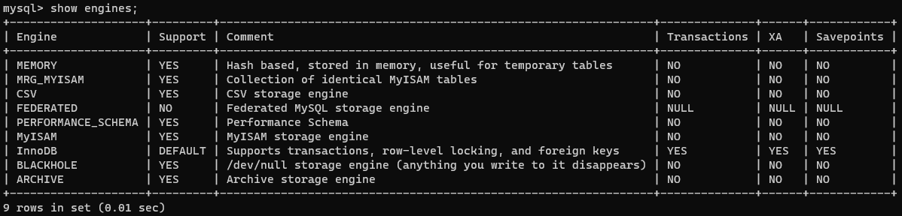
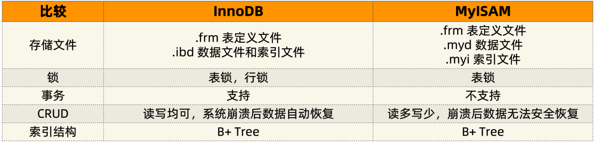

# MySQL 存储引擎

## 存储引擎分类

```mysql
show engines;
```



**引擎怎么选择？**
除非需要用到某些 InnoDB 不具备的特性，并且没有其他办法可以替代，**`否则都应该选择 InnoDB 引擎。`**

## InnoDB 和 MyISAM 存储引擎区别



## 设置存储引擎

```mysql
# 在mysql中默认使用InnoDB引擎，一个数据库中不同的表可以使用不同的引擎。
create table t_myisam(a int primary key, b int) engine=myisam;
```

