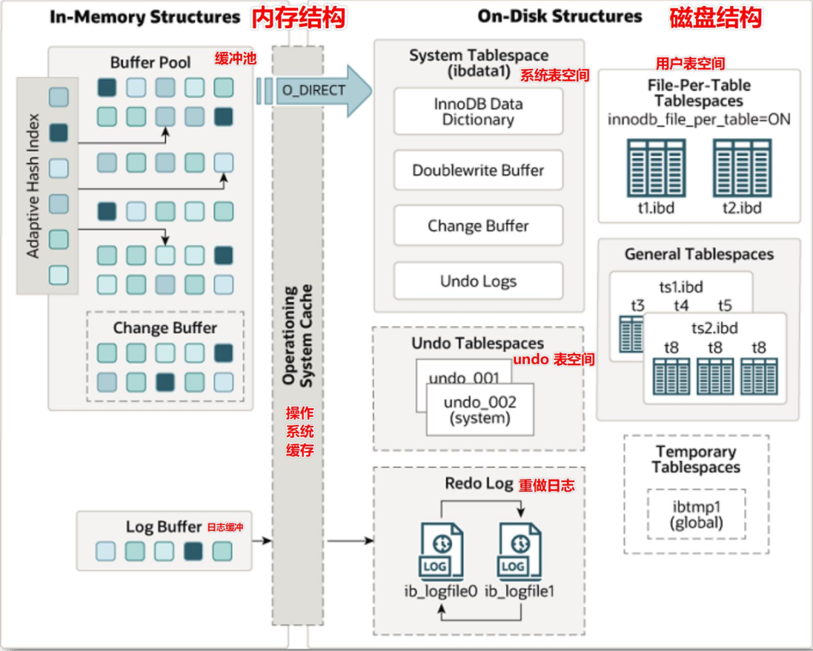
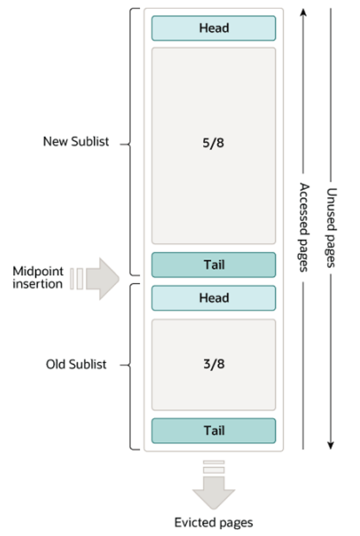
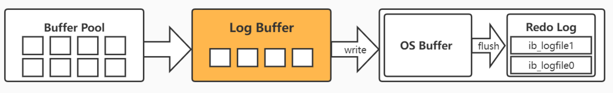
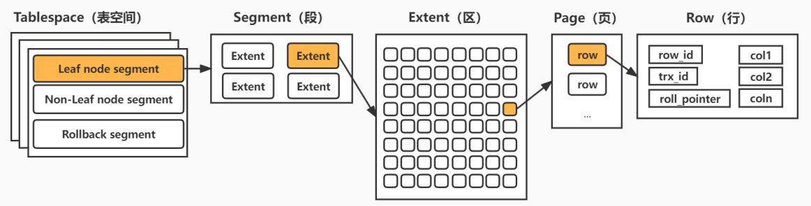
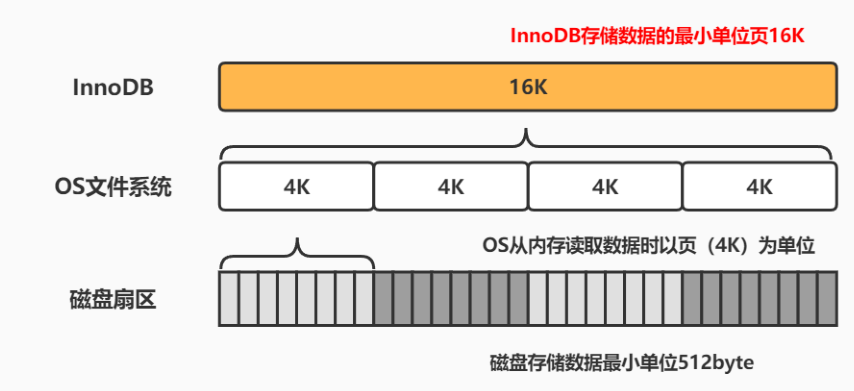

# MySQL 存储引擎之 InnoDB

## 架构图



## 内存结构

### 缓冲池(Buffer Pool)

缓冲池 Buffer Pool 用于 **加速数据的访问和修改，通过将热点数据缓存在内存的方法，最大限度地减少磁盘 IO，加速热点数据读写**。

- 默认大小为 **128M**，Buffer Pool 中数据 **以页为存储单位**，其实现的数据结构是 **以页为单位的单链表**。

- 由于内存的空间限制，Buffer Pool 仅能容纳最热点的数据。

- Buffer Pool 使用 LRU 算法（Least Recently Used 最近最少使用）淘汰非热点数据页。

  **LRU：** 根据页数据的历史访问来淘汰数据，**如果数据最近被访问过，那么将来被访问的几率也更高**，优先淘汰最近没有被访问到的数据。

- 对于 Buffer Pool 中数据的查询，InnoDB 直接读取返回。对于 Buffer Pool 中数据的修改，InnoDB 直接在 Buffer Pool 中修改，并将修改写入 redo log。



```mysql
# 查看innodb存储引擎状态，包含缓冲池、修改缓冲、自适应哈希状态信息、日志缓冲等信息...
mysql> show engine innodb status;
# 查看InnoDB的Buffer Pool大小
mysql> show variables like 'innodb_buffer_pool_size';
```

### 修改缓冲(Change Buffer)

Change Buffer（在 MySQL 5.6 之前叫 insert buffer，简称 ibuf ）是 InnoDB 5.5 引入的一种优化策略。

**Change Buffer 用于加速非热点数据中二级索引的写入操作。**

由于二级索引数据的不连续性，导致修改二级索引时需要进行频繁的磁盘 IO 消耗大量性能，Change Buffer 缓冲 **对二级索引的修改操作，同时将写操作录入 redo log** 中，在 **缓冲到一定量或系统较空闲时进行 merge 操作将修改写入磁盘** 中。

Change Buffer 在系统表空间中有相应的持久化区域。

Change Buffer 大小默认占 Buffer Pool 的 25%，最大 50%，在引擎启动时便初始化完成。其物理结构为 **一棵名为 ibuf 的 B Tree**。

> 二级索引就是辅助索引，除了聚簇索引之外的所有索引都是二级索引。
>
> 聚簇索引也叫聚集索引，索引组织表，指的是 **一种数据存储方式，指数据与索引的数据结构存储在一起**。如 InnoDB 的主键索引中所有叶子节点都存储了对应行的数据。因为数据肯定只是存储在一个地方，所以一个表只能有一个聚集索引。

### 自适应哈希索引(AHI)

自适应哈希索引（Adaptive Hash Index，AHI）**用于实现对于热数据页的一次查询，是建立在索引之上的索引。作用是对频繁查询的数据页和索引页进一步提速**

使用聚簇索引进行 **数据页定位** 的时候需要根据索引树的高度从根节点走到叶子节点，通常 **需要 3 到 4 次查询才能定位到数据**。InnoDB 根据对索引使用情况的分析和索引字段的分析，通过自调优 Self-tuning 的方式为索引页建立或者删除哈希索引。

AHI 的大小为 Buffer Pool 的 1/64，在 MySQL 5.7 之后支持分区，以减少对于全局 AHI 锁的竞争，默认分区数为 8。

AHI 所作用的目标是 **频繁查询的数据页和索引页**，而由于数据页是聚簇索引的一部分，因此 AHI 是建立在索引之上的索引。

- **若二级索引命中 AHI：** 则直接从 AHI 获取二级索引页的记录指针，再根据主键沿着聚簇索引查找数据；
- **若聚簇索引命中 AHI：** 则直接返回目标数据页的记录指针，此时就可以根据记录指针直接定位数据页。

### 日志缓冲(Log Buffer)

InnoDB 使用 Log Buffer 来缓冲日志文件的写入操作。内存写入加上日志文件顺序写的特点，使得 InnoDB 日志写入性能极高。



对于任何修改操作，都将录入诸如 redo log 与 undo log 这样的日志文件中，因此日志文件的写入操作非常频繁，却又十分零散。这些文件都存储在磁盘中，因此日志记录将引发大量的磁盘 IO。Log Buffer 将分散的写入操作放在内存中，**通过定期批量写入磁盘的方式提高日志写入效率和减少磁盘 IO**。

**`注意：这种将分散操作改为批量操作的优化方式将增加数据丢失的风险！`**

## 磁盘结构

在磁盘中，InnoDB 存储引擎将数据、索引、表结构和其他缓存信息等存放的空间称为表空间（Tablespace）。它是物理存储中的最高层，由段 Segment、区 extent、页 Page、行 Row 组成。

### 系统表空间（System Tablespace）

系统表空间是 **InnoDB 数据字典、双写缓冲、修改缓冲和回滚日志的存储位置**，如果关闭独立表空间，它也将存储所有表数据和索引。

默认下是一个 **初始大小 12MB、名为 ibdata1 的文件**，系统表空间所对应的文件由 innodb_data_file_path 定义。

指定系统表空间文件自动增长后，其增长大小由 **innodb_autoextend_increment 设置（默认为 64MB）且不可缩减**，即使删除系统表空间中存储的表和索引，此过程释放的空间仅仅是在表空间文件中标记为已释放而已，并不会缩减其在磁盘中的大小。

- **数据字典（Data Dictionary）**：由各种表对象的元数据信息（表结构，索引，列信息等）组成的内部表
- **双写缓冲（Doublewrite Buffer）**：保证写入磁盘时页数据的完整性，防止发生部分写失效问题。
- **修改缓冲（Change Buffer）**： 内存中 Change Buffer 对应的持久化区域
- **回滚日志（Undo Log）**：实现事务进行回滚操作时对数据的恢复。是实现多版本并发控制（MVCC）重要组成。

### 独立表空间（File-per-table Tablespace）

**独立表空间用于存放每个表的数据和索引。** 在 5.7 版本中默认开启，初始化大小是 96KB。

其他类型的信息，如：回滚日志、双写缓冲区、系统事务信息、修改缓冲等仍存放于系统表空间内。因此即使用了独立表空间，系统表空间也会不断增长。

- 开启独立表空间 innodb_file_per_table = 1，每张表的数据都会存储到一个独立表空间，即表名.ibd 文件，同时创建一个表名.frm 文件用于保存表结构信息

- 关闭独占表空间 innodb_file_per_table = 0，则所有基于 InnoDB 存储引擎的表数据都会记录到系统表空间，即 ibdata1 文件

### 通用表空间（General Tablespace）

通用表空间（General Tablespace）是一个 **由 CREATE TABLESPACE 命令创建的共享表空间，创建时必须指定该表空间名称和 ibd 文件位置**，ibd 文件可以放置于任何 MySQL 有权限的地方。该表空间内可以容纳多张数据表，同时在创建时可以指定该表空间所使用的默认引擎。

**通用表空间存在的目的是为了在系统表空间与独立表空间之间作出平衡。** 系统表空间与独立表空间中的表可以向通用表空间移动，反之亦可，但系统表空间中的表无法直接与独立表空间中的表相互转化。


### 回滚表空间（Undo Tablespace）

Undo TableSpace 用于存放一个或多个 undo log 文件，默认大小为 10MB。

**undo log 默认存储在系统表空间中，MySql5.7 中支持自定义 Undo log 表空间并存储所有 undo log。**

一旦用户定义了 Undo Tablespace，则系统表空间中的 Undo log 区域将失效。对于 Undo Tablespace 的启用必须在 MySQL 初始化前设置，Undo Tablespace 中的 Undo log 表可以进行 truncate 操作。

### 临时表空间（The Temporary Tablespace）

- MySQL 5.7 之前：临时表存储在系统表空间，这样会导致 ibdata 在使用临时表的场景下疯狂增长
- MySQL 5.7 之后：InnoDB 引擎从系统表空间中抽离出临时表空间，用于独立保存临时表数据及其回滚信息

该表空间文件路径由 innodb_temp_data_file_path 指定，但必须继承 innodb_data_home_dir 。

## 存储结构



### 段（Segment）

**表空间由各个段（Segment）组成，创建的段类型分为数据段、索引段、回滚段。**

由于 InnoDB 采用聚簇索引与 B+ 树的结构存储数据，所以 **数据页和二级索引页仅仅只是 B+ 树的叶子节点**，因此 **数据段称为 Leaf node segment**。

**索引段指的是 B+ 树的非叶子节点，称为 Non-Leaf nodesegment。**

一个段会包含多个区，至少会有一个区，段扩展的最小单位是区。

### 区【Extent】

**区（Extend）是由连续的页组成的空间，大小固定为 1MB，由于默认页大小为 16K，因此一个区默认存储 64 个连续的页**。如果页大小调整为 4K，则 256 个连续页组成一个区。为了保证页的连续性，InnoDB 存储引擎会一次从磁盘申请 4 ~ 5 个区。

### 页（Page）

**页（Page）是 InnoDB 的基本存储单位，每个页大小默认为 16K**。从 InnoDB1.2.x 版本开始，可通过设置 innodb_page_size 修改为 4K、8K、16K。InnoDB 首次加载后便无法更改。

MySQL 规定 **一个页上最少存储 2 个数据项**。如果向一个页插入数据时，这个页已经满了，就会从区中分配一个新页。如果向索引树叶子节点中间的一个页中插入数据，如果这个页是满的，就会发生页分裂。

操作系统读写磁盘最小单位也是页，此页非彼页，Linux 的页一般是 4K。

InnoDB 从磁盘中读取一个数据页，操作系统会分 4 次从磁盘文件中读取数据到内存。写入也是一样的，需要分 4 次从内存写入到磁盘中。



### 行（Row）

**InnoDB 的数据是以行为单位存储，一个页中包含多个行。**

在 MySQL5.7 中，InnoDB 提供了 4 种行格式：Compact、Redundant、Dynamic 和 Compressed 行格式，**Dynamic 为 MySQL5.7 默认的行格式。**

**创建表时可以指定行格式**

```mysql
CREATE TABLE t1 (c1 INT) ROW_FORMAT=DYNAMIC;
#修改表的行格式
ALTER TABLE tablename ROW_FORMAT=行格式名称;
#修改默认行格式
SET GLOBAL innodb_default_row_format=DYNAMIC;
#查看表行格式
SHOW TABLE STATUS LIKE 't1';
```

## 内存数据落盘

### 整体思路分析


