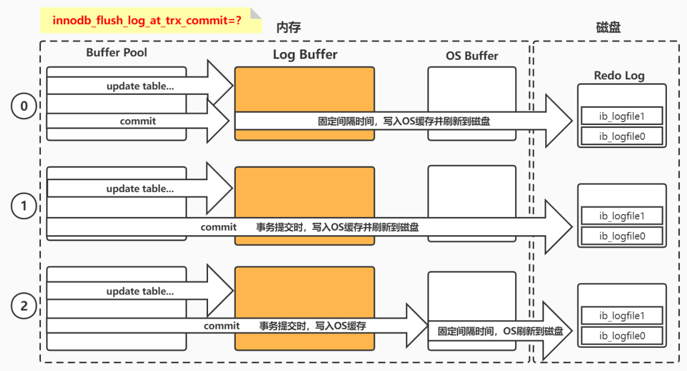

# MySQL 存储引擎之 InnoDB

## 架构图


## 内存结构

### 缓冲池(Buffer Pool)

缓冲池 Buffer Pool 用于 **加速数据的访问和修改，通过将热点数据缓存在内存的方法，最大限度地减少磁盘 IO，加速热点数据读写**。

- 默认大小为 **128M**，Buffer Pool 中数据 **以页为存储单位**，其实现的数据结构是 **以页为单位的单链表**。

- 由于内存的空间限制，Buffer Pool 仅能容纳最热点的数据。

- Buffer Pool 使用 LRU 算法（Least Recently Used 最近最少使用）淘汰非热点数据页。

  **LRU：** 根据页数据的历史访问来淘汰数据，**如果数据最近被访问过，那么将来被访问的几率也更高**，优先淘汰最近没有被访问到的数据。

- 对于 Buffer Pool 中数据的查询，InnoDB 直接读取返回。对于 Buffer Pool 中数据的修改，InnoDB 直接在 Buffer Pool 中修改，并将修改写入 redo log。


```mysql
# 查看innodb存储引擎状态，包含缓冲池、修改缓冲、自适应哈希状态信息、日志缓冲等信息...
mysql> show engine innodb status;
# 查看InnoDB的Buffer Pool大小
mysql> show variables like 'innodb_buffer_pool_size';
```

### 修改缓冲(Change Buffer)

Change Buffer（在 MySQL 5.6 之前叫 insert buffer，简称 ibuf ）是 InnoDB 5.5 引入的一种优化策略。

**Change Buffer 用于加速非热点数据中二级索引的写入操作。**

由于二级索引数据的不连续性，导致修改二级索引时需要进行频繁的磁盘 IO 消耗大量性能，Change Buffer 缓冲 **对二级索引的修改操作，同时将写操作录入 redo log** 中，在 **缓冲到一定量或系统较空闲时进行 merge 操作将修改写入磁盘** 中。

Change Buffer 在系统表空间中有相应的持久化区域。

Change Buffer 大小默认占 Buffer Pool 的 25%，最大 50%，在引擎启动时便初始化完成。其物理结构为 **一棵名为 ibuf 的 B Tree**。

> 二级索引就是辅助索引，除了聚簇索引之外的所有索引都是二级索引。
>
> 聚簇索引也叫聚集索引，索引组织表，指的是 **一种数据存储方式，指数据与索引的数据结构存储在一起**。如 InnoDB 的主键索引中所有叶子节点都存储了对应行的数据。因为数据肯定只是存储在一个地方，所以一个表只能有一个聚集索引。

### 自适应哈希索引(AHI)

自适应哈希索引（Adaptive Hash Index，AHI）**用于实现对于热数据页的一次查询，是建立在索引之上的索引。作用是对频繁查询的数据页和索引页进一步提速**

使用聚簇索引进行 **数据页定位** 的时候需要根据索引树的高度从根节点走到叶子节点，通常 **需要 3 到 4 次查询才能定位到数据**。InnoDB 根据对索引使用情况的分析和索引字段的分析，通过自调优 Self-tuning 的方式为索引页建立或者删除哈希索引。

AHI 的大小为 Buffer Pool 的 1/64，在 MySQL 5.7 之后支持分区，以减少对于全局 AHI 锁的竞争，默认分区数为 8。

AHI 所作用的目标是 **频繁查询的数据页和索引页**，而由于数据页是聚簇索引的一部分，因此 AHI 是建立在索引之上的索引。

- **若二级索引命中 AHI：** 则直接从 AHI 获取二级索引页的记录指针，再根据主键沿着聚簇索引查找数据；
- **若聚簇索引命中 AHI：** 则直接返回目标数据页的记录指针，此时就可以根据记录指针直接定位数据页。

### 日志缓冲(Log Buffer)

InnoDB 使用 Log Buffer 来缓冲日志文件的写入操作。内存写入加上日志文件顺序写的特点，使得 InnoDB 日志写入性能极高。


对于任何修改操作，都将录入诸如 redo log 与 undo log 这样的日志文件中，因此日志文件的写入操作非常频繁，却又十分零散。这些文件都存储在磁盘中，因此日志记录将引发大量的磁盘 IO。Log Buffer 将分散的写入操作放在内存中，**通过定期批量写入磁盘的方式提高日志写入效率和减少磁盘 IO**。

**`注意：这种将分散操作改为批量操作的优化方式将增加数据丢失的风险！`**

## 磁盘结构

在磁盘中，InnoDB 存储引擎将数据、索引、表结构和其他缓存信息等存放的空间称为表空间（Tablespace）。它是物理存储中的最高层，由段 Segment、区 extent、页 Page、行 Row 组成。

### 系统表空间（System Tablespace）

系统表空间是 **InnoDB 数据字典、双写缓冲、修改缓冲和回滚日志的存储位置**，如果关闭独立表空间，它也将存储所有表数据和索引。

默认下是一个 **初始大小 12MB、名为 ibdata1 的文件**，系统表空间所对应的文件由 innodb_data_file_path 定义。

指定系统表空间文件自动增长后，其增长大小由 **innodb_autoextend_increment 设置（默认为 64MB）且不可缩减**，即使删除系统表空间中存储的表和索引，此过程释放的空间仅仅是在表空间文件中标记为已释放而已，并不会缩减其在磁盘中的大小。

- **数据字典（Data Dictionary）**：由各种表对象的元数据信息（表结构，索引，列信息等）组成的内部表
- **双写缓冲（Doublewrite Buffer）**：保证写入磁盘时页数据的完整性，防止发生部分写失效问题。
- **修改缓冲（Change Buffer）**： 内存中 Change Buffer 对应的持久化区域
- **回滚日志（Undo Log）**：实现事务进行回滚操作时对数据的恢复。是实现多版本并发控制（MVCC）重要组成。

### 独立表空间（File-per-table Tablespace）

**独立表空间用于存放每个表的数据和索引。** 在 5.7 版本中默认开启，初始化大小是 96KB。

其他类型的信息，如：回滚日志、双写缓冲区、系统事务信息、修改缓冲等仍存放于系统表空间内。因此即使用了独立表空间，系统表空间也会不断增长。

- 开启独立表空间 innodb_file_per_table = 1，每张表的数据都会存储到一个独立表空间，即表名.ibd 文件，同时创建一个表名.frm 文件用于保存表结构信息

- 关闭独占表空间 innodb_file_per_table = 0，则所有基于 InnoDB 存储引擎的表数据都会记录到系统表空间，即 ibdata1 文件

### 通用表空间（General Tablespace）

通用表空间（General Tablespace）是一个 **由 CREATE TABLESPACE 命令创建的共享表空间，创建时必须指定该表空间名称和 ibd 文件位置**，ibd 文件可以放置于任何 MySQL 有权限的地方。该表空间内可以容纳多张数据表，同时在创建时可以指定该表空间所使用的默认引擎。

**通用表空间存在的目的是为了在系统表空间与独立表空间之间作出平衡。** 系统表空间与独立表空间中的表可以向通用表空间移动，反之亦可，但系统表空间中的表无法直接与独立表空间中的表相互转化。


### 回滚表空间（Undo Tablespace）

Undo TableSpace 用于存放一个或多个 undo log 文件，默认大小为 10MB。

**undo log 默认存储在系统表空间中，MySql5.7 中支持自定义 Undo log 表空间并存储所有 undo log。**

一旦用户定义了 Undo Tablespace，则系统表空间中的 Undo log 区域将失效。对于 Undo Tablespace 的启用必须在 MySQL 初始化前设置，Undo Tablespace 中的 Undo log 表可以进行 truncate 操作。

### 临时表空间（The Temporary Tablespace）

- MySQL 5.7 之前：临时表存储在系统表空间，这样会导致 ibdata 在使用临时表的场景下疯狂增长
- MySQL 5.7 之后：InnoDB 引擎从系统表空间中抽离出临时表空间，用于独立保存临时表数据及其回滚信息

该表空间文件路径由 innodb_temp_data_file_path 指定，但必须继承 innodb_data_home_dir 。

## 存储结构


### 段（Segment）

**表空间由各个段（Segment）组成，创建的段类型分为数据段、索引段、回滚段。**

由于 InnoDB 采用聚簇索引与 B+ 树的结构存储数据，所以 **数据页和二级索引页仅仅只是 B+ 树的叶子节点**，因此 **数据段称为 Leaf node segment**。

**索引段指的是 B+ 树的非叶子节点，称为 Non-Leaf nodesegment。**

一个段会包含多个区，至少会有一个区，段扩展的最小单位是区。

### 区【Extent】

**区（Extend）是由连续的页组成的空间，大小固定为 1MB，由于默认页大小为 16K，因此一个区默认存储 64 个连续的页**。如果页大小调整为 4K，则 256 个连续页组成一个区。为了保证页的连续性，InnoDB 存储引擎会一次从磁盘申请 4 ~ 5 个区。

### 页（Page）

**页（Page）是 InnoDB 的基本存储单位，每个页大小默认为 16K**。从 InnoDB1.2.x 版本开始，可通过设置 innodb_page_size 修改为 4K、8K、16K。InnoDB 首次加载后便无法更改。

MySQL 规定 **一个页上最少存储 2 个数据项**。如果向一个页插入数据时，这个页已经满了，就会从区中分配一个新页。如果向索引树叶子节点中间的一个页中插入数据，如果这个页是满的，就会发生页分裂。

操作系统读写磁盘最小单位也是页，此页非彼页，Linux 的页一般是 4K。

InnoDB 从磁盘中读取一个数据页，操作系统会分 4 次从磁盘文件中读取数据到内存。写入也是一样的，需要分 4 次从内存写入到磁盘中。


### 行（Row）

**InnoDB 的数据是以行为单位存储，一个页中包含多个行。**

在 MySQL5.7 中，InnoDB 提供了 4 种行格式：Compact、Redundant、Dynamic 和 Compressed 行格式，**Dynamic 为 MySQL5.7 默认的行格式。**

**创建表时可以指定行格式**

```mysql
CREATE TABLE t1 (c1 INT) ROW_FORMAT=DYNAMIC;
#修改表的行格式
ALTER TABLE tablename ROW_FORMAT=行格式名称;
#修改默认行格式
SET GLOBAL innodb_default_row_format=DYNAMIC;
#查看表行格式
SHOW TABLE STATUS LIKE 't1';
```

## 内存数据落盘

### 整体思路分析


对于数据库中页的 **修改操作**，则首先修改在缓冲区中的页，然后再以一定的频率刷新到磁盘上。页从缓冲区刷新回磁盘的操作并不是在每次页发生更新时都触发，而是通过一种称为 **CheckPoint 的机制** 刷新回磁盘。

**`内存数据落盘要考虑的核心问题：高性能写入数据，同时保证数据的绝对安全性！`**

1. **写入性能如何保证?**

   分散写入操作放在内存中，通过 **定期批量写入磁盘** 的方式提高写入效率减少磁盘 IO。

2. **如何持久化?**

   - 通过 **CheckPoint 机制** 进行 **脏页落盘**

   - **日志先行**，所有操作前先写 Redo 日志

3. **数据安全性怎么保证？**

   - 记录操作日志：**Force Log at Commit 机制与 Write Ahead Log（WAL）策略**

   - CheckPoint 机制

   - Double Write 机制

### 脏页落盘

#### 什么是脏页

对于数据库中页的 **修改操作**，则首先修改在 **缓冲区中的页**，缓冲区中的页与磁盘中的页数据不一致，所以 **称缓冲区中的页为脏页**。然后再以一定的频率将脏页刷新到磁盘上。

页从缓冲区刷新回磁盘的操作并不是在每次页发生更新时触发，而是通过一种称为 CheckPoint 的机制刷新回磁盘。

#### 为什么不是每次更新直接写入磁盘？

1. 如果每次页发生变化就落盘，一个页落盘必然伴随 4 次 IO 操作，性能开销很大，而且随着写入操作增加性能开销是指数级增长。
2. 如果数据长期在内存中保存，那么数据就存在安全性风险。

InnoDB 采用了 Write Ahead Log（WAL）策略和 Force Log at Commit 机制实现事务级别下数据的持久性。

- **Force Log at Commit 机制：当事务提交时，所有事务产生的日志都必须刷到磁盘。** 如果日志刷新成功后，缓冲池中的数据刷新到磁盘前数据库发生了宕机，那么重启时，数据库可以从日志中恢复数据，这样可以保证数据的安全性。
- **Write Ahead Log（WAL）策略：要求数据的变更写入到磁盘前，首先必须将内存中的日志写入到磁盘；** InnoDB 的 WAL（Write Ahead Log）技术的产物就是 redo log，**对于写操作，永远都是日志先行，先写入 redo log 确保一致性之后，再对修改数据进行落盘。**


#### 怎么确保日志就能安全的写入系统呢？

为了确保日志写入到磁盘，将 redo 日志写入 Log Buffer 后调用 fsync 函数，将缓冲日志文件从 OS Cache 中写入磁盘。

### Redo 日志落盘

**Redo 日志默认落盘策略，事务提交立即落盘。** Log Buffer 写入磁盘的时机由参数 `innodb_flush_log_at_trx_commit` 控制，此参数控制每次事务提交时 InnoDB 的行为。



**innodb_flush_log_at_trx_commit 配置详解：**

- 为 0 时：**每秒写入，与事务无关。** 事务提交时，不会立即把 log buffer 里的数据写入到 redo log 日志文件的。而是等待主线程每秒写入一次。

  - 如果 MySQL 崩溃或者服务器宕机，此时内存里的数据会全部丢失，最多会丢失 1 秒的事务。

  - 写入效率最高，但是数据安全最低。

- 为 1 时：**事务提交，写入磁盘。** 每次事务提交时，会将数据将从 log buffer 写入 redo 日志文件与文件系统缓存，并同时 fsync 刷新到磁盘中。

  - 系统默认配置为 1，MySQL 崩溃已经提交的事务不会丢失，要完全符合 ACID 必须使用默认设置 1。

  - 写入效率最低，但是数据安全最高。

- 为 2 时：**事务提交，写入 OS Buffer。** 事务提交时，也会将数据写入 redo 日志文件与文件系统缓存，但是不会调用 fsync，而是让操作系统自己去判断何时将缓存写入磁盘。

  - 事务提交都会将数据刷新到操作系统缓冲区，可以认为是已经持久化到磁盘，但没有真正意义上持久化到磁盘。

  - 如果 MySQL 崩溃已经提交的事务不会丢失。但是如果服务器宕机或者意外断电，操作系统缓存内的数据会丢失，所以最多丢失 1 秒的事务。

> 用户程序写入数据到磁盘文件时，需要调用操作系统的接口，操作系统本身是有缓冲区的，之后依赖操作系统机制不时的将缓存中刷新到磁盘文件中。用户程序可以执行 fsync 操作将操作系统缓冲区的数据刷入到磁盘文件中。

### CheckPoint 检查点机制

#### 什么是 CheckPoint？

Checkpoint 是将缓冲池中的脏页数据刷到磁盘上的机制。CheckPoint 决定了脏页落盘的时机、条件及脏页的选择，不同的 CheckPoint 类型做法并不相同。

#### 解决什么问题？

1. **脏页落盘：** 避免数据更改直接操作磁盘
2. **缩短数据库的恢复时间：** 当数据库发生宕机时，数据库不需要重做所有的日志，因为 Checkpoint 之前的页都已经刷新回磁盘。数据库只需对 Checkpoint 后的 redo 日志进行恢复，这样就大大缩短了恢复的时间。
3. **缓冲池不够用时，将脏页刷新到磁盘：** 当缓冲池不够用时，根据 LRU 算法会溢出最近最少使用的页，若此页为脏页，那么需要强制执行 Checkpoint，将脏页也就是页的新版本刷回磁盘。
4. **redo 日志不可用时，刷新脏页：** 当 redo 日志出现不可用时，Checkpoint 将缓冲池中的页至少刷新到当前 redo 日志的位置。
   1. 数据库系统对 redo 日志的设计都是循环使用的，不会无限增长。
   2. 如果当数据库宕机恢复操作时，redo 日志中不需要的部分就可以被覆盖重用。
   3. InnoDB 通过 LSN（Log Sequence Number）来标记日志刷新的版本。LSN 是 8 字节的数字，每个页有 LSN，redo 日志和 Checkpoint 也都有 LSN。

#### Checkpoint 分类

1. **sharp checkpoint：** 在关闭数据库的时候，将 buffer pool 中的脏页全部刷新到磁盘中。

2. **fuzzy checkpoint：默认方式。** 数据库正常运行时，在不同的时机，将部分脏页写入磁盘。仅刷新部分脏页到磁盘，也是为了避免一次刷新全部的脏页造成的性能问题。

   1. **Master Thread Checkpoint：** 以每秒或者每 10 秒一次的固定频率刷新部分脏页到磁盘，这个过程是异步的，不会阻塞用户线程
   2. **FLUSH_LRU_LIST Checkpoint：** 缓冲池不够用时，根据 LRU 算法会淘汰掉最近最少使用的页。如果该 Page 是脏页会强制执行 CheckPoint。
   3. **Async/Sync Flush Checkpoint：** redo 日志不可用时，强制脏页落盘，有了前两个这种一般不会发生
   4. **Dirty Page too much Checkpoint：** 脏页占比太多强制进行刷盘，阈值 75%（参数： `innodb_max_dirty_pages_pct`）

### Double Write 双写

#### 写失效问题

数据库准备刷新脏页时，将 16KB 的刷入磁盘，但当写入了 8KB 时，就宕机了这种只写了部分没完成的情况被称为 **写失效 Partial Page Write**。


**`注意：Redo日志不能解决写失效问题，因为redo日志记录的是对页的修改记录而不是数据本身。`**

#### 怎么解决？

Doublewrite 其实就是写两次，在修改记录 redo 日志前，先做个副本留个“备胎”，用以解决写失效问题。


**Double Write 分两个部分**

1. 内存中的 Doublewrite buffer，大小为 2MB
2. 磁盘上的 Doublewrite buffer，大小为 2MB，连续的 128 个页，相当于两个 extent

**Double write 脏页刷新流程**

1. **首先复制：** 脏页刷新时不直接写磁盘，而是先将脏页复制到内存的 Doublewrite buffer
2. **顺序写写入磁盘第一次：** 内存的 Doublewrite buffer 分两次，每次 1MB 顺序地写入共享表空间的物理磁盘上，会立即调用 fsync 函数同步 OS 缓存到磁盘中，顺序写性能好
3. **最后离散写入磁盘第二次：** 内存的 Doublewrite buffer 最后将页写入各自表空间文件中，离散写较顺序写入差一些

**Double write 崩溃恢复**


如果脏页数据未来得及落盘，系统就奔溃了，直接应用 redo 日志重新执行脏页落盘。

如果操作系统在将页写入磁盘的过程中发生了崩溃，其恢复过程如下：

1. 首先找到系统表空间中 Double Write 区域对应的页副本数据
2. 然后将其复制到独立表空间
3. 最后清除 redo 日志


