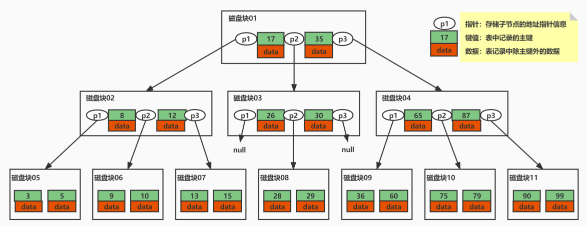

# MySQL 索引

## 索引简介

### 什么是索引

索引是数据库 **高效获取数据的数据结构**，加快查询速度，索引一般存储在表空间中，也就是磁盘里（可能存储在单独的索引文件中，也可能和数据一起存储在数据文件中）。

**常见索引包括聚簇索引、覆盖索引、组合索引、前缀索引、唯一索引等，没有特别说明，默认都是使用 B+树结构组织的索引。**

### 优势和劣势

#### 优势

**两降一升**，降低磁盘 IO 频次、降低数据排序的成本，提高数据检索效率。

- 被索引列会自动排序【B+树叶子节点的有序特性】，包括【单列索引】和【组合索引】，只是组合索引的排序要复杂一些
- 如果 Order By 的字段使用索引，效率会高特别多。

#### 劣势

- 索引会占据磁盘空间
- 索引虽然会提高查询效率，但是会降低更新表的效率。比如每次对表进行增删改操作，MySQL 不仅要保存数据，还要维护索引文件。

## 索引基本使用

### 一条 Select 语句的执行流程

```mysql
select * from tab_user WHERE id=1
```

**执行流程：**


### 索引类型

**按照索引列的数量分类：**

- 单列索引：索引中只有一个列。
- 组合索引：使用 2 个以上的字段创建的索引

#### 单列索引

- 主键索引：必须唯一 Unique Key，非空 Not Null

  ```mysql
  ALTER TABLE table_name ADD PRIMARY KEY (column_name);
  ```

- 唯一性索引：必须唯一 Unique Key，可以为空 Null

  ```mysql
  CREATE UNIQUE INDEX index_name ON table(column_name);
  ```

- 普通索引：可以不唯一，可以为空 Null

  ```mysql
  ALTER TABLE table_name ADD INDEX index_name (column_name);
  ```

- 全文索引：支持全文搜索的索引，只能对文本类型字段设置，不建议使用

- 空间索引：5.7 版支持空间索引，而且支持 OpenGIS 几何数据模型

- 前缀索引：用字段的一部分建立索引

  ```mysql
  ALTER TABLE table_name ADD INDEX index_name (column1(length));
  ```

#### 组合索引

组合索引的使用，需要遵循最左前缀原则。一般情况下，建议使用组合索引代替单列索引（主键索引除外）。

### 删除索引

```mysql
DROP INDEX index_name ON table
```

### 查看索引

```mysql
SHOW INDEX FROM table_name
```

## 索引的数据结构

#### 二叉查找树

每个节点最多有 2 个分叉，左子树和右子树数据顺序左小右大。

二叉树的检索复杂度和树高相关：**理想状态下效率可以达到 O(logn)。**

极端情况下，二叉查找树会构建成为单向链表 = 查找全表扫描。对磁盘不友好【一旦变成了全表扫描，磁盘 io 将是极其沉重】。

#### 红黑树

红黑树是一个近似平衡的二叉树。

平衡二叉树是采用二分法思维，平衡二叉查找树除了具备二叉树的特点，最主要的特征是树的 **左右两个子树的层级最多相差 1**。在插入删除数据时通过 **左旋/右旋** 操作保持二叉树的平衡，不会出现左子树很高、右子树很矮的情况。

使用平衡二叉查找树查询的性能接近于二分查找法，时间复杂度是 O(log2n)。

**平衡二叉树存在的问题：**

1. 时间复杂度和树高相关：树有多高就需要检索多少次，**每个节点的读取，都对应一次磁盘 IO 操作【瓶颈】**。
磁盘每次寻道时间为 10ms，在表数据量大时，对响应时间要求高的场景下，查询性能就会出现瓶颈。例如：1 百万的数据量，log2n 约等于 20 次磁盘 IO，时间 20*10 = 0.2s
2. 平衡二叉树 **不支持范围查询快速查找**，范围查询时需要从根节点多次遍历，查询效率极差。
3. 数据量大的情况下，**索引存储空间占用巨大。**

#### B 树

**B 树是改进二叉树，为多叉树。**

想要减少耗时的 IO 操作，就要尽量降低树的高度。每个节点存储多个元素，**在每个节点尽可能多的存储数据**。每个节点可以存储 1000 个索引（16k/16 = 1000），这样就将二叉树改造成了多叉树，通过增加树的叉树，将树从高瘦变为矮胖。

**主要特点：**

1. B 树的节点中存储着多个元素，每个节点内有多个分叉。
2. 节点中的元素包含键值和数据，节点中的键值从小到大排列。也就是说，在所有的节点都储存数据。
3. 父节点当中的元素不会出现在子节点中。
4. 所有的叶子结点都位于同一层，叶节点具有相同的深度，叶节点之间没有指针连接。



**B 树如何查询数据？**

假如我们查询值等于 15 的数据。查询路径磁盘块 1-> 磁盘块 2-> 磁盘块 7。

**优点：**

1. 磁盘 IO 次数会大大减少。
2. 比较是在内存中进行的，比较的耗时可以忽略不计。
3. B 树的高度相比于平衡二叉树会大幅缩小，所以使用 B 树构建索引可以很好的提升查询的效率。

**缺点：**

1. **B 树不支持范围查询的快速查找**：如果我们想要查找 15 和 26 之间的数据，查找到 15 之后，需要回到根节点重新遍历查找，需要从根节点进行多次遍历，查询效率有待提高。
2. **空间占用较大**：如果 data 存储的是行记录，行的大小随着列数的增多，所占空间会变大。一个页中可存储的数据量就会变少，树相应就会变高，磁盘 IO 次数就会变大。

#### B+ 树

**改进 B 树，非叶子节点不存储数据**

在 B 树基础上，MySQL 在 B 树的基础上继续改造，使用 B+树构建索引。B+树和 B 树最主要的区别在于 **非叶子节点是否存储数据** 的问题：

- **B 树：** 非叶子节点和叶子节点都会存储数据。
- **B+树：** **只有叶子节点才会存储数据，非叶子节点只存储键值**。叶子节点之间使用双向指针连接，最底层的叶子节点形成了一个双向有序链表。


**等值查询：**

假如我们查询值等于 15 的数据。查询路径磁盘块 1-> 磁盘块 2-> 磁盘块 5。

**范围查询：**

假如我们想要查找 15 和 26 之间的数据。查找路径是：

1. 磁盘块 1-> 磁盘块 2-> 磁盘块 5。
2. 首先查找值等于 15 的数据，将值等于 15 的数据缓存到结果集【三次磁盘 IO】。
3. 查找到 15 之后，底层的叶子节点是一个有序列表，我们从磁盘块 5，键值 15 开始向后遍历筛选所有符合筛选条件的数据。
4. 第四次磁盘 IO：根据磁盘 5 后继指针到磁盘中寻址定位到磁盘块 6，将磁盘 6 加载到内存中，在内存中从头遍历比较，15 < 17 < 26，15 < 26 <= 26，将 data 缓存到结果集。

**优点：**

1. 继承了 B 树的优点【多叉树的优点】
2. 保证等值和范围查询的快速查找

**MySQL 的索引就采用了 B+树的数据结构。**

## InnoDB 索引

### InnoDB 索引简介

每个 InnoDB 表都有一个聚簇索引 ，也叫聚集索引。聚簇索引使用 B+树构建，**叶子节点存储的数据是整行记录**。一般情况下，**聚簇索引等同于主键索引**，当一个表没有创建主键索引时，InnoDB 会自动创建一个 ROWID 字段来构建聚簇索引。

**除聚簇索引之外的所有索引都称为辅助索引。** 在 InnoDB 中，辅助索引中的叶子节点存储的数据都是 **该行的主键值**。 在检索时，InnoDB 使用此主键值在聚簇索引中搜索行记录。

**InnoDB 创建索引的具体规则如下：**

1. 在表上定义主键 PRIMARY KEY，InnoDB 将主键索引用作聚簇索引。
2. 如果表没有定义主键，InnoDB 会选择第一个不为 NULL 的唯一索引列用作聚簇索引。
3. 如果以上两个都没有，InnoDB 会使用一个 6 字节长整型的隐式字段 ROWID 字段构建聚簇索引。该 ROWID 字段会在插入新行时自动递增。

**`对于两种索引的实现，以 t_user_innodb 为例，t_user_innodb 的 id 列为主键，age 列为普通索引。`**

### 主键索引

- 主键索引的叶子节点会存储数据行，辅助索引只会存储主键值。
- InnoDB 要求表必须有一个主键索引(MyISAM 可以没有)。


#### 等值查询

```mysql
select * from t_user_innodb where id=30;
```

1. 先在主键树中从根节点开始检索，将根节点加载到内存，比较 30 < 56，走左路。（1 次磁盘 IO）
2. 将左子树节点加载到内存中，比较 20 < 30 < 49，向下检索。（1 次磁盘 IO）
3. 检索到叶节点，将节点加载到内存中遍历，比较 20 < 30，30 = 30。查找到值等于 30 的索引项，直接可以获取整行数据。将改记录返回给客户端。（1 次磁盘 IO）

#### 范围查询

```mysql
select * from t_user_innodb where id between 30 and 49;
```

1. 先在主键树中从根节点开始检索，将根节点加载到内存，比较 30 < 56，走左路。（1 次磁盘 IO）
2. 将左子树节点加载到内存中，比较 20 < 30 < 49，向下检索。（1 次磁盘 IO）
3. 检索到叶节点，将节点加载到内存中遍历比较 20 < 30，30 <= 30 < 49。查找到值等于 30 的索引项。获取行数据缓存到结果集中。（1 次磁盘 IO）
4. 向后遍历底层叶子链表，将下一个节点加载到内存中，遍历比较，30 < 49 <= 49，获取行数据缓存到结果集中。（1 次磁盘 IO）
5. 最后得到 2 条符合筛选条件，将查询结果集返给客户端

因为在主键索引中直接存储了行数据，所以 InnoDB 在使用主键查询时可以快速获取行数据。当表很大时，与在索引树中存储磁盘地址的方式相比，因为不用再去磁盘中获取数据，所以聚簇索引通常可以节省磁盘 IO 操作。

**`磁盘IO次数：2次 + 检索叶子节点数量。`**

### 辅助索引

- 除聚簇索引之外的所有索引都称为辅助索引，InnoDB 的辅助索引只会存储主键值而非磁盘地址。
- 使用辅助索引需要 **检索两遍索引**：首先检索辅助索引获得主键，然后使用主键到主索引中检索获得记录。


#### 等值查询

```mysql
select * from t_user_innodb where age=22;
```

1. 先在索引树中从根节点开始检索，将根节点加载到内存，比较 22 < 77，走左路。（1 次磁盘 IO）
2. 将左子树节点加载到内存中，比较 22 < 34，向下检索。（1 次磁盘 IO）
3. 检索到叶节点，将节点加载到内存中从前往后遍历比较。（1 次磁盘 IO）
- 第一项 5：5 < 22 不符合要求，丢弃。
- 第二项 22：等于 22，符合要求，获取主键 id = 18，去主键索引树中检索 id = 18 的数据放入结果集中。（回表查询：3 次磁盘 IO）
- 第三项 22：等于 22，符合要求，获取主键 id = 49，去主键索引树中检索 id = 49 的数据放入结果集中。（回表查询：3 次磁盘 IO）
4. 向后遍历底层叶子链表，将下一个节点加载到内存中，遍历比较。（1 次磁盘 IO）
- 第一项 34：34 > 22 不符合要求，丢弃。查询结束。
5. 最后得到 2 条符合筛选条件，将查询结果集返给客户端。

**`磁盘 IO 次数：2 次+检索叶子节点数量+记录数*3。(2+2+6=10次)`**

#### 范围查询

```mysql
select * from t_user_innodb where age between 30 and 49;
```

- **辅助索引的范围查询流程和等值查询基本一致**，先使用辅助索引到叶子节点检索到第一个符合条件的索引项，然后向后遍历，直到遇到第一个不符合条件的索引项，终止。
- 检索过程中需要将符合筛选条件的 id 值，依次到主键索引检索将检索的数据放入结果集中。
- 最后将查询结果返回客户端。

#### 回表查询

根据在辅助索引树中获取的主键 id，到主键索引树检索数据的过程称为回表查询。

### 组合索引

#### 存储结构

```mysql
CREATE TABLE `t_multiple_index` (
    `id` int(11) NOT NULL AUTO_INCREMENT,
    `a` int(11) DEFAULT NULL,
    `b` int(11) DEFAULT NULL,
    `c` varchar(10) DEFAULT NULL,
    `d` varchar(10) DEFAULT NULL,
    PRIMARY KEY (`id`) USING BTREE,
	KEY `idx_abc` (`a`,`b`,`c`)
) ENGINE=InnoDB;
insert into t_multiple_index (a,b,c,id,d) values(1 ,1 ,4,5,'dll');
insert into t_multiple_index (a,b,c,id,d) values(1 ,5 ,4,2,'doc');
insert into t_multiple_index (a,b,c,id,d) values(5 ,3 ,6,7,'img');
insert into t_multiple_index (a,b,c,id,d) values(13,14,3,4,'xml');
insert into t_multiple_index (a,b,c,id,d) values(13,16,4,1,'txt');
insert into t_multiple_index (a,b,c,id,d) values(13,16,5,3,'pdf');
insert into t_multiple_index (a,b,c,id,d) values(13,16,5,6,'exe');
insert into t_multiple_index (a,b,c,id,d) values(14,14,14,8,'ddd');
```

以 `t_multiple_index` 表为例，索引树中节点中的索引项按照（a，b，c）的顺序从大到小排列，先按照 a 列排序，a 列相同时按照 b 列排序，b 列相同按照 c 列排序。在最底层的叶子节点中，如果两个索引项的 a，b，c 三列都相同，索引项按照主键 id 排序。

**所以组合索引的最底层叶子节点中不存在完全相同的索引项。**


#### 查找方式

```mysql
select * from t_multiple_index where a=13 and b=16 and c=4;
```

1. 先在索引树中从根节点开始检索，将根节点加载到内存，先比较 a 列，a = 14，14 > 13，走左路。（1 次磁盘 IO）
2. 将左子树节点加载到内存中，先比较 a 列，a = 13，比较 b 列 b = 16，14 < 16，走右路，向下检索。（1 次磁盘 IO）
3. 达到叶节点，将节点加载到内存中从前往后遍历比较。（1 次磁盘 IO）
- 第一项（13,14,3, id = 4）：先比较 a 列，a = 13，比较 b 列 b = 14，b!= 16 不符合要求，丢弃。
- 第二项（13,14,4, id = 1）：一样的比较方式，a = 13，b = 16，c = 4 满足筛选条件。取出索引 data 值即主键 id = 1，再去主键索引树中检索 id = 1 的数据放入结果集中。（回表：3 次磁盘 IO）
- 第三项（13,14,5, id = 3）：a = 13，b = 16，c!= 4 不符合要求，丢弃。查询结束。
4. 最后得到 1 条符合筛选条件，将查询结果集返给客户端。

#### 最左前缀匹配原则

**组合索引的最左前缀匹配原则：使用组合索引查询时，MySQL 会一直向右匹配直至遇到范围查询(`>、<、between、like`)就停止匹配。**

- 最左前缀匹配原则和联合索引的索引存储结构和检索方式是有关系的。
- 在组合索引树中，最底层的叶子节点按照第一列 a 列从左到右递增排列，但是 b 列和 c 列是无序的，b 列只有在 a 列值相等的情况下小范围内递增有序，而 c 列只能在 a，b 两列相等的情况下小范围内递增有序。
- 当我们使用 where a = 13 and b = 16 and c = 4 去查询数据的时候，B+树会先比较 a 列来确定下一步应该搜索的方向，往左还是往右。如果 a 列相同再比较 b 列。**但是如果查询条件没有 a 列，B+树就不知道第一步应该从哪个节点查起。**

所以创建的 idx_abc(a, b, c)索引，相当于创建了 **(a)、（a, b）（a, b, c）** 三个索引。

另外，书写 SQL 条件的顺序，不一定是执行时候的 where 条件顺序。优化器会帮助我们优化成索引可以识别的形式。比如:

```mysql
select * from t_multiple_index where b=16 and c=4 and a=13;
#等价于下面的sql，优化器会按照索引的顺序优化
select * from t_multiple_index where a=13 and b=16 and c=4;
```

#### 索引使用口诀

> 全值匹配我最爱，最左前缀要遵守。
> 带头大哥不能死，中间兄弟不能断。
> 索引列上不计算，范围之后全失效。
> Like 百分写最右，覆盖索引不写星。
> 不等空值还有 OR，索引失效要少用。

### 覆盖索引

根据在辅助索引树查询数据时，首先通过辅助索引找到主键值，然后需要再根据主键值到主键索引中找到主键对应的数据。这个过程称为 **回表**。

使用辅助索引查询比基于主键索引的查询多检索了一棵索引树。**那是不是所有使用辅助索引的查询都需要回表查询呢？**

#### 什么是覆盖索引

select 中列数据如果可以直接在辅助索引树上全部获取，也就是说索引树已经“覆盖”了我们的查询需求，这时 MySQL 就不会做回表查询，这中现象就是 **覆盖索引。**

使用 explain 工具查看执行计划，可以看到 extra 中“Using index”，代表使用了覆盖索引。


```mysql
-- 再举几个栗子
select a,b from t_multiple_index where a=13 and b=16;
select b from t_multiple_index where b=16 and c=4;
select b,c from t_multiple_index where c=4;
```

上面的查询语句用到了覆盖索引进行 **索引扫描**。MySQL 基于成本考虑，会使用了覆盖索引进行全表扫描，使用覆盖索引可以减少了磁盘 IO 次数，显著提升查询性能。

覆盖索引相比与主键索引一个索引项占用的空间少，覆盖索引一个叶子节点中的就可以比主键索引存放更多的数据量，相应的存放数据用到的总叶子树很少一些。

### 索引条件下推

索引条件下推，Index Condition Pushdown，简称 ICP。是 MySQL5.6 对使用索引从表中检索行的一种优化。ICP 可以减少存储引擎必须访问基表的次数以及 MySQL 服务器必须访问存储引擎的次数。可用于 InnoDB 和 MyISAM 表，**对于 InnoDB 表 ICP 仅用于辅助索引**。

可以通过参数 `optimizer_switch` 控制 ICP 的开始和关闭

```mysql
# optimizer_switch 优化相关参数开关
show VARIABLES like 'optimizer_switch';
# 关闭ICP
SET optimizer_switch = 'index_condition_pushdown=off';
# 开启ICP
SET optimizer_switch = 'index_condition_pushdown=on';
```

以 InnoDB 的辅助索引为例，来讲解 ICP 的作用：MySQl 在使用组合索引在检索数据时是使用最左前缀原则来定位记录，左侧前缀之后不匹配的后缀，MySQL 会怎么处理？

```mysql
select * from t_multiple_index where a=13 and b>15 and c='5' and d='pdf';
```


关闭 ICP，使用 explain 工具，查看执行计划，extra 列中的“Using where”执行器表示没有使用了索引条件下推 ICP。


#### 不使用 ICP


**具体步骤如下：**

1. 执行器使用索引(a, b, c)，筛选条件 a = 13 and b >= 15，调用存储引擎 "下一行" 接口。根据最左前缀原则联合索引检索定位到索引项（13,16,4, id = 1），然后 **使用 id = 1 回表查询，获得 id = 1 的行记录。返回给 MySQL 服务层，MySQL 服务层使用剩余条件 c = 5 and d ='pdf' 过滤，不符合要求，直接丢弃**。
2. 执行器调用 "下一行" 接口，存储引擎遍历向后找到索引项（13,16,5, id = 3）, 使用 id = 3 回表获得 id = 3 的行记录。返回给 MySQL 服务层，MySQL 服务层使用剩余条件 c = 5 and d ='pdf'过滤，符合要求，缓存到结果集。
3. 执行器调用 "下一行" 接口，存储引擎遍历向后找到索引项（13,16,5, id = 6）, 使用 id = 6 回表获得 id = 6 的行记录。返回给 MySQL 服务层，MySQL 服务层使用剩余条件 c = 5 and d ='pdf'过滤，不符合要求，直接丢弃。
4. 执行器调用 "下一行" 接口，存储引擎遍历向后找到索引项（14,14,14, id = 8）不满足筛选条件，执行器终止查询。
5. 最终获取一条记录，返回给客户端。

**在不使用 ICP 时，回表查询了 3 次，然后在服务层筛选后（筛选 3 次），最后返回客户端。**

#### 使用 ICP

在 MySQL 5.6 引入了 ICP，可以在索引遍历过程中，对 where 中包含的索引条件先做判断，只有满足条件的才会回表查询读取行数据。这么做可以减少回表查询，从而减少磁盘 IO 次数。


**具体步骤如下：**

1. 执行器使用索引(a, b, c)，筛选条件 a = 13 and b >= 15 and c = 5，调用存储引擎 "下一行" 接口。根据最左前缀原则联合索引检索定位到索引项（13,16,4, id = 1），**然后使用 ICP 下推条件 c = 5 判断，不满足条件，直接丢弃。**
2. 执行器调用 "下一行" 接口，向后遍历判断索引项（13,16,5, id = 3），满足筛选条件 a = 13 and b >= 15 and c = 5，使用 id = 3 回表获得 id = 3 的行记录。返回给 MySQL 服务层，MySQL 服务层使用剩余条件 d ='pdf'过滤，符合要求，缓存到结果集。
3. 执行器调用 "下一行" 接口，存储引擎遍历向后找到索引项（13,16,5, id = 6）, 满足筛选条件 a = 13 and b >= 15 and c = 5，使用 id = 6 回表获得 id = 6 的行记录。返回给 MySQL 服务层，MySQL 服务层使用剩余条件 d ='pdf'过滤，不符合要求，直接丢弃。
4. 执行器调用 "下一行" 接口，存储引擎遍历向后找到索引项（14,14,14, id = 8）不满足筛选条件，执行器终止查询。
5. 最终获取一条记录，返回给客户端。

**使用 ICP 时，回表查询了 2 次，然后在服务层筛选后（筛选 2 次），最后返回客户端。**

- **不使用 ICP：** 不满足最左前缀的索引条件的比较是在 Server 层进行的，非索引条件的比较是在 Server 层进行的。
- **使用 ICP：** 所有的索引条件的比较是在存储引擎层进行的，非索引条件的比较是在 Server 层进行的。

## 索引创建原则

#### 哪些情况需要创建索引

1. 频繁出现在 where 条件字段，order 排序，group by 分组字段
2. select 频繁查询的列，考虑是否需要创建联合索引（覆盖索引，不回表）
3. 多表 join 关联查询，on 字段两边的字段都要创建索引

#### 索引优化建议

1. **表记录很少不需创建索引：** 索引是要有存储的开销

2. **一个表的索引不能过多：**

   - **空间：** 浪费空间。每个索引都是一个索引树，占据大量的磁盘空间。
   - **时间：** 更新（Insert/Delete/Update）变慢。需要更新所有的索引树，太多的索引也会增加优化器的选择时间。

3. **频繁更新的字段，不建议作为索引：** 频繁更新的字段引发频繁的页分裂和页合并，性能消耗比较高。

4. **区分度低的字段，不建议创建索引：** 比如性别、状态等。区分度太低会导致扫描行数过多，再加上回表查询的消耗，比全表扫描的性能还要差。这些字段一般会用在组合索引中。

5. **在 InnoDB 存储引擎中，主键索引建议使用自增的长整型，避免使用很长的字段：** 主键字段越长，索引页和辅助索引的叶子节点可存储的数据量就越少，查询时磁盘 IO 次数会增多，降低查询效率。

6. **无序的字段，不建议作为索引：** 如：身份证，UUID 等。更新数据时，会出现频繁的页分裂，页内数据不紧凑浪费存储空间

7. **尽量创建组合索引，而不是单列索引：**

   - **优点：**一个顶多个，节省空间，可以使用覆盖索引和 ICP。

   - **创建组合索引原则：**组合索引把频繁使用的列、区分度高的列放在前面。频繁使用代表利用率高，区分度高代表筛选粒度大，这样做可最大限度利用索引价值，缩小筛选范围。
