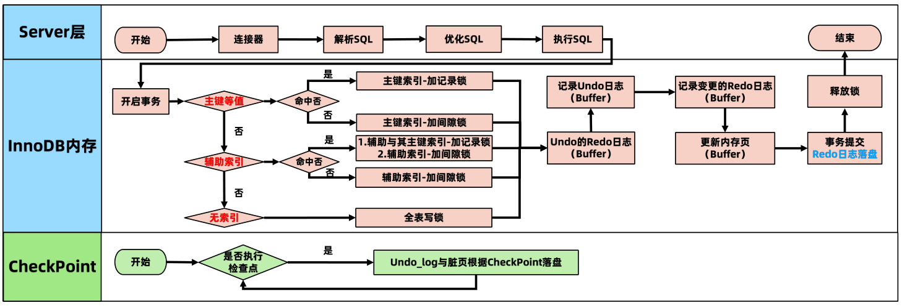
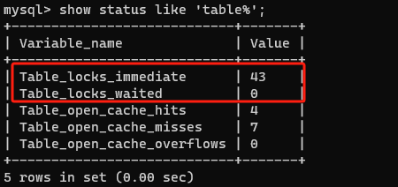
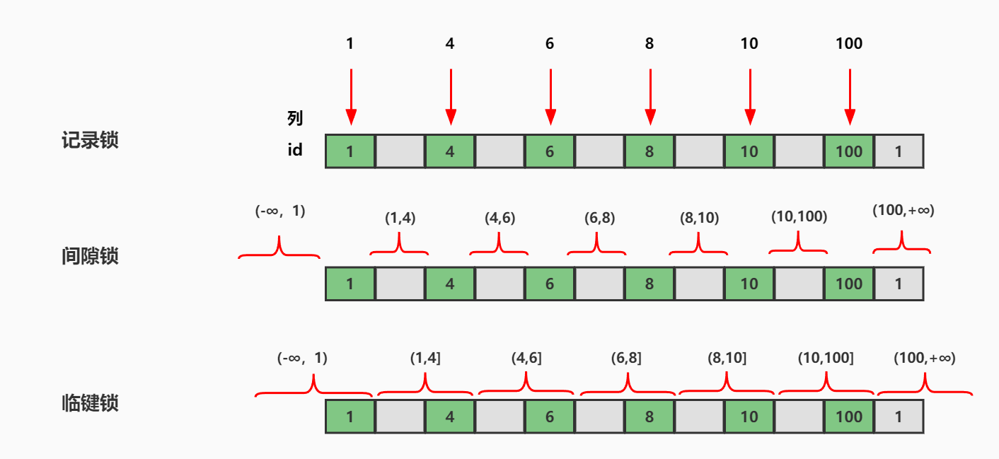
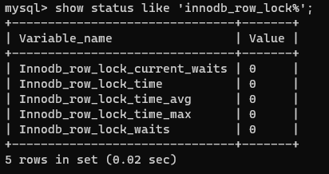
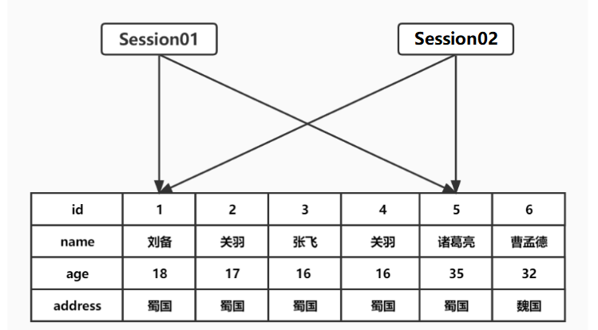
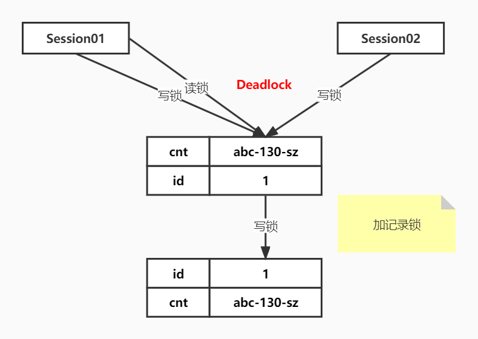

# MySQL 锁

## 一条 Update 语句的执行流程

```mysql
update t_user set name='张三' where id = 1;
```



## MySQL 锁简介

在实际的数据库系统中，**每时每刻都在发生着锁**，当某个用户在修改一部分数据时，MySQL 会通过锁定防止其他用户读取同一数据。

在处理并发读或者写时，通过由两种类型的锁组成的锁系统来解决问题：**共享锁(shared lock)和排他锁(exclusive lock)，也叫读锁(read lock)和写锁(write lock)。**

### 锁分类

#### 按锁功能划分

- **共享锁（shared lock）：** 也叫 S 锁、读锁，**读锁是共享的，读锁之间互相不阻塞**。加锁方式：select … lock in share mode
- **排他锁（exclusive lock）：** 也叫 X 锁、写锁，**写锁是排他的，写锁阻塞其他的读和写锁**。加锁方式：select … for update

#### 按粒度分

- **全局锁：** 锁 DB，由 SQL Layer 层实现

- **表级锁：** 锁 Table，由 SQL Layer 层实现

- **行级锁：** 锁 Row 的索引，由存储引擎实现
  - 记录锁（Record Locks）：锁定索引中一条记录
  - 间隙锁（Gap Locks）：仅仅锁住一个索引区间
  - 临键锁（Next-Key Locks）：记录锁和间隙锁的组合，解决幻读问题
  - 插入意向锁(Insert Intention Locks)：做 insert 时添加的对记录 id 的锁
  - 意向锁：存储引擎级别的“表级”锁

## 全局锁

全局锁是对整个数据库实例加锁，加锁后整个实例就处于只读状态，将阻塞 DML、DDL 及已经更新但未提交的语句。

典型的使用场景是做全库的逻辑备份，对所有的表进行锁定，从而获取一致性视图，保证数据的完整性。

```mysql
# 加全局锁的命令
flush tables with read lock;
# 释放全局锁的命令（或者断开加锁session的连接，自动释放全局锁）
unlock tables;
```

对于 innodb 这种支持事务的引擎，使用 mysqldump 备份时可以使用 `--single-transaction` 参数，利用 mvcc 提供一致性视图，而不使用全局锁，不会影响业务的正常运行。而对于有 MyISAM 这种不支持事务的表，就只能通过全局锁获得一致性视图，对应的 mysqldump 参数为 `--lock-all-tables`。

```mysql
# 提交请求锁定所有数据库中的所有表，以保证数据的一致性，全局读锁【LBCC】
mysqldump -uroot -p --host=localhost --all-databases --lock-all-tables > /root/db.sql
# 一致性视图【MVCC】
mysqldump -uroot -p --host=localhost --all-databases --single-transaction > /root/db.sql
```

## 表级锁

### 什么是表级锁

- 表读锁（Table Read Lock），阻塞对当前表的写，但不阻塞读（当前锁定表的 Session **不能查询其他没有锁定的表**，其他 Session 可以查询或更新未锁定的表。当前 Session **插入或更新锁定的表** 会提示错误，此时其他 Session 插入或更新锁定表会一直 **等待获取锁**，直至锁定表的 Session 释放锁，才能插入或更新成功。）
- 表写锁（Table Write Lock），阻塞对当前表的读和写（当前 Session 对锁定表的查询、插入、更新操作都可以执行，其他 Session 对锁定表的查询被阻塞，需要等待锁被释放）
- 元数据锁（Meta Data Lock，MDL)不需要显式指定，在访问表时会被自动加上，作用保证读写的正确性

  - 当对表做 **增删改查** 操作的时 **加元数据读锁**
  - 当对表做 **结构变更** 操作的时 **加元数据写锁**
- 自增锁(AUTO-INC Locks) AUTO-INC 是一种特殊的表级锁，自增列事务性插入操作时产生

### 表读锁、写锁

MySQL 实现的表级锁定的争用状态变量：

```mysql
# 查看表锁定状态
show status like 'table%';
show status like 'table_locks%';
```



- table_locks_immediate：产生表级锁定的次数
- table_locks_waited：出现表级锁定争用而发生等待的次数

#### 表锁相关命令

```mysql
# 查看表锁定状态
show status like 'table_locks%';
# 添加表读锁(为表t加读锁)
lock table t read;
# 添加表写锁(为表t加写锁)
lock table t write;
# 查看表锁情况
show open tables;
# 删除表锁
unlock tables;
```

### 元数据锁

元数据锁不需要显式指定，在访问一个表的时候会被自动加上，锁的作用是保证读写的正确性。

如果一个查询正在遍历一个表中的数据，而执行期间另一个线程对这个表结构做变更，删了一列，那么查询线程拿到的结果跟表结构对不上，肯定是不行的。因此，在 **MySQL 5.5 版本中引入了元数据锁**，当对一个表做 **增删改查** 操作的时候，**加元数据读锁**；当要对表做 **结构变更** 操作的时候，**加元数据写锁**。

- **读锁是共享的，是互相不阻塞的：** 可以有多个线程同时对一张表加读锁，保证数据在读取的过程中不会被其他线程修改。
- **写锁则是排他的：** 一个写锁会阻塞其他的写锁和读锁，用来保证变更表结构操作的安全性。因此，如果有两个线程要同时给一个表加字段，其中一个要等另一个执行完才能开始执行。

### 自增锁(AUTO-INC Locks)

AUTO-INC 锁是一种特殊的表级锁，发生涉及 AUTO_INCREMENT 列的事务性插入操作时产生。

## 行级锁

MySQL 的行级锁，是由存储引擎来实现的。InnoDB 行锁是通过给 **索引上的索引项加锁来实现的**。因此 InnoDB 这种行锁实现特点 **：只有通过索引条件检索的数据，InnoDB 才使用行级锁，否则，InnoDB 将使用表锁！**

**按范围分：**

- **记录锁（Record Locks）：** 锁定索引中一条记录。
- **间隙锁（Gap Locks）：** 要么锁住索引记录中间的值，要么锁住第一个索引记录前面的值或者最后一个索引记录后面的值。
- **临键锁（Next-Key Locks）：** 是索引记录上的记录锁和在索引记录之前的间隙锁的组合（间隙锁 + 记录锁）。
- **插入意向锁(Insert Intention Locks)：** insert 操作时添加的对记录 id 的锁。

**按功能分：**

- **读锁：** 允许事务 **去读目标行**，阻止其他事务 **更新**。阻止其他事务加写锁，但不阻止加读锁。
- **写锁：** 允许事务 **更新目标行**，阻止其他事务 **获取或修改**。同时阻止其他事务加读锁和写锁。

### 如何加行锁

- 对于 Update、Delete 和 Insert 语句，InnoDB 会自动给涉及数据集 **加写锁**

- 对于普通 Select 语句，InnoDB **不会加任何锁**

- 事务手动给 Select 记录集加读锁或写锁

  ```mysql
  # 添加读锁
  select * from t1_simple where id = 4 lock in share mode;
  # 添加写锁
  select * from t1_simple where id = 4 for update;
  ```

**创建测试表**

```mysql
CREATE TABLE `t1_simple` (
`id` int(11) NOT NULL,
`pubtime` int(11) NULL DEFAULT NULL,
PRIMARY KEY (`id`) USING BTREE,
INDEX `idx_pu`(`pubtime`) USING BTREE
) ENGINE = InnoDB;
INSERT INTO `t1_simple` VALUES (1, 10);
INSERT INTO `t1_simple` VALUES (4, 3);
INSERT INTO `t1_simple` VALUES (6, 100);
INSERT INTO `t1_simple` VALUES (8, 5);
INSERT INTO `t1_simple` VALUES (10, 1);
INSERT INTO `t1_simple` VALUES (100, 20);
```

**主键 id 索引的行锁区间划分图**



### 记录锁

记录锁（Record Locks）仅仅 **锁住索引记录的一行**。记录锁锁住的 **永远是索引**，而非记录本身，即使该表上没有任何显示索引，那么 innodb 会在后台创建一个 **隐藏列 ROWID 的聚簇索引**，那么锁住的就是这个隐藏的聚簇索引索引。


### 间隙锁

间隙锁（Gap Locks）仅仅锁住一个 **索引区间，开区间，不包括双端端点和索引记录。**

在 **索引记录间隙中加锁**，并不包括该索引记录本身。

间隙锁可用于 **防止幻读，保证索引间隙不会被插入数据**（在可重复读（REPEATABLE READ）隔离级别下生效）。

**例如：**

session1 执行：

```mysql
begin;
select * from t1_simple where id > 4 for update; -- 加间隙锁，临键锁区间(4,100+)
commit;
```

session2 执行：

```mysql
begin;
insert into t1_simple values (7,100); -- 阻塞
insert into t1_simple values (3,100); -- 成功
commit;
```

### 临键锁

临键锁（Next-Key Locks）相当于记录锁 + 间隙锁，**左开右闭区间**。默认情况下，InnoDB 使用临键锁来锁定记录，但会在不同场景中退化：

- 场景 01-唯一性字段等值（=）且记录存在，退化为记录锁
- 场景 02-唯一性字段等值（=）且记录不存在，退化为间隙锁
- 场景 03-唯一性字段范围（< >），还是临键锁
- 场景 04-非唯一性字段，默认是临键锁

**例如：**

session1 执行：

```mysql
begin;
select * from t1_simple where pubtime = 20 for update;
-- 临键锁区间(10,20],(20,100]
commit;
```

session2 执行：

```mysql
begin;
insert into t1_simple values (16, 19); -- 阻塞
select * from t1_simple where pubtime = 20 for update; -- 阻塞
insert into t1_simple values (16, 50); -- 阻塞
insert into t1_simple values (16, 101); -- 成功
commit;
```

### 插入意向锁

插入意向锁（Insert Intention Locks）是一种在 INSERT 操作之前设置的一种特殊的间隙锁。

插入意向锁表示了一种插入意图，即当多个不同的事务，同时往同一个索引的同一个间隙中插入数据的时候，它们互相之间无需等待，即不会阻塞。

插入意向锁不会阻止插入意向锁，但是插入意向锁会阻止其他 **间隙写锁（排他锁）、记录锁。**

**例如：** 现在有两个事务，分别尝试插入值为 60 和 70 的记录，每个事务使用插入意向锁锁定 11 和 99 之间的间隙，但是这两个事务不会相互阻塞，因为行是不冲突的，这就是插入意向锁。


### 加锁规则

**主键索引：**

- 等值条件，命中，加记录锁
- 等值条件，未命中，加间隙锁
- 范围条件，命中包含 where 条件的临键区间，加临键锁
- 范围条件，未命中，加间隙锁

**辅助索引：**

- 等值条件，命中，命中记录辅助索引项 + 回表主键索引项，加记录锁，辅助索引项两侧加间隙锁（隔离级别为 RC 不加间隙锁，为 RR 加间隙锁）
- 等值条件，未命中，加间隙锁
- 范围条件，命中包含 where 条件的临键区间，加临键锁。命中记录回表主键索引项加记录锁
- 范围条件，未命中，加间隙锁

### 意向锁

InnoDB 实现了类似表级锁的锁，叫做意向锁（Intention Locks），意向锁是 InnoDB 自动控制不需要手动干预，意向锁和行锁是共存的。意向锁的存在是为了协调行锁和表锁的关系，支持行锁和表锁的共存。主要目标是为了全表更新数据时提升性能。

**例如：**

事务 A 修改 user 表的记录 r，会给记录 r 上一把行级的写锁，同时会给 user 表上一把意向写锁（IX），这时事务 B 要给 user 表上一个表级的写锁就会被阻塞。意向锁通过这种方式实现了行锁和表锁共存，且满足事务隔离性的要求。

当我们需要加一个写锁时，需要根据意向锁去判断表中有没有数据行被锁定：

1. 如果行锁，则需要遍历每一行数据去确认；
2. 如果表锁，则只需要判断一次即可知道有没数据行被锁定，提升性能。

**注意：行级写锁不会因为有别的事务上了意向写锁而堵塞，MySQL 允许不同行的多个行级写锁同时存在**


### 锁相关参数

InnoDB 所使用的行级锁定争用状态查看：`show status like 'innodb_row_lock%'`;



- Innodb_row_lock_current_waits：当前正在等待锁定的数量
- Innodb_row_lock_time：从系统启动到现在锁定总时间长度（重要）
- Innodb_row_lock_time_avg：每次等待所花平均时间（重要）
- Innodb_row_lock_time_max：从系统启动到现在等待最常的一次所花的时间
- Innodb_row_lock_waits：系统启动后到现在总共等待的次数（重要）

当等待次数很高，而且每次等待时长也不小的时候，就需要分析系统中为什么会有如此多的等待，然后根据分析结果着手指定优化计划。

## 死锁

### 什么是死锁

#### 情况 1

两个 Session 的两条 SQL 产生死锁。



| 时刻 | session01                                        | session02                           |
| ---- | ------------------------------------------------ | ----------------------------------- |
| T1   | begin;                                           | begin;                              |
| T2   | select * from t1_deadlock where id = 1 for update; |                                     |
| T3   |                                                  | delete from t1_deadlock where id = 5; |
| T4   | update t1_deadlock set name ='qqq' where id = 5;    |                                     |
| T5   | 死锁                                             | delete from t1_deadlock where id = 1; |
| T6   | commit                                           | commit                              |

#### 情况 2

两个 Session 的一条 SQL，产生死锁



| 时刻 | session01                                                    | session02                                         |
| ---- | ------------------------------------------------------------ | ------------------------------------------------- |
| T1   | begin;                                                       | begin;                                            |
| T2   | delete from t1_deadlock03 where cnt ='abc-130-sz';            |                                                   |
| T3   |                                                              | delete from t1_deadlock03 where cnt ='abc-130-sz'; |
| T4   | insert into t1_deadlock03(cnt) values ('abc-130-sz'); -- 在加写锁之前会先加读锁 | 死锁                                              |
| T5   | commit                                                       | commit                                            |

死锁的发生与否，并不在于事务中有多少条 SQL 语句，**死锁的关键在于：两个(或以上)的 Session【加锁的顺序】不一致**

```mysql
-- 查询最近一次死锁日志
SHOW ENGINE INNODB STATUS;
```

### 如何避免死锁

- 注意程序逻辑：根本原因是程序逻辑的顺序交叠
- 保持事务轻量：越是轻量的事务，占有越少的锁资源，这样发生死锁的几率就越小
- 提高运行速度：避免使用子查询，尽量使用主键等等
- 尽量快提交事务，减少持有锁的时间：越早提交事务，锁就越早释放

**注意：MySQL会主动探知死锁，并回滚某一个影响最小的事务，等另一事务执行完后，再重新执行该事务。**
