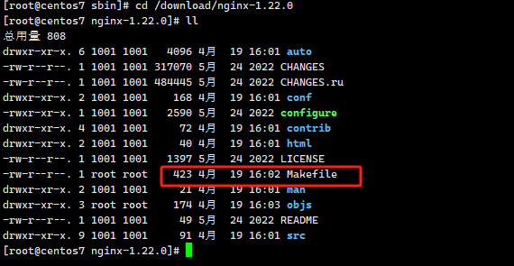
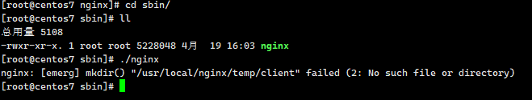
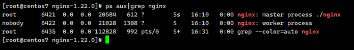
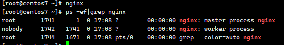

# Nginx 下载安装

## 使用 yum 方式安装

```shell
 sudo yum install -y nginx
 whereis nginx
```

**`注意：`** 此种方式安装：`nginx.conf` 文件在/etc/nginx 目录下。`可执行文件 nginx` 在/usr/sbin/nginx 目录下。`html 静态资源文件` 在/usr/share/nginx 目录下。

## 通过编译源码安装

### 安装 gcc 环境

```shell
yum install -y gcc-c++
```

### 安装第三方库

```shell
yum install -y pcre pcre-devel zlib zlib-devel openssl openssl-devel
```

#### PCRE

PCRE(Perl Compatible Regular Expressions)是一个 Perl 库，包括 perl 兼容的正则表达式库。nginx 的 http 模块使用 pcre 来解析正则表达式，所以需要在 linux 上安装 pcre 库。

此外，pcre-devel 是使用 pcre 开发的一个二次开发库，nginx 也需要此库。

#### zlib

zlib 库提供了很多种压缩和解压缩的方式，nginx 使用 zlib 对 http 包的内容进行 gzip，所以需要在 linux 上安装 zlib 库。

#### OpenSSL

OpenSSL 是一个强大的安全套接字层密码库，囊括主要的密码算法、常用的密钥和证书封装管理功能及 SSL 协议，并提供丰富的应用程序供测试或其它目的使用。nginx 不仅支持 http 协议，还支持 https（即在 ssl 协议上传输 http），所以需要在 linux 安装 openssl 库。

### Nginx 下载

```shell
wget http://nginx.org/download/nginx-1.22.0.tar.gz
```

Nginx 官网提供了三个类型的版本  


- Mainline version：Mainline 是 Nginx 目前主力在做的版本，可以说是开发版  

- Stable version：最新稳定版，生产环境上建议使用的版本（建议使用）  

- Legacy versions：遗留的老版本的稳定版

## Nginx 安装

#### 解压缩

```shell
tar -zxf nginx-1.22.0.tar.gz
```

#### 执行 configure 命令创建 makeFile 文件

```shell
cd nginx-1.22.0
```

```shell
./configure \
--prefix=/usr/local/nginx \
--pid-path=/usr/local/nginx/nginx.pid \
--lock-path=/usr/local/nginx/nginx.lock \
--error-log-path=/usr/local/nginx/log/error.log \
--http-log-path=/usr/local/nginx/log/access.log \
--with-http_gzip_static_module \
--http-client-body-temp-path=/usr/local/nginx/temp/client \
--http-proxy-temp-path=/usr/local/nginx/temp/proxy \
--http-fastcgi-temp-path=/usr/local/nginx/temp/fastcgi \
--http-uwsgi-temp-path=/usr/local/nginx/temp/uwsgi \
--http-scgi-temp-path=/usr/local/nginx/temp/scgi
```

执行后可以看到 Makefile 文件



#### 编译安装

```shell
make && make install
```

### 启动与访问

注意：启动 nginx 之前，上边在执行 `configure` 命令时，将临时文件目录指定为 `--http-client-body-temp-path=/usr/local/nginx/temp/client `，需要创建此目录，否则，启动会报错



```shell
mkdir /usr/local/nginx/temp/
```

进入到Nginx目录下的sbin目录

```shell
cd /usr/local/ngiux/sbin
```

启动Nginx

```shell
./nginx
```

启动后查看进程

```shell
ps aux|grep nginx
```



关闭 nginx

```shell
./nginx -s stop
# 或者
./nginx -s quit
```

重启 nginx

1、先关闭后启动

2、刷新配置文件：

```shell
./nginx -s reload
```

## Nginx命令

### 查看版本信息

```
nginx -v
nginx -V
```

- **nginx –v：**显示 Nginx 版本信息
- **nginx –V：**显示更多的版本相关信息，例如 gcc 的版本，OpenSSL 的版本等

### 测试配置文件

- nginx –t：测试配置文件是否正确，默认只测试默认的配置文件 conf/nginx.conf。
- nginx –T：测试配置文件是否正确，并显示配置文件内容。
- nginx –tq：在配置文件测试过程中，禁止显示非错误信息，即只显示错误信息。

可以结合 -c 选项指定要测试的配置文件。注意，其不会启动 nginx。

### 启动

```
nginx
```



`nginx –c nginx配置文件路径` 可指定配置文件启动，默认加载的是 Nginx 安装目录下的 conf/nginx.cnf。

### 停止

```
nginx -s stop
# 或者
nginx -s quit
```

在 nginx 命令后通过-s 选项，可以指定不同的信号完成不同的功能。

- **nginx –s stop：**强制停止 Nginx，无论当前工作进程是否正在处理工作。
- **nginx –s quit：**优雅停止 Nginx，使当前的工作进程完成当前工作后停止。

### 平滑重启命令 

```
nginx –s reload
```

在不重启 Nginx 的前提下重新加载 Nginx 配置文件，称为平滑重启。


