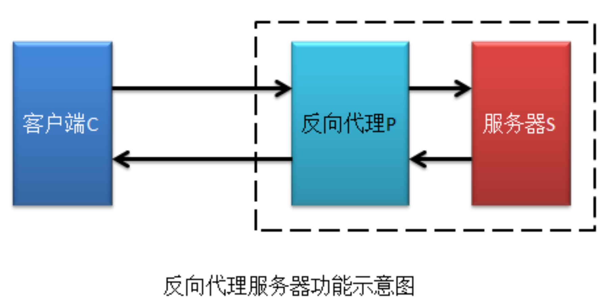
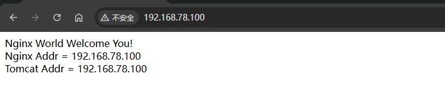
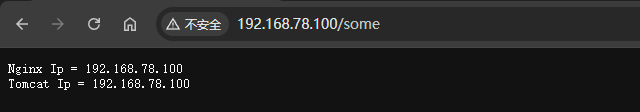

# Nginx 应用实战之反向代理

通过在 `location{}` 中添加通行代理 `proxy_pass` 可以指定当前 Nginx 所要代理的真正服务器。



## 反向代理 tomcat 服务器

### 定义一个 web 工程

定义一个 Maven Web 工程，并命名为 webdemo。其包含一个 JSP 页面，及一个 Servlet。

**pom.xml**

```xml
<properties>
    <project.build.sourceEncoding>UTF-8</project.build.sourceEncoding>    
    <maven.compiler.source>1.8</maven.compiler.source>   
    <maven.compiler.target>1.8</maven.compiler.target>
</properties>
<dependencies>
    <!-- Servlet 依赖 -->
    <dependency>
        <groupId>javax.servlet</groupId>      
        <artifactId>javax.servlet-api</artifactId>    
        <version>3.1.0</version>   
        <scope>provided</scope>
    </dependency>  
    <!-- JSP 依赖 -->
    <dependency>
        <groupId>javax.servlet.jsp</groupId>
        <artifactId>javax.servlet.jsp-api</artifactId> 
        <version>2.2.1</version>
        <scope>provided</scope>
    </dependency>
</dependencies>
```

**index.jsp**

```json
<%@ page contentType="text/html;charset=UTF-8" %>
<html>
  <head>
      <title>webdemo</title>
  </head>
  <body>
      Nginx World Welcome You!<br>
      Nginx Addr = ${pageContext.request.remoteAddr} <br>
      Tomcat Addr = ${pageContext.request.localAddr} <br>
  </body>
</html>
```

**SomeServlet.java**

```java
@WebServlet("/some")
public class SomeServlet extends HttpServlet {

    protected void doGet(HttpServletRequest request, HttpServletResponse response) throws ServletException, IOException {
    
        PrintWriter writer = response.getWriter();
        writer.println("NginxIp = " + request.getRemoteAddr());       
        writer.println("TomcatIp = " + request.getLocalAddr());
    
    }
}
```

### 部署到tomcat

将 webdemo 工程打包后部署到 Tomcat 的 webapps/ROOT 目录中（需要首先将 ROOT 目录中的文件全部删除）。

### 修改 nginx 配置文件

```nginx
server {
    listen 80;
    server_name localhost;
    
    location ~* .*(/|/some) {
        proxy_pass http://192.168.78.100:8080;
    }
}
```

### 访问nginx

通过 Nginx 反向代理访问 Tomcat 主机的 index.jsp 和 SomeServlet。





## 反向代理的属性配置

```nginx
#允许客户端请求的最大单文件字节数
client_max_body_size 10m;

#Nginx 为客户端请求设置的缓存大小。
#如果把它设置为比较大的数值，例如256k，那么，无论使用firefox还是IE浏览器，来提交任意小于256k的图片，都很正常。
#如果注释该指令，使用默认的client_body_buffer_size设置，也就是操作系统页面大小的两倍，8k或者16k，问题就出现了。
#无论使用firefox4.0还是IE8.0，提交一个比较大，200k左右的图片，都返回500 Internal Server Error错误
client_body_buffer_size 128k;


# 当上游服务器返回的响应是重定向或刷新请求（如HTTP响应码是301或者302）时，proxy_redirect可以重设HTTP头部的location或refresh字段。
# 如果需要修改从被代理服务器传来的应答头中的"Location"和"Refresh"字段，可以用这个指令设置。
# 语法：proxy_redirect [ default|off|redirect replacement ] 
# 默认值：proxy_redirect default 
# 使用字段：http, server, location 
proxy_redirect off;

# 使用字段：http, server, location
proxy_set_header Host $host;          
# 在web服务器端获得用户的真实ip          
proxy_set_header X-Real-IP $remote_addr;  
#在nginx 作为代理服务器时，设置的IP列表，会把经过的机器ip，代理机器ip都记录下来，用 【，】隔开；
#后端的Web服务器可以通过X-Forwarded-For获取用户真实IP
proxy_set_header X-Forwarded-For $proxy_add_x_forwarded_for;


#表示使nginx阻止HTTP应答代码为400或者更高的应答。
proxy_intercept_errors on;

#nginx跟后端服务器连接超时时间(代理连接超时)。默认 60 秒。
proxy_connect_timeout 90;

#nginx服务器向被代理服务器组发出write请求后，等待响应的超时间，默认为60秒。
proxy_send_timeout 90;

# Nginx 发出请求后等待后端服务器响应的最长时限。默认 60 秒。
proxy_read_timeout 90;
      
#设置代理服务器（nginx）保存用户头信息的缓冲区大小
#设置从被代理服务器读取的第一部分应答的缓冲区大小，通常情况下这部分应答中包含一个小的应答头，默认情况下这个值的大小为指令proxy_buffers中指定的一个缓冲区的大小，不过可以将其设置为更小
proxy_buffer_size 4k;

#该指令用于设置缓冲区的数量与大小。从被代理的后端服务器取得的响应内容，会缓存到这里。
#设置用于读取应答（来自被代理服务器）的缓冲区数目和大小，默认情况也为分页大小，根据操作系统的不同可能是4k或者8k
proxy_buffers 4 32k;

#高负荷下缓存大小，其默认值为一般为单个 proxy_buffers 的 2 倍。
proxy_busy_buffers_size 64k;

#设置在写入proxy_temp_path时数据的大小，预防一个工作进程在传递文件时阻塞太长
#设定缓存文件夹大小，大于这个值，将从upstream服务器传
proxy_temp_file_write_size 64k;

#开启从后端被代理服务器的响应内容缓冲区。默认值 on。
proxy_buffering on ;

# 如果我们的代理只允许接受get，post请求方法的一种
proxy_method get;    #支持客户端的请求方法。post/get；

#客户端断网时，nginx服务器是否中断对被代理服务器的请求。默认为off。
proxy_ignore_client_abort on;  


# 如果使用upstream指令配置了一组服务器作为被代理服务器，服务器中的访问算法遵循配置的负载均衡规则，同时可以使用该指令配置在发生哪些异常情况时，将请求顺次交由下一组服务器处理。
# 反向代理upstream中设置的服务器组，出现故障时，被代理服务器返回的状态值：error|timeout|invalid_header|http_500|http_502|http_503|http_504|http_404|off
# error：建立连接或向被代理的服务器发送请求或读取响应信息时服务器发生错误。
# timeout：建立连接，想被代理服务器发送请求或读取响应信息时服务器发生超时。
# invalid_header:被代理服务器返回的响应头异常。
# off:无法将请求分发给被代理的服务器。
# http_400，....:被代理服务器返回的状态码为400，500，502，等。
proxy_next_upstream timeout;  


proxy_http_version 1.0 ; #Nginx服务器提供代理服务的http协议版本1.0，1.1，默认设置为1.0版本。

proxy_ignore_headers "Expires" "Set-Cookie";  #Nginx服务器不处理设置的http相应投中的头域，这里空格隔开可以设置多个。
proxy_intercept_errors on;    #如果被代理服务器返回的状态码为400或者大于400，设置的error_page配置起作用。默认为off。
proxy_headers_hash_max_size 1024; #存放http报文头的哈希表容量上限，默认为512个字符。
proxy_headers_hash_bucket_size 128; #nginx服务器申请存放http报文头的哈希表容量大小。默认为64个字符。
```


