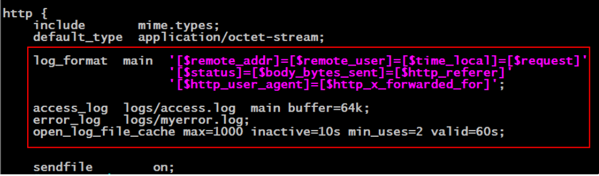
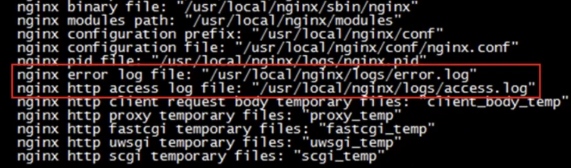
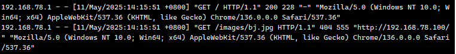

# Nginx 应用实战之缓存配置

## 日志介绍

Nginx 日志对于统计、系统服务排错很有用，主要分为两种：**`access_log(访问日志)和error_log(错误日志)`**。

Nginx 中通过 `access_log` 和 `error_log` 指令配置访问日志和错误日志，通过 `log_format` 我们可以自定义日志格式。

另外，在 access_log 和 log_format 中使用了很多变量，详细的变量信息可以参考 Nginx 官方文档。

## error.log

错误日志在 Nginx 中是通过 error_log 指令实现的。该指令记录服务器和请求处理过程中的错误信息。

```nginx
# 指定错误日志的路径和日志级别，此指令可以在[全局块、http块、server块以及location块中]配置。
# 其中debug级别的日志需要编译时使用--with-debug开启debug开关
#日志级别依次为：debug | info | notice | warn | error | crit | alert | emerg

# error_log [path] [debug | info | notice | warn | error | crit | alert | emerg] 
# error_log  logs/error.log  notice;
# error_log  logs/error.log  info;
error_log /var/log/nginx/error.log info;
```

### error_log 指令

该指令用于指定错误日志的路径与文件名。需要注意以下几点：

- 其不能指定格式，因为其有默认格式。
- 可以使用自己指定的错误日志文件，不过，将来的访问异常日志就不会再写入到默认的 logs/error.log 文件中了。所以关于错误日志，一般使用默认的即可。
- 错误日志级别由低到高有：[debug | info | notice | warn | error | crit | alert | emerg]，默认为 error，级别越高记录的信息越少。
- 错误日志默认是开启的。关闭错误日志的写法为 `error_log/dev/null`;

## access.log

**`访问日志`** 主要记录客户端的请求。客户端向 Nginx 服务器发起的每一次请求都记录在这里。客户端 IP，浏览器信息，referer，请求处理时间，请求 URL 等都可以在访问日志中得到。具体要记录哪些信息，可以通过 `log_format` 指令定义。

下面以 http 块下的访问日志为例。



```nginx
# access_log配置，此指令可以在[http块、server块或者location块]中进行设置
# 在全局块中，我们介绍过errer_log指令，其用于配置Nginx进程运行时的日志存放和级别
# 此处所指的日志与常规的不同，它是指记录Nginx服务器提供服务过程应答前端请求的日志
# access_log path [format [buffer=size]]
# 关闭access_log
# access_log off;

# log_format指令，用于定义日志格式，此指令只能在http块中进行配置
# 日志格式设定
# $remote_addr与$http_x_forwarded_for用以记录客户端的ip地址；
# $remote_user：用来记录客户端用户名称；
# $time_local： 用来记录访问时间与时区；
# $request： 用来记录请求的url与http协议；
# $status： 用来记录请求状态；成功是200，
# $body_bytes_sent ：记录发送给客户端文件主体内容大小；
# $http_referer：用来记录从那个页面链接访问过来的；
# $http_user_agent：记录客户浏览器的相关信息；
# 通常web服务器放在反向代理的后面，这样就不能获取到客户的IP地址了，通过$remote_add拿到的IP地址是反向代理服务器的iP地址。反向代理服务器在转发请求的http头信息中，可以增加x_forwarded_for信息，用以记录原有客户端的IP地址和原来客户端的请求的服务器地址。
log_format  main '$remote_addr - $remote_user [$time_local] "$request" '
                  '$status $body_bytes_sent "$http_referer" '
                  '"$http_user_agent" "$http_x_forwarded_for"';


# 定义了上面的日志格式后，可以以下面的形式使用日志
# access_log  logs/access.log  main;
access_log  /usr/local/nginx/logs/host.access.log  main;
access_log  /usr/local/nginx/logs/host.access.404.log  log404;

```

Nginx 整个系统的默认日志在生成预编译文件 makefile 时就已经默认给配置好了（nginx 安装目录下）。当然，无论是访问日志还是错误日志，其默认路径与名称在 nginx.conf 中均是可以修改的。在配置文件中不仅定义了日志文件的路径及名称，还定义了日志格式。



### log_format 指令

用于设置访问日志的格式，其后的 main 是为该格式所起的名称，可以任意，而其后面的内容则为具体格式，通过 Nginx 内置变量定义。

**日志格式：**

```nginx
log_format main '$server_name $remote_addr - $remote_user [$time_local] "$request" '
'$status $body_bytes_sent "$http_referer" '
'"$http_user_agent" "$http_x_forwarded_for" '
'$upstream_addr $request_time $upstream_response_time' ;
```

- `$server_name`：虚拟主机名称。
- `$remote_addr`：远程客户端的 IP 地址，请求者 IP。
- `-`：空白，用一个“-”占位符替代，历史原因导致还存在。
- `$remote_user`：远程客户端用户名称，用于记录浏览者进行身份验证时提供的名字，如登录百度的用户名 itxh，如果没有登录就是空白。
- `[$time_local]`：访问的时间与时区，比如 07/Jun/2016:08:54:27 +0800，时间信息最后的 "+0800" 表示服务器所处时区位于 UTC 之后的 8 小时。
- `$request`：请求的 URI 和 HTTP 协议，这是整个 PV 日志记录中最有用的信息，记录服务器收到一个什么样的请求
- `$status`：记录请求返回的 http 状态码，比如成功是 200。
- `$body_bytes_sent`：发送给客户端的文件主体内容的大小，比如 899，可以将日志每条记录中的这个值累加起来以粗略估计服务器吞吐量。
- `$http_referer`：记录从哪个页面链接访问过来的。
- `$http_user_agent`：客户端浏览器信息
- `http_x_forwarded_for`：客户端的真实 ip，通常 web 服务器放在反向代理的后面，这样就不能获取到客户的 IP 地址了，通过 http_x_forwarded_for：客户端的真实 ip，通常 web 服务器放在反向代理的后面，这样就不能获取到客户的 IP 地址了，通过 remote_add 拿到的 IP 地址是反向代理服务器的 iP 地址。反向代理服务器在转发请求的 http 头信息中，可以增加 x_forwarded_for 信息，用以记录原有客户端的 IP 地址和原来客户端的请求的服务器地址。
- `$upstream_addr`：upstream 的地址，即真正提供服务的主机地址。
- `$request_time`：整个请求的总时间。
- `$upstream_response_time`：请求过程中，upstream 的响应时间。

**示例：**



### access_log 指令

**语法**

```nginx
 access_log  logs/access.log  main [buffer];
```

该指令用于设置访问日志。上面的格式包含三个参数：

- 第一个参数是日志的存放路径与日志文件名；
- 第二个参数是日志格式名；
- 第三个参数是日志文件所使用的缓存。不过，即使不指定 buffer，其也会存在默认日志缓存的。
- access_log 还可以跟一个参数 off，用于关闭访问日志，即直接写 access_log off 即可关闭访问日志。

访问日志相关属性可以配置在任意模块。在不同的模块，记录的是不同请求的日志信息。即，日志记录的请求范围是不同的。Nginx 访问日志一般可以指定三个范围：`http块范围、server块范围，与location块范围。`

- http 模块范围：只要有请求通过 http 协议访问该 Nginx，就会有日志信息写入到这里的日志文件。
- server 模块范围：只要有请求访问当前 Server，就会有日志信息写入到这里的日志文件。
- location 模块范围：只要有请求访问当前 location，就会有日志信息写入到这里的日志文件。


### open_log_file_cache 指令

```nginx
open_log_file_cache max=1000 inactive=10s min_uses=2 valid=60s;
```

该指令用于打开日志文件读缓存，将日志信息读取到缓存中，以加快对日志的访问。该功能默认为 off，即 `open_log_file_cache off`;

## 日志自动切割

### 创建切割日志 shell 脚本文件

在 Linux 下创建一个实现日志切割的 shell 脚本文件。例如，将该 shell 文件创建在 Nginx 安装目录下的 logs 目录中，并命名为cutting-log.sh。

```bash
#!/bin/bash
##前一天时间
d=$(date -d "-1 day" "+%Y%m%d")
###自己创建的nginx日志存放目录 
logs_path="/usr/local/nginx/log/"
##如果没有这个文件，则创建
[ -d $logs_path ] || mkdir -p $logs_path
##将nginx访问日志移动到自建的日志存放目录
mv /usr/local/nginx/log/access.log ${logs_path}/access.log-$d
```

### 为该文件添加可执行权限

```bash
[root@localhost ~]# chmod u+x cutting-log.sh
```

### 向 crontab 中添加一个定时任务

crontab 是 Linux 中的一个定义任务文件，每一行都代表一项定义任务。每行由 6 个字段组成，前 5 段是时间设定段，第 6 段是任务段。具体格式如下：

```shell
minute(0-59) hour(0-23) day(1-31) month(1-12) week(0-6) command
```

执行如下命令后会打开文本编辑器

```bash
[root@localhost ~]# crontab -e
```

输入定时执行时间

```bash
# 每天23点59分执行日志切割
59 23 * * * /usr/local/nginx/log/cutting-log.sh
```

