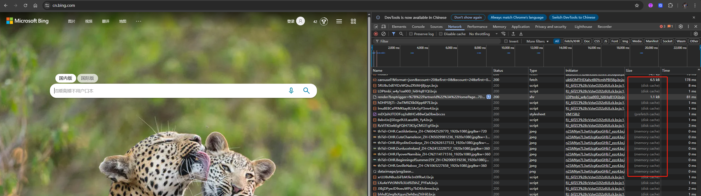
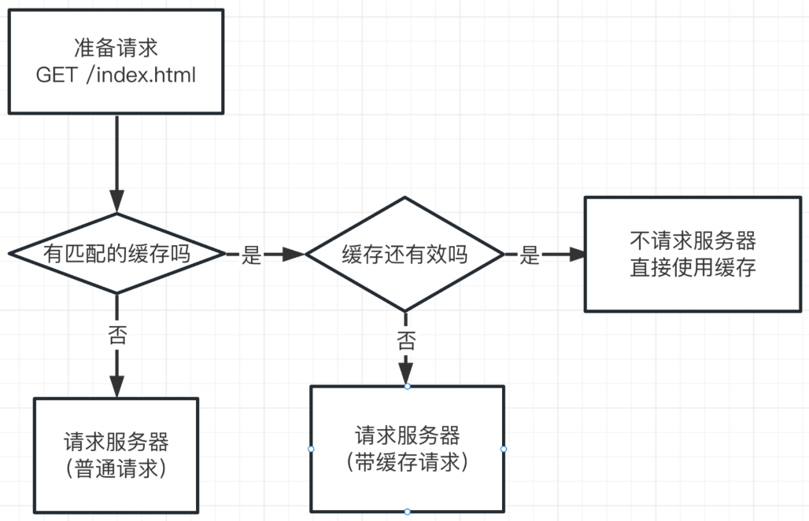
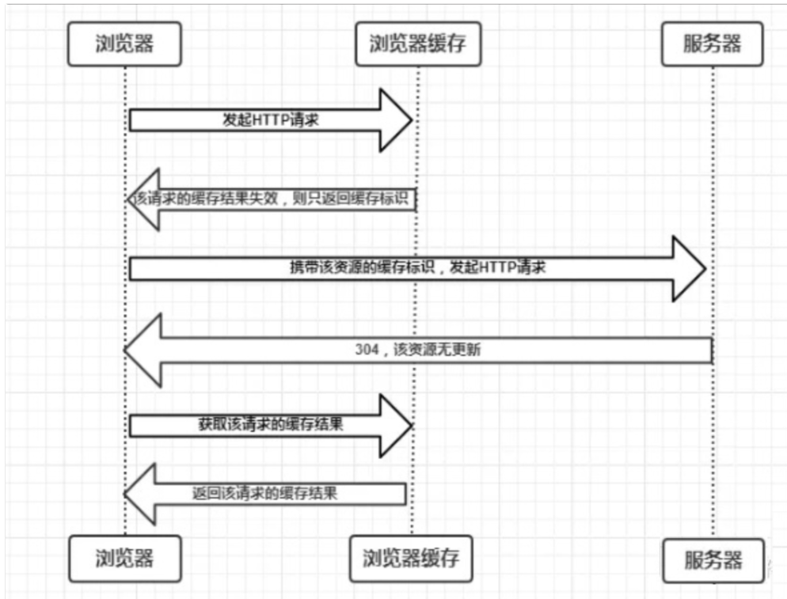
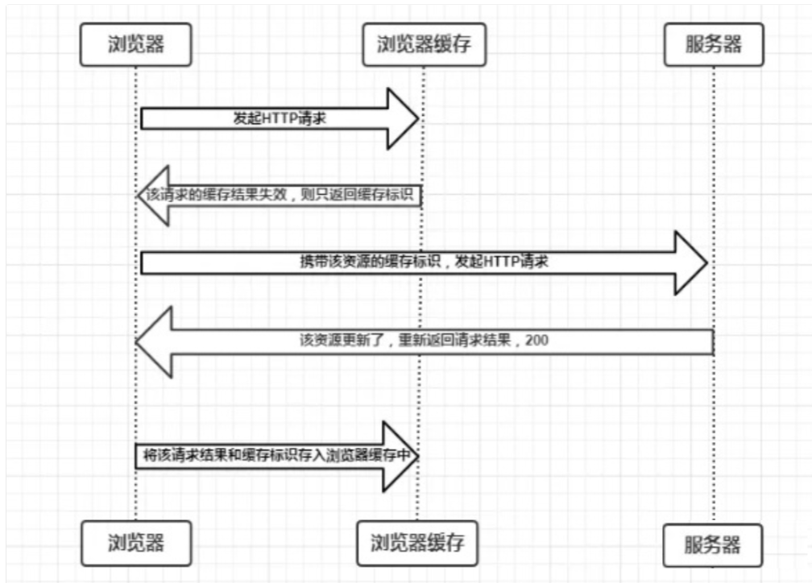
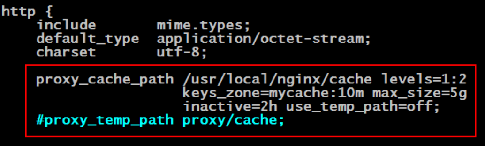

# Nginx 应用实战之缓存配置

浏览器（发送请求） —> DNS —> Nginx 代理服务器  —> 后端服务器

## DNS 缓存

通常我们输入一个网址，它包含了 `域名` 和 `端口` 可以指定唯一的 IP 地址，然后建立连接进行通信，而 `域名` 查找 `IP地址` 的过程就是 DNS 解析。

这个过程会对网络请求带来一定的损耗，所以浏览器在第一次获取到 IP 地址后，会将其缓存起来。下次相同域名再次发起请求时，浏览器会先查找本地缓存，如果缓存有效，则会直接返回该 IP 地址，否则会继续开始寻找。

- 首先搜索浏览器自身的 DNS 缓存, 如果存在，则域名解析到此完成。
- 如果浏览器自身的缓存里面没有找到对应的条目，那么会尝试读取操作系统的 hosts 文件看是否存在对应的映射关系, 如果存在，则域名解析到此完成。
- 如果本地 hosts 文件不存在映射关系，则查找本地 DNS 服务器(ISP 服务器, 或者自己手动设置的 DNS 服务器), 如果存在, 域名到此解析完成。
- 如果本地 DNS 服务器还没找到的话, 它就会向根服务器发出请求, 进行递归查询。

## 浏览器缓存



### memory cache

`memory cache ` 是浏览器为了加快读取缓存速度而进行的 `自身的优化行为`，不受开发者控制，也不受 HTTP 协议头的约束。当资源被存入内存后，下次同样的请求将不再通过网络，而是直接访问内存，当关闭该页面时，此资源就被内存释放掉了，再次重新打开相同页面时不再出现 from memory cache 的情况。

**`什么资源会被放入memory缓存呢？`**

几乎所有的静态网络请求资源都会根据相关的策略被浏览器自动加入到 memory cache 中。但是也正因为数量很大但是浏览器占用的内存不能无限扩大这样两个因素，memory cache 注定只能是个“短期存储”。当数据量过大，即使网页不关闭，缓存依然会失效。

### disk cache

disk cache，也就是硬盘缓存，又叫 HTTP 缓存，它也是浏览器缓存中最重要的内容。因为 `DNS缓存` 它主要是做一个 ip 地址查找并且是自主完成的，`memory cache ` 也是不受控制，算是一个黑盒。所以剩下的可以受我们控制的就是硬盘缓存了，大多优化手段也是针对硬盘缓存。

#### 强制缓存

也叫强缓存，对于强缓存，控制它的字段分别是：`Expires` 和 `Cache-Control`，其中 `Cache-Control` 优先级比 `Expires` 高。

##### 第一次请求

当客户端发出一个请求到服务器，服务器（Nginx）希望你把资源缓存起来，于是在响应头中加入了这些内容：

```http
Cache-Control: max-age=3600 希望把这个资源缓存起来，缓存时间是3600秒（1小时）
Expires: Thu, 10 Nov 2025 08:45:11 GMT 到达指定时间过期
Date: Thu, 30 Apr 2025 12:39:56 GMT

Etag:W/"121-171ca289ebf"，(后面协商缓存内容)这个资源的编号是W/"121-171ca289ebf"
Last-Modified:Thu, 30 Apr 2020 08:16:31 GMT，(后面协商缓存内容)这个资源的上一次修改时间
```

Cache-Control 和 Expires 分别是 HTTP/1.1 和 HTTP/1.0 的内容，为了兼容 HTTP/1.0 和 HTTP/1.1，实际项目中两个字段我们都会设置。

**浏览器收到这个响应之后：**

- 浏览器把这次请求得到的响应体缓存到本地文件中。
- 浏览器标记这次请求的请求方法和请求路径
- 浏览器标记这次缓存的时间是 3600 秒
- 浏览器记录服务器的响应时间是格林威治时间 `2025-04-30 12:39:56`

**这一次的记录非常重要，它为以后浏览器要不要去请求服务器提供了依据。**

##### 非第一次请求

之后当客户端收准备再次请求同样的地址时，它会到缓存中去寻找是否有缓存的资源，如下




判断缓存是否有效就是通过把 `max-age + Date`，得到一个过期时间，看看这个过期时间是否大于当前时间，如果是，则表示缓存还没有过期，仍然有效，如果不是，则表示缓存失效。

#### 协商缓存 

协商缓存就是强制缓存失效后，浏览器 **携带缓存标识** 向服务器发起请求，由服务器根据缓存标识决定是否使用缓存的过程，主要有以下两种情况：

- 协商缓存生效，返回【304】和 Not Modified

  

- 协商缓存失效，返回【200】和请求结果

  

##### 缓存标识

###### Last-Modified 和 If-Modified-Since

1. 浏览器首先发送一个请求，让服务端在 `response header` 中返回请求的资源上次更新时间，就是 `last-modified`，浏览器会缓存下这个时间。
2. 然后浏览器在下次请求中，在 `request header` 中带上 `if-modified-since`: `[保存的last-modified的值]`。
3. 服务端根据浏览器发送的修改时间和服务端的修改时间进行比对，一致的话代表资源没有改变，服务端返回正文为空的响应，让浏览器中缓存中读取资源，这就大大减小了请求的消耗。

由于 `last-modified` 依赖的是保存的绝对时间，还是会出现误差的情况：

1. 保存的时间是以 `秒` 为单位的，`1秒` 内多次修改是无法捕捉到的；
2. 各机器读取到的时间不一致，就有出现误差的可能性。为了改善这个问题，提出了使用 `etag`。

###### ETag 和 If-None-Match

`etag` 是 `http` 协议提供的若干机制中的一种 `Web` 缓存验证机制，并且允许客户端进行缓存协商。生成 etag 常用的方法包括对资源内容使用抗碰撞散列函数，使用最近修改的时间戳的哈希值，甚至只是一个版本号。 和 `last-modified` 一样. 

- 浏览器会先发送一个请求，让服务端在 `response header` 中返回 `etag` 的值。
- 然后浏览器在下一次请求中，在 `request header` 中带上 `if-none-match`: `[保存的etag的值]`。 
- 服务端通过接收的 `etag` 的值和服务端的 `etag` 的值进行比对，如果一致代表资源没有改变，服务端返回正文为空的响应，告诉浏览器从缓存中读取资源。

> etag 能够解决 last-modified 的一些缺点，但是 etag 每次服务端生成都需要进行读写操作，而 last-modified 只需要读取操作，从这方面来看，etag 的消耗是更大的。  

**`二者对比`**

- 精确度上：`Etag` 要优于 `Last-Modified`。 
- 优先级上：服务器校验优先考虑 `Etag`。 
- 性能上：`Etag` 要逊于 `Last-Modified`

**`建议使用：`**

```http
If-Modified-Since: Thu, 30 Apr 2020 08:16:31 GMT  
这个资源的上一次修改时间是格林威治时间2020-04-30 08:16:31，请问这个资源在这个时间之后有发生变动吗？

If-None-Match: W/"121-171ca289ebf"  
这个资源的编号是W/"121-171ca289ebf，请问这个资源的编号发生变动了吗？
```

之所以要发两个信息，是为了兼容不同的服务器，因为有些服务器只认 `If-Modified-Since`，有些服务器只认 `If-None-Match`，有些服务器两个都认, 但是一般来说 `If-None-Match ` 的优先级高于 `If-Modified-Since`。

## nginx 代理缓存

### 常用配置项

#### expires

**作用**

**expires 是服务端返回的到期时间。** 如果下一次请求如果小于服务端返回的过期时间，则直接使用缓存数据。

expires 针对 HTTP1.0 的东西，当前通常浏览器默认都是使用 HTTP1.1。而且由于该值是由服务端生成，而客户端的时间和服务端的时间有可能不一致，导致存在一定误差。**所以 HTTP1.1 使用 Cache-Control 替代。**

**语法**

```nginx
expires [modified] time;
expires epoch | max | off;
```

**参数：**

- max 启用后为：Expires: Thu, 31 Dec 2037 23:55:55 GMT 

    Cache-Control: max-age = 315360000 (10 年)；
- epoch 启用后为：Expires: Thu, 01 Jan 1970 00:00:01 GMT 

    Cache-Control: no-cache；
- time：设定具体时间，可以携带单位（通过 `@`），如：表示一天内的下午 3 点 30 分后失效 `expires @15h@30m`；
    - time 是负数：表示”`Cache-Control: no-cache`”；
    - time 是正数或零：”`Cache-Control: max-age=t`”，其中 t 单位为秒。

**默认值**

```nginx
expires off; 
```

**可配置段**

```nginx
http, server, location, if in location
```

**配置示例**

```nginx
server {
    listen       80;
    server_name  xxx.xxx.com;
    
    root         /app/xxx/html/;
    
    location ~ .*\.(?:jpg|jpeg|gif|png|ico|cur|gz|svg|svgz|mp4|ogg|ogv|webm)$
    {
        expires  7d;
    }

    location ~ .*\.(?:js|css)$
    {
        expires  7d;
    }

    location ~ .*\.(?:htm|html)$    #不缓存html
    {
        add_header Cache-Control "private, no-store, no-cache, must-revalidate, proxy-revalidate";
    }
}
```

Cache-Control 还可以设置下面一个或多个值：

- `public`：指示服务器资源是公开的。比如有一个页面资源，所有人看到的都是一样的。这个值对于浏览器而言没有什么意义，但可能在某些场景可能有用。本着「我告知，你随意」的原则，`http` 协议中很多时候都是客户端或服务器告诉另一端详细的信息，至于另一端用不用，完全看它自己。
- `private`：指示服务器资源是私有的。比如有一个页面资源，每个用户看到的都不一样。这个值对于浏览器而言没有什么意义，但可能在某些场景可能有用。本着「我告知，你随意」的原则，`http` 协议中很多时候都是客户端或服务器告诉另一端详细的信息，至于另一端用不用，完全看它自己。
- `no-cache`：告知客户端，你可以缓存这个资源，但是不要 **直接** 使用它。当你缓存之后，后续的每一次请求都需要附带缓存指令，让服务器告诉你这个资源有没有过期。
- `no-store`：告知客户端，不要对这个资源做任何的缓存，之后的每一次请求都按照正常的普通请求进行。若设置了这个值，浏览器将不会对该资源做出任何的缓存处理。
- `max-age`：指示客户机可以接收生存期不大于指定时间（以秒为单位）的响应。
- `min-fresh`：指示客户机可以接收响应时间小于当前时间加上指定时间的响应。
- `max-stale`：指示客户机可以接收超出超时期间的响应消息。如果指定 max-stale 消息的值，那么客户机可以接收超出超时期指定值之内的响应消息。

比如，`Cache-Control: public, max-age=3600` 表示这是一个公开资源，请缓存 1 个小时。

不仅仅是在响应头中，在 `http1.1` 版本中，也可以在 **请求头** 中加入 `Cache-Control: no-cache，` 它的含义是向服务器表达：不要考虑任何缓存，给我一个正常的结果。这和 `http1.0` 版本的消息头字段 pragma 是一样的功能。

**`expire`**

在 `http1.0` 版本中，是通过 `Expire` 响应头来指定过期时间点的，例如：

```yaml
Expire: Thu, 30 Apr 2020 23:38:38 GMT
```

到了 `http1.1` 版本，已更改为通过 `Cache-Control` 的 `max-age` 来记录。

#### proxy_cache

**作用**

设置是否开启对后端响应的缓存，如果开启的话，参数值就是 zone(proxy_cache_path 配置中 keys_zone 的 name)的名称。

**语法**

```nginx
proxy_cache zone | off;
```

默认值

```nginx
proxy_cache off;
```

**可配置段**

```nginx
http, server, location
```

**配置示例**

```nginx
  proxy_cache mycache;
```

#### proxy_cache_path

**作用**

指定缓存位置、缓存名称、内存中缓存内容元数据信息大小限制、缓存总大小限制。缓存位置是一个目录应该先创建好，nginx 并不会帮我们创建这个缓存目录。

**语法**

```nginx
proxy_cache_path path [levels=levels] [use_temp_path=on|off] keys_zone=name:size[inactive=time] [max_size=size] [manager_files=number] [manager_sleep=time] [manager_threshold=time] [loader_files=number] [loader_sleep=time] [loader_threshold=time] [purger=on|off] [purger_files=number] [purger_sleep=time] [purger_threshold=time];
```

**参数释义：**

- `path`：定义缓存文件存放位置；
- `levels`：定义缓存路径的目录层级，默认所有缓存文件都放在上面指定的根路径中，`最多三级`，每层目录长度为 1 或 2 字节；

- `keys_zone`：
    - `name` 表示共享内存名称，用于在共享内存中定义一块存储区域来存放缓存的 key 和 metadata（类似于使用次数），这样 nginx 可以快速判断一个 request 是否命中缓存。由 proxy_cache 指令使用；
    - `size` 表示共享内存大小，1mb 大约可以存放 8000 个 key；
- `max_size`：设置缓存大小的上限。它是可选的，不指定值允许缓存增长以使用所有可用磁盘空间。当缓存大小达到限制时，称为缓存管理器的进程将删除最近最少用于将缓存大小恢复到限制之下的文件；
- `inactive`：在 inactive 时间内没有被访问的缓存会被淘汰掉，默认是 10 分钟；

    注意：inactive 和 expired 配置项的含义是不同的，expired 只是判断过期时间，不会删除缓存；而 inactive 是直接删除过期缓存。
- `use_temp_path`：如果为 off，则 nginx 会将缓存文件直接写入指定的 cache 文件中，而不使用 temp_path 指定的临时存储路径。

**可配置段**

```nginx
http
```

**配置示例**

```nginx
http {
    ...
    # 缓存目录：/data/nginx/cache
    # 缓存名称：one
    # 缓存占用内存空间：10m
    # 缓存目录级别为2
    # 缓存最大时间为60分钟
    # 加载器每次迭代过程最多执行300毫秒
    # 加载器每次迭代过程中最多加载200个文件
    # 缓存硬盘空间最多为 200m
    proxy_cache_path /data/nginx/cache  levels=1:2 keys_zone=one:10m inactive=60m loader_threshold=300 loader_files=200 max_size=200m;
    
    server {
        listen 8080;
        # 使用名称为one的缓存
        proxy_cache one;
        location / {
            # 此location中使用默认的缓存配置
            proxy_pass http://backend1;
        }
        location /some/path {
            proxy_pass http://backend2;
            
            # 缓存有效期为1分钟
            proxy_cache_valid any 1m;
            # 被请求3次以上时才缓存
            proxy_cache_min_uses 3;
            # 请求中有下面参数值时不走缓存
            proxy_cache_bypass $cookie_nocache $arg_nocache$arg_comment;
        }
    }
}
```

**在如上缓存工作中有两个附加进程：** 

- **`缓存管理器`**：定期检查缓存状态，看缓存总量是否超出限制，如果超出，就移除其中最少使用的部分**
- **`缓存加载器`**：加载器只在 nginx 启动后运行一次，把缓存内容的元数据信息加载到内存空间，如果一次性加载全部缓存信息，会大量消耗资源，使 nginx 在启动后的几分钟里变慢，为避免此问题，有 3 种加载策略：
    - **loader_threshold：指定每次加载执行的时间**
    - **loader_files：每次最多加载的数量**
    - **loader_sleeps：每次加载的延时**

#### proxy_cache_valid

**作用**

默认情况下，缓存的内容是长期存留的，除非缓存的总量超出限制，此字段可配置不同的响应码缓存不同的时长，即指定缓存的有效期。

**语法**

```nginx
proxy_cache_valid [code ...] time;
```

**可配置段**

```nginx
http, server, location
```

**配置示例**

```nginx
 # 响应状态码为200 302时，10分钟有效；
 proxy_cache_valid 200 302 10m;
 
 # 响应状态码为404时，1分钟有效；
 proxy_cache_valid 404  1m;
 
 # 对应任何状态码，5分钟有效;
 proxy_cache_valid any 5m;
```

#### proxy_cache_methods

**作用**

对哪些方法的请求进行缓存。

**语法**

```nginx
proxy_cache_methods GET | HEAD | POST ...;
```

**默认值**

```nginx
proxy_cache_methods GET HEAD;
```

**可配置段**

```nginx
http, server, location
```

#### proxy_cache_key string

**作用**

用于设置不同维度进行缓存，即给缓存设定 key。如缓存 url。

**语法**

```nginx
proxy_cache_key string;
```

**默认值**

```nginx
proxy_cache_key $scheme$proxy_host$request ;
```

可配置段

```nginx
http, server, location
```

#### proxy_cache_min_uses

**作用**

指定请求至少被发送了多少次以上时才缓存，可以防止低频请求被缓存。

**语法**

```nginx
proxy_cache_min_uses string;
```

**默认值**

```nginx
proxy_cache_min_uses 1;
```

**可配置段**

```nginx
http, server, location
```

**配置示例**

```nginx
proxy_cache_min_uses 5;
```

#### proxy_cache_bypass

**作用**

指定哪些响应在某些值不为空或不为 0 的情况下不走缓存。

**语法**

```nginx
proxy_cache_bypass string;
```

**可配置段**

```nginx
http, server, location
```

**配置示例**

```nginx
  proxy_cache_bypass $cookie_nocache $arg_nocache $arg_comment;
```

#### proxy_no_cache string

**作用**

指定定哪些请求不被缓存，即响应来自原始服务器而不是缓存。

**语法**

```nginx
proxy_no_chache string;
```

**可配置段**

```nginx
http, server, location
```

**配置示例**

```nginx
  proxy_no_chache $cookie_nocache $arg_nocache $arg_nocache;
```

#### proxy_cache_use_stale

**作用**

指定在后端服务器在返回什么状态码的情况下可以使用过期的缓存。

**语法**

```nginx
proxy_cache_use_stale off | on;
```

**默认值**

```nginx
proxy_cache_use_stale off;
```

**可配置段**

```nginx
http, server, location
```

**配置示例**

```nginx
proxy_cache_use_stale error timeout invalid_header http_500 http_502 http_503 http_504;
```

#### proxy_cache_lock

**作用**

默认不开启，开启的话则每次只能有一个请求更新相同的缓存，其他请求要么等待缓存有数据要么限时等待锁释放。通常在多个客户端请求缓存未命中时，只有第一个请求可以发向原服务器，其他请求要等待第一个响应返回或者超时后，使用缓存响应客户端。该参数可以合并回源请求，减轻峰值流量下的压力。

**语法**

```nginx
proxy_cache_lock off | on;
```

**默认值**

```nginx
proxy_cache_lock off;
```

**可配置段**

```nginx
http, server, location
```

**配置示例**

```nginx
  proxy_cache_lock on;
```

#### proxy_cache_lock_timeout

**作用**

等待缓存锁超时之后将直接请求后端，结果不会被缓存。

**语法**

```nginx
proxy_cache_lock_timeout time;
```

**默认值**

```nginx
proxy_cache_lock_timeout 5s;
```

**可配置段**

```nginx
http, server, location
```

**配置示例**

```nginx
  proxy_cache_lock_timeout 5s;
```

### http 模块的缓存应用实战

Nginx 具有很强大的缓存功能，可以对请求的 response 进行缓存，起到类似 CDN 的作用，甚至有比 CDN 更强大的功能。同时，Nginx 缓存还可以用来“数据托底”，即当后台 web 服务器挂掉的时候，Nginx 可以直接将缓存中的托底数据返回给用户。此功能就是 Nginx 实现“服务降级”的体现。

Nginx 缓存功能的配置由两部分构成：`全局定义与局部定义`。

- 在 `http{}` 模块的全局部分中进行 `缓存全局定义`。
- 在 `server{}` 模块的各个 ` location{}` 模块中根据业务需求进行 `缓存局部定义`。

#### http 块的缓存全局定义



#### location 块的缓存局部定义

```nginx
# proxy_cache zone | off ;
# 配置一块公用的内存区域的名称，该区域可以存放缓存的索引数据。注意：zone 代表用于存放缓存索引的内存区域的名称（需要使用 proxy_cache_path指令设置）；off 代表关闭Proxy Cache功能
# 指定用于存放缓存 key 内存区域名称。其值为 http{}模块中 proxy_cache_path 中的keys_zone 的值。
proxy_cache mycache ;

# 指定 Nginx 生成的缓存的 key 的组成。
# 用于设置nginx在内存中建立索引时使用的关键字
proxy_cache_key $host$request_uri$arg_age ;

# 配置nginx服务器向客户端发送相应数据时，不从缓存中获取数据的条件。这些条件支持nginx配置的常用变量。
# proxy_cache_bypass $cookie_nocache $arg_nocache $arg_comment $http_pragma $http_authorization
# 当至少有一个字符串指令不为空或者不等于0时,相应数据不从缓存获取
proxy_cache_bypass $arg_age ;

# 指定客户端请求的哪些提交方法将被缓存，默认为 GET 与 HEAD，但不缓存 POST。
proxy_cache_methods GET HEAD ;

# 指定对本次请求是否不做缓存。只要有一个不为 0，就不对该请求结果缓存。
proxy_no_cache $aaa $bbb $ccc ;

# 指定是否清除缓存 key。
proxy_cache_purge $ddd $eee $fff ;

# 是否开启缓存的锁功能
proxy_cache_lock on ;

# 设置缓存的锁功能开启后锁的超时时间
proxy_cache_lock_timeout 5s ;

# 对指定的 HTTP 状态码的响应数据进行缓存，并指定缓存时间。默认指定的状态码为200，301，302。
proxy_cache_valid 5s ;

# 当nginx服务器访问被代理服务器时出现服务器无法访问或者访问错误等现象时。nginx服务器可以使用历史缓存响应客户端的请求
# 设置启用托底缓存的条件。而一旦这里指定了相应的状态码，则前面 proxy_cache_valid中指定的相应状态码所生成的缓存就变为了“托底缓存”。
proxy_cache_use_stale http_404 http_500;

# 当客户端向被代理服务器发送相同的请求达到指定的次数时，nginx服务器才会对该请求的响应数据做缓存，默认为1
proxy_cache_min_uses number;

# 为请求的静态资源开启浏览器端的缓存。
expires 3m ;
```

### 缓存清除

#### 清除缓存配置

```nginx
  location ~ /purge(/.*) {
      # 允许执行的ip
      allow       127.0.0.1;
      allow       192.168.55.0/24;
      # 拒绝所有
      deny        all;
      proxy_cache_purge cache_one $1$is_args$args;
  }
```

**`注意：`**

**`使用 proxy_cache_purge 清除缓存，必须提前安装 ngx_cache_purge 模块，安装模块必须基于编译安装的 Nginx。之后使用 url 访问即可清除对应缓存，如 cache.itzrd.com/purge/nginx.png 即可清除 cache.itzrd.com/nginx.png 此文件的缓存。 `**

