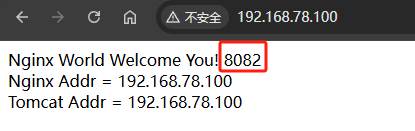

# Nginx 应用实战之负载均衡

负载均衡，英文名称为 `Load Balance`，其意思就是分摊到多个操作单元上进行执行，它是建立在现有网络结构之上，提供了一种廉价有效透明的方法扩展网络设备和服务器的带宽、增加吞吐量、加强网络数据处理能力、提高网络的灵活性和可用性。

例如 Web 服务器、FTP 服务器、企业关键应用服务器和其它关键任务服务器等，从而共同完成工作任务。

## 负载均衡分类

### 负载均衡工作层分类

负载均衡就其所工作的 OSI 层次，在生产应用层面分为两类：七层负载均衡与四层负载均衡。此外，为四层负载均衡提供更为底层实现的，还有三层负载均衡与二层负载均衡。

- `七层负载均衡`：应用层，基于 HTTP 协议，通过虚拟 URL 将请求分配到真实服务器。一般应用于 B/S 架构系统。Nginx 就是七层负载均衡。
- `四层负载均衡`：传输层，基于 TCP 协议，通过“虚拟 IP + 端口号” 将请求分配到真实服务器。一般应用于 C /S 架构系统。例如，LVS、F5、Nginx Plus 都属于四层负载均衡。
- `三层负载均衡`：网络层，基于 IP 协议，通过虚拟 IP 将请求分配到真实服务器。
- `二层负载均衡`：链路层，基于虚拟 MAC 地址将请求分配到真实服务器。

### 软硬件分类

#### 硬件负载均衡

硬件负载均衡器的性能稳定，且有生产厂商作为专业的服务团队。但其成本很高，一台硬件负载均衡器的价格一般都在十几万到几十万，甚至上百万。

#### 软件负载均衡

软件负载均衡成本几乎为零，基本都是开源软件。例如 `LVS、HAProxy、Nginx` 等。

## 负载均衡的实现(模拟)

### 总体规划

- `两台 Tomcat 服务器`。将前面反向代理文章中打过包的 web 工程直接部署到两台 Tomcat 服务器上（端口分别修改为 8081 和 8082）。
- `一台 Nginx 服务器`。在 Nginx 服务器上设置对这两台 Tomcat 主机的负载均衡。


###  配置 Nginx 

```nginx
    upstream www.itzrd.com{ 
        server  192.168.78.100:8081;
        server  192.168.78.100:8082;
    }

    server {
        listen 80;
        server_name localhost;
        
        location / {
            root html;
            index index.html;
        }
        
        location ~* .*\.(css|js|html|jpg|png)$ {
            root /opt/statics;
        }

        location ~* .*(/|/some) {
            #请求转向上面 upstream 定义的服务器
            proxy_pass  http://www.itzrd.com;  
            #proxy_pass http://192.168.78.100:8080;
        }
    }
```

### 浏览器访问

http://192.168.78.100/，每刷新一次页面，依次访问 8081、8082 服务器




## 负载均衡策略

### 轮询

#### 默认轮询

默认的负载均衡策略，nginx 权重都默认为 1。

下面服务器处理请求的顺序：ABABABABAB....

```nginx
    upstream www.itzrd.com { 
        server  192.168.78.100:8081;
        server  192.168.78.100:8082;
    }
```

#### 加权轮询

跟据配置的权重的大小而分发给不同服务器不同数量的请求。如果不设置，则默认为 1。

下面服务器的请求顺序为：ABBABBABBABBABB....

```nginx
    upstream www.itzrd.com { 
        server  192.168.78.100:8081 weight=1;
        server  192.168.78.100:8082 weight=2;
    }
```

#### 热备

如果有 2 台服务器，当一台服务器发生事故时，才启用第二台服务器给提供服务。

下面服务器处理请求的顺序：AAAAAA 突然 A 挂啦，BBBBBBBBBBBBBB.....

```nginx
    upstream www.itzrd.com { 
        server  192.168.78.100:8081;
        server  192.168.78.100:8082; backup;  #热备     
    }
```

#### 复杂轮询

按照各个主机的权重比例依次进行请求分配的。

```nginx
upstream www.itzrd.com { 
  server 192.168.78.100:8081 weight=2 max_fails=1 fail_timeout=10;
  server 192.168.78.100:8082 weight=1 max_fails=3 fail_timeout=20;  
  server 192.168.78.100:8083 backup; #热备 
  server 192.168.78.100:8084 down;
}
```

- `down`：表示当前的 server 暂时不参与负载均衡，该状态一般会对需要停机维护的服务器进行设置。
- `backup`：预留的备份机器。当其他所有的非 `backup` 机器出现故障或者忙的时候，才会请求 `backup` 机器，因此这台机器的压力最轻。
- `max_fails`：表示在 `fail_timeout` 时间内最多允许的失败次数，默认为 `1`。当超过最大次数时，返回 proxy_next_upstream 模块定义的错误。
- `fail_timeout`：经历了 `max_fails` 次失败后，暂停服务的时间，默认为 `10` 秒。`max_fails` 可以和 `fail_timeout` 一起使用。
- `weight`：默认为 1。weight 越大，负载的权重就越大。

### ip_hash

#### 普通 hash

nginx 会让**相同的客户端 ip 请求相同的服务器**。指定负载均衡器按照基于客户端 IP 的分配方式。

```nginx
    upstream www.itzrd.com { 
        ip_hash ;
        server  192.168.78.100:8081;
        server  192.168.78.100:8082; backup;  #热备     
    }
```

#### 复杂hash

```nginx
    upstream www.itzrd.com { 
        ip_hash ;
        server  192.168.78.100:8081 weight=2 max_fails=3 fail_timeout=20;
        server  192.168.78.100:8082 weight=1 max_fails=3 fail_timeout=20;
    }
```

**对于该策略需要注意以下几点：**

- 在 nginx1.3.1 版本之前，该策略中不能指定 weight 属性。
- 该策略不能与 backup 同时使用。
- 此策略适合有状态服务，比如 session。
- 当有服务器宕机，必须手动指定 down 属性，否则请求仍是会落到该服务器。

### least_conn

把请求转发给连接数最少的服务器。

```nginx
upstream www.itzrd.com { 
  least_conn ;
  server 192.168.78.100:8081 weight=2 max_fails=3 fail_timeout=20;
  server 192.168.78.100:8082 weight=1 max_fails=3 fail_timeout=20;  
  server 192.168.78.100:8083 backup; #热备 
  server 192.168.78.100:8084 down;    
}
```

