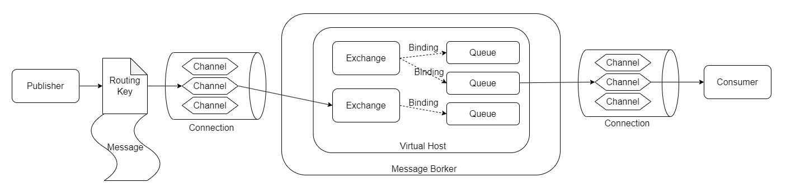
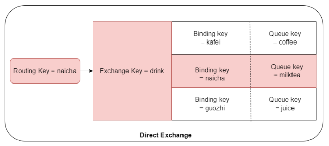
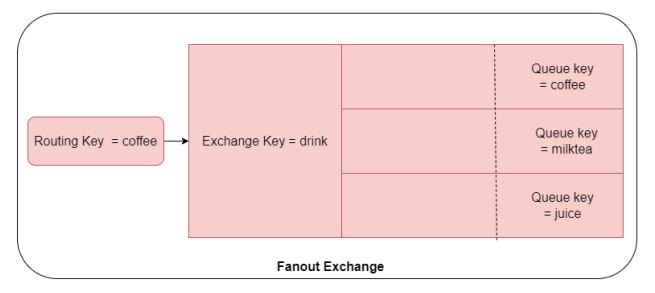
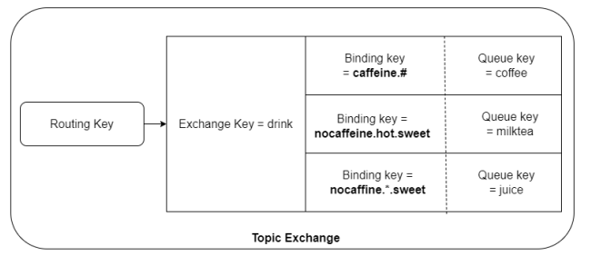
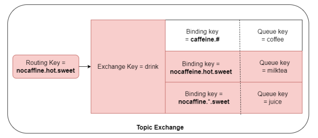

## 什么是AMQP

**AMQP**（Advanced Message Queuing Protocol，高级消息队列协议）。一个提供统一消息服务的应用层标准高级消息队列协议，是应用层协议的一个开放标准，为面向消息的中间件设计。基于此协议的客户端与消息中间件可传递消息，并不受客户端/中间件同产品，不同的开发语言等条件的限制。

### AMQP协议模型

- **Broker**：接收和发送消息的应用，RabbitMQ Server 就是 Message Broker。
- **Virtual Host**：虚拟的 Broker，用于进行逻辑隔离，将多个单元隔离开。每个 Virtual Host 有若干个 Exhange 和 Queue，同一个 Virtual Host 中不能有相同名字的 Exchange。
- **Connection**：publisher／consumer 和 broker 之间的 TCP 连接。
- **Channel**：Connection 内部建立的逻辑连接，如果应用程序支持多线程，通常每个线程创建单独的 Channel。
- **Routing Key**：路由键，用来指示消息的路由转发。
- **Binding**：Exchange 与 Queue 之间的虚拟连接，Binding 中可以包含多个 Routing Key，用于 Message 的分发依据。
- **Exchange**：交换机，根据 Routing Key 和 Binding，分发消息 Queue 中，相当于快递的分拨中心，是 AMQP 中的核心概念。
- **Queue**：消息队列，消息最终被送到这里等待 Consumer 取走，一个消息可以被同时分发到多个 Queue。

## Exchange类型

Exchange 有四种类型，Direct、Topic、Fanout、Headers，其中 Headers 使用很少，以前三种为主。

### Direct Exchange

直接路由，如果 Message 中的 Routing Key 和 Binding Key 一致，Direct Exchange 则将Message 发送到对应的 Queue 中。

如下图，Routing Key = naicha 的消息被分发到 milktea 的 Queue：

### Fanout Exchange

广播路由，每个发到 Fanout Exchange 的 Message 都会分发到所有绑定的 Queue 上去。

如下图，Routing Key = coffee 的消息被分发到所有绑定的 Queue：

### Topic Exchange

话题路由，根据 Routing Key 及通配规则，Topic Exchange 将消息分发到目标 Queue 中。

#### 通配规则

1. 全匹配：与Direct类似
2. Binding Key中的 #：匹配任意个数的word
3. Binding Key中的 *：匹配任意1个word

例如，咖啡、奶茶、果汁，三种饮料 Binding Key 如下：

- 咖啡含有咖啡因，冷热均可，苦甜均可，Binding Key = caffine.#
- 奶茶不含咖啡因，热饮，甜味，Binding Key = nocaffine.hot.sweet
- 果汁不含咖啡因，冷热均可，Binding Key = nocaffine.*.sweet

如若现在条件是：无咖啡因、热饮，甜味，则分发如下：

## RabbitMQ在线模拟器

http://tryrabbitmq.com/，提供在线 RabbitMQ 模拟器，可以帮助理解Exchange、Queue、Binding 概念。

