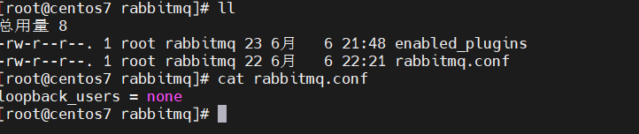

## 什么是 MQ

MQ(Message Quene) :  消息队列，通过典型的生产者和消费者模型，生产者不断向消息队列中生产消息，消费者不断的从队列中获取消息。因为消息的生产和消费都是异步的，而且只关心消息的发送和接收，没有业务逻辑的侵入，轻松的实现系统间解耦。

## 常见的 MQ

ActiveMQ： ActiveMQ 是 Apache 出品，它是一个完全支持 JMS 规范的的消息中间件。丰富的API，多种集群架构模式让 ActiveMQ 在业界成为老牌的消息中间件，在中小型企业颇受欢迎。

Kafka： Kafka 是 LinkedIn 开源的分布式发布-订阅消息系统，目前归属于 Apache 顶级项目。Kafka 主要特点是基于 Pull 的模式来处理消息消费，追求高吞吐量，一开始的目的就是用于日志收集和传输。0.8版本开始支持复制，不支持事务，对消息的重复、丢失、错误没有严格要求，适合产生大量数据的互联网服务的数据收集业务。

RocketMQ： RocketMQ 是阿里开源的消息中间件，它是纯 Java 开发，具有高吞吐量、高可用性、适合大规模分布式系统应用的特点。RocketMQ思路起源于Kafka，但并不是Kafka的一个Copy，它对消息的可靠传输及事务性做了优化，目前在阿里集团被广泛应用于交易、充值、流计算、消息推送、日志流式处理、binglog 分发等场景。

RabbitMQ： RabbitMQ是使用 Erlang 语言开发的开源消息队列系统，基于 AMQP 协议来实现。AMQP 的主要特征是面向消息、队列、路由（包括点对点和发布/订阅）、可靠性、安全。AMQP 协议更多用在企业系统内对数据一致性、稳定性和可靠性要求很高的场景，对性能和吞吐量的要求还在其次。

RabbitMQ 比 Kafka 可靠，Kafka 更适合 IO 高吞吐的处理，一般应用在大数据日志处理或对实时性（少量延迟），可靠性（少量丢数据）要求稍低的场景使用，比如 ELK 日志收集。

## 安装 RabbitMQ 

**安装环境：**

>RabbitMQ版本：3.8.16
>
>CentOS 版本：7.8

RabbitMQ 由 Erlang 语言开发，所以我们需要下载对应的依赖包，一定要注意[RabbitMQ的版本和Erlang的版本对应](https://www.rabbitmq.com/which-erlang.html)。安装使用的 rpm 如下（也可根据文章最下方的下载地址自行下载）：

首先安装 Erlang 的语言基础安装包，安装过程如下所示：

~~~sh
[root@centos7 rabbitmq]# rpm -ivh esl-erlang_23.2-1_centos_7_amd64.rpm
警告：esl-erlang_23.2-1_centos_7_amd64.rpm: 头V4 RSA/SHA256 Signature, 密钥 ID a14f4fca: NOKEY
错误：依赖检测失败：
        libodbc.so.2()(64bit) 被 esl-erlang-23.2-1.x86_64 需要
~~~

错误：依赖检测失败： libodbc.so.2()(64bit) 被 esl-erlang-23.2-1.x86_64 需要。安装依赖环境：

~~~sh
yum install unixODBC
~~~

再次安装 Erlang ：

安装 socat 密钥包，如下所示：

安装 RabbitMQ 服务器端，如下所示：

## 配置 RabbitMQ

### 开启图形化管理界面插件

`RabbitMQ `是自带了图形化操作界面插件的，端口默认是`15672`。图形化界面插件默认是关闭状态，可以通过下述命令进行开启：

~~~sh
rabbitmq-plugins enable rabbitmq_management
~~~

~~~sh
[root@centos7 rabbitmq]# rabbitmq-plugins enable rabbitmq_management
Enabling plugins on node rabbit@centos7:
rabbitmq_management
The following plugins have been configured:
  rabbitmq_management
  rabbitmq_management_agent
  rabbitmq_web_dispatch
Applying plugin configuration to rabbit@centos7...
The following plugins have been enabled:
  rabbitmq_management
  rabbitmq_management_agent
  rabbitmq_web_dispatch

set 3 plugins.
Offline change; changes will take effect at broker restart.
~~~

### 允许 guest 用户远程登陆

根据 [官方配置文档](https://www.rabbitmq.com/access-control.html)，我们需要创建一个 `/etc/rabbitmq/rabbitmq.conf` 的配置文件，并添加`loopback_users = none`的配置

我们也可以去 github上拷贝一份 [rabitmq.conf.example](https://github.com/rabbitmq/rabbitmq-server/blob/v3.8.x/deps/rabbit/docs/rabbitmq.conf.example) 的配置文件模板，修改相关配置。

## 启动 RabbitMQ

~~~sh
systemctl start rabbitmq-server    # 启动 rabbitmq
systemctl restart rabbitmq-server  # 重启 rabbitmq
systemctl stop rabbitmq-server     # 停止 rabbitmq
~~~

启动成功以后，本地访问：http://localhost:15672/，默认用户名密码均为：guest

**登录成功**

**但是，win10 本地却无法访问，这时，我们需要关闭防火墙**

~~~sh
systemctl status firewalld   # 查看防火墙状态
systemctl disable firewalld  # 从开机启动中移除
systemctl stop firewalld     # 关闭防火墙
~~~

然后，再次访问，成功：

至此，RabbitMQ 的安装就告一段落。

## 下载地址

Download RabbitMQ：https://www.rabbitmq.com/download.html 

RabbitMQ 3.8.16 各个系统：https://github.com/rabbitmq/rabbitmq-server/releases/tag/v3.8.16

Download Erlang：https://www.erlang-solutions.com/downloads/

RabbitMQ 对应的 Erlang 版本：https://www.rabbitmq.com/which-erlang.html

rabitmq.conf.example：https://github.com/rabbitmq/rabbitmq-server/blob/v3.8.x/deps/rabbit/docs/rabbitmq.conf.example